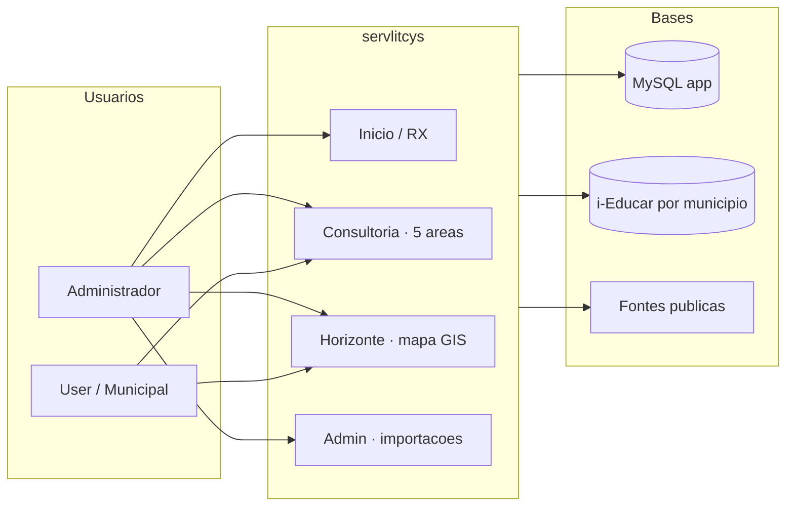
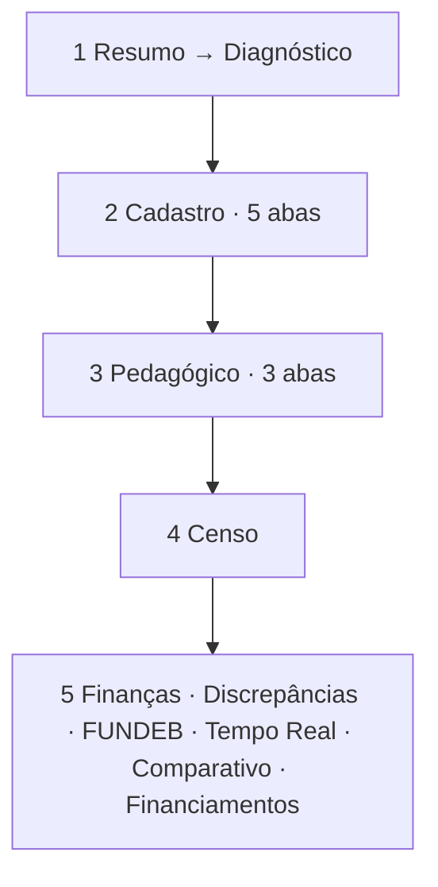

# servlitcys

Plataforma web Laravel para **dados educacionais por município**: painéis, análise, **Horizonte** (mapa de oportunidade) e ligação a bases **i-Educar** por cidade (MySQL ou PostgreSQL conforme a cidade).

**Versão em produção (`main`):** **8.2.0** · tag **`20260724c-Hygieia`** · [release](docs/RELEASE_20260724c_HYGIEIA.md) · [histórico](docs/HISTORICO_VERSOES.md)

---

## Visão geral



| Pergunta | Onde ler |
|----------|----------|
| O que está implementado? | [docs/STATUS_PROJETO.md](docs/STATUS_PROJETO.md) |
| Módulos (Analytics, Horizonte, RX, FUNDEB…) | [docs/modulos/README.md](docs/modulos/README.md) |
| Roadmaps e backlog | [docs/ROADMAP_INDICE.md](docs/ROADMAP_INDICE.md) · [docs/BACKLOG_IMPLEMENTACOES.md](docs/BACKLOG_IMPLEMENTACOES.md) |
| Diagramas e fluxos (deploy, FUNDEB, releases) | [docs/ARQUITETURA_E_FLUXOS.md](docs/ARQUITETURA_E_FLUXOS.md) |
| Índice completo da documentação | [docs/README.md](docs/README.md) |
| Hub visual (timeline 4.x→7.x) | [docs/HUB_DOCUMENTACAO.md](docs/HUB_DOCUMENTACAO.md) · leitor `/admin/documentacao` |

### Consultoria — 5 áreas



Detalhe: [docs/ANALYTICS_NAVEGACAO_UI.md](docs/ANALYTICS_NAVEGACAO_UI.md).

---

## Requisitos

- PHP **8.3+** com extensões: `pdo_mysql`, `pdo_pgsql` (bases i-Educar em PostgreSQL), `pdo_sqlite` (testes), `mbstring`, `openssl`, `tokenizer`, `xml`, `ctype`, `json`, `bcmath`
- Composer 2
- Node.js **20+** e npm (apenas para **desenvolvimento** ou para **recompilar** CSS/JS após alterações — ver abaixo)
- **MySQL/MariaDB** para a base principal da aplicação (usuários, cidades, sessões) em local e produção
- **Redis** recomendado em produção (cache, sessão, filas) — ver [docs/PERFORMANCE.md](docs/PERFORMANCE.md)

## Instalação (desenvolvimento)

```bash
# Copie o modelo versionado e preencha segredos (DB, APP_KEY, admin, APIs públicas).
cp .env.example .env
composer install
php artisan key:generate   # só se APP_KEY estiver vazio

# Base de dados: configurar DB_* no .env, depois:
php artisan migrate

# Utilizador administrador (credenciais via .env — ver abaixo)
php artisan db:seed --class=AdminUserSeeder

npm install
npm run dev
```

Em outro terminal: `php artisan serve` (ou use o script `composer run dev` se configurado).

**Produção:** edite apenas o `.env` no servidor. Lista completa e checklist de deploy: **[docs/VARIAVEIS_AMBIENTE.md](docs/VARIAVEIS_AMBIENTE.md)** (não copie `.env.example` por cima do `.env` existente).

### Variáveis essenciais no `.env` (desenvolvimento)

| Variável | Descrição |
|----------|-----------|
| `APP_NAME` | Nome da aplicação (ex.: `servlitcys`) |
| `APP_ENV` | `local` / `production` |
| `APP_DEBUG` | **`false` em produção** |
| `APP_URL` | URL pública (com HTTPS em produção) |
| `APP_KEY` | Gerado com `php artisan key:generate` — **nunca commitar** |
| `ADMIN_EMAIL` / `ADMIN_USERNAME` / `ADMIN_PASSWORD` / `ADMIN_BIRTH_DATE` | Credenciais e data de nascimento do admin criado pelo `AdminUserSeeder` (a data entra na recuperação de senha) |
| `SERVENTEC_WHATSAPP_NUMBER` | Opcional: número WhatsApp (só dígitos com DDI) para o botão “Contactar Serventec” na página inicial |
| `DB_*` | Base principal Laravel (usuários, cidades, sessões) |
| `CACHE_STORE` / `SESSION_DRIVER` | Em produção: **`redis`** recomendado — [docs/PERFORMANCE.md](docs/PERFORMANCE.md) |
| `ANALYTICS_LAZY_TABS` | Opcional (default `true`): carregar abas pesadas do painel de análise sob demanda; pedidos `.../dashboard/analytics/tab?tab=…` aparecem no Pulse por aba. |
| `SESSION_ENCRYPT` | Considerar `true` em produção com HTTPS |
| `IEDUCAR_MATRICULA_INDICADORES_INCLUIR_SITUACAO_INEP` | Opcional (default `true`): nos indicadores de matrícula, contar também matrículas com situação INEP «em curso» (`matricula_situacao.codigo`, ex. `1`) quando a coluna `ativo` na matrícula está indefinida ou inconsistente com a tela do i-Educar |
| `IEDUCAR_MATRICULA_SITUACAO_INEP_ATIVAS` | Opcional: lista separada por vírgulas de códigos INEP tratados como matrícula ativa em conjunto com o filtro de `ativo` (default: `1`) |
| `IEDUCAR_TABLE_FISICA_RACA` / `IEDUCAR_MYSQL_TABLE_FISICA_RACA` | Opcional: tabela pivô física ↔ raça (default PostgreSQL: `cadastro.fisica_raca`); usada no gráfico «cor ou raça» da aba Inclusão |

#### Painel de análise — FUNDEB, VAAF e novas abas

| Variável | Default | Descrição |
|----------|---------|-----------|
| `ANALYTICS_LAZY_TABS` | `true` | Abas pesadas carregam via `GET /dashboard/analytics/tab?tab=…` |
| `ANALYTICS_FUNDEB_DISC_SUMMARY` | `true` | Na aba FUNDEB (lazy), calcular perda/ganho de cadastro sem abrir a aba Discrepâncias completa |
| `ANALYTICS_FUNDING_SUMMARY_CACHE` | `600` | Cache (segundos) do resumo financeiro; `0` desativa. Reaproveita após visitar Discrepâncias |
| `IEDUCAR_DISC_VAA_REFERENCIA` | `4500` | VAAF de referência (R$/aluno/ano) para estimativas e fallback da **prévia federal** |
| `IEDUCAR_DISC_AVISO_FINANCEIRO` | (texto em `config/ieducar.php`) | Aviso legal nas abas com valores indicativos |
| `IEDUCAR_FUNDEB_NATIONAL_FLOOR` | `true` | Gravar piso nacional em `fundeb_municipio_references` quando não houver VAAF municipal |
| `IEDUCAR_FUNDEB_NATIONAL_VAAF_2024` | — | Prévia federal por ano (sobrepõe `IEDUCAR_DISC_VAA_REFERENCIA` quando > 0) |
| `IEDUCAR_FUNDEB_NATIONAL_VAAF_2025` | — | Idem para 2025 |
| `IEDUCAR_FUNDEB_VAAR_PCT_BASE` | `0` | % opcional de complementação VAAR sobre a base (ordem de grandeza) |
| `IEDUCAR_FUNDEB_AVISO_PREVISAO` | (texto em config) | Aviso na aba FUNDEB |
| `IEDUCAR_FUNDEB_CKAN_RESOURCE_ID` | — | Recurso CKAN FNDE para importar VAAF municipal (admin) |
| `IEDUCAR_FUNDEB_JSON_URL` | — | URL alternativa com dados `{ibge}/{ano}` |
| `IEDUCAR_FUNDEB_CACHE_PATH` | — | Caminho de cache local do JSON FNDE |
| `IEDUCAR_OTHER_FUNDING_PUBLIC_QUERIES` | `true` | Consultas automáticas na aba **Financiamentos** (FNDE, Tesouro, Transparência) |
| `IEDUCAR_OTHER_FUNDING_PUBLIC_CACHE_TTL` | `3600` | Cache (segundos) das consultas públicas por município/ano |
| `IEDUCAR_OTHER_FUNDING_LIVE_FNDE` | `false` | Se `true`, consulta CKAN FNDE em tempo real quando não houver cache |
| `PORTAL_TRANSPARENCIA_API_KEY` | — | Chave da API do [Portal da Transparência](https://portaldatransparencia.gov.br/pagina-api) (despesas por município) |
| `IEDUCAR_TESOURO_TRANSFERENCIAS_RESOURCE_ID` | — | Recurso CKAN do Tesouro (transferências por município); vazio = tentativa de descoberta automática |
| `IEDUCAR_WORK_EXCLUDE_LOGINS` | `admin,administrador,suporte,portabilis` | Logins excluídos da contagem de cadastro na aba **Censo** |
| `IEDUCAR_WORK_EXCLUDE_USER_IDS` | `1` | IDs de usuário excluídos |
| `IEDUCAR_WORK_EXCLUDE_NIVEL` | `1` | Níveis de usuário excluídos (ex.: admin) |
| `IEDUCAR_WORK_MINUTES_PER_RECORD` | `3.5` | Minutos por matrícula quando não há timestamps na base |
| `IEDUCAR_WORK_HOURS_PER_DAY` | `6` | Jornada para converter minutos em «dias de trabalho» |
| `IEDUCAR_CENSO_STATUS_TABLE` | — | Tabela qualificada com estado exportado/fechado por escola (ex.: módulo Educacenso) |
| `IEDUCAR_CENSO_TABLE_CANDIDATES` | (lista em config) | Tabelas a tentar automaticamente se `STATUS_TABLE` vazio |
| `IEDUCAR_CENSO_EXPORTED_TEXT` / `IEDUCAR_CENSO_CLOSED_TEXT` | — | Palavras-chave em colunas de situação textual |
| `APP_NOTIFICATIONS_ENABLED` | `true` | Sino de notificações na barra (processos em fila, conta, etc.) |
| `APP_NOTIFICATIONS_POLL_SECONDS` | `45` | Intervalo de atualização do sino (segundos) |
| `APP_NOTIFICATIONS_QUEUE` | `default` | Fila para gravar notificações na BD |
| `ANALYTICS_PDF_QUEUE` | `default` | Fila para geração do relatório PDF (aba Serventec) |
| `ANALYTICS_PDF_SERVENTEC_NAME` / `ANALYTICS_PDF_SERVENTEC_URL` | Serventec | Rodapé e capa do PDF |
| `ANALYTICS_PDF_DEVELOPER_NAME` / `ANALYTICS_PDF_DEVELOPER_GITHUB` | — | Créditos no rodapé de cada página |
| `ANALYTICS_PDF_REGIONAL_IMAGE` | `images/pdf/regional` | Pasta em `public/` com `{uf}.jpg` ou `default.svg` |

**VAAF municipal vs prévia federal:** os cálculos usam o valor **municipal** (`fundeb_municipio_references` ou importação FNDE). A prévia aparece nos cards para comparação (`IEDUCAR_FUNDEB_NATIONAL_VAAF_*` ou `IEDUCAR_DISC_VAA_REFERENCIA`).

Exemplo mínimo para produção com FUNDEB e trabalho realizado:

```env
ANALYTICS_LAZY_TABS=true
ANALYTICS_FUNDEB_DISC_SUMMARY=true
ANALYTICS_FUNDING_SUMMARY_CACHE=600

IEDUCAR_DISC_VAA_REFERENCIA=4500
IEDUCAR_FUNDEB_NATIONAL_FLOOR=true
IEDUCAR_FUNDEB_NATIONAL_VAAF_2025=4500
# IEDUCAR_FUNDEB_CKAN_RESOURCE_ID=...   # após importação admin

IEDUCAR_WORK_EXCLUDE_LOGINS=admin,administrador,suporte,portabilis
IEDUCAR_WORK_EXCLUDE_USER_IDS=1
IEDUCAR_WORK_EXCLUDE_NIVEL=1
```

Credenciais de ligação à base i-Educar por cidade (`db_*` no modelo `City`) são guardadas **encriptadas** na base (cast `encrypted`).

## Produção (sem Node no servidor)

A pasta **`public/build/`** (manifest + CSS/JS gerados pelo Vite) **está versionada** no Git. No servidor de produção basta:

```bash
composer install --no-dev --optimize-autoloader
php artisan migrate --force
php artisan config:cache
php artisan route:cache
php artisan view:cache
```

**Não é necessário** `npm install` nem `npm run build` na máquina de produção, desde que faças `git pull` com o repositório atualizado.

Servidor web: document root = `public/`.

### Vite / CORS (`[::1]:5173` ou `localhost:5173`)

Se o browser tentar carregar scripts de `http://127.0.0.1:5173` ou `[::1]:5173` em produção, o Laravel encontrou o arquivo **`public/hot`** (criado localmente por `npm run dev`) e pensa que o Vite está em modo desenvolvimento.

1. **`APP_ENV=production`** no `.env` do servidor (e `php artisan config:cache` depois).
2. **Apagar `public/hot`** no servidor: `rm -f public/hot` (não deve existir em produção; está no `.gitignore`).
3. Garantir que **`public/build/manifest.json`** existe (assets compilados no repositório ou após `npm run build`).

A aplicação também **remove automaticamente** `public/hot` ao iniciar em ambiente `production`, mas convém não enviar esse arquivo no deploy.

### Quando alterar `resources/css` ou `resources/js`

Recompila **na tua máquina ou na CI** (Node 20+) e faz commit de `public/build/`:

```bash
npm ci
npm run build
# Se só tiveres Node 18 local, podes usar Docker:
# docker run --rm -v "$(pwd)":/app -w /app node:22-alpine sh -c "npm ci && npm run build"
git add public/build && git commit -m "chore: rebuild assets"
```

## Build de produção (referência rápida)

Os mesmos comandos `npm ci` + `npm run build` acima geram os arquivos em `public/build/` antes do deploy.

## Testes

Requer extensão PHP `pdo_sqlite` para a base em memória definida em `phpunit.xml`.

```bash
composer test
# ou: php artisan test
```

## Análise estática (PHPStan / Larastan)

Analisa `app/Services` e `app/Repositories` (nível 5, com `phpstan-baseline.neon` para dívida existente).

```bash
composer run phpstan
```

## Documentação

**Entrada central:** [docs/README.md](docs/README.md) · **módulos:** [docs/modulos/README.md](docs/modulos/README.md) · **fluxos:** [docs/ARQUITETURA_E_FLUXOS.md](docs/ARQUITETURA_E_FLUXOS.md)

Leitor na aplicação (`/admin/documentacao` ou `/documentacao`): menu lateral **modular** (Entrada, Arquitetura, Painel analítico, **Horizonte**, CadÚnico, SAEB, RX, FUNDEB…), pesquisa, sumário por documento e diagramas Mermaid.

| Âncora | Arquivo |
|--------|---------|
| Estado atual | [docs/STATUS_PROJETO.md](docs/STATUS_PROJETO.md) |
| Índice de módulos | [docs/modulos/README.md](docs/modulos/README.md) |
| Horizonte (técnico) | [docs/HORIZONTE.md](docs/HORIZONTE.md) |
| Arquitetura e fluxos | [docs/ARQUITETURA_E_FLUXOS.md](docs/ARQUITETURA_E_FLUXOS.md) |
| Design system (UI) | [docs/DESIGN_SYSTEM.md](docs/DESIGN_SYSTEM.md) |
| Decisões técnicas | [docs/PONDERACOES_TECNICAS.md](docs/PONDERACOES_TECNICAS.md) |
| Performance / Redis | [docs/PERFORMANCE.md](docs/PERFORMANCE.md) |
| Backlog | [docs/BACKLOG_IMPLEMENTACOES.md](docs/BACKLOG_IMPLEMENTACOES.md) |
| Padrão editorial pt-BR | [docs/PADRAO_DOCUMENTACAO.md](docs/PADRAO_DOCUMENTACAO.md) |

## Estrutura de permissões (resumo)

| Área | Quem acessa |
|------|-------------|
| Início `/dashboard` | `role=admin` |
| Análise `/dashboard/analytics` | `admin`, `user`, `municipal` (este só municípios vinculados) |
| RX `/dashboard/rx` | `admin`, `user` |
| Horizonte `/dashboard/horizonte` | perfis com `canViewHorizonte()` |
| Documentação | `/admin/documentacao` (admin) · `/documentacao` (usuário/municipal com permissão) |
| CRUD de cidades, sync, Pulse, dados públicos | `role=admin` |
| Gestão de usuários | `admin` (todos); `user` (só perfil user); `municipal` (só municipal no âmbito) |
| Desativar / excluir usuários | `role=admin` |
| Registro público | **Desativado** |

Detalhe: [docs/PERFIS_UTILIZADOR.md](docs/PERFIS_UTILIZADOR.md).

## Histórico de versões (linha 7.x)

| Versão | Tag | Data | Destaque |
|--------|-----|------|----------|
| **▶ 7.0.3** | `20260709-Calliope` | 09/07 | Leitor docs modular; tag+GitHub — [RELEASE](docs/RELEASE_20260709_CALLIOPE.md) |
| 7.0.2 | `20260706-Hermes` | 06/07 | pt-BR unificado (UI, menus, documentação) — [RELEASE](docs/RELEASE_20260706_HERMES.md) |
| 7.0.1 | `20260705b-Moneta` | 05/07 | Tooltip FUNDEB por UF; warm-map-cache estável — [RELEASE](docs/RELEASE_20260705b_MONETA.md) |
| 7.0.0 | `20260705-Ploutos` | 05/07 | SICONFI, Transparência, scoring ampliado, modal Horizonte — [RELEASE](docs/RELEASE_20260705_PLUTOS.md) |
| 6.5.0 | `20260702c-Jord` | 02/07 | Malha IBGE, Contornos, Educacenso nacional — [RELEASE](docs/RELEASE_20260702c_JORD.md) |
| 5.0.0 | `20260619-Horizonte` | 19/06 | Mapa de oportunidade municipal — [RELEASE](docs/RELEASE_20260619_HORIZONTE.md) |

Linha completa (2.x→7.x), tags Git e convenção de releases: **[docs/HISTORICO_VERSOES.md](docs/HISTORICO_VERSOES.md)** · entregas por mês: **[docs/ENTREGAS_ESCALONADAS.md](docs/ENTREGAS_ESCALONADAS.md)**.

## Licença

MIT (conforme `composer.json` / projeto Laravel base).
