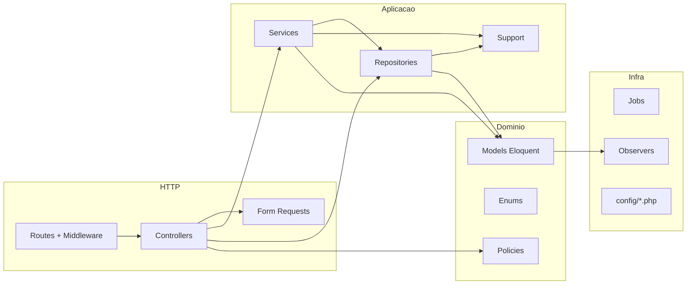

# Análise de padrões Laravel e qualidade de código — servlitcys

**Versão do produto:** 6.5.0 · **Última revisão:** 2026-07-02

> **Índice:** [README.md](README.md) · **Arquitetura:** [ARQUITETURA_E_FLUXOS.md](ARQUITETURA_E_FLUXOS.md) · **Decisões técnicas:** [PONDERACOES_TECNICAS.md](PONDERACOES_TECNICAS.md) · **Segurança:** [SEGURANCA.md](SEGURANCA.md) · **Testes:** [PLANO_TESTES_UNITARIOS.md](PLANO_TESTES_UNITARIOS.md)

Auditoria estática do código em `app/`, `resources/` e `tests/`, comparada com as convenções oficiais do [Laravel](https://laravel.com/docs) e boas práticas de MVC em aplicações de médio/grande porte. Não substitui revisão de segurança dedicada nem análise de performance em produção.

---

## 1. Resumo executivo

O ServLITCYS é um produto **maduro e orientado a domínio** (consultoria municipal, i-Educar multi-tenant, Horizonte, FUNDEB, CadÚnico). A base segue Laravel de forma reconhecível — Eloquent, middleware, policies, jobs, config por domínio — mas evoluiu para um modelo **híbrido**:

```text
Controller → Service / Repository → Support/*Queries
```

em vez do MVC “de livro” (Controller fino + Model gordo).

| Indicador | Valor aproximado | Avaliação |
|-----------|------------------|-----------|
| Arquivos PHP em `app/` | ~528 | Codebase substancial |
| Controllers | 48 | Vários monolíticos |
| Form Requests | 18 | Cobertura parcial (~38% dos controllers) |
| Policies | 6 | `PlatformFeaturePolicy` + gates; hubs admin com policy |
| Models com `scope*` | 3 de 20 | Modelos majoritariamente anémicos |
| Testes unitários | ~202 | Forte em lógica pura |
| Testes feature | 31 | Autorização admin CadÚnico/Public Data coberta |
| Classes > 500 linhas em `app/` | 49 | Risco de manutenção |

**Conclusão:** o projecto funciona bem para o domínio complexo que cobre, com **testes unitários sólidos** e **separação por bounded context** (Horizonte, Fundeb, CadÚnico, Ieducar). Os principais desvios face ao padrão Laravel ideal são **god classes**, **lógica em `Support/` sem fronteira clara com `Services/`**, **poucos scopes Eloquent** e **autorização inconsistente** (middleware vs `User::canX()` vs policies).

---

## 2. Metodologia

1. Inventário de camadas (`app/Http`, `Models`, `Services`, `Repositories`, `Support`, `Livewire`, `Jobs`).
2. Contagem de linhas e identificação de classes > 500 / > 800 linhas.
3. Amostragem de controllers referência (`CityController`) vs ofensores (`AnalyticsDashboardController`).
4. Grep por `scope*`, `$this->authorize`, `env(`, `DB::raw`, `@php` em Blade.
5. Cruzamento com documentação existente (`ARQUITETURA_E_FLUXOS.md`, `SEGURANCA.md`).

**Limitações:** análise estática; não inclui profiling, pentest nem cobertura de código medida por ferramenta CI.

---

## 3. Mapa de camadas (Laravel + extensões do projecto)



| Camada Laravel | Papel esperado | Papel actual no ServLITCYS |
|----------------|----------------|---------------------------|
| **Route** | Agrupar middleware, prefixos, nomes | Bem usado (`auth`, `admin`, `legal.consent`, throttle) |
| **Controller** | Orquestrar pedido; delegar regra | Muitos finos; `AnalyticsDashboardController` **~276 linhas** (era ~2086) — `index()` e `tabPartial()` delegados |
| **Form Request** | Validação + autorização opcional | 18 classes; hubs CadÚnico/Public Data com index + run |
| **Model** | Estado, relações, scopes, casts | Anémico; lógica em `Support/`; scopes raros |
| **Policy** | Autorização por recurso | 6 policies + gates `PlatformFeaturePolicy`; `User::canX()` delega à policy |
| **Service** | Caso de uso / orquestração | 118 services — padrão dominante para importações e sync |
| **Repository** | Abstracção de persistência | 19 repos; i-Educar + snapshots; **sem interfaces** |
| **Support** | — (não é camada Laravel) | 225 arquivos: queries SQL, builders PDF, presenters |
| **Job** | Trabalho assíncrono | PDF analytics, sync admin, importações |
| **View / Blade** | Apresentação | Components `<x-*>` bons; alguns `@php` pesados |
| **Livewire** | UI reactiva | 13 cards Pulse |

---

## 4. MVC — aderência e desvios

### 4.1 Padrão de referência interno

`CityController` exemplifica o que o projecto **já sabe fazer bem**:

- `StoreCityRequest` / `UpdateCityRequest` para validação.
- `$this->authorize()` em cada action.
- Model `City` com scopes (`scopeActive`, `scopeWithDataSetup`, `scopeForAnalytics`).
- Delegação de conexão a `CityDataConnection` (service).

### 4.2 Anti-padrão: Controller gordo

| Severidade | Arquivo | Linhas | Problema |
|------------|----------|--------|----------|
| **Crítico** | `app/Http/Controllers/AnalyticsDashboardController.php` | **~276** (era ~2086) | P0 concluído — `AnalyticsIndexAssembler` + `AnalyticsTabPartialDispatcher`; restam export, diagnóstico, filter options |
| **Alto** | `app/Http/Controllers/Admin/PublicDataImportController.php` | 527 | Hub de importações, validação inline, dispatch de jobs |
| **Alto** | `app/Http/Controllers/Admin/CadunicoSyncController.php` | 460 | Dispatcher de 8+ acções num único `run()` |
| **Alto** | `app/Http/Controllers/Admin/IeducarCompatibilityController.php` | 458 | Admin + exportações + probes |

**Padrão Laravel recomendado:** controller com 5–15 linhas por action; extrair **Actions** ou **Tab Loaders** (`AnalyticsFundebTabLoader`, etc.).

### 4.3 Anti-padrão: lógica fora do “M” e do “C”

| Severidade | Arquivo | Linhas | Problema |
|------------|----------|--------|----------|
| **Crítico** | `app/Support/Ieducar/MatriculaChartQueries.php` | **~1 046** (era 4 153) | Facade + volume/base; delega distorção, vagas e distribuição |
| **Alto** | `app/Support/Ieducar/MatriculaDistorcaoChartQueries.php` | ~1 171 | Gráficos e KPIs de distorção idade/série |
| **Alto** | `app/Support/Ieducar/MatriculaVagasChartQueries.php` | ~1 464 | Vagas, capacidade e rede |
| **Alto** | `app/Support/Ieducar/MatriculaDistribuicaoChartQueries.php` | ~642 | Escola, turno, curso, série |
| **Alto** | `app/Support/Dashboard/AnalyticsTabImpactBuilder.php` | 2 380 | Payload de abas no Support |
| **Alto** | `app/Repositories/Ieducar/SchoolUnitsRepository.php` | 2 541 | Repository que acumula mapa, geo, matrículas |
| **Alto** | `app/Support/Ieducar/InclusionDashboardQueries.php` | 2 519 | Queries monolíticas |

Isto não viola MVC “literalmente” (não está na View), mas **concentra regra de negócio e persistência** em classes difíceis de testar de ponta a ponta.

### 4.4 View com lógica

| Severidade | Exemplo | Problema |
|------------|---------|----------|
| **Médio** | `resources/views/dashboard/analytics/partials/fundeb.blade.php` | ~~Blocos `@php`~~ → `FundebTabPresenter` (feito) |
| **Médio** | `resources/views/dashboard/analytics/partials/network.blade.php` | Contadores de charts na view |
| **Médio** | `resources/views/dashboard/analytics/partials/performance.blade.php` | Múltiplos `@php` |

**Padrão Laravel:** [View Components](https://laravel.com/docs/blade#components) com props tipadas ou **Presenters** (`FundebTabPresenter`) injectados pelo controller.

### 4.5 JavaScript / Alpine

| Avaliação | Exemplo |
|-----------|---------|
| **Positivo** | `horizonteMap.js` isolado; dados via `@js()` no Horizonte |
| **Positivo** | Tabs e tour com Alpine em `horizonte/index.blade.php` |
| **Atenção** | HTML gerado em JS (`tooltipBodyHtml`) | CSS explícito em `horizonte.css` + `horizonte-components.css` (@layer Tailwind extraído de `app.css`) |

---

## 5. Models, scopes e Eloquent

### 5.1 Estado actual

- **20 models** em `app/Models/`.
- **Scopes locais** apenas em: `City` (3), `User` (1), `LegalDocumentVersion` (1).
- Atributos PHP 8 (`#[Fillable]`, `#[Hidden]`), **casts** e **enums** (`UserRole`) bem aplicados.
- `City::db_password` com cast `encrypted` — boa prática.

### 5.2 Modelos anémicos vs gordos

| Modelo | Linhas | Perfil |
|--------|--------|--------|
| `User` | 387 | Gordo: roles, `canX()`, cache de `cityIds`, accessors |
| `City` | ~200 | Equilibrado: scopes + conexão i-Educar |
| Snapshots (`MunicipalTransferSnapshot`, `CadunicoMunicipioSnapshot`, …) | < 80 | Anémicos |

**Padrão Laravel:** model com **relações, casts, scopes e accessors**; regra de negócio complexa em **Services**; autorização transversal em **`PlatformFeaturePolicy`** (gates), com `User::canX()` como façade compatível com Blade.

### 5.3 Scopes em falta (oportunidades)

| Modelo | Scopes sugeridos | Benefício |
|--------|------------------|-----------|
| `MunicipalTransferSnapshot` | `scopeForIbge`, `scopeForYear`, `scopeForFonte` | Evitar repetir `where` em repositories Horizonte/FUNDEB |
| `CadunicoMunicipioSnapshot` | `scopeForIbge`, `scopeLatestForYear` | Simplificar `CadunicoMunicipioSnapshotRepository` |
| `AdminSyncTask` | `scopePending`, `scopeForDomain`, `scopeForUser` | Filtros do monitor admin |
| `AnalyticsReportExport` | `scopeVisibleToUser` | Alinhar com policy existente |
| `FundebMunicipioReference` | `scopeForIbge`, `scopeLatestYear` | Já há lógica similar em `latestModelRowsPerIbge` no service |

**Exemplo de scope (convenção Laravel):**

```php
// app/Models/MunicipalTransferSnapshot.php
public function scopeForIbge(Builder $query, string $ibge): Builder
{
    return $query->where('ibge_municipio', $ibge);
}

public function scopeForYear(Builder $query, int $year): Builder
{
    return $query->where('ano', $year);
}
```

Uso: `MunicipalTransferSnapshot::forIbge($ibge)->forYear($year)->get()`.

### 5.4 Global scopes

Não há global scopes activos além dos implícitos do Eloquent. **Não se recomenda** global scope em `City` sem auditoria — o projecto já usa `UserCityAccess` para scoping multi-município, o que é **preferível** a um global scope opaco.

---

## 6. Controllers, Form Requests e validação

### 6.1 Form Requests

| Métrica | Valor |
|---------|-------|
| Controllers | 48 |
| Form Requests | 18 |
| Controllers com `$request->validate()` inline | ~12 |

**Bom:** `CityController`, `UserController` (+ trait `ValidatesManagedUserAttributes`), `PublishLegalDocumentRequest`, `CadunicoSyncIndexRequest` / `CadunicoSyncRunRequest`, `PublicDataImportIndexRequest` / `PublicDataImportRunRequest`.

**Fraco:** `IeducarCompatibilityController` — validação inline; `AnalyticsDashboardController` — `filterOptions*` ainda sem Form Request dedicado.

**Padrão Laravel:** um Form Request por acção ou por grupo coeso (`AnalyticsFilterRequest`, `CadunicoSyncRunRequest` com `action` enum).

### 6.2 Single Action Controllers (opcional)

Para fluxos admin complexos, o Laravel recomenda [Single Action Controllers](https://laravel.com/docs/controllers#single-action-controllers):

```text
App\Http\Controllers\Admin\Cadunico\RunTerritorioImportController
App\Http\Controllers\Admin\Cadunico\RunMisocialSyncController
```

Substitui o dispatcher `run()` com `match ($action)`.

### 6.3 API

- Único controller API relevante: `Api/SaebMunicipioController` (JSON público, throttle).
- Sem `JsonResource` / `API Resources` — aceitável dado o volume API actual.
- Se a API crescer: adoptar [Eloquent API Resources](https://laravel.com/docs/eloquent-resources) e versionamento de rotas.

---

## 7. Autorização (Policies, Gates, Middleware)

### 7.1 Camadas existentes

1. **Middleware:** `auth`, `verified`, `profile.complete`, `legal.consent`, `admin`, `manage.users`.
2. **Policies:** `CityPolicy`, `UserPolicy`, `AdminSyncTaskPolicy`, `AnalyticsReportExportPolicy`, `PublicDataAdminPolicy`.
3. **Gates / `PlatformFeaturePolicy`:** `importOrConfigure`, `viewHorizonte`, `exportAnalyticsPdf`, `exportInclusionNee`, `viewSyncQueue`.
4. **Métodos no model:** `User::isAdmin()`, `canExportInclusionNee()`, etc. — **delegam** a `PlatformFeaturePolicy`.
5. **Support:** `UserCityAccess` — scoping de municípios (excelente).

### 7.2 Inconsistências

| Severidade | Padrão observado | Risco |
|------------|------------------|-------|
| **Alto** | Controllers admin confiam só em `middleware('admin')` | Sem granularidade por acção/recurso |
| **Médio** | `abort_if($user->canExportInclusionNee())` em vez de policy | Difícil testar e reutilizar |
| **Médio** | `AnalyticsDashboardController` — poucas chamadas `authorize()` | Depende de filtros de cidade noutra camada |
| **Baixo** | Hubs CadÚnico / Public Data | `authorize()` nos Form Requests + `PublicDataAdminPolicy` |

**Padrão Laravel:** [Policies](https://laravel.com/docs/authorization#creating-policies) para cada recurso sensível; `$this->authorize('import', PublicDataImport::class)` nos hubs admin.

---

## 8. Services e Repositories

### 8.1 Convenção actual

```text
Service     → orquestra IO, jobs, cache, arquivos
Repository  → queries Eloquent / i-Educar por cidade
Support     → SQL bruto, builders, normalizers, catálogos
```

A fronteira **Service ↔ Support** é **difusa**: ambos contêm regra de negócio.

### 8.2 God classes (> 800 linhas)

| Linhas | Classe |
|--------|--------|
| 4 153 → **~1 046** | `Support/Ieducar/MatriculaChartQueries` |
| **~1 171** | `Support/Ieducar/MatriculaDistorcaoChartQueries` |
| **~1 464** | `Support/Ieducar/MatriculaVagasChartQueries` |
| **~642** | `Support/Ieducar/MatriculaDistribuicaoChartQueries` |
| 2 541 | `Repositories/Ieducar/SchoolUnitsRepository` |
| 2 519 | `Support/Ieducar/InclusionDashboardQueries` |
| 2 380 | `Support/Dashboard/AnalyticsTabImpactBuilder` |
| 2 086 → **~276** | `Http/Controllers/AnalyticsDashboardController` |
| **~650** | `Services/Analytics/AnalyticsIndexAssembler` |
| **~210** | `Services/Analytics/AnalyticsTabPartialDispatcher` |
| 2 043 | `Services/Fundeb/FundebOpenDataImportService` |
| 1 669 | `Repositories/Ieducar/InclusionRepository` |
| 1 540 | `Services/Funding/TesouroTransferenciasCsvService` |
| 1 247 | `Services/Horizonte/HorizonteMapService` |

### 8.3 Repositories sem interface

Não existem `*RepositoryInterface`. Para o tamanho actual do projecto é **aceitável**; se houver testes de integração com mock, considerar interfaces só nos pontos de fronteira (ex.: `IeducarConnection`).

### 8.4 Duplicação MySQL / PostgreSQL

`FilterOptionsService`, `InclusionNeeExportQuery` e vários `Support/Ieducar/*` repetem dialectos. **Recomendação:** helper `IeducarDialect` ou trait `InteractsWithIeducarSchema` centralizado.

### 8.5 Padrão positivo: Horizonte (5.7.x)

- `HorizonteMapService` orquestra; `HorizonteOpportunityScorer` pontua; `HorizonteTransferScoring` isolado (testável).
- `HorizonteGuideDemo` — dados fictícios separados da view.
- Config em `config/horizonte.php`; cache com fingerprint.

---

## 9. Segurança e configuração

### 9.1 Pontos fortes

- Sem `request()->all()` directo para persistência em `app/`.
- `$fillable` explícito em todos os models (sem `$guarded = []`).
- Upload Educacenso com nome sanitizado + `random_bytes`.
- Credenciais de cidade encriptadas.
- API SAEB com throttle e feature flag.

### 9.2 Pontos de atenção

| Severidade | Achado | Acção |
|------------|--------|-------|
| **Médio** | `env()` em runtime | `HorizonteReferenceYear` migrado para `config/horizonte.php`; rever `RedisProbe` e restantes |
| **Médio** | `City::db_password` em fillable | Manter Form Request; evitar `City::create($request->all())` |
| **Médio** | ~80+ usos de `DB::raw` / `whereRaw` | Auditar concatenação de identificadores; bindings OK na maioria |
| **Baixo** | URLs gov hardcoded em services FUNDEB | Centralizar em `config/ieducar.php` |

Ver também [SEGURANCA.md](SEGURANCA.md).

---

## 10. Testes

| Tipo | Quantidade | Foco |
|------|------------|------|
| Unit | ~205 | Builders, normalizers, scoring Horizonte, `PlatformFeaturePolicy`, scopes |
| Feature | 31 | Auth, smoke analytics, API SAEB, autorização admin |

### Lacunas prioritárias

| Severidade | Área | Gap |
|------------|------|-----|
| **Alto** | `CadunicoSyncController` | Feature tests de autorização criados; falta cobrir fluxo `run()` completo |
| **Alto** | `PublicDataImportController` | Feature tests de autorização criados; falta cobrir POST/import com dados reais |
| **Alto** | `AnalyticsDashboardController` | Smoke sem validar preload real de abas |
| **Médio** | `IeducarCompatibilityController` | Sem feature test dedicado |

**Padrão Laravel:** [Pest/PHPUnit feature tests](https://laravel.com/docs/testing) com `actingAs($admin)` + `assertForbidden()` por policy.

---

## 11. Naming e convenções PSR

| Issue | Exemplo | Severidade |
|-------|---------|------------|
| Identificador PT em PHP | `User::isUsuário()` | Médio |
| Mistura PT-PT / PT-BR / EN no código | `desactivado` vs `efetivo` | Baixo |
| Dois namespaces de lógica | `Services/` vs `Support/` | Médio (documentar) |
| UI em português, código em inglês | Padrão aceite para produto BR | OK |

**Regra proposta:** código PHP em **inglês**; strings de UI em `__()` português; glossário em `docs/PERFIS_UTILIZADOR.md`.

---

## 12. Padrões positivos a preservar

1. **`UserCityAccess`** — scoping centralizado de municípios; evita vazamento de `city_id`.
2. **`CityDataConnection`** + `City::effectiveIeducarDriver()` — multi-tenant i-Educar limpo.
3. **Enums** — `UserRole`, `AdminSyncDomain`, `AdminSyncTaskStatus`.
4. **Observers** — `CityFundebSyncObserver`, `CityCadunicoSyncObserver`.
5. **Jobs** — PDF, sync admin, importações pesadas fora do request.
6. **Config por domínio** — `config/analytics.php`, `horizonte.php`, `ieducar.php`.
7. **Blade components** — `<x-dashboard.consultoria-tab-frame>`, design system.
8. **Testes unitários densos** — permitem refactor seguro de builders e importadores.
9. **PHPDoc com shapes** — arrays tipados em services/repositories.
10. **Horizonte recente** — classes pequenas (`HorizonteTransferScoring`); CSS em `horizonte.css` + `horizonte-components.css`.
11. **Analytics refactor 5.7.6–5.7.7** — controller analytics ~276 linhas; `AnalyticsIndexAssembler` + `AnalyticsTabPartialDispatcher`; matrículas partidas em 4 query classes; modal Horizonte com timeline financeira (`HorizonteFundebRepasseOutlook`).
12. **`PlatformFeaturePolicy`** — capacidades transversais centralizadas; gates em `AppServiceProvider`.

---

## 13. Plano de remediacção (priorizado)

### P0 — Crítico (1–2 sprints)

| # | Acção | Padrão Laravel | Estado |
|---|-------|----------------|--------|
| 1 | Decompor `AnalyticsDashboardController` | Thin controllers | **Feito** — controller ~276 linhas; `AnalyticsIndexAssembler` (~650), `AnalyticsTabPartialDispatcher` (~210), `AnalyticsFilterResolver`, `AnalyticsFinanceTabPreloader`, `AnalyticsTabPartialRenderer`, `AnalyticsSafeLoader`, `AnalyticsMunicipalAccess`, `AnalyticsFilterRequest` |
| 2 | Partir `MatriculaChartQueries` | SRP | **Feito** — facade ~1 046 linhas; `MatriculaDistorcaoChartQueries` (~1 171), `MatriculaVagasChartQueries` (~1 464), `MatriculaDistribuicaoChartQueries` (~642); API pública mantida por delegação |

### P1 — Alto (2–4 sprints)

| # | Acção | Padrão Laravel | Estado |
|---|-------|----------------|--------|
| 3 | Form Requests + policies para hubs admin (CadÚnico, Public Data) | Authorization + Validation | **Feito (index + run)** — `CadunicoSyncIndexRequest`, `CadunicoSyncRunRequest`, `PublicDataImportIndexRequest`, `PublicDataImportRunRequest`, `PublicDataAdminPolicy` |
| 4 | Scopes nos models de snapshot | Eloquent local scopes | **Feito** — `MunicipalTransferSnapshot`, `CadunicoMunicipioSnapshot`, `FundebMunicipioReference`, `AdminSyncTask`, `AnalyticsReportExport` |
| 5 | Mover `User::canX()` restantes para policies | Authorization | **Feito** — `PlatformFeaturePolicy` + gates; `User::canX()` delega |
| 6 | Feature tests para POST/import admin | Testing | **Parcial** — `CadunicoSyncAuthorizationTest`, `PublicDataImportAuthorizationTest`, `PlatformFeaturePolicyTest`; requer `pdo_sqlite` no ambiente de testes |

### P2 — Médio

| # | Acção |
|---|-------|
| 7 | Documentar fronteira `Service` vs `Support` | **Feito** — [PONDERACOES_TECNICAS.md](PONDERACOES_TECNICAS.md) §12 |
| 8 | View Components / Presenters para partials com `@php` pesado | **Parcial** — `FundebTabPresenter` |
| 9 | Eliminar `env()` fora de `config/` | **Parcial** — Horizonte |
| 10 | CSS Horizonte `@layer` fora de `app.css` | **Feito** — `horizonte-components.css` |
| 11 | `IeducarDialect` para MySQL/PostgreSQL | Pendente |

### P3 — Baixo / contínuo

| # | Acção |
|---|-------|
| 12 | Padronizar naming EN no código |
| 13 | Avaliar Single Action Controllers em admin |
| 14 | Interfaces de repository só onde houver mock frequente |

---

## 14. Checklist rápido para novos PRs

Use antes de merge em áreas sensíveis:

- [ ] Controller action < ~50 linhas?
- [ ] Validação em Form Request (não inline)?
- [ ] `$this->authorize()` ou policy explícita?
- [ ] Regra de negócio em Service, não em Blade?
- [ ] Query repetida → scope no Model ou método no Repository?
- [ ] Sem `env()` — só `config()`?
- [ ] Teste unitário para lógica nova pura; feature test se altera fluxo HTTP?
- [ ] Arquivo novo < 400 linhas (ou justificação de catálogo)?

---

## 15. Referências

- [Laravel — Architecture Concepts](https://laravel.com/docs/lifecycle)
- [Laravel — Eloquent Scopes](https://laravel.com/docs/eloquent#query-scopes)
- [Laravel — Form Request Validation](https://laravel.com/docs/validation#form-request-validation)
- [Laravel — Authorization](https://laravel.com/docs/authorization)
- [Laravel — Service Container](https://laravel.com/docs/container)
- Documentação interna: [ARQUITETURA_E_FLUXOS.md](ARQUITETURA_E_FLUXOS.md), [PONDERACOES_TECNICAS.md](PONDERACOES_TECNICAS.md), [DESIGN_SYSTEM.md](DESIGN_SYSTEM.md)

---

*Documento gerado por auditoria estática do repositório. Actualizar após refactors estruturais (ex.: novas extrações de `MatriculaChartQueries`).*
