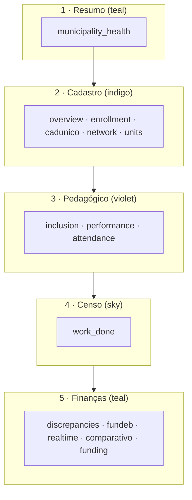

# Analytics — navegação e UI de consultoria

**Versão do produto:** 6.1.0 · **Última revisão:** 2026-06-24

> **Release:** [RELEASE_20260605_ATHENA.md](RELEASE_20260605_ATHENA.md) · **Índice:** [README.md](README.md) · **Padrão:** [PADRAO_DOCUMENTACAO.md](PADRAO_DOCUMENTACAO.md)

## Estrutura do painel

O painel `/dashboard/analytics` organiza-se em **cinco áreas temáticas** (nível 1) e **sub-abas** (nível 2). O estado vive em Alpine (`analyticsTabs` em `resources/js/app.js`); o catálogo PHP é `App\Support\Dashboard\AnalyticsTabCatalog`. Decisão de produto: [CONSULTORIA_ABAS_DECISAO.md](CONSULTORIA_ABAS_DECISAO.md) (cenário C).

| Grupo `id` | Label UI | Tom nav | Abas |
|------------|----------|---------|------|
| `resumo` | Resumo | teal | `municipality_health` |
| `cadastro` | Cadastro | indigo | `overview`, `enrollment`, `cadunico_previsao`, `network`, `school_units` |
| `pedagogico` | Pedagógico | violet | `inclusion`, `performance`, `attendance` |
| `censo` | Censo | sky | `work_done` |
| `consultoria` | Finanças | teal | `discrepancies`, `fundeb`, `finance_realtime`, `comparativo`, `other_funding` |

**Aba inicial** (sem `?tab=` válido): `municipality_health` com ano letivo aplicado; `overview` sem ano. Áreas com uma única sub-aba (Resumo, Censo) omitem o menu de nível 2.

## Lazy-load e preload

- Pedido por aba: `GET /dashboard/analytics/tab?tab=…`
- **Censo:** `AnalyticsDashboardController::preloadCensoTab()` — não passa pelo preload de Finanças.
- **Resumo:** `municipality_health` — preload próprio; reutiliza cache de abas já visitadas.
- **Finanças:** `AnalyticsFinanceTabPreload` — Discrepâncias, FUNDEB, Tempo Real, Comparativo, Financiamentos (sem `work_done` nem Diagnóstico).
- **Comparativo:** `FinanceComparativoService` + `FinanceComparativoInformeBuilder` — ano base (`ano_base` na query ou filtro global), variação matrículas/alunos/turmas/recursos, informes narrativos, detalhe por etapa FUNDEB e projeção do exercício seguinte.
- **Exportação Comparativo:** `GET dashboard.analytics.comparativo.export?format=pdf|csv|xlsx` — download imediato; PDF dedicado em `pdf/comparativo-report/document.blade.php`. O bloco «Relatório PDF completo» (fila) permanece disponível para o dossiê Serventec integral.
- **CadÚnico:** `CadunicoPrevisaoRepository` — lacuna municipal e por faixa (`min(mat, alunos)`), cenários NEE/AEE/VAAR, vulnerabilidade Misocial, mapa/ranking territorial (`cadunico_territorio_snapshots`), demanda×oferta. Ver [CADUNICO_PREVISAO_TERRITORIAL.md](CADUNICO_PREVISAO_TERRITORIAL.md).
- **Exportação CadÚnico:** `GET dashboard.analytics.cadunico-previsao.export?format=pdf|csv|xlsx` — PDF em `pdf/cadunico-previsao-report/`. Dados municipais em `cadunico_municipio_snapshots`; território via CSV admin/CLI.

## Componentes Blade

| Componente | Uso |
|------------|-----|
| `x-dashboard.enrollment-volume-display` | Matrículas + alunos distintos + hint (duplicidade) — Visão geral, Matrículas |
| `x-dashboard.consultoria-tab-frame` | Moldura comum: impact strip, intro, links, flow nav, corpo |
| `x-dashboard.serv-tab-intro` | Título + tom (`rose`, `teal`, `sky`, `amber`, `emerald`) |
| `partials/municipality-health-executive` | Decisão + eixos (Diagnóstico) |
| `partials/municipality-health-executive` | Painel de decisão: índice geral (velocímetro) + eixos na mesma linha |
| `partials/municipality-health-explore` | Cartões «Explorar em detalhe» (métrica por área) |
| `x-dashboard.diagnosis-explore-icon` | Ícones Heroicons nos cartões Explorar |

## Diagnóstico — fluxo na página (Resumo → Diagnóstico)

Ordem na UI (alinhada ao roteiro sticky no topo):

1. **Decisão** — `#diag-decisao` (KPIs, índice geral `#diag-qualidade-sistema` e eixos na mesma linha)
2. **Prioridades** — `#diag-prioridades` (se houver rotinas)
3. **Explorar** — `#diag-explorar`
4. **Consolidado** — `#diag-consolidado` (fontes públicas + mapa de rotinas; subsecções sem número próprio)

Secções AJAX legadas (VAAF/programas/temático embutidos) e skeletons «A carregar…» foram removidos da view — detalhe nas abas via Explorar.

## Explorar em detalhe — métricas por área

Builder: `App\Support\Dashboard\DiagnosisExploreCards::build($healthData)`.

| Tab | Métrica principal | Status derivado de |
|-----|-------------------|-------------------|
| `discrepancies` | Ocorrências ou rotinas c/ pendência | Dimensões + blocos temáticos |
| `fundeb` | Módulos VAAR em alerta | `fundeb_modules` |
| `other_funding` | Programas em alerta | `programas_alerta` |
| `work_done` | Escolas pendentes Censo ou cadastros (quinzena) | `summary.censo_pendentes`, `cadastros_quinzena` |
| `inclusion` | Recurso de prova sem NEE | `summary.recurso_prova_sem_nee` |
| `performance` | SAEB disponível (OK / —) | Blocos temáticos |

Testes: `tests/Unit/DiagnosisExploreCardsTest.php`.

CSS: classes `diag-explore-*` em `resources/css/app.css` — requer `npm run build` após alterações.

## PDF (Apêndice A — Diagnóstico)

Partial: `pdf/analytics-report/partials/diagnosis-explore-board.blade.php`

- Repete a lógica de `DiagnosisExploreCards` numa grelha 2 colunas.
- Índice geral permanece na linha KPI acima; cartões mostram métricas por área + legenda de status.

## Índice de conformidade (3.4.0)

Calculado em `MunicipalityHealthRepository::computeComplianceScore()`:

- Base nas dimensões de cadastro com pendência.
- Penalização por `status` `danger` / `warning` e por perda estimada agregada.
- Cache de abas só entra se o payload estiver **completo** (`AnalyticsTabPayloadCache::isComplete()`).

## Histórico de patches (3.4.0 → 4.1.0)

| Marco | Resumo |
|-------|--------|
| 3.4.0 Nemesis | Área Censo; Explorar em detalhe; cache conformidade v2 |
| 4.0.0 Hestia | Início reorganizado; Acesso rápido; rebuild Tempo Real |
| 4.1.0 Athena | Cenário C — área **Resumo**; Diagnóstico como entrada; fix alertas Tempo Real |

Versão em produção: **6.1.0** / tag **`20260624-Horizonte`** — [HISTORICO_VERSOES.md](HISTORICO_VERSOES.md) · diagramas: [ARQUITETURA_E_FLUXOS.md](ARQUITETURA_E_FLUXOS.md).

## Volume: matrículas vs alunos distintos (3.8.0+)

Classe central: `App\Support\Ieducar\MatriculaVolumeCounts`.

| Métrica | SQL / regra | Onde aparece |
|---------|-------------|--------------|
| Matrículas | `COUNT(DISTINCT matricula.id)` no filtro | KPIs, gráficos por escola/série (denominador operacional) |
| Alunos distintos | `COUNT(DISTINCT matricula.aluno)` se coluna existir | KPIs, faixa de impacto (Visão geral, Matrículas, Inclusão) |
| Base FUNDEB | `min(matrículas, alunos)` quando alunos &lt; matrículas | FUNDEB, Tempo Real, fórmula `formula_base` |

Transferências não encerradas geram **mais matrículas que alunos** — o hint aponta para Discrepâncias → `matricula_duplicada`. A previsão VAAF×volume usa **alunos** para não duplicar repasse indicativo.

## Ficheiros principais

- `app/Support/Dashboard/AnalyticsTabCatalog.php`
- `app/Support/Dashboard/DiagnosisExploreCards.php`
- `resources/views/components/dashboard/analytics-tabs-nav.blade.php`
- `resources/views/components/dashboard/consultoria-tab-frame.blade.php`
- `resources/views/dashboard/analytics/partials/municipality-health-explore.blade.php`
- `resources/css/app.css` — tons `serv-panel--*`, nav `--sky`, `diag-explore-*`
