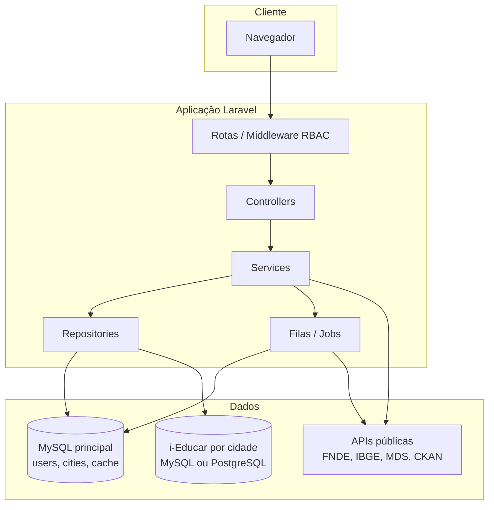
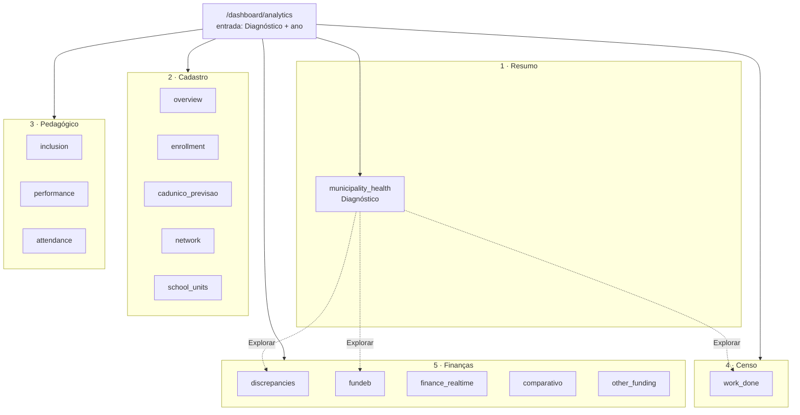
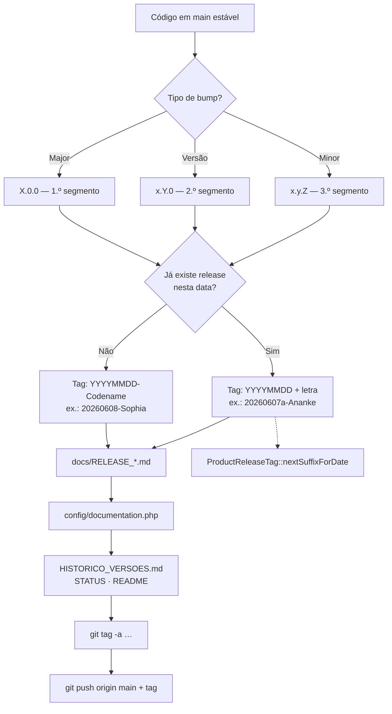
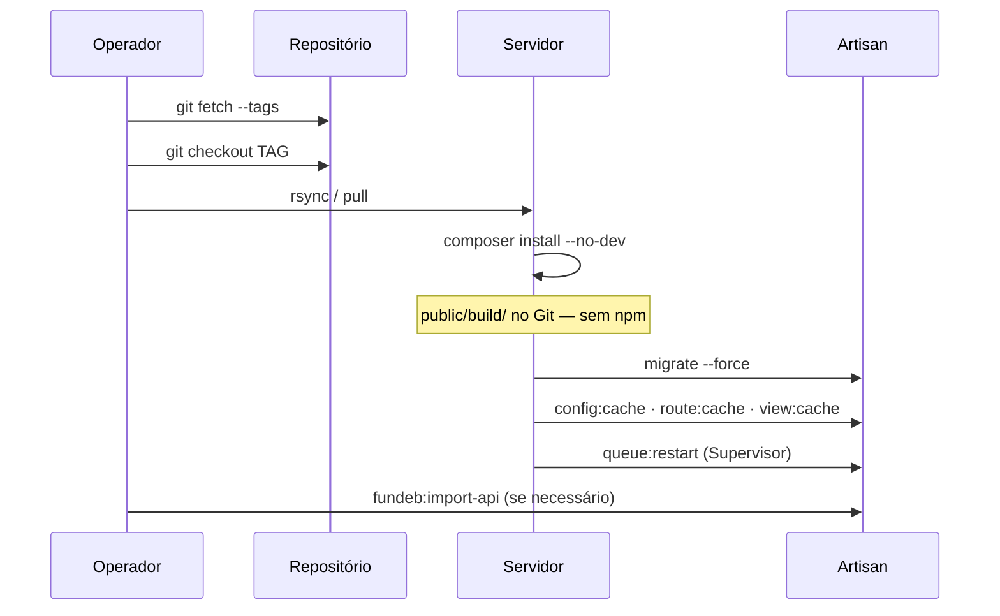
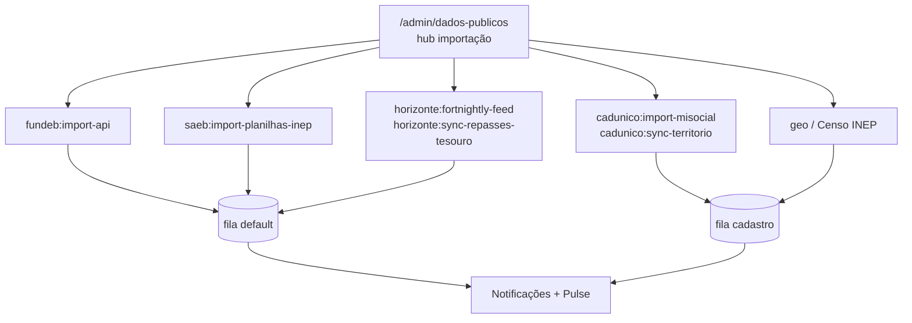
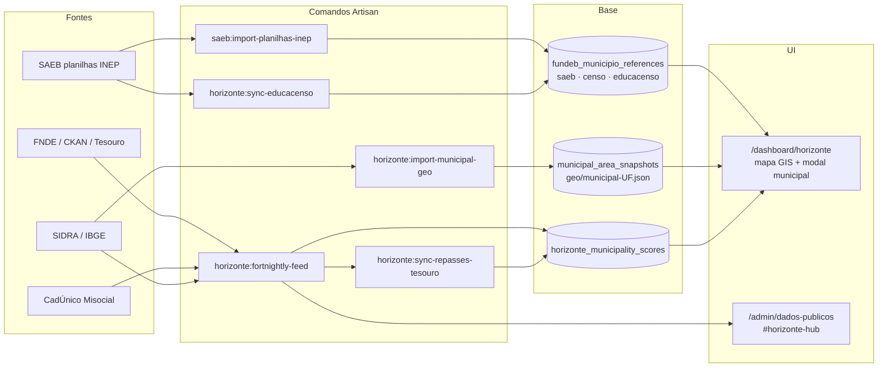
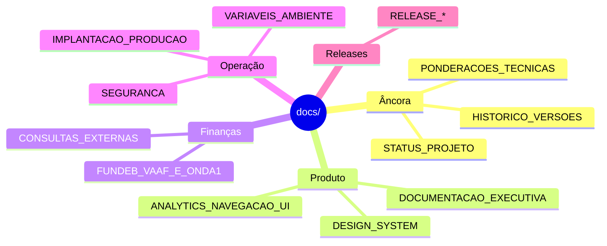

# Arquitetura e fluxos — servlitcys

**Versão do produto:** 6.5.0 · **Última revisão:** 2026-07-02

> **Índice:** [README.md](README.md) · **Hub visual:** [HUB_DOCUMENTACAO.md](HUB_DOCUMENTACAO.md) · **Estado:** [STATUS_PROJETO.md](STATUS_PROJETO.md)

Documento de referência visual para **como o sistema se organiza**, **de onde vêm os dados** e **como publicar releases**. Os diagramas abaixo usam [Mermaid](https://mermaid.js.org/); o leitor admin (`/admin/documentacao`) renderiza blocos ` ```mermaid ` quando suportado.

---

## 1. Arquitetura em camadas



| Camada | Responsabilidade | Exemplos |
|--------|------------------|----------|
| **Rotas** | Autenticação, perfil, município aplicado | `routes/web.php`, middleware `role` |
| **Controllers** | Pedido HTTP, validação, view/JSON | `AnalyticsDashboardController` |
| **Services** | Regra de negócio, orquestração | `FinanceRealtimeFundebService`, `DiscrepanciesPanelAssembler` |
| **Repositories** | SQL i-Educar e agregações | `DiscrepanciesRepository`, `FundebMunicipioReferenceRepository` |
| **Jobs** | PDF, importações, notificações | filas `default`, `cadastro` |

---

## 2. Perfis e áreas da aplicação

```mermaid
flowchart LR
    subgraph Perfis
        Admin[admin]
        User[user]
        Municipal[municipal]
    end

    subgraph Rotas_admin["Só admin"]
        Dash[/dashboard/]
        AdminHub[/admin/*]
        Pulse[/pulse/]
    end

    subgraph Rotas_analise["Análise municipal"]
        Analytics[/dashboard/analytics/]
        Horizonte[/dashboard/horizonte/]
        RX[/dashboard/rx/]
        Doc[/documentacao/]
    end

    Admin --> Dash
    Admin --> AdminHub
    Admin --> Pulse
    Admin --> Analytics
    Admin --> Horizonte
    Admin --> RX
    User --> Analytics
    User --> Horizonte
    User --> Doc
    Municipal --> Analytics
    Municipal --> Doc
```

Detalhe RBAC: [PERFIS_UTILIZADOR.md](PERFIS_UTILIZADOR.md) · Horizonte: [HORIZONTE.md](HORIZONTE.md).

---

## 3. Consultoria — navegação (5 áreas)



Lazy-load: `GET /dashboard/analytics/tab?tab=…` — ver [ANALYTICS_NAVEGACAO_UI.md](ANALYTICS_NAVEGACAO_UI.md).

---

## 4. Fluxo de dados — FUNDEB e discrepâncias

```mermaid
flowchart LR
    subgraph Fontes
        Portaria[Portaria MEC/MF<br/>CSV receita FNDE]
        API[fundeb:import-api]
        Ied[i-Educar matrículas]
        Censo[Censo INEP]
    end

    subgraph Base_local
        Ref[fundeb_municipio_references<br/>VAAF · VAAT · VAAR]
        RT[finance_realtime_snapshots]
    end

    subgraph UI
        RXPainel[Painel RX]
        HomeGráfico[Gráfico Início]
        TabFUNDEB[Aba FUNDEB]
        TabDisc[Discrepâncias]
        AdminCompat[/admin/ieducar-compatibility]
    end

    Portaria --> API
    API --> Ref
    Ied --> TabDisc
    Censo --> TabDisc
    Ref --> TabFUNDEB
    Ref --> RXPainel
    Ref --> HomeGráfico
    Ref --> AdminCompat
    TabDisc --> AdminCompat
```

Assembler único (4.4.0): `DiscrepanciesPanelAssembler` alimenta consultoria e admin.

---

## 5. Publicação de release



Numeração `MAJOR.VERSÃO.MINOR`: [HISTORICO_VERSOES.md](HISTORICO_VERSOES.md) § convenção · checklist [PADRAO_DOCUMENTACAO.md](PADRAO_DOCUMENTACAO.md) §6.

---

## 6. Deploy em produção



Passo a passo: [IMPLANTACAO_PRODUCAO.md](IMPLANTACAO_PRODUCAO.md).

---

## 7. Importações e filas (admin)



Comandos: [COMANDOS_ARTISAN.md](COMANDOS_ARTISAN.md) · impacto nas abas: [IMPORTACAO_DADOS_PUBLICOS.md](IMPORTACAO_DADOS_PUBLICOS.md) · Horizonte: [HORIZONTE.md](HORIZONTE.md) §8.

---

## 8. Fluxo Horizonte — dados públicos → mapa



---

## 9. Hierarquia da documentação



Índice curado: [docs/README.md](README.md).

---

*Diagramas mantidos neste arquivo; evite duplicar listas longas noutros documentos — use link.*
