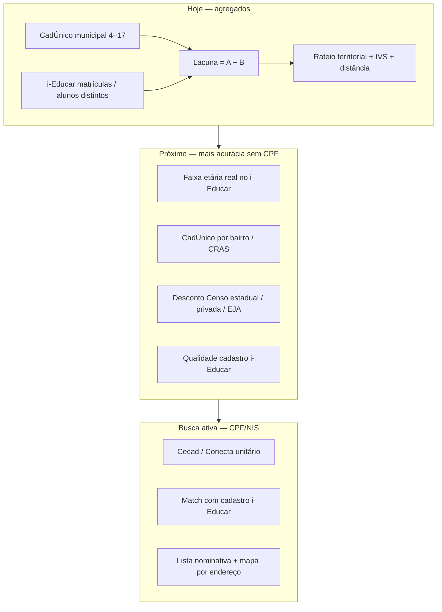

# CadÚnico — previsão territorial e cenários financeiros

Extensão da aba **CadÚnico: previsão fora da rede** (`cadunico_previsao`) em três fases, sempre com **dados agregados** (sem CPF/NIS/endereço individual).

Documentação base Cecad/Misocial: [CADUNICO_CECAD.md](CADUNICO_CECAD.md). Faixas etárias e FUNDEB: [CADUNICO_FAIXAS_ETARIAS_FUNDEB.md](CADUNICO_FAIXAS_ETARIAS_FUNDEB.md).

---

## Fase 1 — Lacuna refinada e cenários

### Base de cálculo da rede

- **Matrículas** e **alunos distintos** vêm de `MatriculaChartQueries::volumeCounts`.
- A base para lacuna e FUNDEB usa `min(matriculas, alunos)` quando há duplicidade de matrícula do mesmo aluno (alinhado ao resto do painel Analytics).
- **CUN-01 (implementado):** quando há data de nascimento no i-Educar, a lacuna por faixa usa **alunos distintos** com idade completa na data de corte **31/03** do ano letivo (`CadunicoFaixaEtariaCounts`). Caso contrário, mantém-se o rateio proporcional anterior.
- **CUN-02 (implementado):** com Censo INEP indexado, desconta-se matrículas **fora da rede municipal** (`CadunicoCensoAjuste` — coluna `matriculas_nao_municipal` ou proxy `total − municipal i-Educar`).

### Lacuna por faixa etária

Para cada faixa Cecad (4–5, 6–10, 11–14, 15–17):

| Campo | Significado |
|-------|-------------|
| `cadunico` | População na faixa (snapshot municipal) |
| `ieducar_estimado` | Alunos distintos na faixa (idade 31/03) ou rateio proporcional |
| `ieducar` | Presente quando a contagem veio de `CadunicoFaixaEtariaCounts` |
| `gap` | `max(0, cadunico − i-Educar na faixa)` |
| `cobertura_label` | Percentagem de cobertura na faixa |
| `fundeb_gap_label` | Lacuna da faixa × VAAF |

Serviço: `App\Services\Cadunico\CadunicoRedeGapAnalyzer`.

### Vulnerabilidade familiar (agregado)

Indicadores derivados do snapshot Misocial/Cecad (`metadados.vulnerabilidade`, crianças PBF estimadas).

Serviço: `App\Services\Cadunico\CadunicoVulnerabilidadeIndicators`.

### Cenários financeiros sobre a lacuna

Proporções **NEE**, **AEE sem cadastro NEE** e **VAAR** observadas na rede municipal aplicadas à lacuna total (não identifica beneficiários no CadÚnico).

Serviço: `App\Services\Cadunico\CadunicoFinanceScenarioBuilder`.

---

## Fase 2 — Mapa de pressão territorial

### Pré-requisitos

1. Snapshot **municipal** CadÚnico (Cecad/Misocial) para o ano.
2. Import **territorial** (bairro, setor censitário, território CRAS, etc.).
3. Opcional: escolas georreferenciadas no filtro (`SchoolUnitsRepository::snapshot` → marcadores no mapa).

### Fórmula de pressão

Para cada território importado:

**Fonte IBGE** (`ibge_censo_2022_wfs` — rateio):

```
lacuna_est = lacuna_municipal × (cadunico_territorio / soma_cadunico_territorios)
```

**Fonte municipal/CRAS** (`csv_territorio` — CUN-02):

```
lacuna_est = max(0, cadunico_territorio − base_rede × (cadunico_territorio / cadunico_municipal))
```

Com faixas etárias reais no i-Educar, a lacuna territorial soma `max(0, cad_faixa_território − ieducar_faixa × peso)` por faixa Cecad.

**Pressão** (ambas as fontes):

```
pressao = lacuna_est × (1 + IVS/100) × (1 + min(15, dist_km_escola)/15 × 0,35)
```

- **IVS**: `indice_vulnerabilidade` do CSV (0–100).
- **dist_km_escola**: distância Haversine à escola municipal mais próxima no mapa.

Serviço: `App\Services\Cadunico\CadunicoTerritorialPressureBuilder`.

### UI

- Tabela **Faixas etárias — CadÚnico e lacuna**
- Tabela **Prioridade por território**
- Mapa Leaflet (`cadunicoTerritoryMap.js`) — círculos = pressão; pontos azuis = escolas

---

## Fase 3 — Demanda × oferta e import

### Demanda × oferta (INT-01 parcial)

Bloco indicativo que cruza lacuna CadÚnico com oferta (matrículas) e lista territórios prioritários do ranking.

Serviço: `App\Services\Cadunico\CadunicoDemandaOfertaSlice`.

### Tabela `cadunico_territorio_snapshots`

Migration: `2026_06_04_100000_create_cadunico_territorio_snapshots_table.php`.

| Coluna | Descrição |
|--------|-----------|
| `ibge_municipio`, `ano_referencia` | Chave com `territorio_codigo` |
| `territorio_nome`, `territorio_tipo` | Identificação (bairro, setor, …) |
| `criancas_4_5` … `criancas_15_17` | Faixas ou `criancas_4_17` total |
| `familias_beneficio`, `indice_vulnerabilidade` | Opcional |
| `latitude`, `longitude` | Para mapa e distância |

### Import territorial (oficial IBGE — recomendado)

Fontes públicas **sem credencial**:

| Fonte | Uso |
|-------|-----|
| [IBGE FTP — Agregados por bairro/setor (Censo 2022)](https://ftp.ibge.gov.br/Censos/Censo_Demografico_2022/Agregados_por_Setores_Censitarios/) | População total (`v0001`) por bairro ou, se ausente, por setor censitário |
| [IBGE GeoServer WFS](https://geoservicos.ibge.gov.br/geoserver/CGMAT/wfs) | Centróides (`qg_2022_650_bairro_agreg` ou `qg_2022_600_setcensitario__v02`) |

O CadÚnico **municipal** (Misocial) é **rateado** por território:  
`criancas_4_17_território ≈ CadÚnico municipal × (população Censo no território / população Censo no município)`.

**Pré-requisito:** snapshot municipal importado (`cadunico:sync-city`).

```bash
php artisan cadunico:sync-city --all --ano=2025
php artisan cadunico:sync-territorio --all --ano=2025
php artisan cadunico:sync-territorio --all --queue --ano=2025   # produção / cron
php artisan cadunico:sync-territorio 1 --ano=2025
```

**Admin:** `/admin/cadunico-sync` → «Fluxo completo — um município» ou «Mapa territorial IBGE — todos».

**Cron (após `cadunico:auto-sync`):** `IEDUCAR_CADUNICO_TERRITORIO_SCHEDULE_ENABLED=true`, horário `04:30` por defeito.

ZIPs em cache: `storage/app/cadunico/territorio/ibge-cache/` (renováveis a cada 90 dias).

### Import CSV territorial (municipal / CRAS)

Quando o município dispuser de agregados próprios (secretaria social, CRAS), use CSV manual ou **pull automático em produção**.

**Admin:** `/admin/cadunico-sync` → formulário «CSV territorial (bairro/setor)».

#### Produção — download + import (recomendado com URL fixa)

Configure no `.env` a URL pública do CSV (placeholders `{ibge}`, `{ano}`, `{city_id}`, `{city}`):

```env
IEDUCAR_CADUNICO_TERRITORIO_CSV_URL=https://dados.exemplo.gov.br/cadunico/territorio_{ibge}_{ano}.csv
IEDUCAR_CADUNICO_TERRITORIO_CSV_CACHE_DAYS=7
IEDUCAR_CADUNICO_TERRITORIO_CSV_TIMEOUT=120
```

```bash
# Um município
php artisan cadunico:pull-territorio 1 --ano=2025

# Todos os municípios com analytics (cron)
php artisan cadunico:pull-territorio --all --ano=2025

# Forçar novo download; só gravar ficheiro sem importar
php artisan cadunico:pull-territorio 1 --ano=2025 --force
php artisan cadunico:pull-territorio 1 --ano=2025 --download-only

# URL pontual (ignora .env)
php artisan cadunico:pull-territorio 1 --ano=2025 --url='https://.../territorio_{ibge}_{ano}.csv'
```

O ficheiro fica em `storage/app/cadunico/territorio/territorio_{ibge}_{ano}.csv` (mesmo padrão do upload admin). Depois importa para `cadunico_territorio_snapshots`.

#### Ficheiro já no servidor

```bash
php artisan cadunico:import-territorio storage/app/cadunico/territorio/territorio_2910800_2024.csv --ano=2024 --city=1
```

Delimitador: `;` (config `IEDUCAR_CADUNICO_TERRITORIO_DELIMITER`).

Mapeamento de colunas: `config/ieducar.php` → `cadunico.territorio.column_map`.

Exemplo mínimo:

```csv
territorio_codigo;territorio_nome;criancas_4_17;latitude;longitude;indice_vulnerabilidade
001;Centro;420;-12.9714;-38.5014;35
002;Subúrbio;680;-12.9950;-38.4550;72
```

---

## Exportação e PDF

Na aba CadÚnico: **PDF / CSV / Excel** incluem faixas com lacuna, cenários, vulnerabilidade, territórios e demanda×oferta.

Rotas: `dashboard.analytics.cadunico-previsao.export`.

---

## Limitações e ética de uso

- CadÚnico ≠ obrigação de matrícula na rede municipal (estadual, privada, EJA).
- Território depende da qualidade do CSV municipal (CRAS, IBGE, secretaria social).
- Cenários NEE/AEE são **indicativos**; não substituem cadastro individual no i-Educar.
- Sem dados territoriais, o mapa e o ranking ficam vazios; a lacuna **municipal** continua disponível.
- O painel **não identifica aluno a aluno** quem está ou não matriculado — apenas estimativas agregadas (ver § Melhorias futuras).

---

## Melhorias futuras — acurácia da lacuna e mapa

> **Estado:** planeamento · **Backlog:** [BACKLOG_IMPLEMENTACOES.md](BACKLOG_IMPLEMENTACOES.md) §I (CUN-01…CUN-03) · **Integrações:** [ESTUDO_INTEGRACOES_SETOR_PUBLICO_E_PREVISAO_DEMANDA.md](ESTUDO_INTEGRACOES_SETOR_PUBLICO_E_PREVISAO_DEMANDA.md) §8.1

### O que o modelo actual não faz

| Limite | Detalhe |
|--------|---------|
| **Sem match individual** | Não há cruzamento CPF/NIS entre CadÚnico e i-Educar |
| **Lacuna municipal** | `CadÚnico 4–17 − min(matriculas, alunos)` no filtro |
| **Faixas etárias** | A rede é **rateada** proporcionalmente pelas faixas Cecad; não usa idade/série real de cada matrícula |
| **Mapa territorial** | A lacuna municipal é **repartida** pelo peso de cada território; com IBGE, o CadÚnico municipal é rateado pela população do Censo |

Isto responde «onde a pressão **provavelmente** é maior», não «quais crianças **concretas** faltam matricular».

### Níveis de evolução



| Nível | Certeza | Esforço | IDs backlog |
|-------|---------|---------|-------------|
| **Actual** | Indicativa (municipal + rateio) | Entregue | INT-07 parcial |
| **Agregados refinados** | Média-alta no território | **Concluído (4.4.x)** | **CUN-01**, **CUN-02** |
| **Busca ativa nominativa** | Alta por aluno | Meses + enquadramento legal | CUN-03 |

### CUN-01 — Lacuna por faixa etária real (sem CPF) — **Concluído**

**Objectivo:** substituir o rateio proporcional por contagem real de matrículas/alunos distintos por idade ou série, alinhada às faixas Cecad (4–5, 6–10, 11–14, 15–17).

| Aspecto | Proposta |
|---------|----------|
| **Fonte rede** | i-Educar: data nascimento + série/etapa + matrícula activa no filtro |
| **Cálculo** | `gap_faixa = max(0, cadunico_faixa − matriculas_rede_faixa)` |
| **Impacto** | Lacuna por etapa e mapa menos distorcidos entre pré-escola, EF e EM |
| **Serviço** | `CadunicoFaixaEtariaCounts` + `CadunicoRedeGapAnalyzer` |

**Pré-requisito:** cadastro com data de nascimento preenchida — [PLUGINS_E_REFINO_CADASTRO_IEDUCAR.md](PLUGINS_E_REFINO_CADASTRO_IEDUCAR.md) §3.1 P0.

### CUN-02 — Território real e lacuna ajustada à rede não municipal — **Concluído**

**Objectivo:** aumentar a fidelidade do mapa de pressão sem identificar pessoas.

| Melhoria | Descrição | Ganho |
|----------|-----------|-------|
| **CadÚnico por bairro/CRAS** | CSV da secretaria social com crianças 4–17 por território (não rateio IBGE) | Mapa reflecte onde estão os cadastrados |
| **Desconto Censo INEP** | Matrículas totais no município por dependência administrativa (`inep_censo_municipio_matriculas`) | Lacuna municipal não infla quem já estuda na rede estadual/privada |
| **IBGE SIDRA** | População por idade (Onda 1, INT-05) | Denominador alternativo para validação |
| **Indicadores SNAS/PBF** | Agregados por território (Onda 2) | Priorização no factor de pressão, não prova de matrícula |

**Serviços afectados:** `CadunicoTerritorialGapEstimator`, `CadunicoTerritorialPressureBuilder`, `CadunicoCensoAjuste`, import Censo (`InepCensoMunicipioMatriculasIndexer` — `tp_dependencia`).

**Operação recomendada:** configurar `IEDUCAR_CADUNICO_TERRITORIO_CSV_URL` com agregados CRAS antes de confiar no mapa IBGE-only.

### CUN-03 — Busca ativa com cruzamento CPF/NIS (módulo restrito)

**Objectivo:** responder, com alta confiança, se **este aluno** está ou não matriculado na rede municipal — fora do painel analítico público.

| Aspecto | Detalhe |
|---------|---------|
| **Fontes** | Cecad/Conecta gov.br (consulta unitária CPF/NIS) ↔ i-Educar (`cadastro.pessoa` / CPF quando existir) |
| **Fluxo** | Lista de candidatos → validação humana → matrícula; registo de operações (LGPD) |
| **Produto** | Módulo admin «Busca ativa»; **proibido** varrer base escolar em massa no dashboard |
| **Mapa** | Endereços geocodificados: confirmados sem matrícula vs. matriculados vs. incertos (CPF ausente/inconsistente) |
| **Privacidade** | Mantém política actual: sem armazenar CPF/NIS de beneficiários CadÚnico em claro no núcleo analítico; credencial Conecta + DPO municipal |

Estudo legal e técnico: [ESTUDO_INTEGRACOES_SETOR_PUBLICO_E_PREVISAO_DEMANDA.md](ESTUDO_INTEGRACOES_SETOR_PUBLICO_E_PREVISAO_DEMANDA.md) §8.1 · Janela **Onda 2–3**.

### Resumo para gestão

| Pergunta | Resposta hoje | Com CUN-01/02 | Com CUN-03 |
|----------|---------------|---------------|------------|
| Quantos provavelmente faltam na rede? | Lacuna municipal indicativa | Lacuna por faixa/território mais fiel | — |
| Onde actuar primeiro? | Ranking de pressão (rateio) | Ranking com CadÚnico CRAS + Censo | — |
| Este aluno está matriculado? | Não disponível | Não disponível | Sim, com fluxo de busca ativa |

---

## Referência técnica

| Componente | Classe |
|------------|--------|
| Relatório da aba | `CadunicoPrevisaoRepository` |
| Lacuna / faixas | `CadunicoRedeGapAnalyzer` |
| Alunos por faixa (idade) | `CadunicoFaixaEtariaCounts` |
| Ajuste Censo | `CadunicoCensoAjuste` |
| Lacuna territorial | `CadunicoTerritorialGapEstimator` |
| Mapa / ranking | `CadunicoTerritorialPressureBuilder` |
| Import CSV | `CadunicoTerritorioCsvImportService` |
| Informes | `CadunicoPrevisaoInformeBuilder` |
| Export | `CadunicoPrevisaoExportRowsBuilder` |
