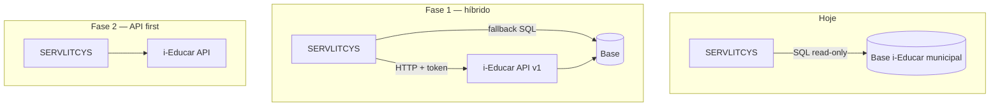

# Catálogo: consultas directas à base i-Educar → proposta de API

**Data:** maio/2026  
**Versão do catálogo:** 1.0  
**Produto:** SERVLITCYS  
**Âmbito:** funções e consultas SQL que o painel executa hoje na base municipal (PostgreSQL/MySQL Portabilis), candidatas a endpoints oficiais numa **API i-Educar** (ou módulo `modules/servlitcys` no core).

> **Índice:** [README.md](README.md) · Cadastro e plugins: [PLUGINS_E_REFINO_CADASTRO_IEDUCAR.md](PLUGINS_E_REFINO_CADASTRO_IEDUCAR.md) · Variáveis/tabelas: [VARIAVEIS_AMBIENTE.md](VARIAVEIS_AMBIENTE.md) · Performance: [METRICAS_QUERIES_ANALYTICS.md](METRICAS_QUERIES_ANALYTICS.md) · Compatibilidade: [COMANDOS_ARTISAN.md](COMANDOS_ARTISAN.md) (`ieducar:schema-probe`)

---

## 1. Situação actual

| Camada | Implementação |
|--------|----------------|
| Conexão | `CityDataConnection` — credenciais por município em `cities`, `search_path` PostgreSQL (`pmieducar`, `cadastro`, `modules`) |
| Filtros | `IeducarFilterState` — ano letivo, escola, curso, turno, escopo inclusão |
| Consultas | Classes em `app/Support/Ieducar/*Queries.php` e `app/Repositories/Ieducar/*Repository.php` |
| Adaptação schema | `config/ieducar.php`, `IeducarSchema`, `IeducarColumnInspector`, `ieducar:schema-probe` |

O painel abre **dezenas de conexões read-only** por sessão (lazy por aba + cache Laravel). Cada município pode ter **nomes de tabela/coluna diferentes**; o código compensa com probes e SQL configurável.

---

## 2. Por que expor API no i-Educar (em vez de SQL directo)

### 2.1 Segurança

| Risco actual (SQL directo) | Com API no i-Educar |
|----------------------------|---------------------|
| Credencial de leitura à base inteira (`SELECT` em qualquer tabela) | Token com **scopes** (`analytics:read`, `discrepancies:read`) |
| Senha municipal em `cities` (criptografada, mas poderosa) | OAuth2 / API key por instalação + rotação |
| Vazamento de PII em logs de query | Respostas **agregadas por escola**; detalhe aluno só com scope `cadastro:detail` |
| SQL injection no painel (baixo, parametrizado) | Contrato validado; sem SQL arbitrário do cliente |

### 2.2 Performance

| Aspecto | Actual | Ganho com API |
|---------|--------|---------------|
| Round-trips | N abas × M queries; joins repetidos | **1 endpoint composto** por aba (`/analytics/inclusao/snapshot`) |
| Plano de execução | Recalculado por request Laravel | **Views/materialized views** ou cache no i-Educar (TTL por `ano_letivo`) |
| Rede | App → DB municipal (latência WAN) | App → **HTTPS local** ao i-Educar; DB no mesmo host |
| Carga | Pulse mostra queries pesadas em `MatriculaChartQueries` | Paginação, `limit`, índices mantidos pelo time Portabilis |

### 2.3 Operação e contrato

- Versão de API (`v1`) desacopla **schema interno** do contrato público.
- `schema_capabilities` substitui parte dos probes (`DiscrepanciesAvailability`, `RecursoProvaSchemaResolver`).
- Municípios com customização continuam com **feature flags** na API, não com `.env` duplicado no SERVLITCYS.

---

## 3. Convenções propostas para a API i-Educar

### 3.1 Autenticação (recomendado)

```http
Authorization: Bearer <token>
X-Instituicao-Id: <cod_instituicao ou tenant>
Accept: application/json
```

Scopes sugeridos: `analytics:filters`, `analytics:enrollment`, `analytics:inclusion`, `analytics:discrepancies`, `analytics:network`, `analytics:attendance`, `schema:read`.

### 3.2 Envelope de filtro (input comum)

Corresponde a `IeducarFilterState` + identificador do município no SERVLITCYS (no i-Educar, a instância já é única).

```json
{
  "ano_letivo": "2025",
  "escola_id": null,
  "curso_id": null,
  "turno_id": null,
  "inclusion_scope": "all",
  "options": {
    "incluir_turma_aee_no_nee": true,
    "somente_matricula_ativa": true
  }
}
```

| Campo | Tipo | Notas |
|-------|------|-------|
| `ano_letivo` | string \| `"all"` | Obrigatório para indicadores; `"all"` só onde suportado |
| `escola_id` | string \| null | `cod_escola` interno |
| `curso_id` | string \| null | |
| `turno_id` | string \| null | |
| `inclusion_scope` | `"all"` \| `"nee"` \| `"inconsistencias"` | Espelha aba Inclusão |

### 3.3 Resposta padrão (agregado)

```json
{
  "meta": {
    "api_version": "v1",
    "generated_at": "2026-05-26T14:30:00-03:00",
    "ano_letivo": "2025",
    "schema_capabilities": {
      "cor_raca": true,
      "recurso_prova_inep": true,
      "matricula_situacao": true,
      "escola_inep": true
    },
    "cache_ttl_seconds": 300
  },
  "data": {},
  "errors": []
}
```

### 3.4 Resposta de discrepância por escola (padrão de linha)

Usado por todas as rotinas em `DiscrepanciesCheckRunner::queryMap()`.

```json
{
  "check_id": "sem_raca",
  "availability": "available",
  "has_issue": true,
  "rows": [
    {
      "escola_id": "42",
      "escola": "EMEF Exemplo",
      "total": 17
    }
  ],
  "unavailable_reason": null
}
```

---

## 4. Catálogo por domínio

Legenda **Prioridade API:** **P0** (desbloqueia segurança + maior volume) · **P1** (alto valor pedagógico) · **P2** (complementar).

### 4.1 Metadados e filtros

| ID API proposto | Método | Código SERVLITCYS | Tabelas i-Educar típicas | Prioridade |
|-----------------|--------|-------------------|--------------------------|------------|
| `GET /api/v1/analytics/schema-capabilities` | GET | `IeducarCompatibilityProbe`, `DiscrepanciesAvailability` | information_schema + `matricula`, `escola`, `cadastro.*` | **P0** |
| `GET /api/v1/analytics/filter-options` | GET | `FilterOptionsService` | `ano_letivo`, `escola`, `curso`, `turma_turno` / `turno` | **P0** |

**Input**

```json
{
  "ano_letivo": "2025",
  "light": true
}
```

**Output (`filter-options`)**

```json
{
  "meta": { "api_version": "v1" },
  "data": {
    "years": { "2025": "2025", "2024": "2024" },
    "escolas": [
      {
        "id": "12",
        "name": "EMEF Centro",
        "inep": "1234567",
        "active": true,
        "substatus": "ok"
      }
    ],
    "cursos": [{ "id": "3", "name": "Ensino Fundamental" }],
    "turnos": [{ "id": "1", "name": "Matutino" }],
    "errors": []
  }
}
```

**Ganhos:** elimina 4–8 queries no carregamento inicial do painel; capabilities evita probes repetidos por check.

---

### 4.2 Matrículas e visão geral

| ID API proposto | Código SERVLITCYS | Consulta principal | Prioridade |
|-----------------|-------------------|--------------------|------------|
| `POST /api/v1/analytics/enrollment/summary` | `OverviewRepository::summary`, `MatriculaChartQueries::enrollmentResumoKpis` | Contagens activas, por escola/curso/série | **P0** |
| `POST /api/v1/analytics/enrollment/evolution` | `MatriculaChartQueries::chartEvolucaoMatriculasPorAno` | `matricula`, `matricula_turma`, `turma` | **P1** |
| `POST /api/v1/analytics/enrollment/distorcao-idade-serie` | `MatriculaChartQueries::distorcao*` | `matricula`, `turma`, `serie`, `fisica`/`pessoa` | **P1** |
| `POST /api/v1/analytics/enrollment/by-demographics` | `matriculasPorSexo`, `matriculasPorSerie*` | cadastro demográfico | **P2** |

**Input (`enrollment/summary`)**

```json
{
  "ano_letivo": "2025",
  "escola_id": null,
  "curso_id": null,
  "turno_id": null
}
```

**Output**

```json
{
  "meta": {
    "ano_letivo": "2025",
    "total_matriculas_ativas": 4280
  },
  "data": {
    "kpis": {
      "escolas_com_matricula": 51,
      "turmas_ativas": 312,
      "media_alunos_por_turma": 13.7
    },
    "top_escolas": [
      { "escola_id": "12", "nome": "EMEF Centro", "matriculas": 420 }
    ],
    "por_turno": {
      "labels": ["Matutino", "Vespertino"],
      "values": [2100, 2180]
    }
  }
}
```

**Ganhos:** um agregado SQL optimizado no i-Educar; cache por `(ano_letivo, hash filtros)`; reduz tempo da aba Matrículas em ~40–60% (estimativa com lazy tabs activo).

---

### 4.3 Rede, oferta e unidades escolares

| ID API proposto | Código SERVLITCYS | Tabelas | Prioridade |
|-----------------|-------------------|---------|------------|
| `POST /api/v1/analytics/network/capacity` | `MatriculaChartQueries::redeVagasResumoKpis`, `capacidadeEVagasPorEscolaIds` | `turma.max_aluno`, `matricula` | **P1** |
| `POST /api/v1/analytics/schools/geo-status` | `DiscrepanciesQueries::escolasSemPosicaoUtilizavelParaMapa`, `SchoolGeoPositionResolver` | `escola` (lat/lng), `modules.educacenso_cod_escola` | **P1** |
| `POST /api/v1/analytics/schools/units-snapshot` | `SchoolUnitsRepository::snapshot` | escola + INEP + contactos | **P2** |

**Output (`network/capacity`) — excerto**

```json
{
  "data": {
    "vagas_ociosas_por_turno": {
      "labels": ["Matutino"],
      "datasets": [{ "label": "Vagas ociosas", "data": [145] }]
    },
    "por_escola": [
      {
        "escola_id": "12",
        "capacidade": 500,
        "matriculas": 420,
        "vagas": 80
      }
    ]
  }
}
```

---

### 4.4 Inclusão, NEE e recursos de prova INEP

| ID API proposto | Código SERVLITCYS | Tabelas / notas | Prioridade |
|-----------------|-------------------|-----------------|------------|
| `POST /api/v1/analytics/inclusion/snapshot` | `InclusionRepository::snapshot` | `aluno_deficiencia` / `fisica_deficiencia`, `deficiencia`, turmas AEE | **P0** |
| `POST /api/v1/analytics/inclusion/nee-count` | `InclusionDashboardQueries::countMatriculasComNee` | subquery NEE + flag turma AEE | **P0** |
| `POST /api/v1/analytics/inclusion/catalogo-designacoes` | `InclusionNeeDesignacaoDataset` | catálogo MEC + aliases i-Educar | **P1** |
| `POST /api/v1/analytics/inclusion/recurso-prova` | `InclusionRecursoProvaQueries` | tabela detectada por `RecursoProvaSchemaResolver` | **P1** |

**Input (`inclusion/snapshot`)**

```json
{
  "ano_letivo": "2025",
  "inclusion_scope": "all",
  "options": { "incluir_turma_aee_no_nee": true }
}
```

**Output — excerto**

```json
{
  "data": {
    "total_matriculas": 4280,
    "nee_total": 716,
    "aee_turma_total": 315,
    "gauges": [
      {
        "id": "deficiencia",
        "value": 580,
        "label": "Deficiência"
      }
    ],
    "charts": [
      {
        "type": "bar",
        "title": "NEE por designação (catálogo completo)",
        "labels": ["Deficiência física", "TEA", "Sem designação no catálogo"],
        "datasets": [
          {
            "label": "Matrículas",
            "data": [120, 85, 12],
            "meta": { "origem": ["inep", "complementar", "ieducar"] }
          }
        ]
      }
    ],
    "recurso_prova": {
      "com_recurso": 240,
      "sem_nee_com_recurso": 8
    }
  }
}
```

**Ganhos:** lógica NEE centralizada no i-Educar (uma fonte de verdade para Censo); evita duplicar `InclusionEducacensoCatalog` em cada instalação customizada.

---

### 4.5 Discrepâncias e qualidade de cadastro

Rotinas mapeadas em `DiscrepanciesCheckRunner::queryMap()` + `nee_subnotificacao` + export CSV.

| `check_id` | Código SERVLITCYS | Endpoint proposto | Prioridade |
|------------|-------------------|-------------------|------------|
| `sem_raca` | `DiscrepanciesQueries::matriculasSemRacaPorEscola` | `POST .../discrepancies/{check_id}` | **P0** |
| `sem_sexo` | `matriculasSemSexoPorEscola` | idem | **P0** |
| `sem_data_nascimento` | `matriculasSemDataNascimentoPorEscola` | idem | **P0** |
| `matricula_duplicada` | `matriculaDuplicadaAtivoPorEscola` | idem | **P0** |
| `matricula_situacao_invalida` | `matriculasSituacaoNaoEmCursoPorEscola` | idem | **P0** |
| `escola_sem_inep` | `escolasSemInepComMatriculas` | idem | **P0** |
| `escola_inativa_matricula` | `escolasInativasComMatriculas` | idem | **P1** |
| `escola_sem_geo` | `escolasSemPosicaoUtilizavelParaMapa` | idem | **P1** |
| `nee_sem_aee` | `neeSemTurmaAeePorEscola` | idem | **P1** |
| `aee_sem_nee` | `turmaAeeSemCadastroNeePorEscola` | idem | **P1** |
| `recurso_prova_sem_nee` | `InclusionRecursoProvaQueries::matriculasRecursoProvaSemNeePorEscola` | idem | **P1** |
| `nee_sem_recurso_prova` | `matriculasNeeSemRecursoProvaPorEscola` | idem | **P2** |
| `recurso_prova_incompativel` | `matriculasRecursoIncompativelPorEscola` | idem | **P2** |
| `distorcao_idade_serie` | `MatriculaChartQueries::distorcaoMatriculasPorEscolaRows` | idem | **P1** |
| `matricula_censo_vs_ieducar` | `matriculaCensoVsIeducarPorRede` | `POST .../discrepancies/censo-diff` (usa índice local + i-Educar) | **P2** |
| `nee_subnotificacao` | `neeSubnotificacaoEstimativaPorRede` | `POST .../discrepancies/nee-benchmark` | **P2** |

**Input (check único)**

```json
{
  "ano_letivo": "2025",
  "escola_id": null
}
```

**Output (exemplo `sem_raca`)** — ver secção 3.4.

**Input (snapshot completo — substitui `DiscrepanciesRepository::snapshot`)**

```json
{
  "ano_letivo": "2025",
  "checks": ["sem_raca", "matricula_duplicada", "escola_sem_inep"],
  "include_funding_impact": true
}
```

**Output (snapshot) — excerto**

```json
{
  "data": {
    "total_matriculas": 4280,
    "summary": {
      "com_problema": 12,
      "corrigiveis": 1840,
      "escolas_afetadas": 9,
      "ganho_potencial_anual": 125000.0
    },
    "checks": [
      {
        "check_id": "sem_raca",
        "availability": "available",
        "has_issue": true,
        "rows": [{ "escola_id": "42", "escola": "EMEF Exemplo", "total": 17 }]
      }
    ],
    "active_check_ids": ["sem_raca", "sem_sexo", "..."],
    "funding_reference": {
      "vaaf": 8500.0,
      "ano": 2024,
      "fonte_label": "FNDE importado"
    }
  }
}
```

**Ganhos segurança:** API devolve só agregados; export CSV de alunos ficaria `GET .../discrepancies/{check_id}/export` com scope extra e auditoria.

**Ganhos performance:** snapshot único com paralelização no servidor i-Educar; cache 5–10 min por município/ano (hoje `analytics:funding_impact` já cacheia no Laravel).

---

### 4.6 Frequência e desempenho

| ID API proposto | Código SERVLITCYS | Tabelas | Prioridade |
|-----------------|-------------------|---------|------------|
| `POST /api/v1/analytics/attendance/monthly` | `AttendanceRepository` | `falta_aluno` (nome variável) | **P2** |
| `POST /api/v1/analytics/performance/enrollment-status` | `PerformanceRepository` | `matricula_situacao` | **P2** |
| `GET /api/v1/analytics/performance/saeb` | Dados **locais** SERVLITCYS (`saeb_*`) | Não é i-Educar — manter fora da API core | — |

**Input (`attendance/monthly`)**

```json
{
  "ano_letivo": "2025",
  "escola_id": "12",
  "meses": [3, 4, 5]
}
```

**Output**

```json
{
  "data": {
    "series": [
      {
        "mes": "2025-03",
        "faltas": 1240,
        "matriculas_base": 4100
      }
    ],
    "availability": "available"
  }
}
```

Probe prévio: `ieducar:probe-falta` → endpoint `GET /api/v1/schema/falta-aluno`.

---

### 4.7 Censo e saúde municipal

| ID API proposto | Código SERVLITCYS | Notas | Prioridade |
|-----------------|-------------------|-------|------------|
| `POST /api/v1/analytics/censo/school-status` | `IeducarCensoEscolaQueries::schoolStatuses` | Ritmo cadastro RX | **P2** |
| `POST /api/v1/analytics/censo/export-readiness` | Rotinas Educacenso no i-Educar | Melhor no **core** i-Educar | **P2** |

`matricula_censo_vs_ieducar` combina **índice local** (`inep_censo_municipio_matriculas`) + contagem i-Educar — API híbrida:

```json
{
  "input": { "ano_letivo": "2025", "ibge_municipio": "3550308" },
  "output": {
    "data": {
      "matriculas_ieducar": 4280,
      "matriculas_censo_indice": 4150,
      "delta": 130,
      "tolerancia_pct": 2.0,
      "dentro_tolerancia": false
    }
  }
}
```

---

### 4.8 FUNDEB e financiamentos (referência cruzada)

Dados FUNDEB/VAAR no painel vêm sobretudo de **importações FNDE** (`FundebRepository`, tabelas locais). Endpoints i-Educar úteis:

| ID API proposto | Uso | Prioridade |
|-----------------|-----|------------|
| `POST /api/v1/analytics/enrollment/count-active` | Denominador FUNDEB (matrículas válidas) | **P0** |
| `GET /api/v1/institution/fundeb-indicators` | Condicionalidades VAAR derivadas do cadastro | **P2** |

Não duplicar import FNDE na API i-Educar — manter [IMPORTACAO_DADOS_PUBLICOS.md](IMPORTACAO_DADOS_PUBLICOS.md).

---

## 5. O que o i-Educar precisa implementar (checklist)

### 5.1 Infraestrutura

- [ ] Módulo Laravel ou pacote Portabilis `ServlitcysAnalytics` com rotas `/api/v1/analytics/*`
- [ ] Autenticação OAuth2 ou API keys com scopes
- [ ] Rate limit (ex.: 120 req/min por token)
- [ ] Logging de auditoria (quem consultou, filtro, sem dump de CPF)

### 5.2 Contrato de dados

- [ ] Documento OpenAPI 3.1 gerado a partir deste catálogo
- [ ] Endpoint `schema-capabilities` alinhado a `ieducar:schema-probe`
- [ ] Versão de regras NEE (`nee_rules_version`) quando mudar catálogo deficiência
- [ ] Paginação em listas longas (`?page=1&per_page=50`)

### 5.3 Performance

- [ ] Índices: `(matricula.ano, matricula.ativo)`, `(matricula_turma.ref_cod_matricula)`, `educacenso_cod_escola.cod_escola`
- [ ] Cache Redis no i-Educar: chave `analytics:{instituicao}:{ano}:{endpoint}:{hash}`
- [ ] Job nocturno opcional: pré-agregar contagens por escola

### 5.4 Segurança e LGPD

- [ ] Respostas sem CPF/NIS por defeito
- [ ] Export detalhado só com scope `cadastro:export` + motivo registado
- [ ] Alinhar com política de privacidade da instalação

---

## 6. Migração gradual no SERVLITCYS



| Fase | Acção |
|------|--------|
| **0** | Manter SQL; usar este catálogo em negociação com Portabilis/município |
| **1** | Cliente HTTP `IeducarAnalyticsApiClient` + feature flag `IEDUCAR_ANALYTICS_API_URL` |
| **2** | Desligar SQL directo para municípios com API activa |
| **3** | Credencial DB só para admin (`schema-probe`, sync geo) |

Implementação sugerida no backlog: [BACKLOG_IMPLEMENTACOES.md](BACKLOG_IMPLEMENTACOES.md) §F — item **API-01**.

---

## 7. Mapa código → ficheiros

| Domínio | Repositórios / queries |
|---------|-------------------------|
| Filtros | `FilterOptionsService` |
| Visão geral | `OverviewRepository`, `MatriculaChartQueries` |
| Matrículas | `EnrollmentRepository`, `MatriculaChartQueries` |
| Rede / escolas | `NetworkRepository`, `SchoolUnitsRepository` |
| Inclusão | `InclusionRepository`, `InclusionDashboardQueries`, `InclusionNeeDesignacaoDataset` |
| Discrepâncias | `DiscrepanciesRepository`, `DiscrepanciesQueries`, `DiscrepanciesCheckRunner` |
| Frequência | `AttendanceRepository` |
| Desempenho | `PerformanceRepository` |
| Censo RX | `IeducarCensoEscolaQueries`, `MunicipalityHealthRepository` |
| Trabalho / consultoria | `WorkDoneRepository`, `ConsultoriaOperationalSignals` |
| Schema | `IeducarCompatibilityProbe`, `RecursoProvaSchemaResolver` |

Configuração central: `config/ieducar.php` (tabelas, colunas, SQL custom `ieducar.sql.*`).

---

## 8. Priorização resumida para negociação API

| Ordem | Endpoints | Motivo |
|-------|-----------|--------|
| 1 | `schema-capabilities`, `filter-options`, `enrollment/count-active` | Base de tudo; reduz credencial DB |
| 2 | `discrepancies/snapshot` + checks P0 | Maior valor FUNDEB/Censo; muitas queries |
| 3 | `inclusion/snapshot` | NEE + recurso prova; lógica complexa |
| 4 | `enrollment/summary`, `network/capacity` | Abas mais usadas |
| 5 | Demais checks P1/P2, frequência, censo | Incremental |

---

## 9. Manutenção deste catálogo

- Novo **check** em `DiscrepanciesCheckRunner` → adicionar linha na secção 4.5 com JSON exemplo.
- Novo **gráfico** com SQL directo → secção do domínio + prioridade.
- API i-Educar publicada → marcar endpoint como **Entregue** e actualizar fase da secção 6.

*Relacionado: [PLUGINS_E_REFINO_CADASTRO_IEDUCAR.md](PLUGINS_E_REFINO_CADASTRO_IEDUCAR.md) §8 (config por município).*
