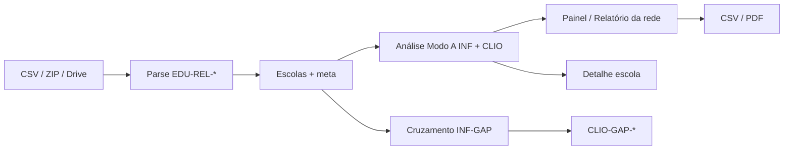

# Clio — catálogo de erros, apontamentos e relatórios

**Versão do produto:** 8.0.0 · **Última revisão:** 2026-07-21

> **Índice:** [README.md](README.md) · **Módulo:** [modulos/MODULO_CLIO.md](modulos/MODULO_CLIO.md) · **Spec:** [ROADMAP_EDUCACENSO_RELATORIOS_ETAPA1.md](ROADMAP_EDUCACENSO_RELATORIOS_ETAPA1.md)

Documento de referência do que o **Clio** pode **mostrar** hoje na interface, nas inferências (`INF-*`), nos achados (`CLIO-*`), nos erros de leitura de CSV (`EDU-REL-*`) e nas exportações. Fonte de verdade: código em `app/Services/Clio/` (análise, parse, cruzamento, presenter).

---

## 1. Como ler severidades

| Severidade | Rótulo na UI | Significado |
|------------|--------------|-------------|
| `error` | **Erro** | Precisa de correção na coleta ou no sistema |
| `warning` | **Atenção** | Revisar antes de concluir |
| `info` | **Informação** | Registro informativo / contexto |

Achados aparecem no painel municipal (`/clio/coletas/{uuid}/analise`), no detalhe da escola, no export CSV e (erros) no PDF.

---

## 2. Superfícies de relatório (o que a UI mostra)

### 2.1 Home `/clio`

| Bloco | Conteúdo |
|-------|----------|
| Faixa Clio + exercício | Marca, busca por município, filtro de ano |
| KPIs do exercício | Municípios com coleta, relatórios prontos, em andamento, tríade média, erros na rede, escolas |
| Cartões por município | Status, perfil (só coleta / consultoria), tríade %, escolas, arquivos, data de referência, erros/avisos |
| Municípios sem coleta | Catálogo Clio ainda sem coleta no ano |

### 2.2 Painel municipal `/clio/coletas/{uuid}/analise`

| Seção | Conteúdo |
|-------|----------|
| **Indicadores principais** | Escolas, % tríade, erros, avisos, matrículas Acomp curricular, escolas em boa forma |
| **Cobertura da tríade** | % completo + barras aluno / turma / profissional |
| **Andamento da coleta** | Buckets: em andamento, não iniciou, fechada, bloqueada (`INF-COL`) |
| **Relatório da rede** | Ver §3 |
| **O que os dados mostram** | Cards das inferências `INF-*` presentes |
| **Escolas da rede** | Status Completa / Incompleta / Com erros; flags de arquivos; link por escola |
| **Acertos e problemas** | Listas por severidade (erro / atenção / informação) |

### 2.3 Detalhe da escola `/clio/coletas/{uuid}/escolas/{inep}`

| Seção | Conteúdo |
|-------|----------|
| KPIs da escola | Situação, tríade 3/3, erros, avisos, linhas de alunos, arquivos |
| Tríade | Presente/em falta por tipo de relação + contagem de linhas |
| Contexto Acomp | Situação de funcionamento, forma de coleta, dependência |
| Arquivos | Kind, nome, linhas, status de parse |
| Achados | Erros / avisos / infos ligados à escola |

### 2.4 Cruzamento i-Educar `/clio/coletas/{uuid}/cruzamento`

| Bloco | Conteúdo |
|-------|----------|
| `INF-GAP` | Só Clio · só i-Educar · em ambos |
| Achados `CLIO-GAP-*` | Escolas presentes num lado e ausentes no outro |

### 2.5 Exportações

| Formato | Conteúdo típico |
|--------|-----------------|
| **CSV** | Meta da coleta, cobertura, inferências (+ payload escalar), escolas (INEP/tríade), achados (código, severidade, mensagem) — **sem PII** |
| **PDF** | Capa municipal, inferências, amostra de achados críticos |

### 2.6 RX e aba Censo

Bloco de ranking/estado das coletas do exercício (tríade, erros, avisos) — leitura operacional, não substitui o painel analítico.

---

## 3. Relatório da rede (Matrícula inicial)

Disponível no painel municipal quando há `INF-MAT` e/ou `INF-TUR` após a análise.

| Bloco | Fonte principal | Uso para decisão |
|-------|-----------------|------------------|
| Totais (turmas, alunos, curricular, AEE, AC, deltas) | Acomp + relações | Volume da rede |
| Turmas por ano / etapa | Relação turma · `Etapa de ensino` | Pirâmide de oferta |
| Alunos por ano / etapa | Relação aluno · `Etapa de ensino` | Pirâmide de matrícula |
| Composição das turmas | `Tipo de turma` → curricular / AEE / AC / outra | Oferta especializada |
| Matrícula por modalidade (Acomp) | Totais curricular / AEE / AC no Acomp | Conferência portal |
| Etapa agregada e mediação | Relação turma | Anos iniciais/finais, presencial… |
| Inclusão (heurística) | `INF-NEE` | Sinais NEE/TEA/AH quando há colunas |
| Por escola | Cruzamento escola × Acomp × relações | Flags: delta curricular, AEE/AC sem turma, alunos sem turma |
| Apontamentos do relatório | Subconjunto de `CLIO-*` (ver §5.2) | Correção prioritária |
| Notas de qualidade | Presenter | Limitações dos CSV importados |

**Dependência de qualidade:** se o Acomp não trouxer colunas AEE/AC, o relatório usa o `Tipo de turma` da Relação; se faltar `Etapa de ensino`, a pirâmide fica incompleta.

---

## 4. Inferências (`INF-*`)

Geradas por `CampaignAnalyzer` (Modo A) e `IeducarGapAnalyzer` (Modo B). Aparecem como cards «O que os dados mostram» e alimentam KPIs / relatório.

| Código | Título na UI | O que resume | Payload útil (exemplos) |
|--------|--------------|--------------|-------------------------|
| **INF-COL** | Situação da coleta nas escolas | Em andamento / não iniciou / fechada / bloqueada | `buckets`, `%` |
| **INF-ESC** | Rede escolar | Ativas vs extintas; dependência | `active`, `extinct`, `by_dependency` |
| **INF-MAT** | Matrículas | Curricular + AEE + AC (Acomp) × linhas Relação aluno; por etapa | `acomp_*_sum`, `by_etapa_ensino`, `schools` |
| **INF-TUR** | Turmas | Total e composição curricular/AEE/AC; por etapa/mediação | `by_tipo_bucket`, `by_etapa_*`, `schools` |
| **INF-DOC** | Profissionais | Linhas Relação profissional | `relacao_profissional_rows` |
| **INF-NEE** | Inclusão / NEE | Heurística de marcadores NEE/TEA/AH/AEE nas colunas | `flagged`, `scanned` |
| **INF-COE** | Coerência dos arquivos | Escolas sem tríade; se há Acomp | `triade_coverage_pct`, `has_acomp` |
| **INF-DUP** | Possíveis duplicidades | IDs repetidos na Relação aluno (rede) | `duplicate_ids`, `unique_ids` |
| **INF-DELTA** | Diferenças Acomp × Relações | Deltas curricular; AEE/AC sem turma | `divergent_*`, `samples` |
| **INF-GAP** | Comparação com o i-Educar | Só Clio / só i-Educar / ambos | Contagens de gap (Modo B) |

A re-análise (Modo A) **preserva** `INF-GAP` e achados `CLIO-GAP-*`.

---

## 5. Achados (`CLIO-*`)

### 5.1 Catálogo completo (Modo A + B)

| Código | Severidade | Escopo | Mensagem típica / quando dispara |
|--------|------------|--------|----------------------------------|
| **CLIO-COL-BLOCK** | Atenção | Escola | Escola bloqueada na coleta (Acomp) |
| **CLIO-MAT-SEM-TURMA** | Atenção | Escola | Matrículas sem `Código da turma` |
| **CLIO-MAT-SEM-ETAPA** | Informação | Rede | Matrículas sem `Etapa de ensino` (pirâmide incompleta) |
| **CLIO-TUR-SEM-CURRICULAR** | Atenção | Escola | Acomp com curricular > 0, mas sem turma tipo Curricular |
| **CLIO-TUR-AEE-AUSENTE** | Atenção | Escola | Acomp com AEE > 0, sem turma AEE na Relação |
| **CLIO-TUR-SEM-ETAPA** | Informação | Rede | Turmas sem `Etapa de ensino` |
| **CLIO-COE-TRIADE** | Atenção | Escola | Tríade incompleta (falta aluno e/ou turma e/ou profissional) |
| **CLIO-COE-ACOMP** | Informação | Rede | Coleta sem relatório municipal de acompanhamento |
| **CLIO-DUP-ID** | Atenção | Escola/arquivo | Identificação duplicada na rede (amostra mascarada) |
| **CLIO-DELTA-MAT** | Informação | Escola | Delta Acomp curricular × linhas Relação aluno |
| **CLIO-DELTA-AC** | Informação | Escola | Acomp com AC > 0 sem turma de Atividade complementar |
| **CLIO-GAP-CLIO** | Atenção | Escola | Escola na coleta Clio e **ausente** no snapshot i-Educar |
| **CLIO-GAP-IEDUCAR** | Informação | Escola* | Escola no i-Educar e **ausente** na coleta Clio |

\*Achados de gap podem referenciar escola quando há vínculo por INEP.

### 5.2 Destacados no «Relatório da rede»

Estes códigos entram na lista **Apontamentos do relatório** (além da seção geral de achados):

- `CLIO-TUR-SEM-CURRICULAR`
- `CLIO-TUR-AEE-AUSENTE`
- `CLIO-TUR-SEM-ETAPA`
- `CLIO-MAT-SEM-ETAPA`
- `CLIO-MAT-SEM-TURMA`
- `CLIO-DELTA-MAT`
- `CLIO-DELTA-AC`

### 5.3 Flags na tabela «Por escola» (sem código `CLIO-*`)

Derivadas no presenter a partir dos agregados:

| Flag | Condição |
|------|----------|
| Delta curricular | Linhas Relação aluno ≠ Acomp curricular |
| AEE sem turma | Acomp AEE > 0 e zero turmas AEE |
| AC sem turma | Acomp AC > 0 e zero turmas AC |
| Alunos sem turma | Há alunos e zero turmas no agregado da escola |

---

## 6. Erros e avisos de parse (`EDU-REL-*` e warnings)

Não são `findings` de análise; ficam no `parse_status` / `parse_meta` do artefato (upload, central, status CLI).

| Código | Quando |
|--------|--------|
| **EDU-REL-READ** | Falha ao ler o CSV |
| **EDU-REL-COLS** | Colunas obrigatórias ausentes |
| **EDU-REL-EMPTY** | Acomp sem escolas válidas (INEP) |
| **EDU-REL-HEADER** | CSV sem cabeçalho utilizável |
| **EDU-REL-EX** | Exceção inesperada no parse |

**Avisos de parse** (status `warning`), exemplos:

- Linhas sem Código da escola válido (Acomp)
- Nenhuma linha com Código da turma (aluno)
- Turmas / matrículas sem Etapa de ensino

---

## 7. Status da escola no painel (rótulos de UI)

| Status | Tom | Critério resumido |
|--------|-----|-------------------|
| Com erros | Rose | Há finding `error` na escola |
| Completa | Emerald | Tríade OK e sem erro |
| Incompleta | Amber | Falta aluno e/ou turma e/ou profissional |
| Sem arquivos | Slate | Sem relações ligadas |

Na home, cartões usam trilho colorido: pronto / erro / interpretado / em preparação.

---

## 8. Artefatos que alimentam os relatórios

| Kind | Arquivo típico | Papel |
|------|----------------|-------|
| `acomp_coleta_1etapa` | `Relatorio_Acomp_Coleta_1Etapa_*.csv` | Cadastro de escolas, status coleta, totais curricular/AEE/AC |
| `relacao_aluno_escola` | `RelacaoAlunoEscola_*.csv` | Matrículas, etapa, duplicidades, NEE heurístico |
| `relacao_turma_escola` | `RelacaoTurmaEscola_*.csv` | Turmas, etapa, tipo (curricular/AEE/AC), mediação |
| `relacao_profissional_escola` | `RelacaoProfissionalEscola_*.csv` | Contagem de vínculos (INF-DOC) |
| `pacote_zip` | ZIP de pastas INEP | Ingestão; expandido para as relações |

---

## 9. Fluxo resumido

---

## 10. O que ainda **não** é catálogo estável na UI

Itens previstos no roadmap Educacenso, mas ainda limitados pela qualidade dos CSV ou não persistidos como finding dedicado:

- Pirâmide oficial só a partir do Acomp desagregado por etapa (quando o portal exportar todas as colunas)
- NEE/TEA/AH fiável sem colunas de deficiência na Relação aluno
- Cruzamento aluno→turma linha a linha (além de contagens e heurísticas)
- Achados `error` críticos além da tríade/bloqueios (a maior parte dos deltas é `info` / `warning`)

Atualizar este documento quando novos códigos `CLIO-*` / `INF-*` forem adicionados em `CampaignAnalyzer` ou `IeducarGapAnalyzer`.

---

## Ver também

| Documento | Uso |
|-----------|-----|
| [modulos/MODULO_CLIO.md](modulos/MODULO_CLIO.md) | Visão do módulo e rotas |
| [ROADMAP_EDUCACENSO_RELATORIOS_ETAPA1.md](ROADMAP_EDUCACENSO_RELATORIOS_ETAPA1.md) | Spec INF-* e BI planejado |
| [CLIO_TODO_IMPLEMENTACAO.md](CLIO_TODO_IMPLEMENTACAO.md) | Checklist de implementação |
| [EDUCACENSO_SIMULACAO_CARGA_ETAPA1.md](EDUCACENSO_SIMULACAO_CARGA_ETAPA1.md) | Conferência TXT pipe × i-Educar (paralelo ao Clio) |
