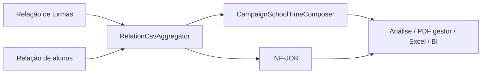

# Clio — Tempo escolar (turmas e alunos)

**Versão do produto:** 8.2.0 · **Última revisão:** 2026-07-24

> **Índice:** [README.md](README.md) · **Módulo:** [modulos/MODULO_CLIO.md](modulos/MODULO_CLIO.md) · **Roadmap:** [ROADMAP_CLIO.md](ROADMAP_CLIO.md) · **Catálogo:** [CLIO_CATALOGO_ERROS_E_RELATORIOS.md](CLIO_CATALOGO_ERROS_E_RELATORIOS.md)

Documento **operacional** sobre como o Clio mede e apresenta o **tempo escolar semanal** a partir das Relações Educacenso (turmas × alunos), quais cenários existem e que resposta o produto dá em cada um.

---

## 1. Em uma frase

O Clio lê a **Carga horária semanal** (ou, na ausência, a **grade no Turno**) na Relação de turmas, cruza com a Relação de alunos e calcula **horas/semana ponderadas pelo número de alunos**, por segmento pedagógico e para a rede municipal.

Não é um substituto do cadastro no portal Educacenso: se o export vier sem horas legíveis, o Clio **explica o buraco** e mostra só contagens.

---

## 2. Fontes e papéis

| Fonte CSV | Papel no tempo escolar |
|-----------|------------------------|
| `relacao_turma_escola` | Perfis de turma: etapa, tipo (curricular / AEE / AC), **Turno**, **Carga horária** |
| `relacao_aluno_escola` | Contagem de alunos por código de turma (peso da média) |

| Camada | Classe / artefacto | Função |
|--------|--------------------|--------|
| Agregação | `RelationCsvAggregator` | Detecta colunas, faz parse da CH, estima CH pelo Turno, monta faixas e turnos |
| Composer | `CampaignSchoolTimeComposer` | Médias ponderadas por segmento e rede |
| Inferência | `CampaignAnalyzer::inferJornada` | Persiste `INF-JOR` + finding `CLIO-JOR-SEM-COL` |
| UI | `CampaignAnalysisPresenter` + `analysis-jornada.blade.php` | Quadro jornada + tempo escolar |
| BI | `ClioBiRefreshService` + insight `SCHOOL_TIME` | Snapshot e leitura gerencial |
| Export | PDF gestor · aba Excel «Tempo escolar» | Mesmos números do composer |



---

## 3. Como a carga horária é obtida

### 3.1 Detecção de colunas

**Turno**

1. Cabeçalho exacto `Turno` (case-insensitive), ou
2. Regex `turno|horário de funcionamento`

**Carga horária** (maior score vence; rejeita falsos positivos como «Duração do curso» / «Carga horária anual»)

| Cabeçalho típico | Score |
|------------------|-------|
| Carga horária semanal | 100 |
| CH semanal | 90 |
| Carga horária (genérico) | 70 |
| Duração semanal (da turma) | 60 |

### 3.2 Parse da célula de CH

| Entrada | Resultado |
|---------|-----------|
| `20`, `20,5`, `20h`, `20 horas`, `20:00` | Horas semanais |
| `120 min`, `1200 min` | Minutos ÷ 60 |
| Número grande sem unidade (ex.: `1200`, ≤ 10080) | Tratado como minutos ÷ 60 |
| Vazio, `Integral`, texto sem número | `null` |
| Valor &gt; 168 h | `null` (fora de faixa) |

### 3.3 Fallback: grade no Turno

Se a CH da célula falhar, o Clio tenta **somar intervalos** no texto do Turno (`08:00 às 12:00`, variantes `as` / `até` / `-`).

| Turno | Estimativa |
|-------|------------|
| Seg–Sex `08:00 às 12:00` | **20,0 h/semana** |
| Vários intervalos no mesmo dia | Soma das durações |
| `Manhã`, `Integral`, vazio | Sem estimativa (`null`) |
| Total ≤ 0 ou &gt; 168 | Descartado |

O fallback corre no agregador **e** no composer (perfil em cache sem `ch_hours`). Quando a estimativa pelo Turno funciona, a turma passa a ter `ch_hours` e conta para o quadro **Tempo escolar** — mas **não** alimenta o histograma de faixas pedagógicas se a **coluna CH não existir** no export (ver §5).

---

## 4. Como se calcula o tempo do aluno

Para cada turma com horas conhecidas (`ch`):

1. Conta-se a turma na média simples de turmas do segmento.
2. Se existem alunos vinculados na Relação:  
   `ch_sum_aluno += ch × alunos` · `alunos_com_ch += alunos`
3. A média reportada (**horas/semana do aluno**) é  
   `ch_sum_aluno / alunos_com_ch` (ponderada).

**Rede municipal:** mesma fórmula somando todos os segmentos.

**Segmentos**

| Chave | Origem |
|-------|--------|
| `infantil`, `fundamental_1`, `fundamental_2`, `medio`, `eja`, `profissional` | Etapa / agregada da turma |
| `aee`, `atividade_complementar` | Tipo de turma (bucket) |
| `outro` | Restante |

Dentro de cada segmento há fatias **curricular / AEE / AC** e, se houver várias cargas distintas, `ch_options` (lista de horas com turmas/alunos).

**Nuances**

- Turma com CH mas **sem alunos** na Relação entra na média por turma, **não** na média por aluno.
- A UI de análise mostra só os 6 segmentos pedagógicos (exclui AEE/AC/`outro` do quadro principal).
- O **PDF do gestor** e o composer bruto mostram todos os segmentos disponíveis.

---

## 5. Duas leituras: faixas de turmas × tempo do aluno

| Leitura | Depende de | Pergunta |
|---------|------------|----------|
| **Faixas de CH (turmas)** | Coluna de Carga horária no CSV | Como se distribuem as turmas por jornada? |
| **Tempo escolar (alunos)** | CH parseada **ou** grade no Turno + alunos | Quantas horas/semana o aluno típico tem? |

Por isso é possível ter **média de horas na rede** (via Turno) e, ao mesmo tempo, mensagem de «coluna CH não encontrada» nas faixas.

### Faixas pedagógicas (só com coluna CH)

| Faixa | Horas | Chave |
|-------|-------|-------|
| Carga reduzida | ≤ 14 | `reduzida` |
| Parcial curta | 15–19 | `curta` |
| Parcial típica | 20–24 | `parcial` |
| Jornada ampliada | 25–34 | `ampliada` |
| Tempo integral | ≥ 35 | `integral` |
| Não informado | sem valor legível | `ni` / **N/I** |

**N/I não é faixa pedagógica** — significa coluna presente, mas célula vazia, texto ilegível ou valor fora de 0–168 h.

### Turnos canónicos

Manhã · Intermediário · Tarde · Noite · Integral · **Outros** (textos livres / horários não classificados, com detalhe em «Outros»).

---

## 6. Cenários previstos e respostas do produto

### 6.1 Disponibilidade do quadro Tempo escolar

| Cenário | `available` | `has_ch` | Resposta típica |
|---------|-------------|----------|-----------------|
| Sem ficheiros `relacao_turma_escola` | `false` | `false` | Quadro omitido / Excel: sem Relações suficientes |
| Há turmas, mas sem CH nem grade no Turno | `true` | `false` | Nota: *«…não trouxeram Carga horária legível nem grade no Turno — abaixo só contagens…»* · UI: *«Sem horas semanais calculáveis…»* · Insight BI **warning** `SCHOOL_TIME` |
| Há CH (coluna e/ou Turno) | `true` | `true` | Nota: *«Horas/semana estimadas… ponderadas pelos alunos…»* · KPI média rede · Insight BI **info** `SCHOOL_TIME` |
| Só AEE/AC (sem segmentos pedagógicos filtrados) | composer `true`, UI pode `false` | varia | UI esconde quadro se não restar segmento desejado; PDF gestor ainda pode listar AEE/AC |

**Nota com CH (`has_ch = true`):**

> Horas/semana estimadas a partir da Carga horária das turmas (ou da grade no campo Turno), ponderadas pelos alunos vinculados (Relação). Quando o segmento mistura curricular, AEE ou complementar — ou várias cargas — o detalhe aparece sob a linha.

**Nota sem CH (`has_ch = false`):**

> As Relações de turmas não trouxeram Carga horária legível nem grade no Turno — abaixo só contagens de turmas/alunos por segmento. Confirme se a coluna «Carga horária semanal» ou os horários no Turno vieram preenchidos no export do Educacenso.

### 6.2 Por turma (agregação)

| Coluna CH | Célula / Turno | `ch_hours` | Contagem meta | Faixa turmas |
|-----------|----------------|------------|---------------|--------------|
| Presente | Número legível | valor | `parsed` | faixa pedagógica |
| Presente | Vazia + Turno com grade | estimativa | `parsed` | faixa da estimativa |
| Presente | Vazia + Turno sem grade | `null` | `empty` | **N/I** |
| Presente | Texto ilegível + sem grade | `null` | `unreadable` | **N/I** |
| Ausente | Turno com grade | estimativa | — | **sem** histograma de faixas |
| Ausente | Turno sem grade | `null` | — | sem faixas |

### 6.3 Explicação das faixas (`cargaHorariaExplain`)

| Condição | Severidade | Lead (resumo) |
|----------|------------|---------------|
| Sem coluna CH e zero barras | `warn` | Coluna de Carga horária semanal não encontrada; peça o export correcto |
| ≥ 95% das turmas em N/I | `warn` | Quase todas em N/I; detalha células vazias vs texto ilegível; N/I ≠ faixa pedagógica |
| ≥ 20% em N/I | `info` | Faixas pedagógicas + percentagem N/I |
| Caso normal | `ok` | Faixas ~20–24 / 25–34 / ≥ 35 h |

### 6.4 Colunas Turno / CH na UI de jornada

| Turno | CH | Mensagem extra |
|-------|----|----------------|
| ausente | ausente | Ambos ausentes; padrões AEE/AC ainda podem aparecer |
| ausente | presente | Turno ausente; faixas CH disponíveis |
| presente | ausente | CH ausente; turnos disponíveis |

Se **nenhuma** das duas colunas existir e houver turmas → finding `CLIO-JOR-SEM-COL` (info): export limitado a padrões de matrícula.

### 6.5 Padrões de jornada do aluno (`INF-JOR`)

Além das horas, o Clio detecta padrões a partir das matrículas do aluno:

| Padrão | Regra resumida |
|--------|----------------|
| Fundamental + AEE em contraturno | 2 matrículas: curricular fund. + AEE |
| Curricular + atividade complementar | Curricular + AC |
| Infantil em turma estendida | Infantil curricular, jornada estendida, 1 matrícula |
| Multi-matrícula | ≥ 2 turmas |
| Estendida / integral | Turno integral/estendido **ou** CH ≥ 35 h |

### 6.6 Canais de saída

| Canal | Com CH | Sem CH (mas com turmas) |
|-------|--------|-------------------------|
| Análise (UI) | Tabela segmentos + média rede | Contagens + aviso |
| PDF gestor | KPI + tabela completa + nota | Tabela/contagens + nota |
| Excel (aba Tempo escolar) | Nota, média, segmentos; opcionalmente faixas/turnos | Mensagem / contagens |
| Insight BI `SCHOOL_TIME` | info com média h/semana | warning pedindo preenchimento |

---

## 7. Payload do composer (contrato)

```text
available: bool          // há perfis de turma
has_ch: bool             // ≥ 1 turma com ch_hours (coluna ou Turno)
note: string             // mensagem pedagógica
segments[]:
  key, label
  turmas, alunos
  ch_media_turma, ch_media_aluno, horas_aluno_semana
  curricular / aee / ac  { turmas, alunos, ch_media_aluno }
  ch_options[]           { hours, label, turmas, alunos }
  has_multiple_tipos, has_multiple_ch
network:
  ch_media_aluno, horas_aluno_semana, alunos_com_ch
```

`INF-JOR.school_time` guarda uma versão slim (sem AEE/AC/`outro` no detalhe persistido). A UI **recalcula ao vivo** via composer para não depender de payload desatualizado.

Snapshot BI: `school_time_available`, `school_time_has_ch`, `school_time_hours`.

---

## 8. Como reprocessar

```bash
# Uma coleta
php artisan clio:campaign-analyze {uuid}

# Todas as coletas do exercício
php artisan clio:campaign-reanalyze-all --year=2026
```

Se a meta antiga tinha coluna CH mas zero horas parseadas, o composer **reprocessa o CSV** em vez de confiar só no `parse_meta`.

Após mudança de export no Educacenso: reimportar Relações de turmas (e alunos, se necessário) e reanalisar.

---

## 9. Testes de referência

| Teste | Cobertura |
|-------|-----------|
| `tests/Unit/Clio/CampaignSchoolTimeComposerTest.php` | Sem artefatos; ordenação de opções de CH |
| `tests/Unit/Clio/CampaignJornadaTest.php` | Fixture turno+CH, faixas, padrões, presenter |
| `tests/Unit/Clio/EtapaLabelOrderAndCensusStageTest.php` | Faixas, detecção de coluna, parse, estimativa Turno |
| `tests/Unit/Clio/ClioS7MedidoresTest.php` | Insight `SCHOOL_TIME` com/sem CH |
| `tests/Unit/Clio/CampaignExcelExporterTest.php` | Aba Tempo escolar |

Fixture típica: `tests/fixtures/clio/coleta_2026/…/RelacaoTurmaEscola_*.csv`.

---

## 10. Referências de código

| Ficheiro | Métodos-chave |
|----------|---------------|
| `app/Services/Clio/Analysis/RelationCsvAggregator.php` | `aggregateTurmas`, `parseCargaHoraria`, `estimateWeeklyHoursFromTurno`, `cargaHorariaBandMeta` |
| `app/Services/Clio/Analysis/CampaignSchoolTimeComposer.php` | `compose`, `enrichProfileCh` |
| `app/Services/Clio/Analysis/CampaignAnalyzer.php` | `inferJornada`, `schoolTimePayload` |
| `app/Services/Clio/Analysis/CampaignAnalysisPresenter.php` | `buildJornadaSection`, `presentSchoolTime`, `cargaHorariaExplain` |
| `app/Services/Clio/Bi/ClioBiInsightComposer.php` | insight `SCHOOL_TIME` |
| `resources/views/clio/campaigns/partials/analysis-jornada.blade.php` | UI |
| `resources/views/pdf/clio-campaign/gestor.blade.php` | PDF gestor |

Releases: [Asclepius 8.1.0](RELEASE_20260724b_ASCLEPIUS.md) (faixas + composer) · [Hygieia 8.2.0](RELEASE_20260724c_HYGIEIA.md) (estimativa via Turno).
