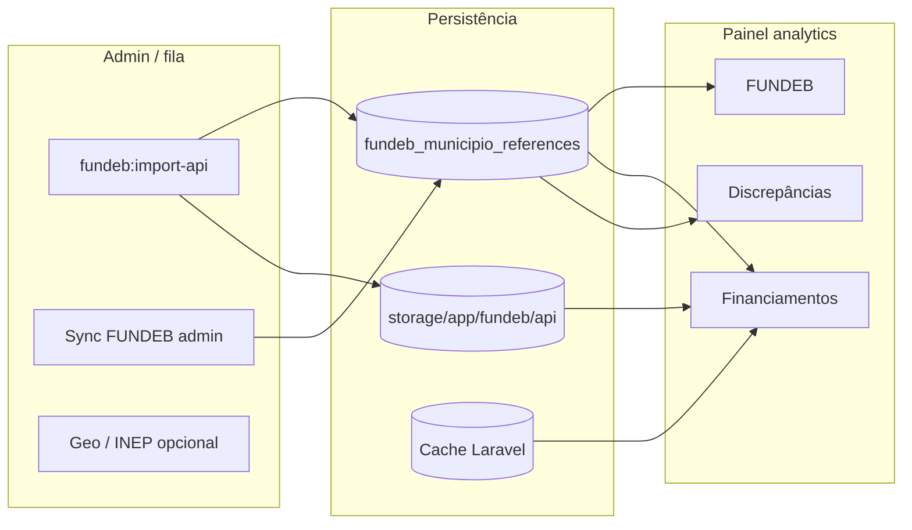

# Consultas externas — fontes, necessidade e uso no sistema

**Data:** maio de 2026  
**Âmbito:** servlitcys (painel de análise i-Educar municipal)

> **Índice:** [README.md](README.md) · **Backlog:** [BACKLOG_IMPLEMENTACOES.md](BACKLOG_IMPLEMENTACOES.md) §C · **Ponderações:** [PONDERACOES_TECNICAS.md](PONDERACOES_TECNICAS.md) §6.

**Relacionado:** [FUNDEB_VAAF_E_ONDA1.md](FUNDEB_VAAF_E_ONDA1.md), [IMPLANTACAO_PRODUCAO.md](IMPLANTACAO_PRODUCAO.md), [ROADMAP_BASES_CALCULOS_FINANCEIROS.md](ROADMAP_BASES_CALCULOS_FINANCEIROS.md)

---

## 1. Resumo executivo

O servlitcys combina **dados locais** (base i-Educar de cada município, ligada por cidade) com **consultas pontuais a fontes públicas federais**. Nenhuma integração substitui o Simec, a prestação de contas do FNDE nem o cálculo oficial de complementação FUNDEB/VAAR.

| Tipo | Origem | Persistência no app | Uso principal |
|------|--------|---------------------|---------------|
| **Financeiro / repasses** | FNDE CKAN, cache JSON, Tesouro CKAN, Portal da Transparência | `fundeb_municipio_references`, `storage/app/fundeb/api/`, cache Laravel | Abas **FUNDEB**, **Financiamentos**, **Discrepâncias**, **Diagnóstico Geral** |
| **Cadastro / Censo** | INEP microdados (ZIP), ArcGIS escolas | `inep_censo_escola_geo_agg`, `school_unit_geos` | Mapa, **Unidades Escolares**, **Censo** |
| **Aprendizagem** | SAEB (URLs, microdados INEP) | `storage/app/saeb/…` | **Desempenho**, inferências pedagógicas |
| **Referência (links)** | Catálogo estático | — | Links oficiais em várias abas (`PublicDataSourcesCatalog`) |

Todas as chamadas HTTP são **somente leitura**, filtradas por **IBGE do município** (quando aplicável) e sujeitas a **timeout**, **cache** e **filas** administrativas.

---

## 2. Princípios de desenho

1. **Município como unidade:** quase todas as consultas financeiras exigem `City.ibge_municipio` e ano letivo do filtro.
2. **Cache antes de rede:** FUNDEB grava `storage/app/fundeb/api/{ibge}/{ano}.json`; Financiamentos usa cache Laravel (`other_funding_public:{city}:{ibge}:{ano}`).
3. **Indicativo, não oficial:** valores de «perda/ganho», previsão FUNDEB e horas de cadastro são **modelos configuráveis** para priorização — não para contabilidade.
4. **Falha graciosa:** se API falhar ou chave faltar, a UI mostra nota explicativa (não bloqueia o painel).
5. **Admin para carga pesada:** importações INEP/SAEB/FUNDEB em massa correm em `admin-sync` ou comandos Artisan, não no clique do utilizador analítico.

---

## 3. Recursos públicos e financiamento (destaque)

Esta secção concentra o que mais impacta **repasse, planeamento financeiro e conformidade** com FUNDEB, VAAR e programas complementares.

### 3.1 FUNDEB — dados abertos FNDE (CKAN)

| Item | Detalhe |
|------|---------|
| **Serviço** | `App\Services\Fundeb\FundebOpenDataImportService` + `FundebFndeReceitaCsvService` |
| **Endpoint** | `GET {IEDUCAR_FUNDEB_CKAN_URL}/api/3/action/datastore_search` (default: `https://www.fnde.gov.br/dadosabertos`) |
| **Descoberta** | `package_search` com `IEDUCAR_FUNDEB_CKAN_SEARCH` se `IEDUCAR_FUNDEB_CKAN_RESOURCE_ID` estiver vazio |
| **Alternativa** | JSON remoto ou ficheiro `storage://app/fundeb/api/{ibge}/{ano}.json` (`IEDUCAR_FUNDEB_JSON_URL`) |
| **Portaria FNDE (CSV)** | «Receita total do Fundeb por ente federado» em gov.br/fnde — VAAF **estimado** = receita total ÷ matrículas activas i-Educar (`fnde_portaria_receita_ieducar`) |

**Por que é necessário**

- Obter **VAAF** (e opcionalmente **VAAT**, complementação VAAR) **por município e ano**, base para:
  - estimativa de impacto financeiro nas **discrepâncias** (`DiscrepanciesFundingImpact`);
  - **previsão de recursos** na aba FUNDEB (`FundebResourceProjection`);
  - comparação municipal × prévia federal (`FundebMunicipalReferenceResolver`).

**Impacto no sistema**

| Área | Efeito |
|------|--------|
| `fundeb_municipio_references` | Linha por `city_id` + `ano` com VAAF importado |
| Discrepâncias | `ocorrências × VAAF × peso_por_check` → perda/ganho indicativo |
| FUNDEB | Gráficos de previsão, distribuição legal (% MDE), comparativo VAAF |
| Financiamentos | Bloco «FUNDEB — referência municipal» via cache local |
| Admin | `/admin/ieducar-compatibility` — importar um ou todos os municípios |
| CLI | `php artisan fundeb:import-api {city} --ano=…` |

**Variáveis `.env`**

```env
IEDUCAR_FUNDEB_CKAN_URL=https://www.fnde.gov.br/dadosabertos
IEDUCAR_FUNDEB_CKAN_RESOURCE_ID=          # recomendado em produção
IEDUCAR_FUNDEB_CKAN_SEARCH="fundeb vaaf municipio"
IEDUCAR_FUNDEB_JSON_URL=storage://app/fundeb/api/{ibge}/{ano}.json
IEDUCAR_FUNDEB_API_TIMEOUT=30
IEDUCAR_FUNDEB_SYNC_YEARS=2020,2021,2022,2023,2024,2025
IEDUCAR_DISC_VAA_REFERENCIA=5559.73       # fallback se não houver import
IEDUCAR_FUNDEB_NATIONAL_FLOOR_ON_IMPORT=false  # evita gravar piso nacional como VAAF municipal
IEDUCAR_FUNDEB_VAAF_ESTIMATE_MIN=2500
IEDUCAR_FUNDEB_VAAF_ESTIMATE_MAX=18000
```

**Ordem de importação (por município/ano):** cache/JSON → CKAN → CSV Portaria FNDE + matrículas i-Educar → (opcional) piso nacional se `IEDUCAR_FUNDEB_NATIONAL_FLOOR_ON_IMPORT=true`.

Registos com `fonte` `referencia_nacional_config` são **ignorados** pelo resolver municipal; reimporte após activar a nova cadeia (`fundeb:import-api` ou admin FUNDEB).

**Mensagem típica na UI:** «Nenhum registo em cache para IBGE/ano» → activar `IEDUCAR_OTHER_FUNDING_LIVE_FNDE=true` **e** configurar `IEDUCAR_FUNDEB_CKAN_RESOURCE_ID`, ou sincronizar FUNDEB no admin.

---

### 3.2 Aba Financiamentos — consultas públicas automáticas

| Item | Detalhe |
|------|---------|
| **Serviço** | `App\Services\Funding\MunicipalFundingPublicSnapshotService` |
| **Orquestração** | `OtherFundingRepository` → campo `public_municipal` |
| **Vista** | `resources/views/dashboard/analytics/partials/other-funding.blade.php` |
| **Cache** | `Cache::remember` — chave `other_funding_public:{city_id}:{ibge}:{ano}`, TTL `IEDUCAR_OTHER_FUNDING_PUBLIC_CACHE_TTL` |

Quatro consultas são executadas em cada carregamento (após cache expirar):

#### A) FUNDEB — referência municipal e prévia

- **Fonte:** base **local** (`fundeb_municipio_references`) + resolver (`FundebMunicipalReferenceResolver`).
- **Rede:** não (só BD app).
- **Necessidade:** mostrar na mesma aba o que já foi importado e divergência municipal × prévia.
- **Impacto:** coerência com aba FUNDEB e Discrepâncias sem nova API.

#### B) FNDE — dados abertos (CKAN) em tempo real ou cache

- **Fonte:** `FundebOpenDataImportService::readCachedRowOnly` ou, se `IEDUCAR_OTHER_FUNDING_LIVE_FNDE=true`, `datastore_search` CKAN.
- **Necessidade:** prévia quando ainda não há import admin nem ficheiro em `storage/app/fundeb/`.
- **Impacto:** reduz «painel vazio»; depende de `IEDUCAR_FUNDEB_CKAN_RESOURCE_ID` para consulta live fiável.

#### C) Tesouro Transparente — transferências ao município

- **Endpoint** | `GET {IEDUCAR_TESOURO_CKAN_URL}/api/3/action/datastore_search` |
| **Pacote** | `transferencias-obrigatorias-da-uniao-por-municipio` (`IEDUCAR_TESOURO_TRANSFERENCIAS_PACKAGE`) |
| **Resource** | `IEDUCAR_TESOURO_TRANSFERENCIAS_RESOURCE_ID` ou descoberta via `package_show` |

- **Necessidade:** visão de **repasses da União** (inclui transferências constitucionais; pode conter rubricas ligadas à educação).
- **Impacto:** amostra filtrada por IBGE e palavras-chave (`fundeb`, `fnde`, `pnae`, `pnate`, `pdde`, `educa`…); **não** separa automaticamente cada programa.
- **Limitação:** mensagem «Nenhuma linha encontrada para o IBGE no limite da consulta» — o CKAN devolve lote limitado (500 registos); municípios grandes podem exigir resource ID correcto ou import offline.

#### D) Portal da Transparência — despesas federais

- **Endpoint** | `GET https://api.portaldatransparencia.gov.br/api-de-dados/despesas?codigoMunicipio={ibge}` |
| **Autenticação** | Header `chave-api-dados: {PORTAL_TRANSPARENCIA_API_KEY}` |
| **Cadastro** | [portaldatransparencia.gov.br/pagina-api](https://portaldatransparencia.gov.br/pagina-api) (gratuito) |

- **Necessidade:** cruzar **execução federal** no município com programas educacionais (filtro por palavras-chave em `IEDUCAR_PORTAL_TRANSPARENCIA_KEYWORDS`).
- **Impacto:** até `IEDUCAR_PORTAL_TRANSPARENCIA_MAX_ROWS` linhas na UI; sem chave, consulta fica em estado «Não consultado».
- **Nota:** primeira página da API; não lista todos os programas — uso de apoio à consultoria, não auditoria completa.

**Variáveis `.env` (Financiamentos)**

```env
IEDUCAR_OTHER_FUNDING_PUBLIC_QUERIES=true
IEDUCAR_OTHER_FUNDING_PUBLIC_CACHE_TTL=3600
IEDUCAR_OTHER_FUNDING_PUBLIC_TIMEOUT=12
IEDUCAR_OTHER_FUNDING_LIVE_FNDE=true
PORTAL_TRANSPARENCIA_API_KEY=
IEDUCAR_PORTAL_TRANSPARENCIA_ENABLED=true
IEDUCAR_TESOURO_CKAN_ENABLED=true
IEDUCAR_TESOURO_TRANSFERENCIAS_RESOURCE_ID=
```

---

### 3.3 Programas complementares (PNAE, PNATE, PDDE) — leitura i-Educar

| Item | Detalhe |
|------|---------|
| **Serviço** | `OtherFundingRepository` |
| **Fonte** | Base **municipal** i-Educar (`matricula`, colunas configuráveis em `config/ieducar.php` → `other_funding.programs`) |
| **Rede externa** | Não — apenas detecção automática de colunas (`transporte_escolar`, `alimentacao_escolar`, etc.) |

**Necessidade**

- Medir **cobertura de cadastro** que alimenta elegibilidade a PNAE, PNATE e PDDE no Censo.
- Ligar ao pilar «Programas complementares» das discrepâncias (`DiscrepanciesFundingImpact::fundingPillars`).

**Impacto**

- KPIs e gráfico de % de preenchimento por programa na aba **Financiamentos**.
- Não calcula valor de repasse PNAE/PNATE — apenas indica se o município regista os campos que o painel consegue ler.

---

### 3.4 Modelos financeiros internos (sem API externa)

Estes cálculos usam dados já carregados (i-Educar + referência FUNDEB importada):

| Componente | Fórmula / lógica | Onde aparece |
|------------|------------------|--------------|
| `DiscrepanciesFundingImpact` | `ocorrências × VAAF × peso_por_check` | Discrepâncias, export CSV, Diagnóstico Geral |
| `FundebResourceProjection` | `matrículas × VAAF`; cenários ± perda/ganho discrepâncias; % VAAR configurável | Aba FUNDEB |
| `FundebComplementacaoInformeBuilder` | Textos narrativos VAAR/VAAT (sem API MEC) | Aba FUNDEB |
| `ConsultoriaThematicBridge` | Blocos temáticos financiamento + VAAR | Diagnóstico Geral (**Serventec**) |

**Impacto transversal:** alterar `IEDUCAR_DISC_VAA_REFERENCIA` ou importar VAAF municipal muda **todas** as estimativas indicativas de uma vez.

---

## 4. Outras consultas externas (não financeiras directas)

### 4.1 INEP — microdados Censo Escolar (ZIP)

| Item | Detalhe |
|------|---------|
| **Serviço** | `InepMicrodadosCadastroEscolasDownloader`, `ImportInepMicrodadosCadastroEscolasGeo` |
| **URL** | `http://download.inep.gov.br/dados_abertos/microdados_censo_escolar_{year}.zip` |
| **Persistência** | CSV local + agregado `inep_censo_escola_geo_agg` |

**Necessidade:** município/UF/região e contexto Censo no modal do mapa quando o i-Educar não tem endereço completo.  
**Impacto:** **Unidades Escolares**, sincronização geo admin; apoio indireto ao Censo (não é valor financeiro).

### 4.2 INEP / ArcGIS — geocodificação de escolas

| Item | Detalhe |
|------|---------|
| **Serviço** | `InepCatalogoEscolasGeoService`, `SchoolGeoPositionResolver` |
| **URL** | FeatureServer ArcGIS (config: `IEDUCAR_INEP_ARCGIS_QUERY_URLS`) |
| **Timeout** | 25–30 s por pedido |

**Necessidade:** latitude/longitude para mapa e discrepância `escola_sem_geo`.  
**Impacto:** operacional / conformidade cadastro; peso financeiro baixo (`peso_por_check` = 0,5).

### 4.3 SAEB — séries e microdados

| Item | Detalhe |
|------|---------|
| **Serviços** | `SaebPedagogicalImportService`, `SaebMicrodadosOpenDataImportService`, `SaebOfficialMunicipalImportService` |
| **URLs** | `IEDUCAR_SAEB_IMPORT_URLS`, `IEDUCAR_SAEB_OFFICIAL_URL_TEMPLATE`, ZIP microdados INEP |

**Necessidade:** gráficos de aprendizagem na aba **Desempenho**; eixo **VAAR — indicadores INEP** nas discrepâncias.  
**Impacto financeiro:** indirecto (metas VAAR / IDEB); não há API de repasse SAEB.

---

## 5. Onde cada consulta aparece na UI

| Consulta / dado | Aba / área | Componente |
|-----------------|------------|------------|
| VAAF / VAAT importado | FUNDEB | `FundebRepository`, card previsão |
| Consultas CKAN + Transparência | **Financiamentos** | `MunicipalFundingPublicSnapshotService` |
| PNAE/PNATE/PDDE cobertura cadastro | **Financiamentos** | `OtherFundingRepository` |
| Perda/ganho discrepâncias | Discrepâncias, Diagnóstico Geral | `DiscrepanciesRepository` |
| Links FNDE, Tesouro, Simec | FUNDEB, Financiamentos, Inclusão | `PublicDataSourcesCatalog` |
| Censo escola exportada/fechada | **Censo** | `IeducarCensoEscolaQueries` (só i-Educar) |
| Mapa INEP / Censo geo | Unidades Escolares | `SchoolUnitsRepository` |

---

## 6. Fluxo operacional recomendado (produção)



1. Configurar `IEDUCAR_FUNDEB_CKAN_RESOURCE_ID` e `PORTAL_TRANSPARENCIA_API_KEY`.
2. Importar FUNDEB por município/ano no admin (preenche cache + BD).
3. Activar `IEDUCAR_OTHER_FUNDING_LIVE_FNDE=true` como rede de segurança.
4. `php artisan config:cache` após alterar `.env`.

---

## 7. Riscos e limitações

| Risco | Mitigação actual |
|-------|------------------|
| CKAN FNDE instável ou HTML em vez de JSON | Cache em disco + import admin |
| Tesouro: lote limitado sem filtro server-side por IBGE | Documentar; futuro: import CSV nacional ([ROADMAP](ROADMAP_BASES_CALCULOS_FINANCEIROS.md)) |
| Portal Transparência: paginação e rate limit | Cache TTL; amostra na UI |
| Confundir estimativa com repasse oficial | Avisos em `IEDUCAR_DISC_AVISO_FINANCEIRO` e `IEDUCAR_FUNDEB_AVISO_PREVISAO` |
| Chaves API em `.env` | Não commitar; usar `.env.example` como modelo |

---

## 8. Referência rápida de ficheiros

| Ficheiro | Papel |
|----------|-------|
| `app/Services/Funding/MunicipalFundingPublicSnapshotService.php` | Consultas HTTP Financiamentos |
| `app/Services/Fundeb/FundebOpenDataImportService.php` | CKAN + cache FUNDEB |
| `app/Repositories/Ieducar/OtherFundingRepository.php` | Relatório Financiamentos |
| `app/Repositories/Ieducar/FundebRepository.php` | Aba FUNDEB |
| `app/Support/Ieducar/DiscrepanciesFundingImpact.php` | Impacto financeiro indicativo |
| `app/Support/Ieducar/FundebResourceProjection.php` | Previsão matrículas × VAAF |
| `app/Support/Dashboard/PublicDataSourcesCatalog.php` | Links oficiais (sem HTTP) |
| `config/ieducar.php` | `fundeb`, `other_funding`, `discrepancies` |

---

*Documento vivo: actualizar quando novas APIs ou tabelas forem integradas.*
