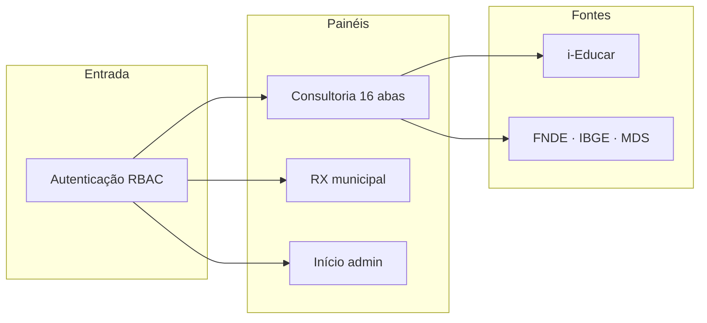

# Documentação executiva — servlitcys

**Versão do produto:** 6.5.0 · **Última revisão:** 2026-07-02

> **Índice:** [README.md](README.md) · **Estado:** [STATUS_PROJETO.md](STATUS_PROJETO.md) · **Versões:** [HISTORICO_VERSOES.md](HISTORICO_VERSOES.md) · **Backlog:** [BACKLOG_IMPLEMENTACOES.md](BACKLOG_IMPLEMENTACOES.md)

## Propósito

O **servlitcys** é uma aplicação web que consolida **informação educacional ao nível municipal**, permitindo explorar indicadores, painéis analíticos e comparações entre territórios. O objetivo é apoiar **análise, planeamento e decisão** com dados organizados e acessíveis a equipas autorizadas.

Arquitetura detalhada: [ARQUITETURA_E_FLUXOS.md](ARQUITETURA_E_FLUXOS.md).

## Público-alvo

- Equipas de gestão educativa municipal ou regional
- Analistas e responsáveis que necessitam de visão agregada por cidade
- Administradores de sistema que configuram conexões a bases de dados por município

## Funcionalidades principais

1. **Consultoria municipal** — Painel `/dashboard/analytics` com 16 análises em 5 áreas (entrada: Diagnóstico executivo); finanças indicativas (FUNDEB, repasses, discrepâncias); exportação PDF Serventec.
2. **Painel e análise** — Métricas e filtros por município com base i-Educar activa (cadastro, pedagógico, Censo).
3. **Gestão de cidades** — Cadastro de municípios e credenciais de acesso às respetivas bases (restrito a administradores).
4. **Gestão de usuários** — Criação de contas após autenticação (sem registro público); administradores podem desativar, reativar ou excluir contas; inativos não autenticam.
5. **Dados públicos** — Importação administrativa (FUNDEB, repasses, SAEB, CadÚnico, geo) com impacto documentado nas abas da consultoria.
6. **Página institucional** — Apresentação da plataforma e acesso ao login.

## Modelo de governação de acesso

- **Administrador** (`role=admin`): acesso total — cidades, sincronizações, configurações e gestão de todos os perfis.
- **Usuário** (`role=user`): análise em todos os municípios com dados; pode criar outros usuários do mesmo perfil.
- **Municipal** (`role=municipal`): análise apenas nos municípios vinculados; pode criar outros municipais no seu âmbito.

Detalhe por perfil, matriz de permissões e operação: [PERFIS_UTILIZADOR.md](PERFIS_UTILIZADOR.md).

Não existe auto-registro: reduz superfície de ataque e permite controlo explícito de quem entra no sistema.

## Dependências técnicas (alto nível)

- Aplicação **Laravel** (PHP), com interface web e API interna para consultas.
- **MySQL** como base principal e, por cidade, conexão configurável a bases de dados municipais.
- **Frontend**: Vite, CSS (Tailwind), JavaScript (Alpine.js) para interatividade.

## Indicadores de sucesso (sugestão)

- Tempo para obter uma visão consolidada por município
- Redução de pedidos ad hoc de dados quando os painéis cobrem as necessidades
- Estabilidade e tempo de resposta dos painéis em horário de uso

## Próximos passos (produto)

Itens priorizados em [BACKLOG_IMPLEMENTACOES.md](BACKLOG_IMPLEMENTACOES.md) (seção **A. Produto e infraestrutura**): CI/CD, monitorização de erros, backup.

---

*Documento orientado a decisores. Índice: [README.md](README.md). Decisões técnicas: [PONDERACOES_TECNICAS.md](PONDERACOES_TECNICAS.md).*
