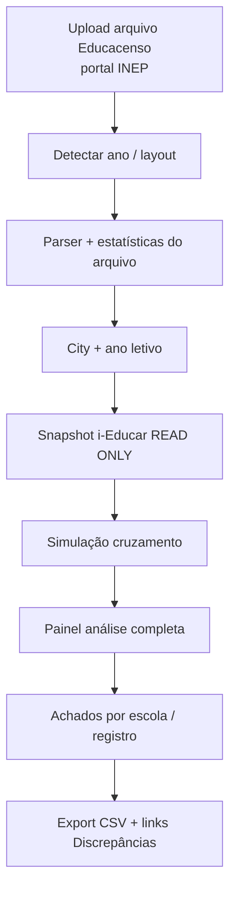

# Educacenso — simulação e conferência da 1ª etapa (especificação)

**Versão do produto:** 6.5.0 · **Última revisão:** 2026-07-02

> **Índice:** [README.md](README.md) · **Relacionado:** [PLUGINS_E_REFINO_CADASTRO_IEDUCAR.md](PLUGINS_E_REFINO_CADASTRO_IEDUCAR.md) · [RELEASE_20260615a_MNEMOSYNE.md](RELEASE_20260615a_MNEMOSYNE.md) · [CATALOGO_API_IEDUCAR_CONSULTAS_DIRETAS.md](CATALOGO_API_IEDUCAR_CONSULTAS_DIRETAS.md) · [CONSULTAS_EXTERNAS.md](CONSULTAS_EXTERNAS.md)

---

## 1. Resumo

Este documento especifica um **módulo de conferência e simulação** para a **1ª etapa do Censo Escolar (Matrícula inicial)**:

1. Recebe o **arquivo originado no sistema Educacenso** (portal INEP) — **não** um export gerado pelo i-Educar.
2. Interpreta a estrutura oficial (layout INEP, registos pipe-delimited).
3. Liga-se **somente leitura** à base i-Educar do município escolhido.
4. **Simula** a coerência entre o que está **declarado no Educacenso** e o que existe no **cadastro i-Educar**, apontando erros e divergências **sem alterar** qualquer base de dados.
5. Exibe um **painel analítico** com contadores, distribuição por escola/registro e lista detalhada de achados.

**Caso de uso principal:** após envio (ou durante correção/conferência pós-DOU), a secretaria baixa o arquivo do [Educacenso](https://educacenso.inep.gov.br/), carrega no servlitcys e obtém um diagnóstico do que precisa ser ajustado **no i-Educar** para alinhar cadastro administrativo à declaração oficial.

**Público:** secretaria municipal, consultoria Serventec, TI municipal.

---

## 2. Origem do arquivo — Educacenso, não i-Educar

| | Educacenso (entrada do módulo) | i-Educar (referência de comparação) |
|---|------------------------------|-------------------------------------|
| **Papel** | Fonte da **declaração oficial** já no INEP | Fonte do **cadastro administrativo** local |
| **Origem do arquivo** | Download/exportação no **portal Educacenso** (migração, exportação de dados declarados, arquivo de conferência — conforme operação disponível no exercício) | **Não** gera o arquivo de entrada deste módulo |
| **Gravação** | O módulo **não escreve** no Educacenso | O módulo **não escreve** no i-Educar |
| **Uso no servlitcys** | Parser + painel de análise do arquivo | Snapshot read-only para cruzamento |

O i-Educar continua a ser usado pela rede para **cadastro e exportação interna** (quando aplicável), mas o arquivo analisado aqui é sempre o que **veio do sistema Educacenso**.

---

## 3. Estado actual no servlitcys

| Capacidade | Implementado? | Onde |
|------------|---------------|------|
| Ler arquivo Educacenso (TXT INEP) | **Não** | — |
| Painel de análise do arquivo + cruzamento i-Educar | **Não** | — |
| Ler status exportado/fechado por escola (i-Educar) | **Sim** | `IeducarCensoEscolaQueries`, aba Censo |
| Calendário e checklist 1ª etapa | **Sim** | `RxEducacensoToolkit`, `config/rx.php` |
| Comparar totais i-Educar × microdados INEP | **Sim** | `matricula_censo_vs_ieducar` |
| Checks cadastrais (NEE, raça, INEP, duplicidade…) | **Sim** | `DiscrepanciesCheckRunner` |

**Implicação:** o módulo reutiliza `City`, `CityDataConnection`, `IeducarSchema`, catálogos Educacenso e rotinas de discrepâncias, mas a **entrada** é sempre arquivo **Educacenso**.

---

## 4. Formato do arquivo Educacenso (1ª etapa)

### 4.1 Conteúdo da 1ª etapa

| Bloco | Registos típicos | Conteúdo na data-base |
|-------|------------------|------------------------|
| **Estabelecimento** | 00, 10 | Identificação, infraestrutura, situação |
| **Turmas** | 20 | Etapa, turno, modalidade |
| **Pessoas** | 30 | Dados cadastrais comuns |
| **Profissionais** | 40, 50, 51 | Docentes, gestores, demais |
| **Matrículas** | 60 | Vínculo aluno × turma |

A **2ª etapa** (situação do aluno) usa arquivo e calendário distintos — **fora** deste módulo.

### 4.2 Características técnicas

| Aspecto | Detalhe |
|---------|---------|
| **Proveniência** | Sistema Educacenso / INEP (portal ou arquivo de migração conforme manual do exercício) |
| **Formato** | Texto, campos separados por **pipe** (`\|`) |
| **Codificação** | ISO-8859-1 / Latin-1 (validar por exercício) |
| **Layout** | Manual anual «Layout de Importação e Exportação da Matrícula Inicial» — [Migração INEP](https://www.gov.br/inep/pt-br/areas-de-atuacao/pesquisas-estatisticas-e-indicadores/censo-escolar/orientacoes/matricula-inicial/migracao) |

### 4.3 Registos (referência)

| Registro | Assunto |
|----------|---------|
| **00** | Escola — identificação e funcionamento |
| **10** | Escola — infraestrutura |
| **20** | Turmas |
| **30** | Pessoa física |
| **40** | Docente |
| **50** | Gestor |
| **51** | Outros profissionais |
| **60** | Matrícula / enturmação |

O parser deve ser **versionado por ano** (`EducacensoLayout2026`, etc.).

---

## 5. Módulo — `EducacensoStage1Conference`

### 5.1 Objetivo

> **Arquivo Educacenso → parser → snapshot i-Educar (read-only) → simulação de coerência → painel com análise completa.**

Responde à pergunta: *«O que está declarado no Educacenso bate com o cadastro i-Educar? O que falta corrigir na base local?»*

### 5.2 Princípios

| Princípio | Implementação |
|-----------|---------------|
| **Entrada = Educacenso** | Upload do arquivo baixado do portal INEP |
| **Referência = i-Educar** | Leitura read-only da base municipal |
| **Zero escrita** | Sem `INSERT`/`UPDATE`/`DELETE`; sem API de envio ao INEP |
| **Análise em duas camadas** | (A) integridade do **arquivo**; (B) **cruzamento** arquivo × i-Educar |
| **Painel obrigatório** | UI dedicada com contadores e drill-down — não só CLI/JSON |

### 5.3 Fluxo



### 5.4 Entradas

| Parâmetro | Obrigatório | Descrição |
|-----------|-------------|-----------|
| `city_id` | Sim | Município em `cities` |
| `arquivo` | Sim | Arquivo Educacenso (upload ou caminho) |
| `ano_letivo` | Sim* | Ano Censo (* inferir do reg. 00 quando possível) |
| `origem` | Não | `educacenso_export` \| `educacenso_migracao` (metadado) |
| `escola_inep` | Não | Filtrar uma escola |
| `layout_ano` | Não | Forçar versão do layout INEP |

---

## 6. Painel de análise completa

Seção central do módulo — rota proposta: `/consultoria/censo/educacenso-analise` ou bloco dedicado na aba **Censo** (`work_done`).

### 6.1 Cabeçalho e contexto

| Elemento | Conteúdo |
|----------|----------|
| Município / ano letivo | Nome, IBGE, ano Censo |
| Arquivo | Nome, tamanho, hash SHA-256, data upload |
| Origem | «Arquivo Educacenso (portal INEP)» |
| Data-base detectada | Do reg. 00 vs calendário RX |
| Estado geral | Semáforo: OK / Atenção / Crítico |
| Última análise | Timestamp + usuário |

### 6.2 Contadores globais (KPIs)

| KPI | Descrição |
|-----|-----------|
| **Linhas / registos** | Total de linhas; total por tipo (00, 10, 20, 30, 40, 50, 51, 60) |
| **Escolas** | Escolas distintas (`cod_escola_inep`); com reg. 00 completo |
| **Turmas** | Total reg. 20 |
| **Pessoas** | Total reg. 30 (alunos vs profissionais inferidos) |
| **Matrículas** | Total reg. 60 |
| **Profissionais** | Soma reg. 40 + 50 + 51 |
| **Erros estruturais** | Bloqueantes no parser |
| **Divergências × i-Educar** | Total achados por severidade (info / aviso / erro / crítico) |
| **Cobertura** | % escolas do arquivo encontradas na base i-Educar |
| **Omissões i-Educar** | Registos na base activos na data-base **ausentes** do arquivo Educacenso |
| **Excessos arquivo** | Registos no arquivo **sem** correspondência no i-Educar |

### 6.3 Gráficos e distribuições

| Visual | Dados |
|--------|-------|
| Barras horizontais | Contagem por tipo de registro |
| Barras por escola | Matrículas arquivo vs matrículas i-Educar (top N + «outras») |
| Pizza / rosca | Achados por categoria (`EDU-CEN-*`) |
| Timeline (opcional) | Histórico de análises do mesmo município/ano |

### 6.4 Tabelas detalhadas

| Tabela | Colunas principais | Acções |
|--------|-------------------|--------|
| **Por escola** | INEP, nome, reg.00–60, divergências, status | Expandir achados |
| **Achados** | Código, severidade, linha, registro, campo, mensagem, sugestão | Filtrar, exportar |
| **Só no Educacenso** | Entidades no arquivo sem par i-Educar | — |
| **Só no i-Educar** | Entidades na base ausentes do arquivo | Link aba Censo |
| **Estrutura do arquivo** | Anomalias de sequência, pipes, campos obrigatórios | Linha exacta |

### 6.5 Acções do painel

- Reprocessar (mesmo arquivo, base atualizada)
- Exportar relatório (CSV / XLSX / JSON)
- Abrir **Discrepâncias** / **Censo** com filtros pré-aplicados
- (Admin) Enfileirar análise em background para redes grandes

### 6.6 Wireframe lógico

```
┌─────────────────────────────────────────────────────────────┐
│ Educacenso — Análise 1ª etapa · Município X · 2026         │
│ Arquivo: educacenso_rede_2026.txt · Crítico (12 erros)      │
├──────────┬──────────┬──────────┬──────────┬───────────────┤
│ Escolas  │ Turmas   │ Matríc.  │ Diverg.  │ Estruturais   │
│   47     │  312     │  4.280   │   89     │      3        │
├──────────┴──────────┴──────────┴──────────┴───────────────┤
│ [Gráfico registos]  [Gráfico escolas arquivo vs i-Educar] │
├─────────────────────────────────────────────────────────────┤
│ Filtros: severidade · registro · escola · código EDU-CEN   │
│ Tabela achados …                                            │
└─────────────────────────────────────────────────────────────┘
```

---

## 7. Simulação e cruzamento (i-Educar)

### 7.1 Snapshot read-only

```php
$this->cityData->run($city, function (Connection $db) use ($simulator, $parsed) {
    if ($db->getDriverName() === 'pgsql') {
        $db->statement('SET TRANSACTION READ ONLY');
    }
    return $simulator->crossCheck($db, $city, $parsed);
});
```

Tabelas via `IeducarSchema`: escola, `educacenso_cod_escola`, turma, matricula, aluno, pessoa, fisica, NEE, servidor/profissionais.

### 7.2 Lógica de simulação

1. **Arquivo isolado:** sequência INEP, cardinalidade, campos obrigatórios, códigos catálogo.
2. **Educacenso → i-Educar:** cada escola/turma/matrícula do **arquivo** existe e coincide na base?
3. **i-Educar → Educacenso:** cadastro activo na data-base **não declarado** no arquivo?
4. **Semântica:** NNE, raça, etapa, situação — alinhamento com `InclusionEducacensoCatalog` e checks existentes.
5. **Totais:** reconciliação por escola e rede (complementa `matricula_censo_vs_ieducar` em granularidade fina).

---

## 8. Catálogo de verificações

(Mantém códigos `EDU-CEN-*` — ver seção anterior do documento.)

| Grupo | Exemplos |
|-------|----------|
| **Estrutura** | `EDU-CEN-001` … `006` |
| **Escola / INEP** | `EDU-CEN-101` … `104` |
| **Turmas** | `EDU-CEN-201` … `204` |
| **Matrículas** | `EDU-CEN-301` … `307` |
| **Profissionais** | `EDU-CEN-401` … `403` |
| **Totais** | `EDU-CEN-501` … `502` |

Cada achado alimenta o painel (contadores + tabela) e, quando aplicável, liga a `DiscrepanciesCheckCatalog`.

---

## 9. Arquitetura técnica

```
app/
  Services/Educacenso/
    EducacensoStage1ConferenceService.php   # orquestrador
    EducacensoFileReader.php
    EducacensoFileStatistics.php            # contadores do arquivo
    EducacensoLayoutRegistry.php
    EducacensoParsedFile.php
    EducacensoIeducarCrossCheck.php         # simulação × i-Educar
    EducacensoIeducarSnapshot.php
    EducacensoAnalysisReport.php            # DTO para painel + export
  Http/Controllers/
    EducacensoAnalysisController.php
  Console/Commands/
    EducacensoAnalyzeStage1Command.php      # censo:analyze-educacenso-file
resources/views/dashboard/analytics/partials/
  educacenso-analysis.blade.php             # painel
```

Persistência local (opcional F2): tabela `educacenso_analysis_runs` (city_id, ano, file_hash, summary_json, created_at) para histórico no painel.

---

## 10. CLI (complementar ao painel)

```bash
php artisan censo:analyze-educacenso-file \
  --city=42 \
  --file=/caminho/arquivo_educacenso.txt \
  --ano=2026 \
  --output=json
```

A CLI partilha o mesmo serviço que alimenta o painel; a UI é o canal principal para consultoria.

---

## 11. Fases de implementação

| Fase | Entrega | Prioridade |
|------|---------|------------|
| **F1** | Parser Educacenso + `EducacensoFileStatistics` (contadores) | **P0** |
| **F2** | Snapshot i-Educar + `EducacensoIeducarCrossCheck` | **P0** |
| **F3** | **Painel web** (KPIs, tabelas, filtros) | **P0** |
| **F4** | CLI + export CSV/JSON | **P1** |
| **F5** | Histórico de análises + job em fila | **P2** |
| **F6** | Layout multi-ano + integração PDF consultoria | **P2** |

**Backlog:** **CEN-01** em [BACKLOG_IMPLEMENTACOES.md](BACKLOG_IMPLEMENTACOES.md).

---

## 12. Próxima etapa — desenvolvimento (TODO)

Checklist para iniciar implementação (**CEN-01**). Marcar na ordem indicada.

### 12.1 Fundação

- [x] **CEN-01a** — Criar namespace `App\Services/Educacenso` e `App\Support/Educacenso`
- [x] **CEN-01b** — Obter layout INEP 2026 (XLS oficial) e documentar versão em `config/educacenso.php`
- [x] **CEN-01c** — `EducacensoFileReader`: leitura streaming, encoding, split pipe
- [x] **CEN-01d** — `EducacensoParsedFile` + tipagem por registro (00–60)
- [x] **CEN-01e** — `EducacensoFileStatistics`: totais por registro, escolas, hash arquivo
- [x] **CEN-01f** — Testes unitários + fixture `tests/fixtures/educacenso/stage1_2026_minimal.txt`

### 12.2 Cruzamento i-Educar

- [x] **CEN-01g** — `EducacensoIeducarSnapshot`: escolas (INEP), turmas, matrículas activas na data-base
- [x] **CEN-01h** — `EducacensoIeducarCrossCheck`: regras EDU-CEN-101…307
- [x] **CEN-01i** — Integrar tolerâncias de `DiscrepanciesQueries::buildCensoMatriculaDiffRow` nos totais
- [ ] **CEN-01j** — Testes integração com fixture i-Educar (SQLite/MySQL)

### 12.3 Painel e operação

- [x] **CEN-01k** — `EducacensoStage1ConferenceService` (orquestrador)
- [x] **CEN-01l** — Rota + controller + upload (validação tamanho, LGPD, retenção)
- [x] **CEN-01m** — View `educacenso-analysis.blade.php`: KPIs, gráficos, tabela achados
- [x] **CEN-01n** — Integrar na aba Censo (`work_done`) e atalho toolkit RX
- [x] **CEN-01o** — Comando `censo:analyze-educacenso-file` + entrada em `COMANDOS_ARTISAN.md`
- [x] **CEN-01p** — Variáveis `.env` + seção em `VARIAVEIS_AMBIENTE.md`

### 12.4 Critério de aceite (MVP)

- [x] Upload de arquivo Educacenso real (anonimizado) processa sem erro fatal
- [x] Painel exibe contadores por registro e totais de divergência
- [x] Lista de achados filtrável por escola e severidade
- [x] Nenhuma escrita na base i-Educar confirmada (teste ou transacção read-only)
- [ ] Documentação de operação atualizada

---

## 13. Riscos e limitações

| Risco | Mitigação |
|-------|-----------|
| Formato Educacenso ≠ export i-Educar | Parser baseado **só** no layout INEP; não assumir export Portabilis |
| Variantes de download no portal | Detectar metadados; permitir `origem` no upload |
| Arquivo grande | Streaming + job assíncrono; painel com polling |
| LGPD | Retenção limitada; aviso no upload; perfil autorizado |

---

## 14. Decisão de produto

| Pergunta | Resposta |
|----------|----------|
| De onde vem o arquivo? | **Sistema Educacenso (INEP)** — upload manual |
| O i-Educar gera este arquivo? | **Não** — é referência de comparação |
| Grava algo? | **Não** — read-only no i-Educar; opcional histórico local da análise |
| Entrega principal? | **Painel** com análise completa e contadores |
| Valor | Conferir declaração oficial × cadastro local; orientar correcções no i-Educar |

---

## 15. Referências

| Documento | Relação |
|-----------|---------|
| [PLUGINS_E_REFINO_CADASTRO_IEDUCAR.md](PLUGINS_E_REFINO_CADASTRO_IEDUCAR.md) | Campos a alinhar no i-Educar |
| [CONSULTAS_EXTERNAS.md](CONSULTAS_EXTERNAS.md) | Check agregado Censo × i-Educar |
| [CATALOGO_API_IEDUCAR_CONSULTAS_DIRETAS.md](CATALOGO_API_IEDUCAR_CONSULTAS_DIRETAS.md) | API futura `censo/export-readiness` |
