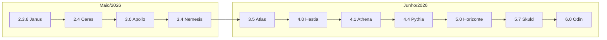

# Entregas escalonadas

> **Versão em produção:** **6.1.0** · tag **`20260624-Horizonte`** · [HISTORICO_VERSOES.md](HISTORICO_VERSOES.md) · [RELEASE_20260624_HORIZONTE.md](RELEASE_20260624_HORIZONTE.md)

Documentação das alterações desenvolvidas no ramo `main`, organizadas **por mês civil** e ligadas às **releases** (`RELEASE_*.md`). Cada documento mensal lista as tags e versões semânticas do período; o detalhe técnico de cada marco está na nota de release correspondente.

**Como usar**

1. Escolha o **mês** na tabela abaixo (ou no menu «Entregas escalonadas → Por mês»).
2. No documento mensal, consulte a tabela **Releases do mês** para saltar directamente à nota de release.
3. Para a linha do tempo completa (commits, patches sem bump), use [HISTORICO_VERSOES.md](HISTORICO_VERSOES.md).

---

## Documentos por mês

| Mês | Intervalo de versões | Documento | Releases |
|-----|----------------------|-----------|----------|
| **Junho/2026** | 3.5.0 → **6.1.0** | [ENTREGAS_ESCALONADAS_JUNHO_2026.md](ENTREGAS_ESCALONADAS_JUNHO_2026.md) | 36+ tags |
| **Maio/2026** *(arquivo)* | 2.3.6 → 3.4.0 | [ENTREGAS_ESCALONADAS_MAIO_2026.md](ENTREGAS_ESCALONADAS_MAIO_2026.md) | 11 tags |

---

## Convenções

| Conceito | Onde consultar |
|----------|----------------|
| **Tag de deploy** | `YYYYMMDD[-letra]-Codename` — [ARQUITETURA_E_FLUXOS.md](ARQUITETURA_E_FLUXOS.md) §6 |
| **Versão semântica** | Título de cada `RELEASE_*.md` e [HISTORICO_VERSOES.md](HISTORICO_VERSOES.md) |
| **Patch sem bump** | Commits listados no doc mensal ou no histórico; sem `RELEASE_*.md` dedicado |
| **Ordem de merge sugerida** | Numeração nos blocos do doc de **maio/2026** (entregas incrementais pré-3.5) |

---

## Próximo mês

Ao fechar **julho/2026**, criar `ENTREGAS_ESCALONADAS_JULHO_2026.md` com tabela de releases do mês e actualizar esta página e o catálogo em `DocumentationEscalonadasCatalog.php`. Ver [PADRAO_DOCUMENTACAO.md](PADRAO_DOCUMENTACAO.md) §7.
