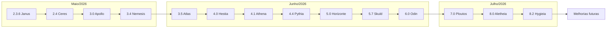

# Entregas escalonadas

> **Versão em produção:** **8.2.0** · tag **`20260724c-Hygieia`** · [HISTORICO_VERSOES.md](HISTORICO_VERSOES.md) · [ROADMAP_INDICE.md](ROADMAP_INDICE.md)

Documentação das alterações desenvolvidas no ramo `main`, organizadas **por mês civil** e ligadas às **releases** (`RELEASE_*.md`). Cada documento mensal lista as tags e versões semânticas do período; o detalhe técnico de cada marco está na nota de release correspondente.

**Como usar**

1. Escolha o **mês** na tabela abaixo (ou no menu «Entregas escalonadas → Por mês»).
2. No documento mensal, consulte a tabela **Releases do mês** para saltar diretamente à nota de release.
3. Para a linha do tempo completa (commits, patches sem bump), use [HISTORICO_VERSOES.md](HISTORICO_VERSOES.md).
4. Para **melhorias futuras** (testes, segurança, performance, docs), use [ENTREGAS_ESCALONADAS_MELHORIAS_FUTURAS.md](ENTREGAS_ESCALONADAS_MELHORIAS_FUTURAS.md).

---

## Documentos por mês

| Mês | Intervalo de versões | Documento | Releases |
|-----|----------------------|-----------|----------|
| **Julho/2026** | **7.0.0 → 8.2.0** | [ENTREGAS_ESCALONADAS_JULHO_2026.md](ENTREGAS_ESCALONADAS_JULHO_2026.md) | Ploutos → Hygieia |
| **Junho/2026** | 3.5.0 → **6.5.0** | [ENTREGAS_ESCALONADAS_JUNHO_2026.md](ENTREGAS_ESCALONADAS_JUNHO_2026.md) | 36+ tags |
| **Maio/2026** *(arquivo)* | 2.3.6 → 3.4.0 | [ENTREGAS_ESCALONADAS_MAIO_2026.md](ENTREGAS_ESCALONADAS_MAIO_2026.md) | 11 tags |

## Planeamento

| Documento | Conteúdo |
|-----------|----------|
| [ENTREGAS_ESCALONADAS_MELHORIAS_FUTURAS.md](ENTREGAS_ESCALONADAS_MELHORIAS_FUTURAS.md) | Plano pós-8.2: testes, segurança, performance, documentação (fases A–E) |

```mermaid
flowchart LR
    subgraph jun [Junho/2026]
        A[3.5 Atlas] --> B[4.0 Hestia]
        B --> C[4.1 Athena]
        C --> D[4.4 Pythia]
        D --> E[5.0 Horizonte]
        E --> F[5.7 Skuld]
        F --> G[6.0 Odin]
    end
    subgraph mai [Maio/2026]
        H[2.3.6 Janus] --> I[2.4 Ceres]
        I --> J[3.0 Apollo]
        J --> K[3.4 Nemesis]
    end
    subgraph jul [Julho/2026]
        L[7.0 Ploutos] --> M[8.0 Aletheia]
        M --> N[8.2 Hygieia]
    end
    K --> A
    G --> L
    N --> P[Melhorias futuras]
```

---

## Convenções

| Conceito | Onde consultar |
|----------|----------------|
| **Tag de deploy** | `YYYYMMDD[-letra]-Codename` — [ARQUITETURA_E_FLUXOS.md](ARQUITETURA_E_FLUXOS.md) §6 |
| **Versão semântica** | Título de cada `RELEASE_*.md` e [HISTORICO_VERSOES.md](HISTORICO_VERSOES.md) |
| **Patch sem bump** | Commits listados no doc mensal ou no histórico; sem `RELEASE_*.md` dedicado |
| **Ordem de merge sugerida** | Numeração nos blocos do doc de **maio/2026** (entregas incrementais pré-3.5) |
| **Melhorias futuras** | [ENTREGAS_ESCALONADAS_MELHORIAS_FUTURAS.md](ENTREGAS_ESCALONADAS_MELHORIAS_FUTURAS.md) |

---

## Próximo mês

Ao fechar **agosto/2026**, criar `ENTREGAS_ESCALONADAS_AGOSTO_2026.md` com tabela de releases do mês e atualizar esta página e o catálogo em `DocumentationEscalonadasCatalog.php`. Ver [PADRAO_DOCUMENTACAO.md](PADRAO_DOCUMENTACAO.md) §7.
