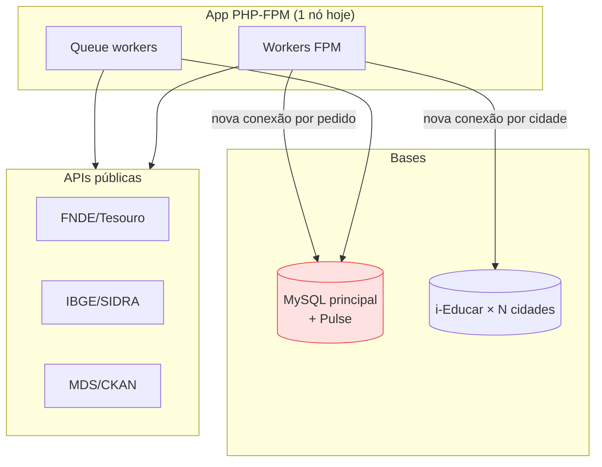
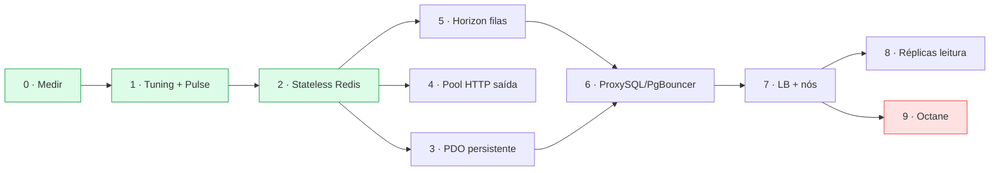

# Escalabilidade e infraestrutura — pool de conexões, balanceamento e alto volume (servlitcys)

**Versão do produto:** 6.5.0 · **Última revisão:** 2026-07-02

> **Índice:** [README.md](README.md) · **Relacionado:** [PERFORMANCE.md](PERFORMANCE.md) · [ARQUITETURA_E_FLUXOS.md](ARQUITETURA_E_FLUXOS.md) · [PONDERACOES_TECNICAS.md](PONDERACOES_TECNICAS.md) · [IMPLANTACAO_PRODUCAO.md](IMPLANTACAO_PRODUCAO.md) · [VARIAVEIS_AMBIENTE.md](VARIAVEIS_AMBIENTE.md)

Guia técnico sobre **ferramentas de pool de conexões, otimização, balanceamento de carga e tratamento de grande volume de dados, requisições e API** no servlitcys. Para cada ferramenta indicamos a **especificação**, **como seria usada neste sistema** e os **prós e contras**. No fim há um **plano de implementação (to-do)** com ganhos, riscos e o que evitar em cada etapa.

> **Aviso de estado:** este documento é **prospectivo** (engenharia de capacidade). As ferramentas descritas **ainda não estão instaladas** salvo indicação explícita. O que já existe hoje: Redis opcional (`predis`/`phpredis`), filas Laravel, cache/sessão configuráveis e mitigações de login ([PERFORMANCE.md](PERFORMANCE.md)).

---

## 1. Contexto e gargalos reais do servlitcys

Antes de escolher ferramentas, fixar a topologia atual (ver [ARQUITETURA_E_FLUXOS.md](ARQUITETURA_E_FLUXOS.md) §1):

| Característica | Situação atual | Implicação de escala |
|---------------|----------------|----------------------|
| **Base principal MySQL** | Remota (TCP, host dedicado), `utf8mb4` | Cada conexão paga *handshake* TCP + auth; ligar/desligar por pedido custa latência |
| **i-Educar por município** | **N bases** MySQL/PostgreSQL, uma por cidade | Conexões dinâmicas e numerosas; abrir uma ligação por cidade/pedido escala mal |
| **Telemetria Pulse** | `database` (mesma MySQL) | Já causou congestionamento: `innodb_buffer_pool_size` 128 MB, *fsync* por commit, *inserts* `pulse_aggregates` em fila — ver histórico de lock wait |
| **Importações pesadas** | SAEB/Censo/FUNDEB (dezenas de milhares de linhas) | Picos de escrita; competem com Pulse e com o tráfego web pela mesma base |
| **APIs externas** | FNDE, IBGE/SIDRA, MDS/CKAN, Tesouro | Alto volume de requisições *outgoing*, sujeitas a *rate limit* e latência de terceiros |
| **App PHP** | PHP-FPM 8.3 (stateless por pedido) | Sem estado partilhado em memória entre pedidos; conexões não são reaproveitadas |



**Três gargalos prioritários:** (1) abertura repetida de conexões à MySQL remota e às N bases i-Educar; (2) contenção de escrita entre Pulse, importações e web na **mesma** base; (3) chamadas externas sequenciais sem *pool* HTTP nem *backoff* coordenado.

---

## 2. Pool de conexões

Reaproveitar conexões em vez de abrir/fechar por pedido. Quatro abordagens, da mais leve à mais estrutural.

### 2.1 Conexões persistentes PDO (`PDO::ATTR_PERSISTENT`)

- **Especificação:** o PDO mantém a ligação TCP aberta no processo PHP-FPM e reutiliza-a no próximo pedido servido pelo mesmo *worker*. Configurável por conexão em `config/database.php` (`options` → `PDO::ATTR_PERSISTENT => true`).
- **Como usar no sistema:** adicionar `DB_PERSISTENT=true` mapeado para `options` na conexão `mysql` principal; **não** aplicar às conexões i-Educar dinâmicas (muitas bases distintas multiplicariam ligações ociosas presas a cada *worker*).
- **Prós:** ganho imediato e barato (elimina *handshake* na base remota); zero infraestrutura nova.
- **Contras:** não há gestão real de *pool* (1 ligação por *worker* FPM); ligações «sujas» (transações abertas, *temp tables*, variáveis de sessão) podem vazar entre pedidos; com muitos *workers* × muitas cidades, explode o número de ligações ociosas.

### 2.2 ProxySQL (pool/multiplexação para MySQL)

- **Especificação:** *proxy* MySQL que fica entre a app e o servidor; multiplexa milhares de ligações de cliente sobre poucas ligações *backend*, com *query routing*, *connection multiplexing* e *query rules*.
- **Como usar no sistema:** instalar ProxySQL no nó da app (ou *sidecar*); apontar `DB_HOST/DB_PORT` para o ProxySQL (`127.0.0.1:6033`). Útil sobretudo para a **base principal** e para encaminhar leitura → réplica (ver §4.2). Pode isolar o tráfego do Pulse num *hostgroup* separado.
- **Prós:** *pooling* verdadeiro independente do número de *workers*; *read/write split* transparente; protege a base de picos (limita conexões *backend*); métricas próprias.
- **Contras:** componente novo a operar e monitorizar; multiplexação desliga-se na presença de transações/`LAST_INSERT_ID()`/variáveis de sessão (reduz ganho se o código abusar destes); curva de configuração das *query rules*; cobre MySQL/MariaDB, **não** as bases i-Educar PostgreSQL.

### 2.3 PgBouncer (pool para i-Educar PostgreSQL)

- **Especificação:** *pooler* leve para PostgreSQL, modos `session`/`transaction`/`statement`. Em modo `transaction` partilha poucas ligações *backend* por muitas ligações de cliente.
- **Como usar no sistema:** instância PgBouncer por *host* i-Educar PostgreSQL; as conexões dinâmicas por cidade passam a apontar para o PgBouncer. Reduz drasticamente o custo de abrir base por cidade/pedido.
- **Prós:** essencial quando há **N bases/conexões** PostgreSQL; muito leve; estabiliza o nº de ligações no servidor i-Educar.
- **Contras:** só PostgreSQL (i-Educar MySQL fica de fora — usar ProxySQL); modo `transaction` proíbe *prepared statements* persistentes e *session state* (ajustar PDO: `ATTR_EMULATE_PREPARES`); mais um serviço por *host* de origem.

### 2.4 Laravel Octane (Swoole / RoadRunner / FrankenPHP)

- **Especificação:** mantém a aplicação **em memória** entre pedidos num *application server* persistente; conexões de base e clientes são reaproveitados naturalmente, eliminando *bootstrap* do framework por pedido.
- **Como usar no sistema:** `composer require laravel/octane` + *runtime* (FrankenPHP é o mais simples de operar); servir atrás do Nginx. Ganho duplo: reaproveita conexões **e** corta o *cold start* do Laravel em cada pedido.
- **Prós:** maior salto de *throughput* por nó; reaproveitamento de conexões «de graça»; combina com §4 (menos nós para a mesma carga).
- **Contras:** exige código *stateless* e «*leak*-free» (estáticos/singletons que guardam estado de pedido tornam-se *bugs*); risco com pacotes que assumem ciclo de vida tradicional; mudança operacional significativa (processo persistente, *reload* no deploy). **Não adotar sem auditoria de estado global.**

---

## 3. Otimizações de aplicação e base

Antes de escalar horizontalmente, extrair o máximo de um nó. Várias destas já existem (ver [PERFORMANCE.md](PERFORMANCE.md)); aqui ficam consolidadas.

| Técnica | Especificação | Uso no sistema | Prós | Contras |
|---------|---------------|----------------|------|---------|
| **OPcache + `config:cache`/`route:cache`/`view:cache`** | Compila PHP e *config* em cache | Já no deploy ([IMPLANTACAO_PRODUCAO.md](IMPLANTACAO_PRODUCAO.md)) | Grande, gratuito | `config:cache` ignora `.env` em *runtime* — disciplina de deploy |
| **Cache de leitura (Redis) `Cache::remember`** | Memoriza agregações caras | `DiscrepanciesRepository`, FUNDEB, *snapshot* RX, mapa Início | Tira carga repetida da base | Invalidação correta; risco de dados velhos |
| **Índices e *query review*** | Índices alinhados ao `WHERE`/`JOIN` | i-Educar e tabelas locais (`saeb_indicator_points`, `admin_user_logs`) | Reduz I/O e *lock time* | Índice a mais penaliza escrita |
| **Eager loading (evitar N+1)** | `with()` em relações | Listagens de cidades/escolas | Menos *round-trips* | `with()` excessivo carrega a mais |
| **Bulk `upsert`/`insert` em lote** | Escrita agrupada | Importações SAEB/Censo/FUNDEB | Menos transações, menos *lock* | Lote grande estoura memória/*binlog* |
| **Leitura em *chunk*/*cursor*** | `chunkById`/`lazy()` | Processamento de microdados | Memória constante | Não use `chunk` com escrita na mesma chave |
| **Trabalho diferido pós-resposta** | `terminate`/`defer` | Auditoria de login, alertas Início (`PERFORMANCE_DEFER_*`) | Resposta mais rápida | Erros pós-resposta menos visíveis |
| **Tuning InnoDB no servidor** | `innodb_buffer_pool_size`, `innodb_flush_log_at_trx_commit` | **Crítico:** *buffer pool* de 128 MB é o gargalo do Pulse | Resolve a raiz da contenção | Fora do código; depende de acesso ao MySQL |

> **Decisão de raiz:** boa parte da «lentidão» observada é o `innodb_buffer_pool_size` de 128 MB com *fsync* por commit. Subir o *buffer pool* e isolar a telemetria Pulse (Redis ou base própria) tende a render mais do que qualquer pooling na app.

---

## 4. Balanceamento de carga (load balancing)

Distribuir tráfego por mais de um recurso. Duas frentes: **app** (horizontal) e **base** (réplicas de leitura).

### 4.1 Balanceador HTTP (Nginx upstream / HAProxy / LB de nuvem)

- **Especificação:** distribui pedidos HTTP por vários nós de aplicação (round-robin / least-conn), com *health checks* e terminação TLS.
- **Como usar no sistema:** ≥ 2 nós PHP-FPM (ou Octane) atrás do balanceador. Pré-requisito **obrigatório**: estado fora do processo — `SESSION_DRIVER=redis`, `CACHE_STORE=redis`, ficheiros partilhados/objeto (ver §6). Os PDFs e *assets* (`public/build`, já no Git) servem de qualquer nó.
- **Prós:** escala horizontal e tolerância a falhas (um nó cai, o tráfego continua); permite *deploy* sem *downtime* (drenar nó).
- **Contras:** exige *statelessness* real; sessões em base/ficheiro local quebram com vários nós; mais infraestrutura e observabilidade.

### 4.2 Réplicas de leitura MySQL (read/write split)

- **Especificação:** Laravel suporta conexões `read`/`write` separadas em `config/database.php`; leituras vão para réplica(s), escritas para o *primário*.
- **Como usar no sistema:** configurar `read`/`write` na conexão `mysql` (ou delegar o *split* ao ProxySQL §2.2). Painéis pesados de leitura (Horizonte, Analytics) saem da réplica; importações e Pulse escrevem no primário.
- **Prós:** tira leitura analítica do primário; escala leitura quase linearmente.
- **Contras:** **lag de replicação** → ler logo após escrever pode devolver dado velho (usar `sticky` do Laravel); operar replicação tem custo; não ajuda em carga de **escrita**.

### 4.3 Escala horizontal de filas (workers + Horizon)

- **Especificação:** mais *queue workers* em paralelo, possivelmente noutros nós; **Laravel Horizon** dá painel, *auto-scaling* e métricas para filas Redis.
- **Como usar no sistema:** filas `default` e `cadastro` (ver [ARQUITETURA_E_FLUXOS.md](ARQUITETURA_E_FLUXOS.md) §7) com `QUEUE_CONNECTION=redis`; Horizon a supervisionar; importações grandes fatiadas em *jobs* idempotentes.
- **Prós:** isola trabalho pesado do ciclo web; escala por filas; visibilidade do *backlog*.
- **Contras:** Horizon exige Redis e Supervisor; mais *workers* = mais conexões à base (combina com §2); *jobs* não idempotentes duplicam efeitos em *retry*.

---

## 5. Alto volume de dados, requisições e API

### 5.1 Dados (escrita/leitura massiva)

- **Especificação/uso:** importações em lote idempotentes, `upsert` por chave natural, leitura em *cursor*, e — quando o volume crescer — **particionamento**/arquivo de séries (ex.: `saeb_indicator_points` por ano) e *materialized views*/tabelas-resumo para os painéis.
- **Prós:** escrita previsível, menos *lock*, consultas de painel rápidas.
- **Contras:** lotes grandes pressionam *binlog*/*undo*; resumos exigem recomputação/invalidção; particionar é migração não trivial.

### 5.2 Requisições HTTP de entrada (rate limiting e *cache* de resposta)

- **Especificação/uso:** `RateLimiter`/middleware `throttle` por perfil e rota; *cache* de respostas idempotentes (ETag/`Cache-Control`); CDN à frente de `public/` e *assets* versionados.
- **Prós:** protege contra picos e abuso; descarrega estáticos.
- **Contras:** *throttle* mal calibrado bloqueia uso legítimo; *cache* de resposta arrisca servir dado de outro contexto/município se a chave ignorar o utilizador.

### 5.3 Requisições HTTP de saída (pool, *backoff*, circuit breaker)

- **Especificação:** `Http::pool()` (Guzzle) para concorrência controlada; *retry* com *backoff* exponencial + *jitter*; *circuit breaker* para fontes instáveis; *cache* de respostas externas com TTL.
- **Como usar no sistema:** consolidar chamadas FNDE/IBGE/MDS/Tesouro num cliente com *pool* + *retry* (parte já em `SaebMicrodadosInepDownloader` e afins); enfileirar grandes coletas; respeitar *rate limit* das fontes públicas.
- **Prós:** coletas paralelas mais rápidas e resilientes a falha intermitente; menos *timeouts* em cascata.
- **Contras:** concorrência alta pode levar a *ban*/`429` das fontes; *circuit breaker* precisa de estado partilhado (Redis); *cache* externo desatualiza dados oficiais se o TTL for longo.

### 5.4 API própria (se exposta a terceiros)

- **Especificação/uso:** paginação por **cursor** (não `OFFSET`), *payloads* enxutos (API Resources), *rate limit* por *token*, versionamento e contrato estável.
- **Prós:** previsível para consumidores e barato no servidor.
- **Contras:** *over-fetching* sem campos seletivos; versionar exige disciplina de compatibilidade.

---

## 6. Pré-requisito transversal — tornar a app *stateless*

Quase tudo em §2.4, §4.1 e §4.3 depende de **não** guardar estado no processo/nó:

```env
SESSION_DRIVER=redis
CACHE_STORE=redis
QUEUE_CONNECTION=redis
PULSE_INGEST_DRIVER=redis   # tirar telemetria da MySQL
```

Ficheiros de utilizador (PDFs, *uploads*) devem ir para armazenamento partilhado/objeto se houver vários nós. Sem isto, balancear só introduz *bugs* intermitentes.

---

## 7. Plano de implementação (to-do) — ganhos, riscos e o que evitar

Ordenado por **relação ganho/risco** (mais seguro primeiro). Cada etapa é independente e mensurável; medir antes/depois com `php artisan performance:check` e Pulse.

### Etapa 0 — Linha de base e medição `[ ]`

- [ ] Capturar métricas atuais: tempo p95 das rotas pesadas, `Threads_running`/`Innodb_history_list_length`, *backlog* de filas, `SHOW GLOBAL STATUS` da MySQL.
- [ ] Registar `innodb_buffer_pool_size` e `innodb_flush_log_at_trx_commit`.
- **Ganho:** sem linha de base, nenhuma etapa seguinte é comprovável.
- **Riscos:** nenhum técnico; risco é *pular* esta etapa.
- **Evitar:** otimizar «no escuro» sem número antes/depois.

### Etapa 1 — Tuning do servidor + isolar Pulse `[ ]`

- [ ] Subir `innodb_buffer_pool_size` (alvo: 50–70% da RAM dedicada à base).
- [ ] Mover telemetria Pulse para Redis (`PULSE_INGEST_DRIVER=redis`) ou base própria.
- [ ] Avaliar `innodb_flush_log_at_trx_commit=2` se a perda de ≤1 s em falha for aceitável.
- **Ganho:** ataca a **raiz** da contenção (lock wait das importações vs Pulse); maior retorno do plano.
- **Riscos:** `=2` reduz durabilidade; *buffer pool* alto de mais sufoca o SO.
- **Evitar:** mexer nestes valores sem janela de manutenção e sem *backup*/medição.

### Etapa 2 — App *stateless* (Redis para sessão/cache/fila) `[ ]`

- [ ] `SESSION_DRIVER`, `CACHE_STORE`, `QUEUE_CONNECTION` → `redis`; validar com `performance:check`.
- **Ganho:** desbloqueia balanceamento e Octane; login/painéis mais rápidos.
- **Riscos:** Redis indisponível derruba sessão/fila — precisa de Redis fiável.
- **Evitar:** ativar em produção sem Redis monitorizado e com política de memória definida.

### Etapa 3 — Conexões persistentes PDO (base principal) `[ ]`

- [ ] `DB_PERSISTENT=true` só na conexão `mysql`; **não** nas i-Educar dinâmicas.
- **Ganho:** elimina *handshake* TCP na base remota a cada pedido (latência imediata).
- **Riscos:** ligações «sujas» entre pedidos; ligações ociosas a multiplicar por *worker*.
- **Evitar:** persistir as conexões i-Educar por cidade; deixar transações abertas.

### Etapa 4 — Pool HTTP de saída + *backoff*/cache externo `[ ]`

- [ ] `Http::pool()` + *retry*/*jitter* nos coletores FNDE/IBGE/MDS/Tesouro; *cache* com TTL.
- **Ganho:** coletas em lote mais rápidas e resilientes; menos *timeouts*.
- **Riscos:** concorrência excessiva → `429`/*ban* das fontes públicas.
- **Evitar:** paralelismo agressivo sem respeitar limites; TTL longo em dados oficiais voláteis.

### Etapa 5 — Filas escaláveis (Horizon) `[ ]`

- [ ] Instalar Horizon; mover importações pesadas para *jobs* idempotentes e fatiados.
- **Ganho:** trabalho pesado sai do ciclo web; visibilidade e *auto-scale* do *backlog*.
- **Riscos:** mais *workers* = mais conexões à base; *jobs* não idempotentes duplicam em *retry*.
- **Evitar:** subir paralelismo de filas sem pooling de base (Etapa 6) — só transfere a contenção.

### Etapa 6 — Pooling externo (ProxySQL / PgBouncer) `[ ]`

- [ ] ProxySQL à frente da MySQL principal (e *read/write split* se houver réplica).
- [ ] PgBouncer (`transaction`) à frente dos i-Educar PostgreSQL; ProxySQL para i-Educar MySQL.
- **Ganho:** nº de conexões *backend* estável independentemente de *workers*/cidades; protege as bases.
- **Riscos:** multiplexação quebra com transações/variáveis de sessão; modo `transaction` proíbe *prepared statements* persistentes (ajustar PDO).
- **Evitar:** ativar multiplexação sem auditar uso de `LAST_INSERT_ID()`/`SET @var`/transações longas.

### Etapa 7 — Escala horizontal da app (LB + ≥2 nós) `[ ]`

- [ ] Balanceador (Nginx/HAProxy/LB de nuvem) + *health checks*; *assets*/ficheiros partilhados.
- **Ganho:** escala de tráfego web e tolerância a falhas; *deploy* sem *downtime*.
- **Riscos:** qualquer estado local restante vira *bug* intermitente.
- **Evitar:** balancear antes de concluir a Etapa 2 (stateless).

### Etapa 8 — Réplicas de leitura `[ ]`

- [ ] Conexão `read`/`write` no Laravel (ou via ProxySQL); painéis de leitura na réplica.
- **Ganho:** alivia o primário na carga analítica (Horizonte/Analytics).
- **Riscos:** *lag* de replicação devolve dado velho logo após escrita.
- **Evitar:** ler da réplica imediatamente após escrever sem `sticky`.

### Etapa 9 — Octane (opcional, maior salto/maior risco) `[ ]`

- [ ] Auditar estado global/singletons; adotar FrankenPHP/Swoole atrás do LB.
- **Ganho:** maior *throughput* por nó; reaproveitamento de conexões nativo.
- **Riscos:** *memory leaks*/vazamento de estado entre pedidos; incompatibilidades de pacotes.
- **Evitar:** adotar sem testes de carga prolongados e sem a auditoria de estado.



---

## 8. Resumo de decisão

| Quando | Priorizar |
|--------|-----------|
| **Hoje (contenção/lock wait)** | Etapa 1 (tuning InnoDB + isolar Pulse) e Etapa 2 (Redis) |
| **Latência por pedido na base remota** | Etapa 3 (PDO persistente) e, depois, Etapa 6 (pooling externo) |
| **Coletas externas lentas/instáveis** | Etapa 4 (pool HTTP + *backoff*) |
| **Importações a competir com a web** | Etapa 5 (Horizon) + Etapa 8 (réplica de leitura) |
| **Crescimento de utilizadores simultâneos** | Etapa 7 (LB) e, se justificar, Etapa 9 (Octane) |

**Regra de ouro:** medir antes/depois (Etapa 0), resolver a **raiz** na base (Etapa 1) e só então escalar app/filas. Pooling e balanceamento amplificam o sistema — incluindo os seus defeitos — por isso vêm **depois** de corrigir contenção e tornar a app *stateless*.

---

## 9. Ver também

- [PERFORMANCE.md](PERFORMANCE.md) — Redis, login e mitigações já implementadas.
- [ARQUITETURA_E_FLUXOS.md](ARQUITETURA_E_FLUXOS.md) — camadas, filas e fontes de dados.
- [PONDERACOES_TECNICAS.md](PONDERACOES_TECNICAS.md) — decisões e limites.
- [IMPLANTACAO_PRODUCAO.md](IMPLANTACAO_PRODUCAO.md) — deploy, Supervisor, caches.
- [VARIAVEIS_AMBIENTE.md](VARIAVEIS_AMBIENTE.md) — `REDIS_*`, `QUEUE_*`, `PERFORMANCE_*`, `PULSE_*`.
- [BACKLOG_IMPLEMENTACOES.md](BACKLOG_IMPLEMENTACOES.md) — onde registar as etapas adotadas.
