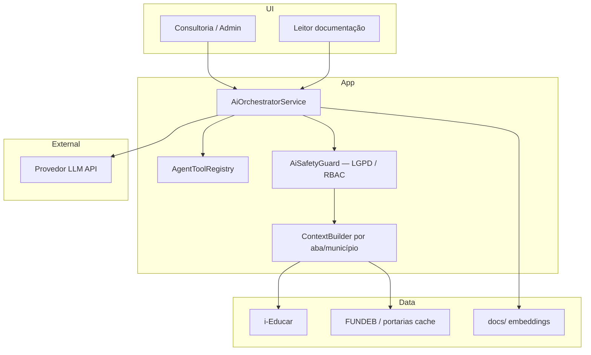

# Estudo: agentes e IA generativa no SERVLITCYS

**Data:** junho/2026  
**Versão do estudo:** 1.0  
**Produto:** SERVLITCYS (painel analítico i-Educar municipal)  
**Âmbito:** copilotos de consultoria, automação administrativa, enriquecimento de dados e integrações — **sem substituir** cálculos oficiais FNDE/Simec nem decisões legais do ente.

> **Índice:** [README.md](README.md) · **Segurança/LGPD:** [SEGURANCA.md](SEGURANCA.md) · **Ponderações:** [PONDERACOES_TECNICAS.md](PONDERACOES_TECNICAS.md) · **Backlog:** [BACKLOG_IMPLEMENTACOES.md](BACKLOG_IMPLEMENTACOES.md) · **Integrações:** [ESTUDO_INTEGRACOES_SETOR_PUBLICO_E_PREVISAO_DEMANDA.md](ESTUDO_INTEGRACOES_SETOR_PUBLICO_E_PREVISAO_DEMANDA.md)

---

## 1. Objetivo

Este estudo avalia **como agentes de IA e modelos de linguagem (LLM)** podem enriquecer o SERVLITCYS — hoje centrado em **dados estruturados** (i-Educar, FNDE, INEP, CadÚnico, repasses) e **painéis determinísticos** (Discrepâncias, FUNDEB, Diagnóstico, PDF ATM).

Não propõe «IA no lugar do FUNDEB» nem respostas sem rastreio. Define **cenários**, **caminhos técnicos em Laravel**, **vantagens e contras** e **fases de adoção** compatíveis com LGPD, RBAC e a arquitetura existente (filas `admin-sync`, cache, `PublicDataImportCatalog`, consultoria lazy-load).

---

## 2. Contexto do produto (o que a IA pode apoiar)

| Camada actual | Exemplos no código | Lacuna que IA pode ajudar |
|---------------|-------------------|---------------------------|
| **Dados municipais** | `CityDataConnection`, matrículas i-Educar | Explicar discrepâncias, sugerir priorização de correção |
| **Referências federais** | Portarias FNDE, CKAN, Tesouro | Resumir portarias, comparar exercícios, alertar divergências (como análise assistida) |
| **Consultoria** | Abas analytics, Diagnóstico, Comparativo | Narrativa executiva, «perguntas em linguagem natural» sobre o recorte |
| **Admin / operação** | Hub dados públicos, filas, documentação | Runbooks, triagem de falhas de import, geração de notas de release |
| **Documentação** | `DocumentationCatalog`, markdown em `docs/` | Busca semântica, respostas citando fonte interna |

**Princípio:** a IA **interpreta e articula** o que o sistema já calculou; os **números oficiais** continuam a vir de serviços PHP testáveis (`FundebOpenDataImportService`, `DiscrepanciesFundingImpact`, etc.).

---

## 3. Tipos de solução (taxonomia)

| Abordagem | O que é | Quando usar no SERVLITCYS |
|-----------|---------|---------------------------|
| **A. Prompt único (sem memória)** | Uma chamada LLM com contexto montado na hora | Resumo de PDF ATM, explicação de um cartão FUNDEB |
| **B. RAG (Retrieval-Augmented Generation)** | LLM + busca em docs/dados antes de responder | «Como importar VAAF?», «O que significa VAAT-MIN?» |
| **C. Copilot contextual** | UI com contexto do filtro (município, ano, aba) | «Por que caiu o VAAF?» na aba FUNDEB |
| **D. Agente com ferramentas** | LLM que chama funções/APIs (tool use) | Consultar matrículas, disparar `fundeb:import-api`, ler status da fila |
| **E. Agente multi-passo (workflow)** | Vários passos planeados (plan → act → verify) | Auditoria FUNDEB: matriz × portaria × matrículas |
| **F. Automação event-driven** | IA só em gatilhos (fila, alerta, PR) | Comentário em falha CI, sugestão de correção de import |
| **G. Modelos especializados (não-LLM)** | Classificação, anomalia, previsão série temporal | Detecção de outliers em VAAF, previsão de matrículas |

---

## 4. Cenários de valor (por área do produto)

### 4.1 Consultoria municipal (usuário `municipal` / `user`)

| Cenário | Abordagem sugerida | Enriquecimento |
|---------|-------------------|----------------|
| Explicar guia FUNDEB (consolidado vs projeção) | B + C | Leigos entendem matrículas vigentes → exercício seguinte |
| Resumo executivo do Diagnóstico | A ou C | Texto para reunião com secretaria (a partir de KPIs já calculados) |
| «O que corrigir primeiro?» nas Discrepâncias | C + D | Ordenar por impacto FUNDEB usando `DiscrepanciesFundingImpact` |
| Comparativo ano a ano em linguagem natural | C | Narrativa sobre variação matrículas/VAAF sem novo SQL |
| CadÚnico — lacuna fora da rede | C | Explicar mapa territorial e cenários NEE/AEE |

### 4.2 Admin e integrações (`admin`)

| Cenário | Abordagem sugerida | Enriquecimento |
|---------|-------------------|----------------|
| Triagem falha `fundeb:import-api` | D + F | Agente lê log, sugere matrículas/URL/portaria |
| Verificação portaria HTTP 403 vs GET | F | Já resolvido deterministicamente; IA só documenta runbook |
| Hub dados públicos — «qual importação falta?» | D | Consulta `PublicDataImportCatalog`, gaps PDF ATM |
| Documentação interna | B | Chat sobre `docs/` com citação de arquivo |
| Monitor filas `admin-sync` | D | «Por que a fila FUNDEB está parada?» |

### 4.3 Dados e qualidade (transversal)

| Cenário | Abordagem sugerida | Enriquecimento |
|---------|-------------------|----------------|
| Divergência matriz × portaria × BD | E | Workflow reproduzível (como análise `dadosatuais.csv`) |
| Sugestão de fonte em [ESTUDO_INTEGRACOES…](ESTUDO_INTEGRACOES_SETOR_PUBLICO_E_PREVISAO_DEMANDA.md) | B | Priorizar Onda 1/2 com base em lacunas do município |
| Normalização cadastro Censo | G + C | Classificar tipo de pendência; LLM explica regra INEP |

---

## 5. Matriz de opções — vantagens e contras

### 5.1 Copilot na consultoria (C)

| Vantagens | Contras |
|-----------|---------|
| Alto valor percebido pela gestão municipal | Risco de alucinação se contexto incompleto |
| Reutiliza filtros e payloads existentes | Custo por token; latência em abas pesadas |
| Pode citar «fonte: aba FUNDEB, exercício 2026» | Exige disclaimers («indicativo, não FNDE») |

**Caminho técnico:** endpoint Laravel `POST /api/consultoria/copilot` (auth + policy por `city_id`); monta JSON do tab lazy-load já em cache; prompt com `FundebValueLexicon` + números; streaming SSE opcional.

---

### 5.2 RAG sobre documentação (B)

| Vantagens | Contras |
|-----------|---------|
| Respostas alinhadas ao que está em `docs/` | Índice desatualizado → respostas erradas |
| Baixo risco financeiro (sem números de repasse) | Embeddings + vector store = nova infra |
| Útil para admin e municipal (perguntas «como») | Markdown grande (releases) precisa chunking |

**Caminho técnico:** indexar `docs/*.md` + `DocumentationCatalog` paths; busca por similaridade (pgvector, Qdrant, ou SQLite-vec em dev); resposta obrigatória com `path` citado (`admin.documentation.show`).

---

### 5.3 Agente com ferramentas (D)

| Vantagens | Contras |
|-----------|---------|
| Acções concretas (import, status fila) | Superfície de ataque se tools mal limitadas |
| Reduz cliques no admin | Debugging mais complexo |
| Alinha-se a «agentes» modernos (tool calling) | Necessita allowlist estrita de comandos Artisan |

**Caminho técnico:** camada `App\Services\Ai\AgentToolRegistry` com tools read-only por defeito (`getFundebMatrix`, `getImportDiagnostics`, `listQueueTasks`); tools mutáveis só `admin` + confirmação explícita na UI; **nunca** SQL livre nem `eval`.

Tools candidatas (leitura):

- `FundebOfficialSourcesService::probeUpdates()`
- `FundebMunicipioReferenceRepository::yearlyMatrix()`
- `AdminSystemFlowStatus::diagram()`
- `PublicDataImportCatalog::gapIndex()`

Tools candidatas (escrita — fase tardia):

- Enfileirar `fundeb:import-api` via `AdminSyncQueue` (já existente)
- Gerar rascunho de nota em `docs/` (PR humano)

---

### 5.4 Workflow multi-agente auditoria FUNDEB (E)

| Vantagens | Contras |
|-----------|---------|
| Reproduz análises como portaria × matriz × matrículas | Custo e tempo maiores |
| Saída estruturada (relatório JSON + markdown) | Ainda precisa validação humana |
| Diferencial comercial forte | Depende de matrículas e portarias atualizadas |

**Caminho técnico:** job na fila `system` ou comando `fundeb:audit-ai` que: (1) carrega CSV portaria cache; (2) carrega BD; (3) LLM só **redige** conclusões a partir de diff calculado em PHP — **não** deixa o modelo calcular VAAF.

---

### 5.5 Automação em CI / filas (F)

| Vantagens | Contras |
|-----------|---------|
| Sem exposição a usuárioes finais | Valor indirecto |
| Resumos de falha de teste/import | Pode vazar logs se mal configurado |

**Caminho técnico:** hook pós-falha em `admin-sync` → envia trecho de log para LLM → grava sugestão em `meta` da tarefa (não auto-executa).

---

### 5.6 Modelos clássicos ML (G)

| Vantagens | Contras |
|-----------|---------|
| Previsão matrículas / demanda CadÚnico | Requer histórico limpo e features |
| Sem custo recorrente de API LLM | Pipeline de MLOps separado |
| Complementa [ESTUDO_INTEGRACOES…](ESTUDO_INTEGRACOES_SETOR_PUBLICO_E_PREVISAO_DEMANDA.md) | Menos «conversacional» |

**Caminho técnico:** export agregado municipal (sem PII) → Python/R ou serviço sidecar; resultados gravados em tabela `municipality_forecasts`; UI apenas exibe série.

---

## 6. Arquitetura técnica recomendada (Laravel)

### 6.1 Componentes novos (proposta)

| Componente | Responsabilidade |
|------------|------------------|
| `config/ai.php` | Provedor, modelo, limites token, feature flags |
| `AiOrchestratorService` | Monta mensagens, chama provedor, regista auditoria |
| `ConsultoriaContextBuilder` | Serializa KPIs da aba activa (sem PII desnecessária) |
| `DocumentationRagService` | Chunk + embed + search em `docs/` |
| `AgentToolRegistry` | Allowlist de callable PHP |
| `ai_interaction_logs` (migration) | `user_id`, `city_id`, `prompt_hash`, `tokens`, `tools_used` — **sem** gravar PII de alunos |

### 6.2 Provedores LLM (opções)

| Opção | Prós | Contras |
|-------|------|---------|
| **API comercial** (OpenAI, Anthropic, Google) | Qualidade, rápido a integrar | Dados saem do perímetro; custo |
| **Azure OpenAI / Vertex com contrato** | DPA enterprise, região | Contratação |
| **Modelo self-hosted** (Ollama, vLLM) | Dados no servidor municipal | GPU, manutenção, qualidade variável |
| **Híbrido** | RAG local + LLM só para redação | Complexidade |

**Recomendação inicial:** feature flag desligada em produção; piloto **RAG documentação** + **copilot só leitura** com provedor configurável via `.env` (`AI_PROVIDER`, `AI_API_KEY`).

### 6.3 Integração com o que já existe

- **Filas:** agentes de escrita usam `AdminSyncQueue` — mesma fila FUNDEB/CadÚnico.
- **Semântica FUNDEB:** prompts incluem glossário `FundebValueLexicon` / `lang/pt_BR/fundeb.php`.
- **LGPD:** seguir [SEGURANCA.md](SEGURANCA.md); não enviar nome/CPF de aluno ao LLM; agregar por escola/etapa quando necessário.
- **RBAC:** municipal só vê tools do seu `city_id`; documentação admin-only não entra no RAG do perfil municipal.

---

## 7. Roadmap sugerido (fases)

| Fase | Entrega | Abordagem | Esforço | Risco |
|------|---------|-----------|---------|-------|
| **0** | Política de uso + `config/ai.php` + logs | Governança | Baixo | Baixo |
| **1** | RAG na documentação admin (`/admin/documentacao`) | B | Médio | Baixo |
| **2** | «Explicar este painel» na consultoria FUNDEB/Diagnóstico | C | Médio | Médio |
| **3** | Agente leitura admin (status fila, portarias, matriz) | D read-only | Médio | Médio |
| **4** | Auditoria FUNDEB assistida (diff PHP + narrativa LLM) | E | Alto | Médio |
| **5** | Enfileirar imports por agente (com confirmação) | D write | Alto | Alto |
| **6** | Previsão demanda ML + narrativa | G + C | Alto | Médio |

---

## 8. Riscos transversais e mitigação

| Risco | Mitigação |
|-------|-----------|
| Alucinação em valores FUNDEB | Números sempre de PHP/BD; LLM só explica |
| Fuga de dados pessoais | `AiSafetyGuard` strip CPF/NIS/nome; auditoria |
| Custo API | Cache de respostas por `(city_id, tab, hash_context)` |
| Dependência de fornecedor | Interface `LlmClient` + fallback «modo offline» |
| Responsabilidade legal | Disclaimer UI + registo em PDF («texto assistido por IA») |

---

## 9. Variáveis de ambiente (proposta)

| Variável | Uso |
|----------|-----|
| `AI_ENABLED` | `false` por defeito |
| `AI_PROVIDER` | `openai` \| `anthropic` \| `ollama` \| `azure` |
| `AI_API_KEY` | Segredo (nunca commit) |
| `AI_MODEL` | Ex.: `gpt-4o-mini` / modelo local |
| `AI_MAX_TOKENS` | Limite por pedido |
| `AI_RAG_DOCS_ENABLED` | RAG só documentação |
| `AI_COPILOT_TABS` | Lista: `fundeb,discrepancies,diagnostico` |

Documentar em [VARIAVEIS_AMBIENTE.md](VARIAVEIS_AMBIENTE.md) quando a fase 0 for implementada.

---

## 10. Conclusão

Agentes e IA **complementam** o SERVLITCYS — não substituem portarias FNDE, queries i-Educar nem RBAC. O melhor custo-benefício inicial é:

1. **RAG na documentação** (admin e equipa técnica).  
2. **Copilot explicativo** nas abas FUNDEB e Diagnóstico (contexto já calculado).  
3. **Agente read-only** no admin para filas, portarias e divergências.  

Cálculos financeiros e importações críticas devem permanecer em **PHP testável**; a IA entra na **camada de linguagem, priorização e operação**.

---

## 11. Referências externas (conceitos)

- Tool use / function calling — padrão OpenAI/Anthropic para agentes com ferramentas.  
- RAG — recuperação aumentada para reduzir alucinação em domínios documentados.  
- LGPD — tratamento de dados em serviços de IA: base legal, minimização, DPA com fornecedor.  
- [Postman AI agent readiness](https://www.postman.com/) — boas práticas de APIs consumíveis por agentes (útil se expuser endpoints internos).

---

*Manutenção:* ao implementar fase ≥ 1, atualizar [BACKLOG_IMPLEMENTACOES.md](BACKLOG_IMPLEMENTACOES.md) com IDs dedicados e [STATUS_PROJETO.md](STATUS_PROJETO.md) quando entrar em produção.
