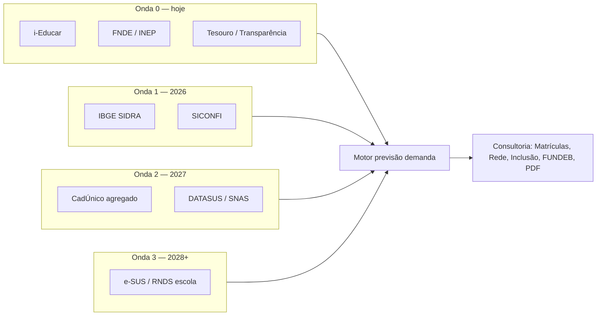

# Estudo: integrações do setor público × melhorias educacionais e previsão de demanda

**Data:** maio/2026  
**Versão do estudo:** 1.0  
**Produto:** SERVLITCYS (painel analítico i-Educar municipal)  
**Âmbito:** educação, tesouro/finanças, saúde, assistência social e fontes transversais (demografia, trabalho, transparência).

> **Índice:** [README.md](README.md) · **Integrações em produção:** [CONSULTAS_EXTERNAS.md](CONSULTAS_EXTERNAS.md) · **Hub de carga:** [IMPORTACAO_DADOS_PUBLICOS.md](IMPORTACAO_DADOS_PUBLICOS.md) · **Backlog:** [BACKLOG_IMPLEMENTACOES.md](BACKLOG_IMPLEMENTACOES.md) §H · **Cadastro/plugins:** [PLUGINS_E_REFINO_CADASTRO_IEDUCAR.md](PLUGINS_E_REFINO_CADASTRO_IEDUCAR.md)

---

## 1. Objetivo

Este estudo mapeia **sistemas públicos brasileiros** (federais, estaduais e municipais) que podem **alimentar melhorias educacionais** e **modelos de previsão de demanda** no município — matrículas futuras, oferta de vagas, inclusão, financiamento (FUNDEB) e priorização de investimento.

Não propõe substituir sistemas oficiais (Simec, Educacenso, e-SUS clínico, prestação de contas). Define **como integrar com segurança**, **quando implementar** no roadmap SERVLITCYS e **que decisões gerenciais** cada fonte suporta.

---

## 2. Metodologia de avaliação

Cada sistema foi classificado nos eixos abaixo.

| Eixo | Significado |
|------|-------------|
| **Esfera** | **F** federal · **E** estadual · **M** municipal · **F/E/M** conforme uso |
| **Ingestão** | **API** REST/GraphQL · **CKAN** dados abertos · **CSV/ZIP** batch · **BD** conexão directa · **Manual** portal/Simec · **N/D** sem acesso público automatizável |
| **Unidade de consulta** | IBGE 7 dígitos, INEP escola, CPF/NIS, competência financeira, etc. |
| **LGPD / acesso** | **Aberto** (agregado público) · **Credencial** (Conecta gov.br, API key) · **Restrito** (CPF/NIS individual, termo de cooperação) |
| **Janela SERVLITCYS** | Ver §3 |

**Princípios alinhados ao produto** (ver [PONDERACOES_TECNICAS.md](PONDERACOES_TECNICAS.md) §6 e §15):

1. Município (`City.ibge_municipio`) + ano letivo do filtro analytics.
2. Cache e fila admin — sem consulta pesada no clique do gestor.
3. Indicadores **indicativos** para planeamento; repasses oficiais vêm do FNDE/Tesouro/Simec.
4. Falha graciosa na UI quando fonte ou credencial faltar.

---

## 3. Janelas de implementação (roadmap SERVLITCYS)

| Janela | Período alvo | Critério de entrada | Exemplos |
|--------|--------------|---------------------|----------|
| **Onda 0** | Entregue (2.3.x) | Dado aberto ou i-Educar local; já no hub `/admin/dados-publicos` | FNDE CKAN, Tesouro CSV/CKAN, INEP Censo/SAEB/geo, i-Educar |
| **Onda 1** | 3.º tri. 2026 | API/CSV **agregado por município**, sem CPF em massa | IBGE SIDRA (população, domicílios), SICONFI indicadores, painéis MEC programas |
| **Onda 2** | 2027 | Credencial municipal ou convênio; ainda preferir agregados | CadÚnico indicadores municipais, DATASUS agregado, SNAS/SUAS metas |
| **Onda 3** | 2028+ | Interoperabilidade clínica/identidade ou pacto estadual | RNDS/e-SUS APS, vacinação escolar, CRM educação estadual |

---

## 4. Matriz resumo

Legenda ingestão: **API** · **CKAN** · **CSV** · **BD** · **MAN** manual · **—** não integrado.

| Sistema / fonte | Esfera | Ingestão | API / método | Regra de consulta (resumo) | Janela | No SERVLITCYS |
|-----------------|--------|----------|--------------|----------------------------|--------|---------------|
| **i-Educar** (base municipal) | M | BD | PostgreSQL por cidade | Filtros escola/série/ano; matrícula activa | 0 | Sim — núcleo |
| **FNDE — dados abertos** | F | CKAN / CSV | `datastore_search`; CSV receita Fundeb | IBGE + ano; cache `fundeb/api/{ibge}/{ano}.json` | 0 | Sim |
| **Tesouro Transparente** | F | CKAN / CSV | Recurso transferências; `TesouroTransferenciasCsvService` | COD_MUN IBGE + exercício | 0 | Sim |
| **Portal da Transparência** | F | API | REST com `PORTAL_TRANSPARENCIA_API_KEY` | Município + período; cache TTL | 0 | Sim (opcional) |
| **INEP — Censo / microdados** | F | CSV / ZIP | Pipeline local; indexador municipal | IBGE + ano Censo | 0 | Sim |
| **INEP — SAEB / IDEB** | F | CSV / JSON | Import pedagógico; URLs configuráveis | IBGE + ano aplicação | 0 | Sim |
| **INEP — geo escolas** | F | CSV / ArcGIS | `school_unit_geos` | INEP escola ↔ i-Educar | 0 | Sim |
| **MEC — Simec / VAAR** | F | MAN | Portal Simec (sem API única) | Prestação de contas manual | — | Links / narrativa FUNDEB |
| **MEC — programas (PNAE, PDDE…)** | F | MAN / catálogo | `PublicDataSourcesCatalog` | Referência; flags i-Educar quando existirem | 0–1 | Parcial |
| **IBGE — SIDRA / malhas** | F | API / CSV | APIs IBGE; malha para mapa Início | IBGE município; série temporal | 1 | Mapa Início (parcial); socio PDF lacuna |
| **IBGE — Censo demográfico** | F | CSV | Tabelas população por idade | IBGE + ano | 1 | Backlog `ibge_socio_missing` |
| **Tesouro — SICONFI** | F | API | API Contas / SICONFI (Tesouro) | Ente IBGE + exercício | 1 | Não |
| **Tesouro — SIAFI** | F | — | Sistema interno União | Não aplicável ao município direto | — | Não |
| **Receita / CADIN** | F | API | Conecta (restrição) | CNPJ ente / convênio | 3 | Não |
| **CadÚnico — Serviços** | F | API | Conecta gov.br / Dataprev | **CPF/NIS** — uso restrito; agregados via MDDS | 2 | Não |
| **SNAS / SUAS** | F | CSV / painéis | Cidadania.gov.br, painéis SNAS | Município + ano programa | 2 | Não |
| **Bolsa Família / BPC escola** | F | API / painel | Indicadores familiares (restrito) ou painéis agregados | Cruzar com defasagem escolar | 2 | Não |
| **DATASUS / TabNet** | F | CSV / MAN | Export TabNet; Portal Dados Abertos SUS | Município + CID/FAE agregado | 2 | Não |
| **e-SUS AB / PEC** | F/M | API / BD | RNDS (credencial); e-SUS municipal | UBS × território; não lista turma por padrão | 3 | Não |
| **SISVAN / PNAE nutricional** | F/M | MAN / API | Vigilância alimentar; cruzamento PNAE | Escola INEP | 2 | Não |
| **CNES** | F | CSV | Base estabelecimentos DATASUS | Proximidade escola–UBS | 2 | Não |
| **RAIS / CAGED / PNAD** | F | CSV | Microdados IBGE/MTb | Mercado trabalho local → EJA demanda | 2 | Não |
| **Conselho Tutelar / rede proteção** | M | MAN / BD | Sistemas municipais heterogêneos | Sem padrão nacional único | 3 | Não |
| **Transporte escolar municipal** | M | BD / MAN | Módulo i-Educar ou planilha | Rotas × matrícula | 1–2 | Parcial (cadastro i-Educar) |

---

## 5. Previsão de demanda educacional (modelo conceitual)

A **demanda** no SERVLITCYS combina três camadas já parcialmente disponíveis na consultoria:

| Camada | Fonte principal | Uso na previsão |
|--------|-------------------|-----------------|
| **Estoque** | i-Educar (matrículas activas, série, idade, NEE) | População em idade escolar matriculada vs. defasagem |
| **Oferta** | i-Educar (turmas, capacidade, vagas) + geo INEP | Gargalos por segmento; expansão de rede |
| **Contexto** | Censo INEP municipal, IBGE (Onda 1), repasses (Onda 0) | Crescimento populacional, migração, capacidade financeira |

**Fórmulas indicativas** (não oficiais MEC):

1. **Demanda potencial por faixa etária** ≈ população IBGE (5–17 anos) × taxa de escolarização histórica (Censo/INEP).
2. **Pressão de vaga** = matrículas activas / capacidade turmas (já na aba **Rede & Oferta** e mapa **Unidades Escolares**).
3. **Demanda inclusiva** = alunos NEE + AEE × recursos de prova (i-Educar) + indicadores SUAS/CadÚnico (Onda 2) para vulnerabilidade.
4. **Sustentabilidade financeira** = matrículas × VAAF municipal importado (FNDE) vs. repasses Tesouro (Onda 0).

**Saídas desejadas no produto** (backlog INT-01 a INT-04):

| ID | Entrega | Janela |
|----|---------|--------|
| INT-01 | Painel «Demanda × Oferta» por segmento e projeção 3 anos (cenários) | 1 |
| INT-02 | Série histórica matrícula + população IBGE no município | 1 |
| INT-03 | Alertas «risco de superlotação» (capacidade &lt; 95% ocupação prevista) | 1 |
| INT-04 | Bloco PDF «Contexto socioeconómico» (IBGE + repasses) | 1 |

---

## 6. Educação e financiamento (detalhe)

### 6.1 i-Educar (municipal)

| Aspecto | Detalhe |
|---------|---------|
| **Esfera** | M (implantação municipal; padrão nacional) |
| **Ingestão** | **BD** PostgreSQL dedicado por `City` |
| **Regras de consulta** | Ano letivo em `matricula.ano` e/ou `turma.ano`; matrícula activa; escopo `city_id` + permissões RBAC |
| **Melhoria educacional** | Qualidade cadastro → discrepâncias, FUNDEB, Censo, inclusão |
| **Previsão demanda** | Série matrículas, capacidade turma, distorção idade-série |
| **Técnico** | Conexões em admin; Pulse por aba — [METRICAS_QUERIES_ANALYTICS.md](METRICAS_QUERIES_ANALYTICS.md) |
| **Administrativo** | Secretaria mantém cadastro; acordos de uso da base |
| **Gerencial** | Metas por escola; semáforo RX; impacto saldo indicativo por aba |

### 6.2 FNDE / FUNDEB (federal)

| Aspecto | Detalhe |
|---------|---------|
| **Esfera** | F |
| **Ingestão** | **CKAN** + **CSV** portaria receita + cache JSON |
| **API** | `GET …/api/3/action/datastore_search` — ver [CONSULTAS_EXTERNAS.md](CONSULTAS_EXTERNAS.md) §3.1 |
| **Regras** | `IBGE` 7 dígitos + `ano`; ordem import: CSV receita → cache → CKAN → PDF UF |
| **Previsão** | VAAF municipal × matrículas → previsão recursos; **não** confundir com piso federal R$ 4.500 (prévia) |
| **Administrativo** | Equipa técnica importa via `/admin/dados-publicos`; prestação VAAR no Simec |
| **Gerencial** | Priorizar correcções cadastro com maior `ocorrências × VAAF × peso` |

### 6.3 INEP — Censo, SAEB, geo

| Aspecto | Detalhe |
|---------|---------|
| **Esfera** | F |
| **Ingestão** | **CSV/ZIP** batch (microdados); sem API REST estável por município em tempo real |
| **Regras** | Indexação por IBGE; ano Censo vs. ano letivo i-Educar documentado na UI |
| **Previsão** | Comparar matrículas i-Educar × Censo municipal; IDEB/SAEB para demanda por desempenho (EJA, reforço) |
| **Técnico** | `InepCensoMunicipioMatriculasIndexer`, `SaebPedagogicalImportService`, pipeline geo |
| **Gerencial** | Meta export Educacenso; discrepâncias P0 antes do PDF |

### 6.4 Tesouro e transparência (federal)

| Aspecto | Detalhe |
|---------|---------|
| **Esfera** | F |
| **Ingestão** | **CKAN** Tesouro + **CSV** + **API** Portal Transparência |
| **Regras** | Exercício financeiro; COD_MUN; cache `municipal_transfer_snapshots` |
| **Previsão** | Capacidade de investimento local (transporte, infra) vs. matrícula |
| **Técnico** | `MunicipalTransferImportService`, `MunicipalFundingPublicSnapshotService` |
| **Gerencial** | Aba **Financiamentos**; não substitui extrato bancário |

---

## 7. Saúde (SUS)

Integração **indirecta** à educação: nutrição (PNAE), vacinação escolar, necessidades de saúde que impactam frequência e inclusão (NEE, medicamentos, atendimento APS).

### 7.1 Portal de Dados Abertos do SUS

| Aspecto | Detalhe |
|---------|---------|
| **Esfera** | F (MS) · execução **M** (secretarias municipais de saúde) |
| **Ingestão** | **API** + download **CSV/JSON/XML** |
| **Acesso** | Conta gov.br Prata/Ouro para alguns serviços; suporte `dadosabertos@saude.gov.br` |
| **Regras** | Conjuntos de dados por tema; agregar por município IBGE; **não** usar prontuário individual sem base legal |
| **Janela** | **2** (agregados) · **3** (eventos escola via e-SUS) |
| **Previsão** | Indicadores morbidade infantil / cobertura vacinal por território → risco de evasão por saúde |
| **Técnico** | Novo conector `HealthOpenDataImportService` (proposto); tabela `municipal_health_indicators` |
| **Administrativo** | Termo com SMS; alinhamento Conselho Municipal de Educação |
| **Gerencial** | Cruzamento com PNAE e frequência (aba **Frequência**) |

### 7.2 DATASUS / TabNet

| Aspecto | Detalhe |
|---------|---------|
| **Esfera** | F |
| **Ingestão** | **MAN** (export TabNet) → **CSV** programado |
| **API** | Não há API única equivalente ao CKAN FNDE para todos os indicadores |
| **Janela** | **2** |
| **Uso educacional** | Série histórica internações/agravo infantil por município (contexto PDF) |

### 7.3 e-SUS AB, CNES, RNDS

| Aspecto | Detalhe |
|---------|---------|
| **Esfera** | F (plataforma) · **M** (instância e-SUS) |
| **Ingestão** | **BD** municipal e-SUS (restrito) · **API** RNDS com credencial |
| **Regras** | LGPD estrita; consentimento; vínculo profissional–estabelecimento CNES |
| **Janela** | **3** (vacinação escolar, busca ativa saúde–escola) |
| **Previsão** | Baixa prioridade para matrícula futura; alta para **frequência e inclusão** |
| **Gerencial** | Parceria SMS × SME; não expor dado clínico no painel analítico público |

---

## 8. Assistência social (SUAS / CadÚnico)

### 8.1 CadÚnico — APIs Conecta / Dataprev

| Aspecto | Detalhe |
|---------|---------|
| **Esfera** | F (MDS) · operação **M** (CRAS/CREAS) |
| **Ingestão** | **API** REST (Conecta gov.br) |
| **Endpoints (ex.)** | Situação cadastral por CPF/NIS; indicadores familiares (**uso restrito** para dados detalhados) |
| **Regras** | Consulta **unitária** CPF/NIS com finalidade; **proibido** varrer base escolar no painel sem amparo legal |
| **Alternativa Onda 2** | Painéis **agregados** MDDS/SNAS por município (CSV público) |
| **Previsão** | % famílias em vulnerabilidade × defasagem escolar → prioridade busca ativa, EJA, transporte |
| **Técnico** | Serviço `CadunicoMunicipalAggregateImportService` (proposto); sem armazenar CPF em claro |
| **Administrativo** | Credencial Conecta; DPO municipal; registro de operações |
| **Gerencial** | Indicador «alunos em contexto de vulnerabilidade» (agregado) na **Inclusão** e PDF |

### 8.2 SNAS / SUAS (programas, metas)

| Aspecto | Detalhe |
|---------|---------|
| **Esfera** | F · execução **M** |
| **Ingestão** | **CSV** / relatórios SNAS; sem API única estilo CKAN |
| **Janela** | **2** |
| **Uso** | Metas PAIF/PSE; articulação com Conselho Tutelar (municipal, Onda 3) |

---

## 9. Demografia, trabalho e planeamento territorial

### 9.1 IBGE (população, domicílios, rendimento)

| Aspecto | Detalhe |
|---------|---------|
| **Esfera** | F |
| **Ingestão** | **API** SIDRA · **CSV** Censo demográfico |
| **Regras** | Código IBGE; série 2010–2030 (projeções) |
| **Janela** | **1** — fecha lacuna `ibge_socio_missing` do PDF |
| **Previsão** | Principal driver de **demanda futura** por faixa etária |
| **Técnico** | Cache agregado `municipal_demography_snapshots` |
| **Gerencial** | Cenários «alta / média / baixa» migração para planeamento de escolas |

### 9.2 RAIS / CAGED / PNAD Contínua

| Aspecto | Detalhe |
|---------|---------|
| **Esfera** | F |
| **Ingestão** | **CSV** microdados (IBGE/MTb) |
| **Janela** | **2** |
| **Previsão** | Demanda **EJA** e qualificação profissional ligada ao mercado local |

---

## 10. Regras transversais de consulta (checklist técnico)

| Regra | Aplicação |
|-------|-----------|
| **R1 — IBGE obrigatório** | Toda fonte externa municipal exige `City.ibge_municipio` válido (7 dígitos) |
| **R2 — Ano coerente** | Documentar se ano é letivo, Censo, exercício financeiro ou aplicação SAEB |
| **R3 — Somente leitura** | Integrações analytics não escrevem em sistemas externos |
| **R4 — Cache antes de rede** | TTL configurável; fila `admin-sync` para carga pesada |
| **R5 — Agregação por defeito** | Dados pessoais só com base legal; preferir tabelas municipais |
| **R6 — Rastreabilidade** | Campo `fonte`, `imported_at`, `schema_version` nas tabelas de snapshot |
| **R7 — Falha graciosa** | UI com nota «fonte indisponível»; PDF lista lacuna em `data_gaps` |

Variáveis existentes: [VARIAVEIS_AMBIENTE.md](VARIAVEIS_AMBIENTE.md). Hub operacional: [IMPORTACAO_DADOS_PUBLICOS.md](IMPORTACAO_DADOS_PUBLICOS.md).

---

## 11. Governança administrativa e gerencial

### 11.1 Papéis

| Papel | Responsabilidade |
|-------|------------------|
| **Secretário(a) de Educação** | Prioriza melhorias com base em saldo indicativo, demanda e FUNDEB |
| **Equipe técnica / TI** | Credenciais, sync, qualidade i-Educar |
| **Controladoria / Fazenda** | Valida repasses Tesouro vs. orçamento (fora do escopo contábil do app) |
| **SMS / Assistência** | Onda 2+ — dados agregados vulnerabilidade (sem expor famílias) |
| **Fornecedor SERVLITCYS** | Implementação ondas, SLA de import, documentação |

### 11.2 Ritmo operacional sugerido

| Frequência | Acção |
|------------|--------|
| **Diário** | i-Educar (operacional escolas) |
| **Semanal** | `weekly-mass-sync:run` (FUNDEB, Censo, repasses, geo) |
| **Mensal** | Revisão discrepâncias P0; conferência capacidade/vagas |
| **Anual** | Pós-Censo: SAEB, IDEB, atualização projeção demanda (Onda 1+) |
| **Por release** | Actualizar este estudo e [CONSULTAS_EXTERNAS.md](CONSULTAS_EXTERNAS.md) |

### 11.3 Riscos e mitigação

| Risco | Mitigação |
|-------|-----------|
| Uso indevido de CPF/CadÚnico | Apenas agregados no painel; APIs unitárias só em processo municipal separado |
| Confundir VAAF municipal com piso federal | Textos `FundebReferenceDisplay`; ver [COMPARATIVO_VAAF_SERVLITCYS_VS_FNDE_MEC.md](COMPARATIVO_VAAF_SERVLITCYS_VS_FNDE_MEC.md) |
| API federal fora do ar | Cache local + CSV manual no `storage` |
| Expectativa de «API Simec» | Manter links e checklist; VAAR no portal oficial |

---

## 12. Referências oficiais (selecção)

| Fonte | URL (referência) |
|-------|------------------|
| FNDE dados abertos | https://www.fnde.gov.br/dadosabertos |
| Tesouro Transparente | https://www.tesourotransparente.gov.br |
| Portal da Transparência — API | https://portaldatransparencia.gov.br/pagina-api |
| INEP microdados | https://www.gov.br/inep/pt-br/acesso-a-informacao/dados-abertos |
| IBGE SIDRA | https://apisidra.ibge.gov.br |
| Catálogo APIs gov.br (Conecta) | https://www.gov.br/conecta/catalogo |
| CadÚnico API (Dataprev) | https://docs.dataprev.gov.br/docs/api/api-cadunico/ |
| Dados abertos SUS | https://www.gov.br/saude/pt-br/composicao/seidigi/dados-abertos |

---

## 13. Manutenção deste estudo

1. Nova integração implementada → atualizar matriz §4, janela e [CONSULTAS_EXTERNAS.md](CONSULTAS_EXTERNAS.md).
2. Novo item de produto → linha em [BACKLOG_IMPLEMENTACOES.md](BACKLOG_IMPLEMENTACOES.md) §H (IDs INT-xx) ou §J (IDs HOR-xx, Horizonte).
3. Integração com impacto no mapa comercial → [HORIZONTE.md](HORIZONTE.md) §11.2–§11.9.
4. Alteração de lacuna PDF → [RELATORIO_PDF_ATM.md](RELATORIO_PDF_ATM.md) e hub dados públicos.

*Documento vivo — versão 1.0 (maio/2026).*
