# Histórico de versões (resumo)

> **▶ EM PRODUÇÃO (`main`):** versão **`8.2.0`** · tag de deploy **`20260724c-Hygieia`** · ver [RELEASE_20260724c_HYGIEIA.md](RELEASE_20260724c_HYGIEIA.md)

| Indicador | Valor atual |
|-----------|----------------|
| **Versão semântica em produção** | **8.2.0** (`MAJOR.VERSÃO.MINOR` — ver [convenção](#convenção-de-releases-a-partir-de-236)) |
| **Ramo** | `main` |
| **Tag de deploy (servidor)** | `20260724c-Hygieia` |
| **Data de referência** | **24/07/2026** |
| **Último marco documentado** | **Clio Hygieia** — PDF gestor (série SVG), reanálise em lote, Censo 2025, NEE/Excel — [RELEASE_20260724c_HYGIEIA.md](RELEASE_20260724c_HYGIEIA.md) |
| **UI admin** | `/admin/documentacao` mostra o selo **«Em produção»** com esta versão (`config/documentation.php`) |
| **Commit de release** | `PENDING` (#**568**) |

> **Como ler:** cada linha da tabela abaixo é **histórico**. A linha marcada com **▶** ou a seção «Em produção» indica o que está em `main` hoje. O **#N** é a posição do commit na história linear do ramo `main`.
>
> **Entregas em série:** índice [ENTREGAS_ESCALONADAS.md](ENTREGAS_ESCALONADAS.md) — [junho/2026](ENTREGAS_ESCALONADAS_JUNHO_2026.md) · [maio/2026 (arquivo)](ENTREGAS_ESCALONADAS_MAIO_2026.md).

### Linha 4.x → 6.x (visual)

```mermaid
timeline
    title Marcos semânticos 4.x → 6.0
    2026-06-04 : 4.0.0 Hestia — Início reorganizado
    2026-06-05 : 4.1.0 Athena — 5 áreas consultoria
    2026-06-09 : 4.4.5a Themis — qualidade no dock, FUNDEB gerencial
    2026-06-15 : 4.4.7a Mnemosyne — toolkit Educacenso RX
    2026-06-19 : 5.0.0 Horizonte — mapa oportunidade municipal
    2026-06-19 : 5.0.1a Heimdall — data release + monitor + dados públicos
    2026-06-19 : 5.1.0b Prospeccao — Horizonte calor + feed quinzenal
    2026-06-03 : 5.2.0c Argus — hub Horizonte + monitor sondas + acesso
    2026-06-03 : 5.3.0d Prometheus — feed bimestral, UF, SGE mapa, fix IBGE
    2026-06-03 : 5.4.0e Hyperion — scoring v2, SIDRA, repasses, mapa performante
    2026-06-19 : 5.5.0c Helios — GIS gerencial Horizonte, monitor 10 min, Artisan admin
    2026-06-20 : 5.6.0 Urania — alta pressão GIS, feed robusto, sync BR
    2026-06-20 : 5.7.0a Metis — centro de decisão Horizonte, performance UF extensas
    2026-06-20 : 5.7.1b Sleipnir — sync BR screen, convenção MAJOR.VERSÃO.MINOR
    2026-06-20 : 5.7.2c Forseti — mapa UF extensas, cache Redis, filtros GIS
    2026-06-20 : 5.7.3d Bragi — mapa recorte/tour, sync screen, UI pt-BR
    2026-06-20 : 5.7.4e Vidar — sync wanted/ensure, reinício pós-TERM
    2026-06-22 : 5.7.5a Mimir — tour/demo Horizonte, repasses modal, import Tesouro
    2026-06-22 : 5.7.6b Saga — modal municipal, demo animada, transferências FNDE
    2026-06-24 : 5.7.7a Skuld — timeline financeira modal, SIDRA pop. total, analytics refactor
    2026-06-03 : 5.8.0g Thor — FUNDEB estadual, pan mapa, resumo UF, sync repasses Tesouro
    2026-06-03 : 6.0.0h Odin — marca Horizonte, barra cmd fixa, resumo UF inline, dados públicos
    2026-06-24 : 6.1.0 Horizonte — coroplético IBGE, mesorregiões, alertas VAAT
    2026-07-02 : 6.2.0 Educacenso — contadores por etapa, filtro dependência
    2026-07-02 : 6.3.0 Horizonte — modal refinado, finanças em colunas
    2026-07-02 : 6.5.0 Jord — malha IBGE, Contornos, pílulas geo, Educacenso nacional
    2026-07-09 : 7.0.3 Calliope — leitor documentação modular e publicação tag+GitHub
    2026-07-24 : 8.2.0 Hygieia — Clio PDF série SVG, reanálise lote, Censo 2025
    2026-07-24 : 8.1.0 Asclepius — Clio Diagnóstico Geral, PDF gestor, tempo escolar, jornada
    2026-07-24 : 8.0.4 Theia — Clio painel Insights nativo Chart.js, UX análise/home
    2026-07-24 : 8.0.3 Pythia — Clio BI bi_clio_*, insights gestores, medidores IND
    2026-07-23 : 8.0.2 Harmonia — Clio PDF/Excel alinhados, Fund. I/II, lotes Drive
    2026-07-23 : 8.0.1 Euterpe — Clio jornada, NEE, transporte, Excel/PDF, UTF-8
    2026-07-21 : 8.0.0 Aletheia — Clio hub de relatórios, AEE/AC e etapas Educacenso
    2026-07-06 : 7.0.2 Hermes — pt-BR unificado (UI, menus, documentação)
    2026-07-05 : 7.0.1 Moneta — tooltip FUNDEB por UF, warm-map-cache sem lock
    2026-07-05 : 7.0.0 Ploutos — SICONFI, Transparência, tendência SAEB, scoring ampliado
```



Diagramas de deploy e convenção de tag: [ARQUITETURA_E_FLUXOS.md](ARQUITETURA_E_FLUXOS.md) §5–6.

---

## Linha do tempo

| Versão | Commit | # | Data (ref.) | Resumo |
|--------|--------|---|-------------|--------|
| **▶ 8.2.0** | `PENDING` / `20260724c-Hygieia` → `main` | **568** | 24/07/2026 | **Produção:** Clio — série SVG no PDF gestor, `clio:campaign-reanalyze-all`, Censo 2025, NEE/Excel/Cor-Raça — [RELEASE_20260724c_HYGIEIA.md](RELEASE_20260724c_HYGIEIA.md). |
| 8.1.0 | `ca0f09a8` / `20260724b-Asclepius` → `main` | **563** | 24/07/2026 | Clio — Diagnóstico Geral, PDF do gestor, tempo escolar, série no card, faixas de CH/turnos — [RELEASE_20260724b_ASCLEPIUS.md](RELEASE_20260724b_ASCLEPIUS.md). |
| 8.0.4 | `c0a7d791` / `20260724a-Theia` → `main` | **561** | 24/07/2026 | Clio — painel Insights nativo (Chart.js), UX análise (jornada/transporte/etapas) e botões dos cards — [RELEASE_20260724a_THEIA.md](RELEASE_20260724a_THEIA.md). |
| 8.0.3 | `55bccd96` / `20260724-Pythia` → `main` | **559** | 24/07/2026 | Clio — S7 BI `bi_clio_*`, insights gestores, CLI-IND-01…10, prune, margem distorção — [RELEASE_20260724_PYTHIA.md](RELEASE_20260724_PYTHIA.md). |
| 8.0.2 | `4fc99bac` / `20260723b-Harmonia` → `main` | **554** | 23/07/2026 | Clio — PDF/Excel alinhados, Fund. I/II, distorção ordenada, AEE sem NEE, lotes Drive, painel escola — [RELEASE_20260723b_HARMONIA.md](RELEASE_20260723b_HARMONIA.md). |
| 8.0.1 | `af850f7` / `20260723-Euterpe` → `main` | **548** | 23/07/2026 | Clio — jornada, NEE/subnotificação, transporte, Excel, matriz PDF, UTF-8 CSV, filtro Consultoria — [RELEASE_20260723_EUTERPE.md](RELEASE_20260723_EUTERPE.md). |
| 8.0.0 | `3951fab` / `20260721-Aletheia` → `main` | **536** | 21/07/2026 | Clio hub de relatórios, relatório municipal (etapas/AEE/AC), home redesenhada — [RELEASE_20260721_ALETHEIA.md](RELEASE_20260721_ALETHEIA.md). |
| 7.0.3 | `98bfeee` / `20260709-Calliope` → `main` | **518** | 09/07/2026 | Leitor documentação modular, layout amplo, tabelas com scroll; README 7.x; `product:release-publish` — [RELEASE_20260709_CALLIOPE.md](RELEASE_20260709_CALLIOPE.md). |
| 7.0.2 | `41344e9` / `20260706-Hermes` → `main` | **513** | 06/07/2026 | pt-BR unificado na UI, menus e documentação viva; ROADMAP_INDICE; patches Horizonte pós-7.0.1 — [RELEASE_20260706_HERMES.md](RELEASE_20260706_HERMES.md). |
| 7.0.1 | `04ecf63` / `20260705b-Moneta` → `main` | **506** | 05/07/2026 | Horizonte — tooltip FUNDEB por UF (rank, total, % federal) no mapa nacional; `horizonte:warm-map-cache` sem locks HTTP — [RELEASE_20260705b_MONETA.md](RELEASE_20260705b_MONETA.md). |
| 7.0.0 | `e3caa40` / `20260705-Ploutos` → `main` | **483** | 05/07/2026 | Horizonte enriquecimento — SICONFI/RREO, Portal Transparência, tendência SAEB 4 ciclos, Educacenso modal, CadÚnico fora da escola, dimensões fiscal/trajectória/momentum/inclusão — [RELEASE_20260705_PLUTOS.md](RELEASE_20260705_PLUTOS.md). |
| 6.5.0 | `d07f58a` / `20260702c-Jord` → `main` | **482** | 02/07/2026 | Horizonte territorial — malha municipal IBGE + área km², modo **Contornos**, pílulas geo (posição/distância/área), copiar coordenadas decimal, SAEB/microrregiões, Educacenso nacional, docs alinhadas — [RELEASE_20260702c_JORD.md](RELEASE_20260702c_JORD.md). |
| 6.3.0 | `c8e2315` / `20260702b-Horizonte` → `main` | — | 02/07/2026 | Modal Horizonte — cabeçalho fixo, finanças portaria/Tesouro em colunas, roda de propensão, regiões IBGE, SAEB e textos pt-BR — [RELEASE_20260702b_HORIZONTE.md](RELEASE_20260702b_HORIZONTE.md). Entregas pós-tag integradas em **6.5.0**. |
| 6.2.0 | — / `20260702-Educacenso` → `main` | — | 02/07/2026 | Contadores por etapa no gráfico Horizonte (Educacenso INEP), correção agregação matrículas — [RELEASE_20260702_EDUCACENSO.md](RELEASE_20260702_EDUCACENSO.md). |
| 6.1.0 | `c5d6fc2` / `20260624-Horizonte` → `main` | **441** | 24/06/2026 | **Produção:** coroplético IBGE UF/mesorregiões, alertas VAAT, modal municipal, resumo UF, tour/demo — [RELEASE_20260624_HORIZONTE.md](RELEASE_20260624_HORIZONTE.md). |
| 6.0.0 | `df7d9b3` / `20260603h-Odin` → `main` | **433** | 03/06/2026 | Marca consultoria+Horizonte, barra cmd fixa, resumo UF inline, desenhar todos, modal municipal centrado, notificação dados públicos agrupada — [RELEASE_20260603h_ODIN.md](RELEASE_20260603h_ODIN.md). |
| 5.8.0 | `0bf9b2f` / `20260603g-Thor` → `main` | **431** | 03/06/2026 | Painel FUNDEB estadual, pan mapa + resumo UF, tela inteira, `horizonte:sync-repasses-tesouro`, YTD último repasse — [RELEASE_20260603g_THOR.md](RELEASE_20260603g_THOR.md). |
| 5.7.7 | `16e49e0` / `20260624a-Skuld` → `main` | **427** | 24/06/2026 | Timeline financeira no modal (FNDE/CKAN/ano corrente), SIDRA `populacao_total`, repasses chunk, analytics refactor — [RELEASE_20260624a_SKULD.md](RELEASE_20260624a_SKULD.md). |
| 5.7.6 | `ed7fccf` / `20260622b-Saga` → `main` | **419** | 22/06/2026 | Modal municipal (pipeline, propensão, CSS), demo com números/cores, transferências FNDE no score — [RELEASE_20260622b_SAGA.md](RELEASE_20260622b_SAGA.md). |
| 5.7.5 | `6be4f7c` / `20260622a-Mimir` → `main` | **412** | 22/06/2026 | Tour/demo Horizonte, repasses no modal (FUNDEB/educação), import Tesouro com índice IBGE — [RELEASE_20260622a_MIMIR.md](RELEASE_20260622a_MIMIR.md). |
| 5.7.4 | `605f829` / `20260620e-Vidar` → `main` | **406** | 20/06/2026 | Sync BR wanted/ensure, runner resistente a TERM, `loginctl enable-linger` — [RELEASE_20260620e_VIDAR.md](RELEASE_20260620e_VIDAR.md). |
| 5.7.3 | `85aa358` / `20260620d-Bragi` → `main` | **405** | 20/06/2026 | Horizonte mapa UF/recorte/tour; sync BR screen; UI pt-BR — [RELEASE_20260620d_BRAGI.md](RELEASE_20260620d_BRAGI.md). |
| 5.7.2 | `862b552` / `20260620c-Forseti` → `main` | **404** | 20/06/2026 | Horizonte performance UF 150+; filtros GIS + dock lateral — [RELEASE_20260620c_FORSETI.md](RELEASE_20260620c_FORSETI.md). |
| 5.7.1 | `84cda6e` / `20260620b-Sleipnir` → `main` | **402** | 20/06/2026 | Convenção `MAJOR.VERSÃO.MINOR` + codenames nórdicos/astecas; sync BR em GNU screen — [RELEASE_20260620b_SLEIPNIR.md](RELEASE_20260620b_SLEIPNIR.md). |
| 5.7.0 | `cc9a025` / `20260620a-Metis` → `main` | **401** | 20/06/2026 | Horizonte centro de decisão (UI funil comercial), consultas scoped por UF, render adaptativo e mapa canvas — [RELEASE_20260620a_METIS.md](RELEASE_20260620a_METIS.md). |
| 5.6.0 | `2fe55d3` / `20260620-Urania` → `main` | **400** | 20/06/2026 | Horizonte alta pressão GIS (preset decisão comercial), centroides IBGE, feed SAEB/repasses/CadÚnico robusto, script sync BR — [RELEASE_20260620_URANIA.md](RELEASE_20260620_URANIA.md). |
| 5.5.0 | `317705d` / `20260619c-Helios` → `main` | **395** | 19/06/2026 | Horizonte GIS gerencial (filtros, metodologia, tooltip dimensões), monitor 10 min, catálogo Artisan admin, login/home — [RELEASE_20260619c_HELIOS.md](RELEASE_20260619c_HELIOS.md). *Tag `20260603f-Helios` obsoleta.* |
| 5.4.0 | `ccbce57` / `20260603e-Hyperion` → `main` | **392** | 03/06/2026 | Horizonte v2 — CadÚnico/SIDRA/repasses no score e feed, mapa performante, SGE concorrência, fix Closure no cache — [RELEASE_20260603e_HYPERION.md](RELEASE_20260603e_HYPERION.md). |
| 5.3.0 | `a33ec4e` / `20260603d-Prometheus` → `main` | **391** | 03/06/2026 | Feed Horizonte bimestral, escopo UF, cadastro SGE no mapa, fix catálogo IBGE — [RELEASE_20260603d_PROMETHEUS.md](RELEASE_20260603d_PROMETHEUS.md). |
| 5.2.0 | `97e5960` / `20260603c-Argus` → `main` | **384** | 03/06/2026 | Hub Horizonte em Dados públicos, `module-monitor:collect`, acesso admin/usuário — [RELEASE_20260603c_ARGUS.md](RELEASE_20260603c_ARGUS.md). |
| 5.1.0 | `c6a98df` / `20260619b-Prospeccao` → `main` | **383** | 19/06/2026 | Horizonte comercial (calor, gestores, prospecção) + rotina quinzenal `horizonte:fortnightly-feed` — [RELEASE_20260619b_PROSPECCAO.md](RELEASE_20260619b_PROSPECCAO.md). |
| 5.0.1 | `c4f34d9` / `20260619a-Heimdall` → `main` | **381** | 19/06/2026 | Data de release corrigida; monitor de módulos; painel verificação dados públicos no hub — [RELEASE_20260619a_HEIMDALL.md](RELEASE_20260619a_HEIMDALL.md). |
| 5.0.0 | `f3d19b8` / `20260603b-Horizonte`* → `main` | **380** | 19/06/2026 | **Horizonte** — mapa oportunidade; KPIs Início; check dados públicos — [RELEASE_20260603b_HORIZONTE.md](RELEASE_20260603b_HORIZONTE.md). *Tag com prefixo de data incorreto; usar `20260619a-Heimdall`. |
| 4.4.8 | — / `20260603a-Cleodora` → `main` | — | 03/06/2026 | Conferência Educacenso 1ª etapa — upload, parser, cruzamento i-Educar read-only, painel na aba Censo — [RELEASE_20260603a_CLEODORA.md](RELEASE_20260603a_CLEODORA.md). |
| 4.4.7 | `66bc396` / `20260615a-Mnemosyne` → `main` | **369** | 15/06/2026 | Toolkit Educacenso 2026, calendário INEP e banner de prazo por fase no RX — [RELEASE_20260615a_MNEMOSYNE.md](RELEASE_20260615a_MNEMOSYNE.md). |
| 4.4.6 | `5225496` / `20260609d-Themis` → `main` | **367** | 09/06/2026 | Ano letivo automático ao trocar município, abas lazy com `ano_letivo`, índice qualidade no dock — [RELEASE_20260609d_THEMIS.md](RELEASE_20260609d_THEMIS.md). |
| 4.4.5 | `1927352` / `20260609a-Themis` → `main` | **364** | 09/06/2026 | Índice qualidade no dock, FUNDEB gerencial, fix troca município/ano, hub exports, pt-BR — [RELEASE_20260609a_THEMIS.md](RELEASE_20260609a_THEMIS.md). |
| 4.4.4 | `6ea5002` / `20260609c-Atropos` → `main` | **360** | 09/06/2026 | Dock analytics, Diagnóstico explorar, cache mapa Início 1 h, PNG com legenda 1/2 colunas, PDF CadÚnico — [RELEASE_20260609c_ATROPOS.md](RELEASE_20260609c_ATROPOS.md). |
| 4.4.3 | `39333e0` / `20260609b-Lachesis` → `main` | **355** | 09/06/2026 | CadÚnico CUN-01/02 — lacuna por idade, desconto Censo não municipal, mapa territorial — [RELEASE_20260609b_LACHESIS.md](RELEASE_20260609b_LACHESIS.md). |
| 4.4.2 | `9e728a5` / `20260608a-Pythia` → `main` | **352** | 08/06/2026 | Estudo Power BI, pesquisa no leitor, backlog PBI-01…10 — [RELEASE_20260608a_PYTHIA.md](RELEASE_20260608a_PYTHIA.md). |
| 4.4.1 | `e50ecca` / `20260607b-Peitho` → `main` | **340** | 07/06/2026 | Hub docs no GitHub/leitor, Mermaid, rodapé desenvolvedor+GitHub — [RELEASE_20260607b_PEITHO.md](RELEASE_20260607b_PEITHO.md). |
| 4.4.0 | `eee339e` / `20260607a-Ananke` → `main` | **336** | 07/06/2026 | Sufixo alfabético em tags do mesmo dia, paridade Discrepâncias, VAAR/CadÚnico admin — [RELEASE_20260607a_ANANKE.md](RELEASE_20260607a_ANANKE.md). |
| 4.3.0 | `a308c0d` / `20260611-Harmonia` → `main` | **321** | 11/06/2026 | *(doc. data incorreta)* Discrepâncias×Unidades geo, RX portaria, gráfico home, CLI `--replace` — conteúdo em 4.4.0 — [RELEASE_20260611_HARMONIA.md](RELEASE_20260611_HARMONIA.md). |
| 4.2.0 | `b0cd61f` / `20260610-Clio` → `main` | **319** | 10/06/2026 | FUNDEB VAAT/VAAR portaria, gráfico RX complementações, hub Discrepâncias — [RELEASE_20260610_CLIO.md](RELEASE_20260610_CLIO.md). |
| 4.1.9 | `e473c26` / `20260609-Theia` → `main` | **317** | 09/06/2026 | Outlook Finanças até dezembro, diagrama ERP, mapa CadÚnico (zoom + cores) — [RELEASE_20260609_THEIA.md](RELEASE_20260609_THEIA.md). |
| 4.1.8 | `d1c01ed` / `20260608-Sophia` → `main` | **313** | 08/06/2026 | VAAT portaria + lookback Censo, diagnose matrículas, admin i-Educar leigos, diagrama ERP — [RELEASE_20260608_SOPHIA.md](RELEASE_20260608_SOPHIA.md). |
| 4.1.7 | `033bfa7` / `20260607-Phronesis` → `main` | **307** | 07/06/2026 | FUNDEB portarias 6/2026, lexicon UI (consolidado/em formação/projeção), VAAT CSV, export matriz — [RELEASE_20260607_PHRONESIS.md](RELEASE_20260607_PHRONESIS.md). |
| 4.1.6 | `29274d8` / `20260606-Aletheia` → `main` | **302** | 06/06/2026 | Admin UI unificado (hub + screen-shell), dedup Financiamentos, telas legado cities/LGPD — [RELEASE_20260606_ALETHEIA.md](RELEASE_20260606_ALETHEIA.md). |
| 4.1.5 | `9be03ae` / `20260605-Themis` → `main` | **300** | 05/06/2026 | Admin rebuild Tempo Real e extrato CKAN×SISWEB. |
| 4.1.4 | `418dd5e` / `20260605-Horae` → `main` | **298** | 05/06/2026 | Rebuild Tempo Real só municipal com granularidade. |
| 4.1.3 | `acdae84` / `20260605-Chronos` → `main` | **296** | 05/06/2026 | Granularidade dia/mês no Tempo Real. |
| 4.1.2 | `7da5a67` / `20260605-Eunomia` → `main` | **293** | 05/06/2026 | Fix datas extrato Tempo Real — sem 31/12 futuro; total anual sem data na fonte — [RELEASE_20260605_EUNOMIA.md](RELEASE_20260605_EUNOMIA.md). |
| 4.1.1 | `7b11e6e` / `20260605-Kairos` → `main` | **292** | 05/06/2026 | Extrato Tempo Real por repasse, expectativa portaria FNDE, cache CSV mensal, mapa CadÚnico, sidebar releases — [RELEASE_20260605_KAIROS.md](RELEASE_20260605_KAIROS.md). |
| 4.1.0 | `20260605-Athena` → `main` | **289** | 05/06/2026 | Navegação cenário C (5 áreas, Diagnóstico em Resumo), fix Tempo Real, `funding:rebuild-finance-realtime` documentado — [RELEASE_20260605_ATHENA.md](RELEASE_20260605_ATHENA.md). |
| 4.0.0 | `20260604-Hestia` → `main` | **283+** | 04/06/2026 | Início reorganizado, Acesso rápido (`HomeQuickActionsCatalog`), mapa mental em camadas, rebuild Finanças Tempo Real — [RELEASE_20260604_HESTIA.md](RELEASE_20260604_HESTIA.md). |
| 3.10.0 | `20260604-Plutus` → `main` | **282** | 04/06/2026 | Repasses FUNDEB (Tesouro/SISWEB/BB), extrato Tempo Real por ciclo e mês, download BB — [RELEASE_20260604_PLUTUS.md](RELEASE_20260604_PLUTUS.md). |
| 3.9.0 | `20260604-Gaia` → `main` | **275** | 04/06/2026 | CadÚnico previsão territorial (mapa, IBGE Censo+WFS, faixas, cenários, demanda×oferta) — [RELEASE_20260604_GAIA.md](RELEASE_20260604_GAIA.md). |
| 3.8.0 | `20260603-Artemis` → `main` | **274** | 03/06/2026 | Alunos distintos nos KPIs, base FUNDEB `min(mat, alunos)`, NEE/AEE por aluno — [RELEASE_20260603_ARTEMIS.md](RELEASE_20260603_ARTEMIS.md). |
| 3.7.0 | `20260603-Selene` → `main` | **273** | 03/06/2026 | Finanças lazy otimizadas, VAAF×matrículas com ponderações e base legal, hub importação admin, `SafeOutboundUrl` — [RELEASE_20260603_SELENE.md](RELEASE_20260603_SELENE.md). |
| 3.6.0 | `20260603-Iris` → `main` | — | 03/06/2026 | Misocial MDS (`cadunico:import-misocial`), IBGE 6/7, Finanças tempo real, metodologia FUNDEB admin — [RELEASE_20260603_IRIS.md](RELEASE_20260603_IRIS.md). |
| 3.5.1 | `20260602-Hermes` → `main` | — | 02/06/2026 | Fix aba CadÚnico; FUNDEB/Financiamentos (`comparativoData`); matriz admin CadÚnico; fila cadastro — [RELEASE_20260602_HERMES.md](RELEASE_20260602_HERMES.md). |
| 3.5.0 | `20260601-Atlas` → `main` | — | 01/06/2026 | Comparativo Finanças; CadÚnico previsão + pipeline automático + export — [RELEASE_20260601_ATLAS.md](RELEASE_20260601_ATLAS.md). |
| 3.4.0 | `20260531-Nemesis` → `main` | — | 31/05/2026 | Área Censo; UI Finanças/Censo; Diagnóstico qualidade + explorar; cache v2 — [RELEASE_20260531_NEMESIS.md](RELEASE_20260531_NEMESIS.md). |
| *(patch pós-3.4.0)* | `4b976f2` | — | 26/05/2026 | Diagnóstico: um velocímetro geral; consolidado operacional colapsável; roteiro no topo. |
| *(patch pós-3.4.0)* | `e423808` | — | 26/05/2026 | Explorar em detalhe: métrica por área (`DiagnosisExploreCards`); UI com ícones; painel PDF; modo estratégico sem seções AJAX duplicadas. |
| 3.3.2 | `20260530-Metis` → `main` | — | 30/05/2026 | Diagnóstico estratégico (um pedido leve, reutiliza cache de abas) — [RELEASE_20260530_METIS.md](RELEASE_20260530_METIS.md). |
| 3.3.1 | `20260529-Helios` → `main` | — | 29/05/2026 | Otimização Analytics — Diagnóstico progressivo, cache, Finanças sem queries duplicadas — [RELEASE_20260529_HELIOS.md](RELEASE_20260529_HELIOS.md). |
| 3.3.0 | `20260528-Eos` → `main` | — | 28/05/2026 | Monitor de módulos admin; doc/filas/export NEE — [RELEASE_20260528_EOS.md](RELEASE_20260528_EOS.md). |
| *(patch pós-3.3.0)* | `504d2f9` | **240** | 25/05/2026 | Monitor de módulos: UI alinhada ao design system `serv-*`. |
| *(patch pós-3.3.0)* | `d6a1785` | **241** | 25/05/2026 | Monitor: cartões focam saúde (sem atalhos ao módulo/fila). |
| *(patch pós-3.3.0)* | `f29b30b` | **242** | 25/05/2026 | RX: painel de legendas, guia de colunas, KPIs e comparativo sky (sem bump de versão). |
| 3.2.0 | `20260527-Notus` → `main` | — | 27/05/2026 | Export NEE corrigido, medidores/risco AEE, fila admin com cards temáticos — [RELEASE_20260527_NOTUS.md](RELEASE_20260527_NOTUS.md). |
| 3.1.0 | `20260526-Boreas` → `main` | — | 26/05/2026 | Inclusão (NEE/AEE, FUNDEB indicativo, inconsistências com nome do aluno); leitor doc admin sem 404 — [RELEASE_20260526_BOREAS.md](RELEASE_20260526_BOREAS.md). |
| 3.0.0 | `20260525-Apollo` → `main` | **212+** | 25/05/2026 | LGPD (`/consentimento`, logs), notificações, catálogo NEE INEP, rodapé/privacidade, SAEB 4 colunas, UX welcome/RX — [RELEASE_20260525_APOLLO.md](RELEASE_20260525_APOLLO.md). |
| 2.4.0 | `20260524-Ceres` → `c25bc22` | **206** | 24/05/2026 | `saeb:import-planilhas-inep` (PhpSpreadsheet, RAR/XLSX INEP); FUNDEB receita + ordem VAAF — [RELEASE_20260524_CERES.md](RELEASE_20260524_CERES.md). |
| 2.3.8.7 | `6eb94cf` | **202** | 21/05/2026 | Pulse diagnóstico SQL (sistema + municípios) e operações; aba Matrículas com ganho VAAF e sem perdas. |
| 2.3.8.6 | `0a0743e` | **198** | 21/05/2026 | Mapa municípios Início com cores/meta RX (cadastro ano vigente); cartão com contato municipal e progresso meta; snapshot em cache. |
| 2.3.8.5 | `a2566aa` | **195** | 21/05/2026 | Mapa capacidade/vagas (fallback); Matrículas cartões saldo + fórmula VAAF; NEE dataset unificado (grupo + catálogo); alias deficiência. |
| 2.3.8.4 | `4833160` | **191** | 21/05/2026 | Mapa escolas: capacidade/vagas; Matrículas saldo/VAAF (prévia 4.500); Inclusão catálogo/recorte; Redis predis (`performance:check`). |
| **2.3.8.3** | `a736e43` | **188** | 21/05/2026 | Performance: login mais rápido (audit defer, Pulse em auth); cache city_ids/SMTP; Redis (`performance:check`); índice `admin_user_logs`. |
| **2.3.8.2** | `30bc32d` | **186** | 21/05/2026 | Patch visual: `serv-page-shell` (perfil/usuários); contato RX empilhado (nome completo). |
| **2.3.8.1** | `bd9d228` | **184** | 21/05/2026 | Ajustes visuais: perfil `/profile`, chips de contato em `/users`, cartão agenda no RX e na Consultoria; CSS/`public/build`. |
| **2.3.8** | `20260521-Mercury` → `3c935ca` | **182** | 21/05/2026 | VAAF municipal unificado; contatos município/usuário; perfil redesenhado; RX (Indicador meta, Leitura dos dados); admin i-Educar; pt-BR. |
| **2.3.7** | `20260521-Minerva` → `a9a8c73` | **180** | 21/05/2026 | Consultoria: saldo por aba, VAAF FUNDEB/diagnóstico, gráficos R$, overlay de carregamento; PDF, auth e rodapé. |
| **2.3.6** | `20260522-Janus` → `9350e9d` | **174** | 22/05/2026 | RX: progresso e «em falta» (turmas + matrículas); legenda visual por coluna; fix filtro matrícula ativa e sintaxe analytics. |
| **2.3.5** | `17d3d6e` | **168** | mai/2026 | RX: meta retroativa (+5%/salto), semáforo por município, legenda de colunas; consultas resilientes (conexão ≠ erro SQL). |
| **2.3.4** | `ccc5ad4` | **166** | mai/2026 | Inclusão: catálogos MEC+i-Educar completos (NEE e raça, zeros visíveis); totalizador `kpi_total` nos gráficos de alunos; fix URL i-Educar no mapa Início. |
| **2.3.3** | `eb3837f`…`78fd0f4` | **159–165** | mai/2026 | Mapa Início (IBGE/anti-overlap); botão i-Educar; medidor status; Matrículas holísticas; painel RX; VAAF UF PDF + CSV FNDE 2026; `ieducar:probe-falta`. |
| **2.3.2** | `4d3f5e8` | **157** | mai/2026 | Saldo pedagógico (Desempenho/Frequência/Inclusão); alertas frequência sem `falta_aluno`; medidor status 75/25; FUNDEB lazy com matrículas reais; alias `IeducarCityDataService`. |
| **2.3.1** | `4893801` | **155** | mai/2026 | Modal mapa unidades: endereço (`escola_localizacao`), métricas com fallback ano letivo, link QEdu; correções FUNDEB (`CityDataConnection`) e sync semanal (checkpoint). |
| **2.3.0** | `05a7410` | **151** | mai/2026 | VAAF ampliado (perfil, matrículas, alertas FNDE); repasses CSV Tesouro; sync semanal retomável; PDF quadros FUNDEB; Financiamentos e hub importações corrigidos. |
| **2.2.0** | `2c8cf44` | **135** | mai/2026 | Importações externas com guia de impacto (FUNDEB/geo/SAEB); matriz VAAF/VAAT com legenda, filtros e CSV; modo replace/update FUNDEB; PDF analítico com comparativos; dashboard admin e mapas alinhados. |
| | `48887a3` | 134 | mai/2026 | Matriz FUNDEB restaurada; apresentação matriz admin; comparativos no PDF; legenda mapa municípios. |
| | `797efe1` | 133 | mai/2026 | Export matriz FUNDEB; repositório `yearlyMatrix`. |
| | `b5ad612` | 127 | mai/2026 | Nova dashboard admin; menu Conexões; `DashboardController` consultoria. |
| | `e84cfcb` | 129 | mai/2026 | Export PDF analítico (fila, UI). |
| | `6ff3b75` | 112 | abr/2026 | Abas FUNDEB e Censo no analytics; faixa de impacto. |
| | `20208c4` | 108 | abr/2026 | Fila administrativa `admin-sync` (geo, SAEB, FUNDEB). |
| | `094da72` | 100 | abr/2026 | RBAC perfis; tooling FUNDEB; endurecimento segurança. |
| **v2.1.0** | `c3ec8b9` | **66** | mar/2026 | Geografia Censo INEP: pipeline microdados, mapa unidades, sync geo passos 1–5. |
| | `8e7ae69` | — | mar/2026 | Comando import microdados cadastro escolas; pipeline geo. |
| **v2.0.1** | `683510b` | **28** | fev/2026 | Inclusão cor/raça via `fisica_raca`; alinhamento BI; estabilização 2.0.x. |
| **v2.0.0** *(marco, sem tag dedicada)* | — | ~15–27 | 2026 | Matrículas alinhadas INEP (`IEDUCAR_MATRICULA_*`); suporte PostgreSQL i-Educar; evolução analytics. |
| **v1.0.0** | `8507c9a` | **1** | 2025 | Plataforma inicial: Laravel, conexão i-Educar por município, painéis PT-BR, `public/build` versionado. |

---

## Detalhe por versão

### v3.0.0 — `20260525-Apollo` (25/05/2026) — **em produção**

Marco de **conformidade**, **comunicação** e **pedagógico** (consolida entregas pós-2.4.0).

| Área | Melhoria |
|------|----------|
| **LGPD** | `/privacidade`, `/consentimento`, banner cookies, `legal_consent_logs`, admin consentimentos; layout desktop no aceite. |
| **Notificações** | `/notifications` + `/notifications/feed`. |
| **Rodapé / versão** | `ProductVersion`, selo tag Apollo + data; links Perfil, Notificações, Privacidade. |
| **Inclusão NEE** | SQL unificado + turma AEE; gráfico catálogo completo INEP (`includeZeros`). |
| **Desempenho** | SAEB em grelha 4 colunas (compacto). |
| **Consultoria / welcome** | Home 4 atalhos, RX barra Censo, welcome com ícones. |
| **Base 2.4.0** | Importações SAEB planilhas, FUNDEB — mantidas. |

**Pós-deploy:** `php artisan migrate` · `npm run build` · `php artisan route:clear` · validar `/consentimento` e **Pedagógico → Inclusão**.

### v2.4.0 — `20260524-Ceres` (24/05/2026)

Marco de **importações** públicas sem passo manual Python.

| Área | Melhoria |
|------|----------|
| **SAEB planilhas INEP** | Comando `saeb:import-planilhas-inep`; serviços `SaebPlanilhaInep*`; PhpSpreadsheet; RAR via `unrar`/`7z`; URLs 2021/2023 em config. |
| **FUNDEB** | `FundebFndeReceitaCsvService`; `FundebMunicipalReferenceResolver::vaafParaCalculo` com ordem explícita de fontes. |
| **Microdados SAEB** | Melhorias em downloader e conversor CSV em stream. |
| **Docs** | [RELEASE_20260524_CERES.md](RELEASE_20260524_CERES.md), [IMPORTACAO_SAEB_PLANILHAS_INEP.md](IMPORTACAO_SAEB_PLANILHAS_INEP.md). |

**Pós-deploy:** `composer install` · `unrar` ou `p7zip` · `php artisan saeb:import-planilhas-inep --years=2021,2023` · hub `/admin/dados-publicos`.

### v2.3.8.7 — `6eb94cf` (#202, 21/05/2026)

Patch de observabilidade Pulse e consultoria Matrículas (sem nova tag Git). Tag de deploy **`20260521-Mercury`**.

| Área | Melhoria |
|------|----------|
| **Pulse — SQL** | Métricas `db_slow_scope`, `db_slow_fp`, `db_muni_run`, `db_muni_run_slow`, `db_request_total`; escuta `QueryExecuted`; contexto em `CityDataConnection::run`; cartões *Diagnóstico SQL* e *SQL por município*; limiares `PULSE_DB_DIAGNOSTICS_*`. |
| **Pulse — operações** | Métricas `app_operation` / `app_operation_slow` / `app_operation_error`; middleware `RecordPulseOperations` (rotas HTTP); instrumentação em abas Analytics lazy, RX, Início, jobs sync/PDF, mapa RX, export CSV, probe i-Educar; cartão *Operações da aplicação*; KPI *Operações lentas* na faixa executiva; `PULSE_OPERATIONS_*`. |
| **Pulse — UI** | Aba Desempenho em `/pulse` reorganizada; infraestrutura municipal com resumo SQL por município. |
| **Matrículas** | Ganho estimado = matrículas realizadas × VAAF municipal (ou prévia configurada); **perda zero** na aba; ganho potencial só ao corrigir cadastro; `funding_reference` garantido no lazy-load. |
| **Docs técnicas** | `METRICAS_QUERIES_ANALYTICS.md`, `PONDERACOES_TECNICAS.md` §9, `.env.example`. |

**Pós-deploy:** `php artisan config:clear` · percorrer `/pulse` (aba Desempenho) e aba Matrículas com cidade/ano · variáveis opcionais em `.env` (ver `.env.example`).

### v2.3.8.6 — `0a0743e` (#198, 21/05/2026)

Patch do mapa de municípios no Início (sem nova tag Git). Tag de deploy continua **`20260521-Mercury`**.

| Área | Melhoria |
|------|----------|
| **Mapa Início** | Cores dos pins alinhadas ao semáforo RX (meta de cadastro do ano vigente): verde/amarelo/vermelho; legenda dupla (conexão + cadastro RX). |
| **Cartão município** | Contato de referência (nome, telefone, WhatsApp, e-mail); mensagem de atenção/elogio; barra de progresso da meta; link ao painel RX. |
| **Backend** | `AdminHomeMapCadastroSnapshot` (cache 20 min, `RxCityMetricsCollector`); `MunicipalityMapCadastroPresenter`; endpoint `cadastro-snapshot`. |

### v2.3.8.5 — `a2566aa` (#195, 21/05/2026)

Patch de consultoria (sem nova tag Git). Tag de deploy continua **`20260521-Mercury`**.

| Área | Melhoria |
|------|----------|
| **Mapa unidades** | Capacidade/vagas quando `max_aluno` vazio: ocupação por turma e fallback por matrículas da escola; nota no pin. |
| **Matrículas** | Cartões Perda/Ganho/Saldo sempre visíveis (zero quando sem discrepância); bloco «Base FUNDEB» com fórmula `matrículas × VAAF`; textos VAAF sem duplicar prévia federal. |
| **Inclusão NEE** | `InclusionNeeDesignacaoDataset`: mesma consulta para gráfico **agrupado** (3 blocos) e **detalhado** (catálogo); designações órfãs no cadastro; `<details>` catálogo completo MEC; `deficiencia_label_aliases` em `config/ieducar.php`. |

### v2.3.8.4 — `4833160` (#191, 21/05/2026)

Patch de consultoria e analytics (sem nova tag Git). Tag de deploy continua **`20260521-Mercury`**.

| Área | Melhoria |
|------|----------|
| **Mapa unidades** | Capacidade e vagas no pin/modal (filtro ano turma+matrícula); detalhe por curso/série. |
| **Matrículas** | Impacto no saldo sem cartões zerados quando só há base FUNDEB indicativa; textos VAAF claros (municipal vs prévia federal / `IEDUCAR_DISC_VAA_REFERENCIA`). |
| **Inclusão** | Catálogo MEC+i-Educar completo; recorte NEE na aba (fora dos filtros globais); joins alinhados aos gráficos. |
| **Redis** | `RedisProbe` com predis, PING/SET fallback; `performance:check` mostra cliente efectivo e diagnóstico. |
| **VAAF** | `FundebReferenceDisplay` centraliza rótulos e fórmulas «matrículas × valor-aluno/ano». |

### v2.3.8.3 — `a736e43` (#188, 21/05/2026)

Patch de performance (sem nova tag Git). Tag de deploy continua **`20260521-Mercury`**.

| Área | Melhoria |
|------|----------|
| **Login** | Auditoria em `admin_user_logs` após resposta HTTP; eager-load de municípios no redirect municipal. |
| **Pulse** | Sem gravação em rotas de autenticação nem em visitantes anónimos. |
| **Cache** | `city_ids` municipal, SMTP no boot, schema `mail_settings`; invalidação ao editar usuário/e-mail. |
| **Redis** | Guia [PERFORMANCE.md](PERFORMANCE.md); `php artisan performance:check`; `.env.example` com variáveis recomendadas. |
| **BD** | Índice composto em `admin_user_logs` (histórico de logins). |

### v2.3.8.2 — `30bc32d` (#186, 21/05/2026)

Patch visual (sem nova tag): largura útil até 96rem no cabeçalho, perfil e lista de usuários; cartão de contato no RX com layout empilhado para o nome não truncar.

### v2.3.8.1 — `bd9d228` (#184, 21/05/2026)

Sem nova tag Git nem release GitHub — continua **`20260521-Mercury`** para deploy por tag; o número **2.3.8.1** documenta apenas refinamentos de UI.

| Área | Ajuste |
|------|--------|
| **Perfil** | Layout em cartão e seções; hero com prévia de foto; CSS `.serv-profile-*`; build Vite atualizado. |
| **Usuários** | Coluna Contatos com chips coloridos (`variant="table"`). |
| **RX** | Contato municipal estilo agenda (nome + botões ícone). |
| **Consultoria** | Mesmo cartão agenda com tom escuro na faixa do município. |

### v2.3.8 — `20260521-Mercury` → `3c935ca` (#182, 21/05/2026)

**Mercury** (mitologia romana): mensageiro e elo — alinhado a contatos municipais/usuário, perfil e leitura operacional no RX.

| Tema | Melhoria |
|------|----------|
| **VAAF** | `vaafParaCalculo()` centralizado; impacto FUNDEB/discrepâncias e matrículas com referência municipal. |
| **Contatos** | Migrações cidades/usuários; `CityReferenceContact`, `ContactChannels`; Consultoria, RX e `/users`. |
| **Perfil** | Hero, seções, upload de foto; telefone/WhatsApp opcionais. |
| **RX** | Indicador meta, Leitura dos dados, Pendente/Em andamento; tooltips pt-BR. |
| **Admin** | `ieducar-compatibility` com VAAF, prioridades e impacto/correção. |

Notas: [RELEASE_20260521_MERCURY.md](RELEASE_20260521_MERCURY.md).

### v2.3.7 — `20260521-Minerva` → `a9a8c73` (#180, 21/05/2026)

**Minerva** (mitologia romana): análise e estratégia — alinhada ao diagnóstico municipal, VAAF e leitura financeira da consultoria.

| Tema | Melhoria |
|------|----------|
| **Saldo por aba** | `AnalyticsTabImpactBuilder`: remove impacto em abas sem saldo útil; Matrículas com KPIs e VAAF municipal; FUNDEB mantém saldo. |
| **FUNDEB** | `FundebResourceProjection` com `vaafCalculo` real; gráficos em BRL; perfil sem bloco legal duplicado. |
| **Diagnóstico** | `MunicipalityHealthRepository`: perda/ganho em linha, pendências informativas, VAAF/previsão da projeção. |
| **Carregamento** | `dataLoading.js` + overlay em app/auth; inferência admin/sync/auth; lazy tabs analytics. |
| **Inclusão / repasses** | Catálogo Educacenso; repasse observado em R$. |

Inclui desde **2.3.6**: PDF analítico, rodapé logado, UI auth. Notas: [RELEASE_20260521_MINERVA.md](RELEASE_20260521_MINERVA.md).

### v1.0.0 — `8507c9a` (#1)

- Plataforma **servlitcys**: multi-município, conexão MySQL i-Educar, autenticação e painéis base.
- Deploy sem Node em produção (`public/build` no Git).

### v2.0.0 → v2.0.1 — até `683510b` (#28)

- Painel de análise i-Educar com abas e filtros.
- Indicadores de matrícula com regras `IEDUCAR_MATRICULA_*` e situação INEP.
- **v2.0.1:** correções Inclusão (cor/raça), documentação de requisitos (`pdo_pgsql`).

### v2.1.0 — `c3ec8b9` (#66)

- **Sincronização geográfica:** i-Educar → INEP oficial → microdados → pipeline → probe.
- Mapa de unidades e agregação Censo INEP (`inep_censo_escola_geo_agg`, `school_unit_geos`).
- UI admin geo-sync por passos.

### v2.2.0 — `main` até `2c8cf44` (#135)

Trajetória após v2.1.0 (commits #67–#135), agrupada por tema:

| Tema | Commits (ex.) | Melhoria para o usuário |
|------|----------------|----------------------------|
| **RBAC e segurança** | `094da72`, `2a9e01d` | Perfis admin/user/municipal; gestão usuários; entrada municipal na consultoria. |
| **FUNDEB / VAAF** | `cd60694`…`797efe1`, `48887a3` | Import CKAN/portaria; fila admin; matriz municipal com tipo de dado (consolidado/prévia/nacional); export CSV; modo apagar/atualizar. |
| **Discrepâncias e impacto** | `08c81a4`, `f6db57f` | Impacto financeiro indicativo (VAAF × peso); export CSV. |
| **Analytics / consultoria** | `6ff3b75`, `b5ad612` | Abas FUNDEB, Censo, Financiamentos; faixa impacto saldo; dashboard admin moderna. |
| **SAEB / pedagógico** | `36093eb`…`96f1892` | Import JSON, CSV, microdados INEP; sync pedagógica em fila. |
| **PDF e alertas** | `e84cfcb`, `afd8d4a` | Relatório PDF em fila; comparativos ano/UF; alertas operacionais. |
| **Importações UX** | `2c8cf44` | Bloco «Para que serve» nas telas FUNDEB, geo, SAEB e fila; ordem recomendada; fluxos antes ocultos visíveis. |

Documentação técnica alinhada: [COMPARATIVO_VAAF_SERVLITCYS_VS_FNDE_MEC.md](COMPARATIVO_VAAF_SERVLITCYS_VS_FNDE_MEC.md), [CONSULTAS_EXTERNAS.md](CONSULTAS_EXTERNAS.md).

### v2.3.0 — `05a7410` (#151, mai/2026)

Entrega focada em **bases financeiras públicas**, **sincronização semanal** e **relatório PDF**:

| Tema | Melhoria para o usuário |
|------|-------------------------|
| **Sync semanal** | Correção `WeeklyMassSyncCheckpoint` (`AdminSync`); alias de compatibilidade; FUNDEB inclui anos de planejamento na orquestração. |
| **FUNDEB / VAAF** | Perfil municipal (ano civil + próximo); matrículas por ano (i-Educar + fallback Censo INEP); alertas de publicação FNDE; metadados de receita, complementação e portaria; `fundeb:diagnose-matriculas`. |
| **Repasses** | Import **CSV Tesouro** (FUNDEB por município, `COD_MUN`); snapshots na aba Financiamentos e na sync `funding`. |
| **Financiamentos** | Consultas públicas estáveis (`transferSnapshots` injetado); aviso de programas vazio só sem erro de API. |
| **PDF analítico** | Quadros objetivos FUNDEB (portaria, complementação, cenários, distribuição legal); mapa territorial composto; tema visual por seção. |
| **Testes** | Tesouro CSV, import repasses, tabelas FUNDEB no PDF, alertas FNDE, anos de planejamento. |

Documentação: [FUNDEB_VAAF_E_ONDA1.md](FUNDEB_VAAF_E_ONDA1.md), [IMPORTACAO_DADOS_PUBLICOS.md](IMPORTACAO_DADOS_PUBLICOS.md), [RELATORIO_PDF_ATM.md](RELATORIO_PDF_ATM.md), [CONSULTAS_EXTERNAS.md](CONSULTAS_EXTERNAS.md).

### v2.3.6 — `20260522-Janus` → `9350e9d` (#174, 22/05/2026)

**Janus** (mitologia romana): passagem entre o que foi e o que será — alinhado ao painel RX (ano vigente, ano anterior e comparativo).

| Tema | Melhoria |
|------|----------|
| **RX — cálculos** | `RxCadastroGap`: progresso e em falta (turmas em cima, matrículas em baixo); não soma enturmações no total exibido; Δ «novo cadastro» quando Y−1 zerado. |
| **RX — UI** | `RxColumnTone` + legenda de cores (vigente / anterior / comparativo / meta); cabeçalho agrupado na tabela. |
| **RX / analytics — fix** | `MatriculaAtivoFilter` com `$db` na situação INEP (`7626ffb`); `matriculasPorSexo` sem chave extra (`37541a1`); `buildEstimate` sem meta de enturmação duplicada. |

Inclui marcos **2.3.3–2.3.5** desde `v2.1.0` (commits #159–#172). Notas: [RELEASE_20260522_JANUS.md](RELEASE_20260522_JANUS.md).

### v2.3.5 — `17d3d6e` (#168, mai/2026)

| Tema | Melhoria |
|------|----------|
| **RX — meta** | Busca ano de referência para trás quando Y−1 tem turmas/mat. zeradas; +5% por salto (configurável). |
| **RX — UI** | Semáforo de cumprimento da meta; guia de colunas (details); coluna Meta cadastro. Patch pós-3.3.0: `legend-panel`, KPIs `serv-home-kpi`, tons sky/teal. |
| **RX — fiabilidade** | Teste de conexão antes das consultas; falhas SQL isoladas (OK/Parcial/Consulta vs Conexão). |

### v2.3.4 — `ccc5ad4` (#166, mai/2026)

| Tema | Melhoria |
|------|----------|
| **Inclusão — NEE** | Novo gráfico com catálogo completo MEC + i-Educar (barras com zero). |
| **Inclusão — raça** | Gráfico de cor/raça com todas as opções Educacenso e da base. |
| **KPIs de alunos** | `kpi_total` no cabeçalho do painel e na legenda («Ver lista»); Desempenho e medidores Inclusão. |
| **Mapa Início** | Corrige `CityIeducarAppUrlResolver` não injetado em `AdminHomeMunicipalityMap`. |

### v2.3.1 — `4893801` (#155)

Correções pós-2.3.0 no painel analítico e na fila admin:

| Tema | Melhoria |
|------|----------|
| **Mapa / Unidades** | Endereço ampliado (`escola_localizacao`); matrículas/capacidade/vagas sem «0» enganoso; link **QEdu** por INEP + Catálogo gov.br. |
| **FUNDEB** | `FundebMatriculasByYearService` usa `CityDataConnection` (aba FUNDEB/Diagnóstico). |
| **Sync semanal** | Alias `WeeklyMassSyncCheckpoint` no autoload Composer (`compatibility_aliases.php`). |

### v2.3.2 — `4d3f5e8` (#157)

Consultoria pedagógica e Finanças alinhadas ao cadastro filtrado:

| Tema | Melhoria |
|------|----------|
| **Impacto no saldo** | Desempenho (abandono/remanejamento), Frequência (faltas ou lacuna de cadastro) e Inclusão com estimativa VAAF; deixa de mostrar «info only» com zeros. |
| **Frequência** | Tabela `falta_aluno` inacessível → status em alerta (~15%) e saldo indicativo; sem lançamentos → atenção (~28%), não neutro 60%. |
| **UI abas** | Medidor de status à direita (25% da faixa de título) em todas as abas com impact strip. |
| **FUNDEB lazy** | Carrega KPIs de Matrículas no mesmo filtro; previsão de recursos deixa de dizer «sem matrículas» quando a aba Matrículas tem totais. |
| **Compatibilidade** | Classe `IeducarCityDataService` (extends `CityDataConnection`) para deploys com referência antiga. |

---

## Tags Git no repositório

| Tag | Commit | # | Notas |
|-----|--------|---|--------|
| **`20260521-Mercury`** | `3c935ca` | 182 | Release **2.3.8** (VAAF municipal, contatos, perfil, RX). |
| **`20260521-Minerva`** | `a9a8c73` | 180 | Release **2.3.7** (consultoria VAAF, saldo, overlay). |
| **`20260522-Janus`** | `9350e9d` | 174 | Release **2.3.6** (formato `YYYYMMDD-nome`). |
| `v2.1.0` | `c3ec8b9` | 66 | Geografia Censo INEP. |
| `v2.0.1` | `683510b` | 28 | Inclusão cor/raça. |

*(Não existe tag `v1.0.0`; o marco inicial é o commit `8507c9a` #1.)*

**Contador total em `main`:** `git rev-list --count main` → **202** (maio/2026, após patch **2.3.8.7** em produção). A tag **`20260521-Mercury`** continua em **`3c935ca`** (#182); último patch **`6eb94cf`** (#**202**).

---

## Convenção de releases (a partir de 2.3.6)

### Numeração `MAJOR.VERSÃO.MINOR`

Formato **`X.Y.Z`** (três segmentos). A nomenclatura do produto **não** segue o sentido coloquial de «minor» do npm/SemVer:

| Tipo | Segmento que muda | Exemplo | Quando usar |
|------|-------------------|---------|-------------|
| **Major** | **1.º** (`X`) | `5.7.3` → **`6.0.0`** | Mudança estrutural, quebra de compatibilidade ou nova linha de produto |
| **Versão** | **2.º** (`Y`) | `5.6.0` → **`5.7.0`** | Marco funcional visível (módulo, área consultoria, fluxo admin) |
| **Minor** | **3.º** (`Z`) | `5.7.0` → **`5.7.1`** | Ajustes, correcções e melhorias incrementais sobre o mesmo marco |

- **Patch pós-release sem bump:** documentar em [HISTORICO_VERSOES.md](HISTORICO_VERSOES.md) / entregas escalonadas **sem** alterar `X.Y.Z` (ex.: pós-3.0.0).
- **UI e config:** `config/documentation.php` → `product.version`; selo `<x-product-version-badge />`.

> **Nota histórica:** notas `RELEASE_*.md` antigas podem dizer «Minor» ao descrever um bump do **2.º** segmento — leia como **Versão** na tabela acima.

### Tag Git e codename

- **Nome da tag:** `YYYYMMDD-NomeMitologico` (ex.: `20260522-Janus`).
- **Mais de uma release no mesmo dia (desde 4.4.0):** `YYYYMMDD` + letra minúscula em sequência (`a`, `b`, `c`…) + `-NomeMitologico` (ex.: `20260607a-Ananke` após `20260607-Phronesis`). Implementação: `ProductReleaseTag`.
- **Codename:** entidade mitológica — **greco-romana** (padrão histórico do projecto), **nórdica** ou **asteca**; o nome deve **aludir** às melhorias da release (ex.: *Heimdall* — vigilância; *Sleipnir* — percurso até concluir). **Único por tag**; não repetir no mesmo dia sem nova letra.
- **Tradições já usadas:** greco-romana (Athena, Metis, Urania…), nórdica (`Heimdall`, `Sleipnir`, **`Forseti`**). Asteca — disponível para releases futuras (ex.: *Quetzalcoatl*, *Tlaloc*).
- **Data na tag:** sempre o dia civil da release (`YYYYMMDD`), alinhado a `revision_date` em `config/documentation.php`.
- Ao publicar: atualizar tabela **Linha do tempo**, **Tags Git**, `README.md`, `STATUS_PROJETO.md` e `product.version`.

```bash
php artisan product:release-status 20260709-Calliope --product-version=7.0.3
php artisan product:release-publish 20260709-Calliope --product-version=7.0.3
```

Fluxo completo: [RELEASE_PUBLICACAO.md](RELEASE_PUBLICACAO.md). Exemplo legado:

```bash
git tag -a 20260521-Mercury 3c935ca -m "2.3.8 — VAAF municipal, contatos, perfil e RX (Mercury)"
git push origin 20260521-Mercury
gh release create 20260521-Mercury --title "20260521-Mercury (2.3.8)" --notes-file docs/RELEASE_20260521_MERCURY.md
```

---

## Manutenção

Seguir checklist em [PADRAO_DOCUMENTACAO.md](PADRAO_DOCUMENTACAO.md) §6. Resumo:

1. Cada entrega visível → linha na tabela **Linha do tempo** (versão, hash, #, resumo).
2. Actualizar `config/documentation.php` (`product.version`, `release_tag`, `commit_short`).
3. Obter `#` local: `git rev-list --count HEAD`.
4. Não duplicar listas longas noutros arquivos — linkar para este documento ou [STATUS_PROJETO.md](STATUS_PROJETO.md).

*Índice: [README.md](README.md) · Padrão editorial: [PADRAO_DOCUMENTACAO.md](PADRAO_DOCUMENTACAO.md)*
