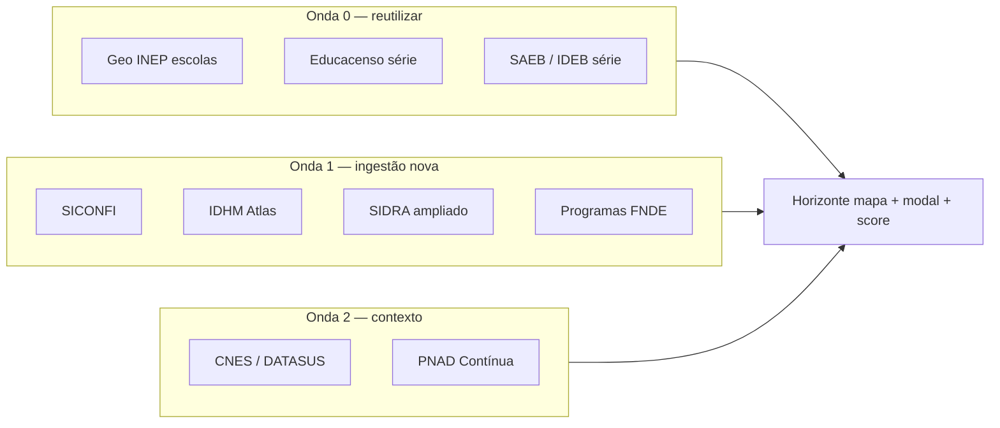

# Horizonte — mapa de oportunidade municipal

**Versão do produto:** 7.0.0 · **Última revisão:** 2026-07-05

**Rota:** `/dashboard/horizonte` (`dashboard.horizonte`)  
**Menu:** Consultoria → **Horizonte** (perfil com `canViewHorizonte()`)  
**Relacionado:** [ESTUDO_INTEGRACOES_SETOR_PUBLICO_E_PREVISAO_DEMANDA.md](ESTUDO_INTEGRACOES_SETOR_PUBLICO_E_PREVISAO_DEMANDA.md) · [IMPORTACAO_DADOS_PUBLICOS.md](IMPORTACAO_DADOS_PUBLICOS.md) · [INICIO_DASHBOARD.md](INICIO_DASHBOARD.md)

---

## 1. Objetivo

O **Horizonte** é o módulo de **inteligência territorial** do SERVLITCYS. Responde:

1. Quais municípios **já têm Consultoria** (base i-Educar activa no catálogo)?
2. Quais **ainda não têm** e aparecem nos dados públicos importados?
3. Onde há **déficits educacionais indicativos** (FUNDEB, SAEB, escala Censo)?
4. Quais **regiões (UF)** concentram maior **benefício potencial**?
5. Quais prospectos têm **maior propensão a sucesso** de implementação?

> **Natureza dos indicadores:** scores **indicativos** para priorização comercial e expansão. **Não substituem** o Diagnóstico (`municipality_health`), discrepâncias i-Educar nem publicações oficiais FNDE/MEC.

---

## 2. Público e acesso

| Perfil | Acesso |
|--------|--------|
| Admin | Sim |
| Utilizador da plataforma | Sim |
| Municipal (só «Meu município») | Não (403) |
| Inactivo / convidado | Não (403) |

---

## 3. Fontes de dados

| Camada | Tabela / origem | Uso no Horizonte |
|--------|-----------------|------------------|
| **Catálogo SERVLITCYS** | `cities` | Presença, UF, ligação Consultoria (`is_active` + credenciais BD) |
| **FUNDEB** | `fundeb_municipio_references` | Complementação VAAR/VAAT/VAAF, receita, pressão financeira |
| **Censo INEP** | `inep_censo_municipio_matriculas` | Escala (matrículas municipais); série histórica no modal (prospectos) |
| **SAEB / IDEB** | `saeb_indicator_points` | Déficit pedagógico (LP, MAT) |
| **CadÚnico** | `cadunico_municipio_snapshots` | Demanda social (crianças 0–17, PBF), filtro no mapa, dimensão `social_demand` no score |
| **Demografia IBGE SIDRA** | `municipal_demography_snapshots` | População **total** e 4–17 (Censo 2022, agregado 9514); reimportar com `--phase=sidra_demography --reset` se `populacao_total` estiver vazia |
| **Repasses Tesouro** | `fundeb_municipio_references` (colunas de transferência) | Dependência de transferências federais — dimensão `transfer_dependency`, complementa FUNDEB |
| **IBGE** | API localidades (cache) | Nome, UF, centroide para municípios só com dados públicos |
| **Malha municipal IBGE** | `storage/app/horizonte/geo/municipal-{UF}.json` + `municipal_area_snapshots` | Modo **Contornos** no mapa + área km², coordenadas e distância à capital no modal |

O universo do mapa = **união de IBGE** presentes em qualquer fonte acima ou no catálogo.

> **Roadmap de novas fontes:** §11.2–§11.9 (geo escolas, SICONFI, IDHM, momentum Educacenso, etc.).

---

## 4. Estados no mapa (tiers)

| Tier | Cor | Significado |
|------|-----|-------------|
| `consultoria_active` | Verde | Consultoria activa — base i-Educar OK |
| `catalog_pending` | Laranja | No catálogo, sem base configurada |
| `prospect_high` | Vermelho | Alta propensão (score ≥ limiar alto) |
| `prospect_medium` | Âmbar | Média propensão |
| `prospect_low` | Cinza | Baixa propensão |
| `data_sparse` | Cinza claro | Sem dados públicos importados |

---

## 5. Metodologia de scoring (v2)

Configuração: `config/horizonte.php` · serviço: `HorizonteOpportunityScorer`

### 5.1 Dimensões (prospectos)

| Dimensão | Peso default | Descrição |
|----------|--------------|-----------|
| **Pressão financeira** | 22% | Complementação FUNDEB / receita ou por matrícula vs mediana nacional |
| **Déficit pedagógico** | 18% | SAEB LP/MAT abaixo do percentil 25 da amostra |
| **Demanda social** | 18% | CadÚnico escolar vs Censo, % crianças PBF — pressão social indicativa |
| **Escala** | 12% | log₁₀(matriculas Censo ou pop. 4–17 SIDRA como fallback) |
| **Dependência de transferências** | 10% | Razão repasses Tesouro / receita FUNDEB vs mediana nacional |
| **Prontidão de dados** | 10% | FUNDEB + Censo + SAEB + CadÚnico (+ bónus SIDRA/repasses) |
| **Benefício × escala** | 10% | Interacção escala × pressão financeira |

**Propensão a sucesso** (`success_score`, 0–100): combinação ponderada acima.

**Benefício territorial** (`benefit_score`, 0–100): enfatiza déficit pedagógico + financeiro + escala — usado para **ranking de UF** e «regiões mais afectadas».

### 5.2 Benchmarks

Calculados **na mesma geração do mapa** (amostra actual):

- `saeb_p25` — percentil 25 dos valores SAEB LP/MAT
- `compl_ratio_median` — mediana complementação/receita FUNDEB
- `transfer_ratio_median` — mediana repasses Tesouro / receita FUNDEB

### 5.3 Limites de tier

| Variável | Default |
|----------|---------|
| `HORIZONTE_HIGH_THRESHOLD` | 70 |
| `HORIZONTE_MEDIUM_THRESHOLD` | 40 |

---

## 6. Interface

### 6.1 Mapa

- Base **Leaflet** + OSM; modos **Pontos** (marcadores por tier), **Calor** (pressão FUNDEB) e **Contornos** (polígonos municipais IBGE).
- **Visão nacional:** coroplético IBGE por UF (malha oficial) + marcadores de capitais; hover para KPIs agregados; clique abre o estado.
- **UF extensa** (≥60 municípios, `HORIZONTE_MAP_MESO_THRESHOLD`): vista intermédia por **mesorregião IBGE** — malha colorida (vizinhos com tons distintos); hover para dados; clique abre só municípios da região com overlay de **microrregiões**; botão **«Regiões»** volta ao mapa estadual.
- **Modo Contornos:** polígonos municipais IBGE (qualidade intermediária) dos municípios visíveis no recorte; clique abre a ficha; destaque ao passar o mouse e no município selecionado.
- **Modo Calor:** círculos por pressão FUNDEB com **borda preta** (legibilidade mesmo em baixa pressão); intensidade normalizada no recorte visível.
- **Carregamento UF:** overlay «Carregando UF {sigla}» ao abrir um estado.
- **UF pequena** ou mesorregião seleccionada: detalhe municipal com limite adaptativo (120–400 pontos) — coord. aproximadas ficam na lista.
- **Bases nacionais grandes** (>800 municípios): overview nacional restringe vista inicial (UF prioritária + alta pressão).
- **Buscador** por nome, UF ou código IBGE (sugestões + `flyTo`).
- Filtros comerciais: **camada «Alta pressão FUNDEB»** (default), propensão/benefício mínimos, matrículas, pressão FUNDEB, FUNDEB/Censo/SAEB/CadÚnico, **demanda social mínima**, UF, segmentos «Onde buscar clientes».
- Overlay de carregamento durante fetch JSON e desenho do mapa.
- Tooltip municipal (modal **~48rem**, overlay no `body`): **cabeçalho fixo** (nome, UF, meso/micro/região imediata, IBGE, SAEB LP/MAT, propensão em roda, dados geográficos) + corpo rolável (alertas, pipeline, gráfico Censo §6.9, finanças §6.5, fontes/SGE, dimensões).
- Malha IBGE servida por `GET /dashboard/horizonte/map-geo` (`scope=brazil|meso|micro|municipal`, `HorizonteIbgeMalhaService`, cache em `storage/app/horizonte/geo/`).

### 6.5 Modal municipal — leitura financeira (consultoria)

Modal **centrado** (`x-teleport`), altura limitada (~**88dvh** / **45rem**), **cabeçalho fixo** + **corpo rolável**.

**Cabeçalho:** município · UF · mesorregião · **IBGE** (pílula) · separador · **SAEB** (rótulo em negrito + pílulas LP/MAT por ano) · linha seguinte com pílulas geográficas:

| Pílula | Cor / ícone | Conteúdo |
|--------|-------------|----------|
| **Posição** | Azul (âmbar se `coord_approximate`) · pin | Coordenadas legíveis (`7,505°S · 43,134°W`); botão **copiar** gera decimal (`-7.505000, -43.134000`) para Google Maps |
| **Distância** | Laranja · edifício | km até a capital estadual |
| **Área** | Verde · mapa | km² de `municipal_area_snapshots` (malha IBGE importada) |

· roda de propensão (% + Alta/Média/Baixa).

**Corpo:** alertas VAAT → card municipal (pendências + pipeline) → gráfico Educacenso (§6.9) → **finanças em duas linhas** (ano anterior e ano vigente, cada uma com colunas *Previsto na portaria* | *Pago pelo Tesouro*) → **enriquecimento público** (§6.11) → pílulas Fontes/SGE → dimensões com glossário **Detecta / Indica**.

**Alertas MEC/FNDE (VAAT):** chip no topo do modal com três estados — pendência encontrada (link Siconfi/FNDE), sem pendências na última importação, ou «não verificado» (sync nunca executado). Após `cache:clear` no deploy, o mapa **reidrata** o snapshot `storage/app/horizonte/municipal_alerts_snapshot.json` automaticamente. Comando para primeira importação ou actualização FNDE: `horizonte:sync-municipal-alerts`.

Três leituras **complementares** por exercício (não somar entre blocos nem entre anos):

| Coluna | Fonte | Conteúdo |
|--------|-------|----------|
| **Previsto na portaria** | Portaria FNDE | VAAF, receita vinculada, complementação federal **deste município**, teto total |
| **Pago pelo Tesouro** | Tesouro CKAN | Repasses observados; no ano vigente: YTD, projeção, barra «Recebido do previsto», saldo **A − B** |

**Notas de interpretação (UI):**

- Receita FNDE ≠ repasse CKAN — portaria × pagamento; valores iguais não são duplicidade.
- Quando o CKAN só tem programa **FUNDEB**, total e verbas coincidem — uma linha no tooltip.
- Valores monetários com **centavos**; previsão do ano corrente reutiliza lógica de **Finanças → Tempo Real**.

Serviço: `HorizonteFundebRepasseOutlook` · payload `fundeb_realtime_*` em cada marcador.

### 6.11 Enriquecimento público (finanças, pedagogia, social)

Blocos no modal quando existem snapshots importados (`has_fiscal`, `has_transparency`, `has_saeb`, `has_censo`, `has_cadunico`, `has_pnad`):

| Bloco | Fonte | Indicadores |
|-------|-------|-------------|
| **Finanças e capacidade fiscal** | SICONFI RREO | Despesa educação/receita; % mínimo constitucional; dívida/caixa; restos a pagar; captação própria |
| **Portal da Transparência** | API Portal (opcional) | Convénios MEC/FNDE; empenhos educação/tecnologia; contratos software |
| **Pedagogia e escala** | SAEB + Educacenso | Tendência LP/MAT (3–4 ciclos); dinâmica matrículas; aluno/docente; % integral/profissional; dependência administrativa |
| **Social e demanda** | PNAD + CadÚnico | Escolaridade média; NEET jovem; crianças 0–17 fora da escola (estimativa CadÚnico − Censo) |

Comandos dedicados: §9.2 · dimensões de score: §7 · metodologia UI: `HorizonteMapPresenter::methodologyUi()`.

**Último repasse YTD:** rótulo do último mês com valor em `meta.mensal` ou `imported_at` (`HorizonteFundebTransferTemporal`).

### 6.9 Gráfico de matrículas — prospectos (Censo INEP)

Secção no modal municipal **apenas para municípios sem Consultoria activa** (`consultoria_active === false`). Municípios com base i-Educar configurada no catálogo **não** mostram o gráfico (dados em tempo real ficam no Painel analítico).

| Aspecto | Detalhe |
|---------|---------|
| **Fonte** | `inep_censo_municipio_matriculas` (microdados Educacenso agregados por município/ano) |
| **Carregamento** | Lazy — `GET /dashboard/horizonte/municipality/{ibge}/enrollment-series` ao abrir o modal |
| **Anos** | Últimos **N** anos consecutivos do Educacenso (default **5**), terminando no ano mais recente indexado nacionalmente; lacunas municipais aparecem sem ponto |
| **Linhas** | Total · Regular · EJA · Educação especial · Complementar / integral |
| **Filtro v1 (dependência)** | Três modos no modal: **Total** (todas as redes no território) · **Municipal** (`tp_dependencia = 3`) · **Não municipal** (federal + estadual + privada). Query `?dependencia=total|municipal|nao_municipal` em `enrollment-series`. Gráfico e contadores por etapa seguem o recorte activo. |
| **Contadores por etapa** | Abaixo da legenda do gráfico: totais do ano mais recente indexado — infantil (`qt_mat_inf`), Fundamental I (`qt_mat_fund_ai`), Fundamental II (`qt_mat_fund_af`), ensino médio (`qt_mat_med`), educação profissional (`qt_mat_prof`) |
| **Segmentos** | Colunas `matriculas_regular`, `matriculas_eja`, `matriculas_especial`, `matriculas_complementar` — preenchidas na reindexação Censo; sem elas aparece só **Total** + nota para reimportar |
| **Etapas no BD** | `matriculas_infantil`, `matriculas_fundamental_1`, `matriculas_fundamental_2`, `matriculas_medio`, `matriculas_profissional` — migration `2026_07_02_120000`; requer reimportação Educacenso |
| **Breakdown por dependência** | Para cada segmento/etapa: colunas `*_municipal` e `*_nao_municipal` (migration `2026_07_02_140000`) — alimentam o filtro v1 |
| **Roadmap v2** | Séries comparáveis por dependência INEP individual (federal, estadual, municipal, privada) e modo «comparar com total» no mesmo gráfico |

**Reindexar após deploy** (migration + microdados INEP):

```bash
php artisan migrate --force
php artisan horizonte:sync-educacenso --reset --all   # 135 passos (5 anos × 27 UFs)
# Ou pelo hub: Dados públicos → Horizonte → «Educacenso — reimportação ano × UF»
php artisan horizonte:sync-educacenso --year=2024 --uf=BA
# Alternativa via feed bimestral (mesmo serviço, 1 passo ano×UF por invocação):
php artisan horizonte:fortnightly-feed --phase=educacenso --reset
```

Serviço: `HorizonteMunicipioEnrollmentSeriesService` · importação multi-ano: `HorizonteEducacensoMatriculasSyncService` · UI: `horizonteMap.js` (Chart.js) + `map-tooltip-sge.blade.php`. O gráfico só é desenhado após o canvas ficar visível (evita falhas ao consultar vários municípios em sequência).

### 6.10 Malha municipal e área territorial (IBGE)

Importação **nacional por UF** (27 passos): polígonos municipais para contornos no mapa + área km² em `municipal_area_snapshots`.

| Aspecto | Detalhe |
|---------|---------|
| **Comando** | `php artisan horizonte:import-municipal-geo --all` (nacional) · `--uf=BA` (uma UF) · `--force` (rebuscar malha) |
| **Feed bimestral** | Fase `ibge_municipal_geo` (após `ibge_catalog`); `--skip-ibge-municipal-geo` para ignorar |
| **Integração IBGE** | Com `HORIZONTE_MUNICIPAL_GEO_WITH_IBGE_CATALOG=true`, aquece malha+área da mesma UF do catálogo |
| **Progresso** | Persistido pelos ficheiros `municipal-{UF}.json`; hub `#horizonte-municipal-geo-sync` |
| **API malha** | IBGE v3 `malhas/estados/{id}?intrarregiao=municipio&qualidade=intermediaria` |
| **Área fallback** | IBGE v4 metadados por município quando a geometria não permite cálculo direto |
| **Mapa (modo Contornos)** | `GET /dashboard/horizonte/map-geo?scope=municipal&uf=…` — polígonos dos municípios do recorte; cache invalidado quando `municipal_area_snapshots` muda |

```bash
php artisan migrate   # tabela municipal_area_snapshots
php artisan horizonte:import-municipal-geo --all
php artisan horizonte:fortnightly-feed --phase=ibge_municipal_geo
```

Serviço: `HorizonteIbgeMunicipalGeoImportService` · progresso: `HorizonteIbgeMunicipalGeoImportProgress` · área: `GeoJsonFeatureAreaKm2`.

> **Nota:** «Complementar / integral» aproxima `qt_mat_ativ_comp`, `qt_mat_ativ_comp_esp` e `qt_mat_prof` do Censo — taxonomia distinta do i-Educar.

### 6.6 Painel FUNDEB estadual (recorte UF)

No cabeçalho de decisão, com UF seleccionada, bloco **âmbar** com agregados municipais:

| Indicador | Origem |
|-----------|--------|
| Receita portaria / complementação | Soma `fundeb_municipio_references` na UF |
| Avanço YTD | Soma observado × esperado (`fundeb_realtime_*`) |
| Portaria vigente | Catálogo FNDE + última importação receita/repasses |
| Comparativo nacional | Posição em receita e % realizado vs média BR |

Payload: `uf_fundeb_insights` · serviço `HorizonteUfFundebInsights`.

### 6.7 Mapa — pan, tela inteira e resumo UF

- **Pan** com rato (arrastar) em horizontal e vertical; limites do Brasil alargados; vista manual preservada após arrastar.
- **Tela inteira** no painel do mapa; filtros em dock com transição; navegação **Brasil / Regiões** conforme o nível activo.
- Botão **«Resumo UF»** (toolbar e controlos flutuantes): disponível em vista estadual e mesorregiões; **centra o estado inteiro ou a mesorregião activa** e abre painel compacto com KPIs comerciais + bloco FUNDEB (mesmo estilo do cabeçalho de decisão).

### 6.8 Ajuda in-app

| Entrada | Conteúdo |
|---------|----------|
| **Como usar** | Tour guiado (7 passos) — KPIs, recorte, mapa, filtros, rail, área de trabalho |
| **Demonstração** | Animação SVG do fluxo Brasil → mesorregiões → municípios → filtros → ficha |
| **Documentação** | Ligação a este ficheiro (`docs/HORIZONTE.md`) |
| **Metodologia** (aba) | Fórmulas, tiers, dimensões com **Detecta / Indica**, discrepâncias i-Educar |

Textos partilhados via `HorizonteMapPresenter::methodologyUi()` — passos «Como usar» também na aba **Resumo** da área de trabalho.

### 6.2 Painéis laterais

| Painel | Conteúdo |
|--------|----------|
| **Sistemas de gestão (SGE)** | Identificados, consultoria i-Educar, registo externo, não identificados |
| **Cobertura de dados** | Contagem FUNDEB / Censo / SAEB / CadÚnico / SIDRA / repasses / triad completa |
| **UFs prioritárias** | Top 12 UFs por volume de **alta pressão** + clique abre UF filtrada |
| **Top prospectos** | Melhores scores nacionais (clicáveis no mapa) |

### 6.3 KPIs e prospecção

| Área | Conteúdo |
|--------|----------|
| **KPIs** | **Alta pressão** · dados públicos · prospectos · alta propensão · consultoria · matrículas prospecto |
| **Segmentos** | Prontos para abordagem · pressão FUNDEB · déficit SAEB · grande escala · **demanda social** |
| **Tabela** | Até 50 municípios do recorte, ordenados para abordagem comercial (inclui coluna SGE) |

---

## 6.4 Sistemas de gestão educacional (SGE)

O Horizonte tenta identificar o **SGE** de cada município por duas fontes (em ordem de prioridade):

1. **Catálogo ServLITCYS** (`cities`) — i-Educar com estados: consultoria activa, base configurada ou pendente.
2. **Registo externo opcional** — JSON local ou URL remota (não bloqueia o mapa se ausente ou inválido).

Quando nenhuma fonte identifica o sistema, o município aparece como **SGE não identificado** (`N/I` na tabela); o restante do payload (FUNDEB, Censo, SAEB, scores) continua disponível.

### Formato do registo externo

Ficheiro default: `storage/app/horizonte/sge_registry.json` (configurável via `HORIZONTE_SGE_REGISTRY_PATH`).

```json
{
  "3550308": {
    "system": "GDAE",
    "vendor": "SME-SP",
    "notes": "Portal municipal de gestão escolar",
    "app_url": "https://portal.exemplo.sp.gov.br"
  },
  "municipios": [
    {
      "ibge": "2910800",
      "system": "SIGE",
      "fornecedor": "Secretaria municipal"
    }
  ]
}
```

Chaves aceites por entrada: `system`/`sistema`, `vendor`/`fornecedor`, `notes`/`notas`, `app_url`/`url`, `ibge`/`ibge_municipio`.

A fase **SGE** do feed bimestral (`horizonte:fortnightly-feed`) sincroniza o registo para cache; falhas são registadas em log e **não impedem** as restantes fases nem o uso do mapa.

```bash
php artisan horizonte:fortnightly-feed --skip-sge   # ignorar registo SGE
```

## 7. Arquitectura técnica

```
HorizonteController
  ├── HorizonteMapService::build()   [cache AdminHomeMapCache]
  └── enrollmentSeries(ibge)         [lazy — HorizonteMunicipioEnrollmentSeriesService]
        ├── citiesByIbge()
        ├── fundebByIbge / censoByIbge / saebByIbge
        ├── IbgeMunicipalityCatalog (nome + coordenadas)
        ├── HorizonteMunicipalSgeResolver + HorizonteMunicipalSgeRegistryService (cache)
        ├── HorizonteMunicipalAlertsResolver (alertas VAAT em cache)
        └── HorizonteOpportunityScorer
```

| Ficheiro | Função |
|----------|--------|
| `app/Http/Controllers/HorizonteController.php` | Entrada HTTP + malha `map-geo` + série matrículas |
| `app/Services/Horizonte/HorizonteMunicipioEnrollmentSeriesService.php` | Série Censo (prospectos) |
| `app/Services/Horizonte/HorizonteMapService.php` | Agregação e cache |
| `app/Services/Horizonte/HorizonteIbgeMalhaService.php` | Malha UF/meso/micro/municipal IBGE (coroplético + contornos) |
| `app/Services/Horizonte/HorizonteIbgeMunicipalGeoImportService.php` | Importação malha municipal + área km² |
| `app/Console/Commands/HorizonteImportMunicipalGeoCommand.php` | CLI `horizonte:import-municipal-geo` |
| `app/Services/Horizonte/HorizonteMunicipalAlertsSyncService.php` | Importação alertas MEC/FNDE VAAT |
| `app/Services/Horizonte/HorizonteOpportunityScorer.php` | Scores |
| `app/Support/Horizonte/HorizonteMapPresenter.php` | Cores, legenda, metodologia UI |
| `app/Support/Horizonte/HorizonteGuideDemo.php` | Pontos fictícios da demonstração animada |
| `app/Support/Brazil/IbgeMunicipalityCatalog.php` | Metadados IBGE |
| `app/Support/Horizonte/HorizonteMunicipalSgeResolver.php` | SGE por IBGE (catálogo + registo) |
| `app/Services/Horizonte/HorizonteMunicipalSgeRegistryService.php` | Import JSON/URL do registo SGE |
| `resources/js/horizonteMap.js` | Mapa Alpine + busca + tour |
| `resources/views/horizonte/index.blade.php` | UI |
| `app/Services/Horizonte/HorizonteFortnightlyFeedService.php` | Rotina bimestral de dados públicos |
| `app/Console/Commands/HorizonteFortnightlyFeedCommand.php` | CLI `horizonte:fortnightly-feed` |
| `app/Console/Commands/HorizonteSyncMunicipalAlertsCommand.php` | CLI `horizonte:sync-municipal-alerts` |

---

## 8. Variáveis de ambiente

| Variável | Default | Descrição |
|----------|---------|-----------|
| `HORIZONTE_ENABLED` | `true` | Activa o módulo |
| `HORIZONTE_CACHE_SECONDS` | `900` | TTL cache do payload |
| `HORIZONTE_REFERENCE_YEAR` | ano−1 | Exercício FUNDEB/Censo/SAEB |
| `HORIZONTE_HIGH_THRESHOLD` | `70` | Limiar alta propensão |
| `HORIZONTE_MEDIUM_THRESHOLD` | `40` | Limiar média propensão |
| `HORIZONTE_FORTNIGHTLY_FUNDEB_ALLOW_EMPTY` | `true` | Feed continua se FUNDEB vier vazio |
| `HORIZONTE_SGE_ENABLED` | `true` | Activa fase SGE no feed |
| `HORIZONTE_SGE_REGISTRY_PATH` | `horizonte/sge_registry.json` | JSON local IBGE→SGE |
| `HORIZONTE_SGE_REGISTRY_URL` | — | URL remota alternativa (opcional) |
| `HORIZONTE_SGE_REGISTRY_HTTP_TIMEOUT` | `15` | Timeout HTTP do registo remoto |
| `HORIZONTE_SGE_REGISTRY_CACHE_TTL` | `604800` | TTL cache do índice SGE (s) |
| `HORIZONTE_SIDRA_ENABLED` | `true` | Activa ingestão SIDRA pop. 4–17 no feed |
| `HORIZONTE_SIDRA_AGREGADO` | `9514` | Agregado IBGE SIDRA (Censo 2022) |
| `HORIZONTE_SIDRA_PERIODO` | `2022` | Período SIDRA |
| `HORIZONTE_SIDRA_UFS_PER_STEP` | `1` | UFs por passo na fase SIDRA |
| `HORIZONTE_CADUNICO_FILL_GAPS` | `false` | CadÚnico: preencher lacunas via API SAGI no feed |
| `HORIZONTE_MAP_HEAVY_THRESHOLD` | `800` | Acima disto, vista inicial restringe UF + prospectos |
| `HORIZONTE_MAP_MAX_RENDER` | `400` | Máximo de pontos desenhados no mapa por defeito |
| `HORIZONTE_MAP_MESO_THRESHOLD` | `60` | UF com ≥ N municípios abre vista mesorregião |
| `HORIZONTE_MUNICIPAL_ALERTS_ENABLED` | `true` | Alertas MEC/FNDE no modal |
| `HORIZONTE_ENROLLMENT_SERIES_YEARS` | `5` | Anos no gráfico de matrículas do modal (prospectos) |
| `HORIZONTE_EDUCACENSO_ENABLED` | `true` | Fase Educacenso no feed bimestral |
| `HORIZONTE_EDUCACENSO_FETCH_IF_MISSING` | `true` | Download ZIP INEP por ano se CSV local ausente |
| `HORIZONTE_EDUCACENSO_SKIP_IF_MISSING` | `true` | Não bloqueia o pipeline se um ano falhar |
| `HORIZONTE_EDUCACENSO_YEARS_PER_STEP` | `1` | Legado — preferir `HORIZONTE_EDUCACENSO_STEPS_PER_STEP` |
| `HORIZONTE_EDUCACENSO_STEPS_PER_STEP` | `1` | Passos **ano × UF** Educacenso por invocação (hub ou CLI) |
| `HORIZONTE_EDUCACENSO_MEMORY_LIMIT` | `1024M` | RAM da fase Educacenso |
| `HORIZONTE_FNDE_VAAT_INABILITADOS_CSV_URL` | CSV FNDE oficial | Fonte VAAT inabilitados (ver §9.1c) |

Variáveis completas: [VARIAVEIS_AMBIENTE.md](VARIAVEIS_AMBIENTE.md) §11b.

---

## 9. Operacionalização

### 9.1 Rotina bimestral (abastecimento automático)

Comando: **`horizonte:fortnightly-feed`** · agendamento: **bimestral** — dia **1** às **03:00** nos meses **1, 3, 5, 7, 9, 11** (início do ciclo) + **passos a cada N minutos** enquanto o pipeline estiver activo.

Por defeito corre **em etapas** (`HORIZONTE_FORTNIGHTLY_FEED_STAGED=true`): cada invocação executa **uma fase**, libertando memória entre processos. Admins recebem **notificação por fase** e ao concluir o ciclo. Estado visível em **Filas** (`#fila-horizonte`) e no hub Horizonte.

| Fase | O que faz |
|------|-----------|
| **FUNDEB** | CSV nacional «Receita total do Fundeb por ente federado» (FNDE) → `fundeb_municipio_references` por IBGE |
| **Censo** | Indexa matrículas municipais a partir do microdados INEP mais recente (`inep_censo_municipio_matriculas`), incluindo segmentos |
| **Educacenso** | Importa a janela do gráfico (§6.9) **ano × UF** — **1 passo por invocação** por defeito (`HORIZONTE_EDUCACENSO_STEPS_PER_STEP=1`); comando dedicado `horizonte:sync-educacenso` |
| **CadÚnico** | Sincroniza snapshots municipais (`cadunico_municipio_snapshots`) — criancas escolares e PBF |
| **SIDRA** | População **total** e 4–17 por município (API agregado 9514) → `municipal_demography_snapshots` — **1 UF por passo** |
| **Repasses Tesouro** | Transferências federais (CKAN Tesouro / FUNDEB) → enriquece `fundeb_municipio_references` |
| **SICONFI** | Indicadores fiscais municipais (RREO Anexos 01/02/06/14) → `municipal_fiscal_snapshots` — **N municípios por passo** |
| **Transparência** | Convénios e empenhos Portal da Transparência → `municipal_transparency_snapshots` (requer API key) |
| **SAEB** | Planilhas oficiais INEP — **1 ano por passo** por defeito (`HORIZONTE_FORTNIGHTLY_SAEB_YEARS_PER_STEP=1`) |
| **IBGE** | Aquece catálogo de centroides (**1 UF por invocação** por defeito — `HORIZONTE_FORTNIGHTLY_IBGE_UFS_PER_STEP=1`) |
| **IBGE malha** | Malha municipal + área km² (**1 UF por passo** — `HORIZONTE_MUNICIPAL_GEO_UFS_PER_STEP=1`; comando `horizonte:import-municipal-geo --all`) |
| **SGE** | Sincroniza registo opcional de sistemas de gestão educacional (JSON local ou URL) — **não bloqueia** se ausente |
| **Verificação** | `public-data:check-official --no-notify` (cache no hub, sem notificação) |

```bash
# Manual — etapas (recomendado em produção)
php artisan horizonte:fortnightly-feed --staged --reset
php artisan horizonte:fortnightly-feed --staged --continue
php artisan horizonte:fortnightly-feed --phase=fundeb_receita
php artisan horizonte:fortnightly-feed --phase=censo_matriculas
php artisan horizonte:fortnightly-feed --phase=educacenso
php artisan horizonte:fortnightly-feed --phase=educacenso --reset
php artisan horizonte:fortnightly-feed --phase=cadunico_sync
php artisan horizonte:fortnightly-feed --phase=sidra_demography
php artisan horizonte:fortnightly-feed --phase=sidra_demography --reset
php artisan horizonte:fortnightly-feed --phase=repasses_tesouro
php artisan horizonte:fortnightly-feed --phase=siconfi_sync
php artisan horizonte:fortnightly-feed --phase=transparency_sync
php artisan horizonte:fortnightly-feed --phase=saeb_planilhas
php artisan horizonte:fortnightly-feed --phase=saeb_planilhas --reset
php artisan horizonte:fortnightly-feed --phase=ibge_catalog
php artisan horizonte:fortnightly-feed --phase=ibge_catalog --reset
php artisan horizonte:fortnightly-feed --phase=ibge_catalog --uf=SP
php artisan horizonte:fortnightly-feed --phase=ibge_municipal_geo
php artisan horizonte:fortnightly-feed --phase=ibge_municipal_geo --reset
php artisan horizonte:import-municipal-geo --all

# Manual — tudo numa invocação (verbose activo; retomar se interrompido)
php artisan horizonte:fortnightly-feed --all
php artisan horizonte:fortnightly-feed --all --continue
php artisan horizonte:fortnightly-feed --all --reset

php artisan horizonte:fortnightly-feed --dry-run
php artisan horizonte:fortnightly-feed --skip-saeb --skip-censo --skip-educacenso --skip-cadunico --skip-sidra --skip-repasses --skip-sge

# Fases incrementais (Educacenso / SAEB / IBGE / SIDRA) — repetir --phase até concluir; --reset recomeça o lote
php artisan horizonte:fortnightly-feed --phase=educacenso
php artisan horizonte:fortnightly-feed --phase=saeb_planilhas
php artisan horizonte:fortnightly-feed --phase=ibge_catalog

# Pipeline staged completo (alternativa ao --phase isolado)
php artisan horizonte:fortnightly-feed --staged --reset --skip-fundeb --skip-censo --skip-saeb --skip-verify
php artisan horizonte:fortnightly-feed --staged --continue   # até concluir IBGE, depois SGE

# Uma UF manualmente

# Confirmar agendamento
php artisan schedule:list | grep horizonte
```

Variáveis: `HORIZONTE_FORTNIGHTLY_FEED_*` — ver [VARIAVEIS_AMBIENTE.md](VARIAVEIS_AMBIENTE.md) §11b.

**Auditoria pós-importação** (amostra de municípios com todos os anos da janela):

```bash
php artisan horizonte:verify-educacenso-coverage --sample=50
```

### 9.1b Loop nacional até concluir (screen)

Para completar **todas** as fases/UFs/anos pendentes em loop (até 200 rondas), use **GNU screen** — a sessão continua após fechar SSH:

```bash
cd /caminho/do/servlitcys

# Uma vez por utilizador (evita systemd matar processos ao logout SSH):
sudo loginctl enable-linger serventec   # ou $(whoami)

# Iniciar (detached — pode fechar o terminal de imediato)
./scripts/horizonte-sync-br-screen.sh start

# Se cair após logout SSH ou TERM acidental:
./scripts/horizonte-sync-br-screen.sh ensure

# Cron (reinício automático a cada 5 min se wanted activo):
# */5 * * * * cd /caminho/servlitcys && ./scripts/horizonte-sync-br-screen.sh ensure >> storage/logs/horizonte-sync-br-ensure.log 2>&1

# Rever progresso (desanexar: Ctrl+A, depois D — NÃO feche o SSH estando attached)
./scripts/horizonte-sync-br-screen.sh attach

# Estado
./scripts/horizonte-sync-br-screen.sh status

# Parar
./scripts/horizonte-sync-br-screen.sh stop

# Reiniciar se caiu (wanted activo, screen morto)
./scripts/horizonte-sync-br-screen.sh ensure

# Log agregado
tail -f storage/logs/horizonte-sync-br-nohup.log
```

O script `horizonte-sync-br-continue.sh` executa `horizonte:fortnightly-feed --all --continue` em loop e reconhece pendências de **Educacenso**, SAEB e IBGE. A fase Educacenso indexa **um ano por passo** por defeito (`HORIZONTE_EDUCACENSO_YEARS_PER_STEP=1`) e pode demorar várias horas na primeira carga.

**Importante:**

- Corra **sempre como o mesmo utilizador** (não use `sudo` no `start` — senão o `status` noutro user mostra «não activo»).
- Use `start` e saia do SSH **sem** `attach`, ou desanexe com **Ctrl+A, D** antes de fechar o terminal.
- Se ao logout o sync morrer: `loginctl enable-linger $(whoami)` (requer sudo, uma vez).
- Sockets screen ficam em `storage/screen/` (por defeito).

O script interno `horizonte-sync-br-continue.sh` usa **flock** (uma instância), detecta OOM/parcial e exporta `HORIZONTE_SAEB_MEMORY_LIMIT=2048M` por defeito. **Não** corra em paralelo com `php artisan horizonte:fortnightly-feed` manual.

**Hub admin:** `/admin/dados-publicos?hub=horizonte` · painéis `#horizonte-hub`, `#horizonte-educacenso-sync`, `#horizonte-municipal-geo-sync` — cobertura nacional (FUNDEB, Censo, SAEB, CadÚnico, SIDRA, repasses, **malha IBGE**), botão «Abastecer Horizonte» com skips por fase, **export/import de pacote offline v2** e ligações a cada fonte. Ver [IMPORTACAO_DADOS_PUBLICOS.md](IMPORTACAO_DADOS_PUBLICOS.md) §11.

O cache do mapa invalida-se automaticamente quando `imported_at` / contagens nas tabelas fonte mudam (fingerprint em `HorizonteMapService`).

### 9.1c Alertas MEC/FNDE (VAAT inabilitados)

Comando: **`horizonte:sync-municipal-alerts`** — importa lista oficial FNDE de municípios **inabilitados ao VAAT** (CSV primário; PDF fallback) + registo JSON manual opcional. Grava cache Laravel e snapshot em `storage/app/horizonte/municipal_alerts_snapshot.json`; após `php artisan cache:clear`, o mapa repõe o cache a partir desse ficheiro.

```bash
php artisan horizonte:sync-municipal-alerts
php artisan horizonte:sync-municipal-alerts --dry-run
php artisan horizonte:sync-municipal-alerts --uf=BA
php artisan horizonte:sync-municipal-alerts --skip-fnde   # só registo JSON local
php artisan horizonte:sync-municipal-alerts --reset
```

Variáveis: `HORIZONTE_FNDE_VAAT_INABILITADOS_CSV_URL`, `HORIZONTE_MUNICIPAL_ALERTS_PATH` — ver [VARIAVEIS_AMBIENTE.md](VARIAVEIS_AMBIENTE.md) §11b.

### 9.1d SICONFI — capacidade fiscal municipal

Comando: **`horizonte:sync-siconfi`** — importa RREO via API Tesouro (`municipal_fiscal_snapshots`). Processa **lotes incrementais** (municípios pendentes no ano de referência). Rotina **semestral** (jan/jul) via agendador Laravel; manualmente use `--reset --continue` para iniciar cobertura nacional e `--continue` para retomar.

```bash
php artisan horizonte:sync-siconfi --limit=8
php artisan horizonte:sync-siconfi --uf=BA --limit=20
php artisan horizonte:sync-siconfi --year=2024 --period=6
php artisan horizonte:sync-siconfi --reset --continue    # inicia ciclo nacional
php artisan horizonte:sync-siconfi --continue              # retoma lote pendente
php artisan horizonte:sync-siconfi --refresh --limit=20    # actualiza período RREO inferior
php artisan horizonte:sync-siconfi --ibge=2927408 --dry-run
php artisan horizonte:fortnightly-feed --phase=siconfi_sync
php artisan horizonte:fortnightly-feed --skip-siconfi   # ignorar no feed
```

Variáveis: `HORIZONTE_SICONFI_*`, `HORIZONTE_SICONFI_SCHEDULE_*` — ver [VARIAVEIS_AMBIENTE.md](VARIAVEIS_AMBIENTE.md) §11b.

### 9.1e Portal da Transparência — convénios e empenhos

Comando: **`horizonte:sync-transparency`** — convénios MEC/FNDE, empenhos educação/tecnologia e proxy de contratos software (`municipal_transparency_snapshots`). **Requer** `PORTAL_TRANSPARENCIA_API_KEY` no `.env`.

```bash
php artisan horizonte:sync-transparency --limit=5
php artisan horizonte:sync-transparency --uf=SP --limit=10
php artisan horizonte:fortnightly-feed --phase=transparency_sync
php artisan horizonte:fortnightly-feed --skip-transparency
```

### 9.2 Uso comercial (gestores)

1. **Enriquecer dados:** garantir rotina **bimestral** activa + importações pontuais em Dados públicos; correr **`horizonte:sync-municipal-alerts`**, **`horizonte:sync-siconfi`** e **`horizonte:sync-transparency`** (com API key) após deploy ou quando houver novas listas/fontes.
2. **Actualizar mapa:** abrir `/dashboard/horizonte` — shell rápido + JSON assíncrono; use **Como usar** / **Demonstração** no topo para onboarding da equipa.
3. **Priorizar expansão:** modo **Calor**, segmentos «Onde buscar clientes», filtros de propensão/FUNDEB/Censo/SAEB; em UFs extensas, navegue por **mesorregião** antes do detalhe municipal.
4. **Onboarding:** criar cidade no catálogo → configurar conexão → tier passa a `catalog_pending` → `consultoria_active`.

### 9.3 Abastecimento offline (local → produção, sem git)

Quando o feed em produção morre com `Killed` (OOM), processe os dados **localmente** (máquina com RAM e acesso às APIs) e transfira um pacote ZIP **v2**:

```bash
# Local — gerar dados completos (feed ou importações no hub)
php artisan horizonte:fortnightly-feed --all
# ou fases individuais com RAM suficiente

# Exportar pacote (CLI ou hub admin — secções seleccionáveis)
php artisan horizonte:export-data-bundle
# Ficheiro: storage/app/horizonte/bundles/horizonte-YYYYMMDD-HHMMSS.zip
# Cópia: storage/app/horizonte/bundles/latest.zip

# Enviar para produção (exemplo)
scp storage/app/horizonte/bundles/latest.zip user@servidor:/var/www/servlitcys/storage/app/horizonte/bundles/

# Produção — importar (sem git)
php artisan horizonte:import-data-bundle storage/app/horizonte/bundles/latest.zip
php artisan horizonte:import-data-bundle storage/app/horizonte/bundles/latest.zip --dry-run
php artisan horizonte:import-data-bundle storage/app/horizonte/bundles/latest.zip --only=fundeb,censo,cadunico,demography,transfers
```

O pacote v2 inclui: `fundeb_municipio_references`, `inep_censo_municipio_matriculas`, `saeb_indicator_points` (municipal), **`cadunico_municipio_snapshots`**, **`municipal_demography_snapshots`**, repasses Tesouro, cache IBGE (centroides) e registo SGE. No hub admin, use os checkboxes de secção para export/import parcial.

---

## 10. Impacto por sistema (interpretação)

| Sistema | O que o Horizonte mede | O que **não** mede |
|---------|------------------------|---------------------|
| **Dados oficiais** | Déficits proxy (FUNDEB, SAEB, Censo) | Repasse legal definitivo, IDEB oficial INEP em tempo real |
| **i-Educar** | Só indirectamente (Consultoria activa) | Qualidade cadastro, Censo, NEE |
| **SERVLITCYS** | Propensão/benefício estimado | `compliance_score` real — ver Consultoria |

Após activar Consultoria, use **Painel analítico → Diagnóstico** para indicadores de qualidade reais (0–100).

---

## 11. Roadmap

### 11.1 Linha do tempo (produto)

| Fase | Melhoria | Estado |
|------|----------|--------|
| **v1** | Mapa IBGE conhecidos + scores + busca + rankings UF/prospectos | Concluído |
| **v1.1** | Importação nacional por UF (job batch) sem cadastrar cidade | Concluído |
| **v1.2** | Coroplético IBGE UF + mesorregiões + export CSV prospectos | Concluído |
| **v2 (parcial)** | CadÚnico + demanda social · SIDRA pop. 4–17 · repasses Tesouro · bundle offline v2 · alertas VAAT · malha municipal · Educacenso modal | Concluído |
| **v2.1** | Versão mão (detecção automática + alternância manual) | Concluído |
| **v2.2** | Enriquecimento por bases públicas (§11.2–§11.6) | Planeado |
| **v3** | Comparativo antes/depois para clientes (`delta compliance_score`) | Planeado |

Itens rastreáveis: secção **J** em [BACKLOG_IMPLEMENTACOES.md](BACKLOG_IMPLEMENTACOES.md) (`HOR-*`). Estudo transversal: [ESTUDO_INTEGRACOES_SETOR_PUBLICO_E_PREVISAO_DEMANDA.md](ESTUDO_INTEGRACOES_SETOR_PUBLICO_E_PREVISAO_DEMANDA.md).

---

### 11.2 Enriquecimento por bases públicas — visão geral

O Horizonte consome hoje o **triângulo FUNDEB–Censo–SAEB**, complementado por CadÚnico, SIDRA (população), repasses Tesouro, malha IBGE e alertas VAAT. O roadmap abaixo organiza **novas fontes públicas** por:

| Eixo | Objectivo |
|------|-----------|
| **Mapa** | Camadas visuais, coropléticos e densidade territorial |
| **Ficha municipal** | Campos no modal (finanças, pedagogia, social, compliance) |
| **Decisão comercial** | Novas dimensões de score, filtros e segmentos «Onde buscar clientes» |

**Princípios** (alinhados ao [estudo de integrações](ESTUDO_INTEGRACOES_SETOR_PUBLICO_E_PREVISAO_DEMANDA.md) §2):

1. Agregado por **IBGE 7 dígitos** — sem CPF/NIS em massa.
2. Ingestão via **feed bimestral** ou hub Dados públicos — nunca consulta pesada no clique.
3. Indicadores **indicativos** para priorização comercial; repasses oficiais continuam FNDE/Tesouro/Simec.
4. Reutilizar pipelines **Onda 0** já existentes no SERVLITCYS antes de abrir fontes novas.



---

### 11.3 Prioridade 1 — quick wins (Onda 0)

Fontes **já importáveis** no hub `/admin/dados-publicos`; falta expor no Horizonte.

| ID | Fonte | Mapa | Ficha | Decisão | Entrega |
|----|-------|------|-------|---------|---------|
| **HOR-01** | **Geo INEP escolas** (`school_unit_geos`) | Camada de pontos/cluster ao abrir UF ou município; heatmap densidade rede | Contagem escolas mapeadas vs matrículas Censo | Segmento «fragmentação de rede»; filtro municípios com muitas unidades pequenas | v2.2a |
| **HOR-02** | **Educacenso — momentum** (série já no modal §6.9) | Cor opcional por Δ matrículas 5 anos | Chip «tendência» (↑ estável ↓) no cabeçalho do modal | Dimensão `enrollment_momentum` no scorer; segmento «mercado em retração» | v2.2a |
| **HOR-03** | **SAEB / IDEB — série histórica** (`saeb_indicator_points`) | — | Gráfico ou sparkline LP/MAT (últimos 3–4 ciclos) | Dimensão `learning_trajectory` (tendência, não só nível) | v2.2a |

**Critério de prioridade:** alto impacto comercial, **zero API nova** — derivar do que o feed bimestral já indexa.

---

### 11.4 Prioridade 2 — mapa e ficha municipal (Onda 1)

| ID | Fonte | Ingestão | Mapa | Ficha | Decisão | Entrega |
|----|-------|----------|------|-------|---------|---------|
| **HOR-04** | **SICONFI** (API Contas Tesouro) | API REST por ente IBGE + exercício · ver INT-06 | — | Despesa educação/receita, endividamento, liquidez, restos a pagar | Dimensão `fiscal_capacity`; filtro «capacidade fiscal mínima» | v2.2b |
| **HOR-05** | **IDHM** (Atlas IPEA/PNUD) | CSV/API quinquenal por município | Coroplético «IDHM educação» (modo Contornos ou UF) | Pílula IDHM educação + ranking na UF | Refina `social_demand` e narrativa socioeconómica | v2.2b |
| **HOR-06** | **IBGE SIDRA ampliado** | API agregados (urbanização, migração, domicílios c/ crianças) · base INT-05 parcial | Choropleth «pressão demográfica» | População 0–14, taxa urbanização, saldo migratório | Dimensão `demographic_pressure`; segmento «crescimento populacional» | v2.2c |
| **HOR-07** | **Programas FNDE** (PDDE, PNAE, PNATE) | CKAN FNDE / CSV repasses programáticos | Intensidade por município (opcional) | Volume histórico por programa | Segmento «dependência de programas»; risco prestação de contas | v2.2c |
| **HOR-08** | **Portal da Transparência** | API REST (`PORTAL_TRANSPARENCIA_API_KEY`) | — | Convénios MEC/FNDE activos; empenhos tech/educação | Proxy «SGE/incumbent» + projecto em curso | v2.2c |

**Persistência sugerida:** `municipal_fiscal_snapshots`, `municipal_idhm_snapshots`, extensão de `municipal_demography_snapshots`, `municipal_program_snapshots` — incluir no bundle offline v3 quando existir.

---

### 11.5 Prioridade 3 — decisão comercial e scoring v3 (Onda 1–2)

Novas **dimensões** candidatas (pesos a calibrar em `config/horizonte.php` após dados disponíveis):

| Dimensão | Fontes | Detecta | Indica |
|----------|--------|---------|--------|
| `enrollment_momentum` | Educacenso | Queda ou alta de matrículas 5 anos | Urgência de modernização vs mercado maduro |
| `learning_trajectory` | SAEB série | IDEB estável / em queda / em recuperação | Argumento pedagógico na abordagem |
| `fiscal_capacity` | SICONFI | Endividamento, % educação, liquidez | Viabilidade de contrato e prazo de ROI |
| `inclusion_gap` | CadÚnico × Censo | Crianças vulneráveis vs cobertura municipal | Prioridade inclusão / PBF |
| `network_fragmentation` | Geo INEP + Censo | Muitas escolas pequenas / km² | Dor de gestão — fit i-Educar |
| `demographic_pressure` | SIDRA migração | Crescimento 0–14 vs oferta | Expansão futura de matrículas |
| `program_dependency` | FNDE programas | Alto PDDE/PNAE sem VAAR OK | Risco operacional / oportunidade consultoria |
| `regional_cluster` | Catálogo `cities` | Consultorias activas em corredor geográfico | Planeamento de visitas comerciais |

**Segmentos «Onde buscar clientes»** previstos: mercado em retração · alta fragmentação · capacidade fiscal · tendência IDEB negativa · corredor regional.

**Scoring v3:** rebalancear pesos actuais (§5.1) após calibragem com amostra nacional; manter benchmarks dinâmicos (`saeb_p25`, medianas FUNDEB/transferências).

| ID | Entrega |
|----|---------|
| **HOR-11** | Novos segmentos + filtros mapa (depende HOR-01–04) |
| **HOR-12** | Visual «corredor regional» — consultorias activas + prospectos adjacentes |
| **HOR-13** | Comparativo antes/depois `compliance_score` (clientes com Consultoria activa) — **v3** |

---

### 11.6 Contexto territorial e saúde (Onda 2 — opcional)

| ID | Fonte | Mapa | Ficha | Notas |
|----|-------|------|-------|-------|
| **HOR-09** | **CNES** (DATASUS) | Camada UBS/UPA; distância média escola–UBS | Equipamentos saúde no município | Ver INT-08; agregado público |
| **HOR-10** | **PNAD Contínua** (IBGE) | — | Escolaridade média, NEET jovem | Argumento EJA; CSV/API municipal |

---

### 11.7 Fora de âmbito (Onda 3 ou não aplicável)

| Fonte | Motivo |
|-------|--------|
| CadÚnico Serviços (CPF/NIS individual) | LGPD; credencial Conecta gov.br |
| e-SUS APS / RNDS clínico | Credencial SMS; sem API municipal simples |
| SIAFI, CADIN | Não aplicável ao recorte municipal comercial |
| Scraping massivo Simec | Instável; preferir listas FNDE + alertas pontuais (VAAT já implementado) |
| Dados eleitorais automatizados | Baixo valor / alto ruído para score comercial |

---

### 11.8 Ordem de implementação recomendada

| Ordem | IDs | Esforço | Impacto | Dependências |
|-------|-----|---------|---------|--------------|
| 1 | HOR-01 | Baixo | Alto (visual) | `school_unit_geos` + endpoint mapa regional |
| 2 | HOR-02, HOR-03 | Baixo | Alto (decisão) | Série Educacenso/SAEB já indexada |
| 3 | HOR-04 | Médio | Alto (fecho comercial) | INT-06 · API SICONFI |
| 4 | HOR-11, HOR-12 | Médio | Médio | HOR-01–04 |
| 5 | HOR-05, HOR-06 | Médio | Médio | INT-05 ampliado |
| 6 | HOR-07, HOR-08 | Médio–alto | Médio | CKAN FNDE · API Transparência |
| 7 | HOR-09, HOR-10 | Alto | Baixo–médio | Onda 2 |
| 8 | HOR-13 | Médio | Alto (retention) | Consultoria activa + histórico compliance |

---

### 11.9 Rastreabilidade com o backlog global

| ID Horizonte | ID transversal | Documento |
|--------------|----------------|-----------|
| HOR-04 | INT-06 | SICONFI |
| HOR-06 | INT-05 | SIDRA demografia |
| HOR-07 | — | Programas FNDE (catálogo `PublicDataSourcesCatalog`) |
| HOR-08 | — | [CONSULTAS_EXTERNAS.md](CONSULTAS_EXTERNAS.md) § Portal Transparência |
| HOR-09 | INT-08 | DATASUS / CNES |
| HOR-01 | — | [IMPORTACAO_DADOS_PUBLICOS.md](IMPORTACAO_DADOS_PUBLICOS.md) · `geo_inep` |

Ao concluir cada item: mover para **G** em [BACKLOG_IMPLEMENTACOES.md](BACKLOG_IMPLEMENTACOES.md) e actualizar [STATUS_PROJETO.md](STATUS_PROJETO.md).

---


## 12. Testes

```bash
php artisan test --filter=Horizonte
```

Cobertura: `HorizonteOpportunityScorerTest`, `HorizonteSocialDemandScorerTest`, `HorizonteFortnightlyFeedPipelineTest`, `HorizonteDataBundleServiceTest`, `HorizonteMunicipioEnrollmentSeriesServiceTest`, `GeoJsonFeatureAreaKm2Test`, `HorizonteIbgeMunicipalGeoImportProgressTest`.

---

*Última revisão: 2026-07-05 · Módulo Horizonte v6.5 — roadmap enriquecimento bases públicas (§11.2–§11.9)*
