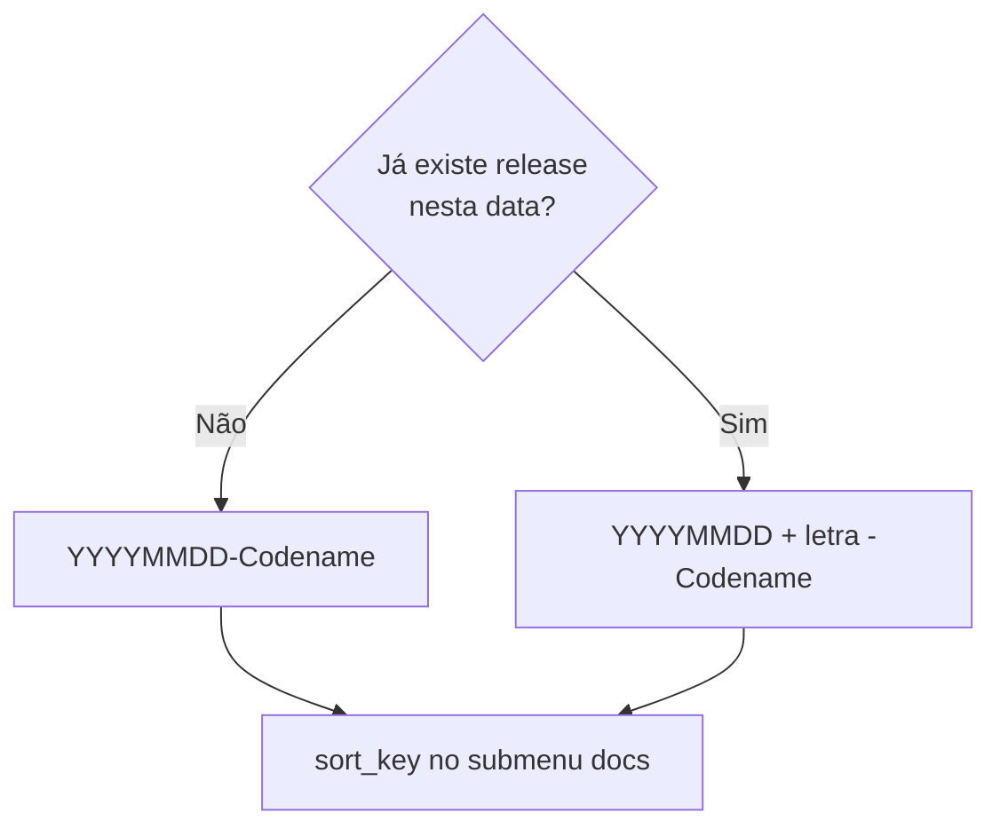
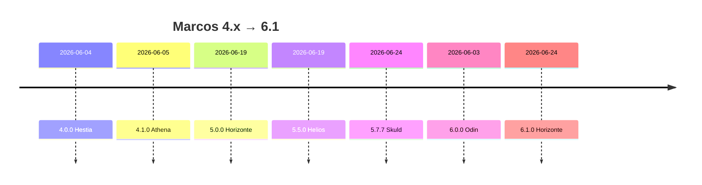
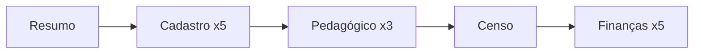
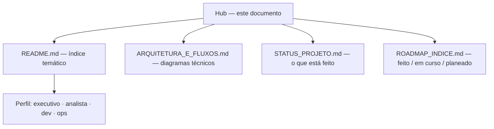

# Hub de documentação — servlitcys

**Versão do produto:** 8.0.2 · **Última revisão:** 2026-07-23

> **Índice:** [README.md](README.md) · **Fluxos:** [ARQUITETURA_E_FLUXOS.md](ARQUITETURA_E_FLUXOS.md) · **Versões:** [HISTORICO_VERSOES.md](HISTORICO_VERSOES.md) · **Roadmaps:** [ROADMAP_INDICE.md](ROADMAP_INDICE.md)

Mapa visual da documentação em produção: versão atual **8.0.2**, linha **8.x** (Clio — relatórios Educacenso Matrícula inicial), navegação da consultoria e convenção de tags.

Versão interativa para **Cursor IDE:** [canvases/documentacao-hub.canvas.tsx](../canvases/documentacao-hub.canvas.tsx) (gráficos e seções expansíveis).

---

## Produção actual

| Indicador | Valor |
|-----------|-------|
| **Versão semântica** | **8.0.2** |
| **Tag de deploy** | `20260723b-Harmonia` |
| **Commit de referência** | `4fc99bac` |
| **Data de referência** | 2026-07-23 |
| **Release** | [RELEASE_20260723b_HARMONIA.md](RELEASE_20260723b_HARMONIA.md) |
| **Marco** | **Harmonia** — Clio PDF/Excel alinhados, Fund. I/II, lotes Drive; tag + GitHub Release |

---

## Numeração `MAJOR.VERSÃO.MINOR`

| Tipo | Segmento | Exemplo |
|------|----------|---------|
| **Major** | 1.º | `5.7.0` → `6.0.0` |
| **Versão** (marco) | 2.º | `5.6.0` → `5.7.0` |
| **Minor** (ajuste) | 3.º | `5.7.1` → `5.7.2` |

Detalhe e exemplos históricos: [HISTORICO_VERSOES.md](HISTORICO_VERSOES.md) § convenção.

---

## Codenames mitológicos

| Tradição | Exemplos no projecto | Quando usar |
|----------|---------------------|-------------|
| **Greco-romana** | Athena, Metis, Urania, Phronesis | Padrão histórico; marcos funcionais e áreas consultoria |
| **Nórdica** | Heimdall (vigilância), Sleipnir (percurso), **Forseti** (decisão/filtros) | Operação resiliente, sync longo, centro de decisão |
| **Asteca** | *(reservado)* Quetzalcoatl, Tlaloc | Pontes entre sistemas, integrações, documentação operacional |

O codename deve **aludir** ao conteúdo da release. Tag: `YYYYMMDD[-letra]-Codename` — `ProductReleaseTag`.

---

## Convenção de tags (mesmo dia)

> Segunda release (ou seguinte) no mesmo dia civil: sufixo alfabético `a`, `b`, `c`… após `YYYYMMDD`, antes do codename. Implementação: `ProductReleaseTag`.

| Ordem no dia | Exemplo de tag | Arquivo RELEASE |
|--------------|----------------|------------------|
| 1ª | `20260607-Phronesis` | [RELEASE_20260607_PHRONESIS.md](RELEASE_20260607_PHRONESIS.md) |
| 2ª | `20260607a-Ananke` | [RELEASE_20260607a_ANANKE.md](RELEASE_20260607a_ANANKE.md) |
| 3ª | `20260607b-Peitho` | [RELEASE_20260607b_PEITHO.md](RELEASE_20260607b_PEITHO.md) |

---

## Linha 4.x → 6.x — commits em `main`

| Versão | Codename | Data (ref.) | Commit # |
|--------|----------|-------------|----------|
| **6.5.0** | **Jord** | 02/07 c | `d07f58a` |
| **6.3.0** | **Horizonte** | 02/07 b | `c8e2315` |
| **6.2.0** | Educacenso | 02/07 | — |
| **6.1.0** | **Horizonte** | 24/06 | **441** (`c5d6fc2`) |
| **6.0.0** | Odin | 03/06 h | **433** (`df7d9b3`) |
| **5.8.0** | Thor | 03/06 g | **431** (`0bf9b2f`) |
| **5.7.7** | Skuld | 24/06 a | **427** (`16e49e0`) |
| **5.7.6** | Saga | 22/06 b | **419** (`ed7fccf`) |
| **5.5.0** | Helios | 19/06 c | **395** (`317705d`) |
| **5.0.0** | Horizonte | 19/06* | **380** (`f3d19b8`) |
| 4.4.0 | Ananke | 07/06 a | **336** (`eee339e`) |
| 4.2.0 | Clio | 10/06/2026 | **319** (`b0cd61f`) |
| 4.1.0 | Athena | 05/06/2026 | **289** |
| 4.0.0 | Hestia | 04/06/2026 | **283** |

Detalhe completo: [HISTORICO_VERSOES.md](HISTORICO_VERSOES.md).

---

## Consultoria — sub-abas por área

| Área | Sub-abas | Tom |
|------|----------|-----|
| **1 Resumo** | 1 (Diagnóstico) | blue |
| **2 Cadastro** | 5 | sky |
| **3 Pedagógico** | 3 | violet |
| **4 Censo** | 1 | sky |
| **5 Finanças** | 5 | blue |

Guia: [ANALYTICS_NAVEGACAO_UI.md](ANALYTICS_NAVEGACAO_UI.md).

---

## Mapa de documentação

### Âncora

| Documento | Caminho |
|-----------|---------|
| Estado do projeto | [STATUS_PROJETO.md](STATUS_PROJETO.md) |
| Roadmaps (feito / em curso) | [ROADMAP_INDICE.md](ROADMAP_INDICE.md) |
| Backlog (IDs pendentes) | [BACKLOG_IMPLEMENTACOES.md](BACKLOG_IMPLEMENTACOES.md) |
| Histórico de versões | [HISTORICO_VERSOES.md](HISTORICO_VERSOES.md) |
| Ponderações técnicas | [PONDERACOES_TECNICAS.md](PONDERACOES_TECNICAS.md) |
| Padrão editorial | [PADRAO_DOCUMENTACAO.md](PADRAO_DOCUMENTACAO.md) |

### Produto e UI

| Documento | Caminho |
|-----------|---------|
| Documentação executiva | [DOCUMENTACAO_EXECUTIVA.md](DOCUMENTACAO_EXECUTIVA.md) |
| Navegação consultoria | [ANALYTICS_NAVEGACAO_UI.md](ANALYTICS_NAVEGACAO_UI.md) |
| Design system | [DESIGN_SYSTEM.md](DESIGN_SYSTEM.md) |
| Início dashboard | [INICIO_DASHBOARD.md](INICIO_DASHBOARD.md) |

### Finanças e dados

| Documento | Caminho |
|-----------|---------|
| FUNDEB / VAAF | [FUNDEB_VAAF_E_ONDA1.md](FUNDEB_VAAF_E_ONDA1.md) |
| Consultas externas | [CONSULTAS_EXTERNAS.md](CONSULTAS_EXTERNAS.md) |
| CadÚnico territorial | [CADUNICO_PREVISAO_TERRITORIAL.md](CADUNICO_PREVISAO_TERRITORIAL.md) |

### Operação

| Documento | Caminho |
|-----------|---------|
| Implantação produção | [IMPLANTACAO_PRODUCAO.md](IMPLANTACAO_PRODUCAO.md) |
| Variáveis ambiente | [VARIAVEIS_AMBIENTE.md](VARIAVEIS_AMBIENTE.md) |
| Comandos Artisan | [COMANDOS_ARTISAN.md](COMANDOS_ARTISAN.md) |
| Performance e Redis | [PERFORMANCE.md](PERFORMANCE.md) |
| Escalabilidade e infraestrutura | [ESCALABILIDADE_INFRAESTRUTURA.md](ESCALABILIDADE_INFRAESTRUTURA.md) |
| Segurança | [SEGURANCA.md](SEGURANCA.md) |

---

## Releases recentes (7.x e 6.x)

| Versão | Codename | Data | # | Nota |
|--------|----------|------|---|------|
| **8.0.2** | Harmonia | 23/07 b | — | [RELEASE_20260723b_HARMONIA.md](RELEASE_20260723b_HARMONIA.md) — PDF/Excel alinhados; Fund. I/II; lotes Drive |
| **8.0.1** | Euterpe | 23/07 | — | [RELEASE_20260723_EUTERPE.md](RELEASE_20260723_EUTERPE.md) — Clio jornada/NEE/transporte; Excel/PDF; UTF-8 |
| **8.0.0** | Aletheia | 21/07 | — | [RELEASE_20260721_ALETHEIA.md](RELEASE_20260721_ALETHEIA.md) — Clio hub relatórios; AEE/AC/etapas |
| **7.0.3** | Calliope | 09/07 | — | [RELEASE_20260709_CALLIOPE.md](RELEASE_20260709_CALLIOPE.md) — leitor docs modular; tag+GitHub |
| **7.0.2** | Hermes | 06/07 | — | [RELEASE_20260706_HERMES.md](RELEASE_20260706_HERMES.md) — pt-BR unificado |
| **7.0.1** | Moneta | 05/07 b | **506** | [RELEASE_20260705b_MONETA.md](RELEASE_20260705b_MONETA.md) — tooltip FUNDEB UF, warm-map-cache |
| **7.0.0** | Ploutos | 05/07 | **483** | [RELEASE_20260705_PLUTOS.md](RELEASE_20260705_PLUTOS.md) — SICONFI, Transparência, scoring ampliado |
| **6.5.0** | Jord | 02/07 c | **482** | [RELEASE_20260702c_JORD.md](RELEASE_20260702c_JORD.md) — malha IBGE, Contornos, Educacenso nacional |
| **6.1.0** | Horizonte | 24/06 | **441** | [RELEASE_20260624_HORIZONTE.md](RELEASE_20260624_HORIZONTE.md) — coroplético IBGE, mesorregiões, alertas VAAT |
| **6.0.0** | Odin | 03/06 h | **433** | [RELEASE_20260603h_ODIN.md](RELEASE_20260603h_ODIN.md) — marca azul, barra cmd fixa, resumo UF inline, SAEB feed |
| **5.8.0** | Thor | 03/06 g | **431** | [RELEASE_20260603g_THOR.md](RELEASE_20260603g_THOR.md) — FUNDEB estadual, pan mapa, sync repasses Tesouro |
| **5.7.7** | Skuld | 24/06 a | **427** | [RELEASE_20260624a_SKULD.md](RELEASE_20260624a_SKULD.md) — timeline financeira modal, SIDRA pop. total |
| **5.7.6** | Saga | 22/06 b | **419** | [RELEASE_20260622b_SAGA.md](RELEASE_20260622b_SAGA.md) — modal municipal, demo animada |
| 5.7.5 | Mimir | 22/06 a | **412** | [RELEASE_20260622a_MIMIR.md](RELEASE_20260622a_MIMIR.md) — tour Horizonte, repasses no modal |
| 5.7.4 | Vidar | 20/06 e | **406** | [RELEASE_20260620e_VIDAR.md](RELEASE_20260620e_VIDAR.md) — sync BR wanted/ensure |
| 4.4.3 | Lachesis | 09/06 b | **355** | [RELEASE_20260609b_LACHESIS.md](RELEASE_20260609b_LACHESIS.md) — CadÚnico faixas + Censo |

---

## Por onde começar

---

*Manutenção: atualizar tabelas e versão ao fechar release — [PADRAO_DOCUMENTACAO.md](PADRAO_DOCUMENTACAO.md) §6.*
