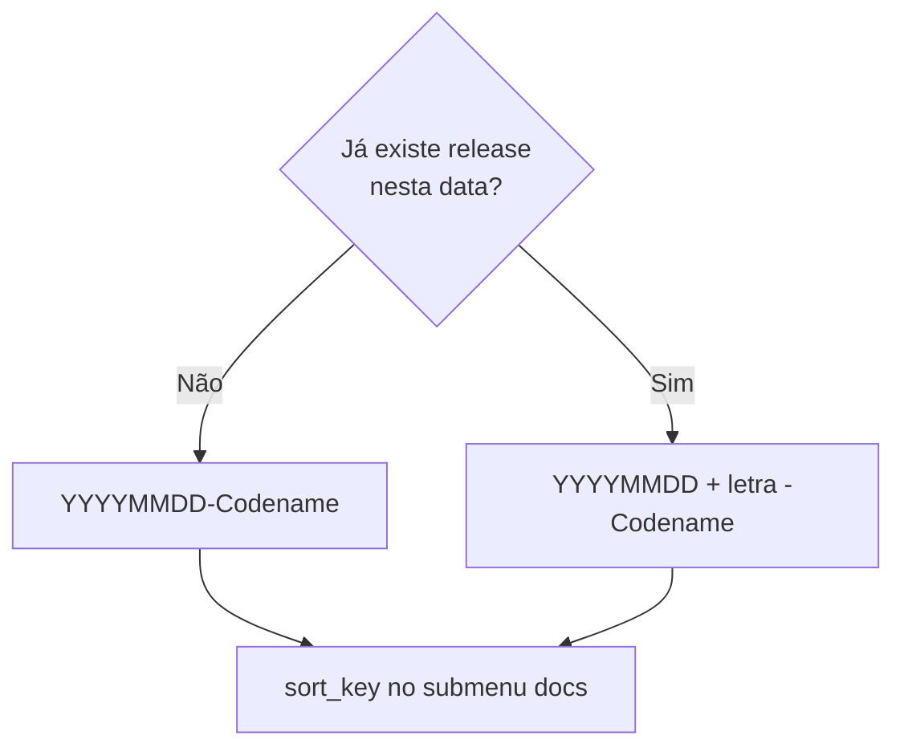
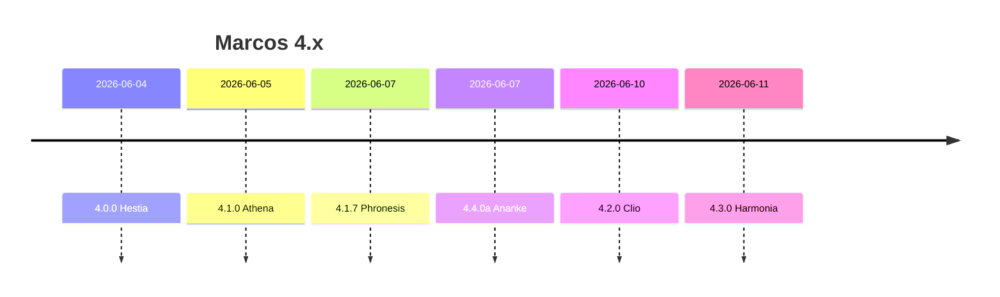
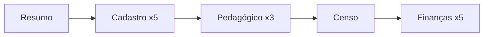
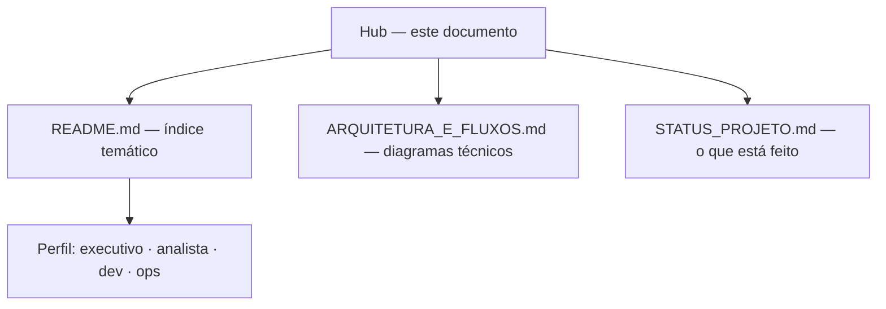

# Hub de documentação — servlitcys

**Versão do produto:** 5.7.7 · **Última revisão:** 2026-06-24

> **Índice:** [README.md](README.md) · **Fluxos:** [ARQUITETURA_E_FLUXOS.md](ARQUITETURA_E_FLUXOS.md) · **Versões:** [HISTORICO_VERSOES.md](HISTORICO_VERSOES.md)

Mapa visual da documentação em produção: versão actual **5.7.7**, linha **5.x** (Horizonte GIS + operação admin), navegação da consultoria e convenção de tags. Este ficheiro está versionado no GitHub e no leitor **Documentação** (`/admin/documentacao` e `/documentacao`).

Versão interactiva para **Cursor IDE:** [canvases/documentacao-hub.canvas.tsx](../canvases/documentacao-hub.canvas.tsx) (gráficos e secções expansíveis).

---

## Produção actual

| Indicador | Valor |
|-----------|-------|
| **Versão semântica** | **5.7.7** |
| **Tag de deploy** | `20260622b-Saga` |
| **Data de referência** | 2026-06-22 |
| **Release** | [RELEASE_20260622b_SAGA.md](RELEASE_20260622b_SAGA.md) |
| **Marco** | **Saga** — modal municipal, demo animada, transferências FNDE no score |

---

## Numeração `MAJOR.VERSÃO.MINOR`

| Tipo | Segmento | Exemplo |
|------|----------|---------|
| **Major** | 1.º | `5.7.0` → `6.0.0` |
| **Versão** (marco) | 2.º | `5.6.0` → `5.7.0` |
| **Minor** (ajuste) | 3.º | `5.7.1` → `5.7.2` |

Detalhe e exemplos históricos: [HISTORICO_VERSOES.md](HISTORICO_VERSOES.md) § convenção.

---

## Codenames mitológicos

| Tradição | Exemplos no projecto | Quando usar |
|----------|---------------------|-------------|
| **Greco-romana** | Athena, Metis, Urania, Phronesis | Padrão histórico; marcos funcionais e áreas consultoria |
| **Nórdica** | Heimdall (vigilância), Sleipnir (percurso), **Forseti** (decisão/filtros) | Operação resiliente, sync longo, centro de decisão |
| **Asteca** | *(reservado)* Quetzalcoatl, Tlaloc | Pontes entre sistemas, integrações, documentação operacional |

O codename deve **aludir** ao conteúdo da release. Tag: `YYYYMMDD[-letra]-Codename` — `ProductReleaseTag`.

---

## Convenção de tags (mesmo dia)

> Segunda release (ou seguinte) no mesmo dia civil: sufixo alfabético `a`, `b`, `c`… após `YYYYMMDD`, antes do codename. Implementação: `ProductReleaseTag`.

| Ordem no dia | Exemplo de tag | Ficheiro RELEASE |
|--------------|----------------|------------------|
| 1ª | `20260607-Phronesis` | [RELEASE_20260607_PHRONESIS.md](RELEASE_20260607_PHRONESIS.md) |
| 2ª | `20260607a-Ananke` | [RELEASE_20260607a_ANANKE.md](RELEASE_20260607a_ANANKE.md) |
| 3ª | `20260607b-Peitho` | [RELEASE_20260607b_PEITHO.md](RELEASE_20260607b_PEITHO.md) |

---

## Linha 4.x — commits em `main`

| Versão | Codename | Data (ref.) | Commit # |
|--------|----------|-------------|----------|
| 4.0.0 | Hestia | 04/06/2026 | 283 |
| 4.1.0 | Athena | 05/06/2026 | 289 |
| 4.1.7 | Phronesis | 07/06/2026 | 307 |
| 4.2.0 | Clio | 10/06/2026 | 319 |
| 4.3.0 | Harmonia | 11/06/2026 | 321 |
| **5.1.0** | **Prospeccao** | **19/06 b** | — |
| **5.0.1** | **Heimdall** | **19/06 a** | — |
| 5.0.0 | Horizonte | 19/06* | `f3d19b8` |

Detalhe completo: [HISTORICO_VERSOES.md](HISTORICO_VERSOES.md).

---

## Consultoria — sub-abas por área

| Área | Sub-abas | Tom |
|------|----------|-----|
| **1 Resumo** | 1 (Diagnóstico) | teal |
| **2 Cadastro** | 5 | indigo |
| **3 Pedagógico** | 3 | violet |
| **4 Censo** | 1 | sky |
| **5 Finanças** | 5 | teal |

Guia: [ANALYTICS_NAVEGACAO_UI.md](ANALYTICS_NAVEGACAO_UI.md).

---

## Mapa de documentação

### Âncora

| Documento | Caminho |
|-----------|---------|
| Estado do projeto | [STATUS_PROJETO.md](STATUS_PROJETO.md) |
| Histórico de versões | [HISTORICO_VERSOES.md](HISTORICO_VERSOES.md) |
| Ponderações técnicas | [PONDERACOES_TECNICAS.md](PONDERACOES_TECNICAS.md) |
| Padrão editorial | [PADRAO_DOCUMENTACAO.md](PADRAO_DOCUMENTACAO.md) |

### Produto e UI

| Documento | Caminho |
|-----------|---------|
| Documentação executiva | [DOCUMENTACAO_EXECUTIVA.md](DOCUMENTACAO_EXECUTIVA.md) |
| Navegação consultoria | [ANALYTICS_NAVEGACAO_UI.md](ANALYTICS_NAVEGACAO_UI.md) |
| Design system | [DESIGN_SYSTEM.md](DESIGN_SYSTEM.md) |
| Início dashboard | [INICIO_DASHBOARD.md](INICIO_DASHBOARD.md) |

### Finanças e dados

| Documento | Caminho |
|-----------|---------|
| FUNDEB / VAAF | [FUNDEB_VAAF_E_ONDA1.md](FUNDEB_VAAF_E_ONDA1.md) |
| Consultas externas | [CONSULTAS_EXTERNAS.md](CONSULTAS_EXTERNAS.md) |
| CadÚnico territorial | [CADUNICO_PREVISAO_TERRITORIAL.md](CADUNICO_PREVISAO_TERRITORIAL.md) |

### Operação

| Documento | Caminho |
|-----------|---------|
| Implantação produção | [IMPLANTACAO_PRODUCAO.md](IMPLANTACAO_PRODUCAO.md) |
| Variáveis ambiente | [VARIAVEIS_AMBIENTE.md](VARIAVEIS_AMBIENTE.md) |
| Comandos Artisan | [COMANDOS_ARTISAN.md](COMANDOS_ARTISAN.md) |
| Segurança | [SEGURANCA.md](SEGURANCA.md) |

---

## Releases recentes (5.7+)

| Versão | Codename | Data | Nota |
|--------|----------|------|------|
| **5.7.7** | Skuld | 24/06 a | [RELEASE_20260624a_SKULD.md](RELEASE_20260624a_SKULD.md) — timeline financeira modal, SIDRA pop. total |
| **5.7.6** | Saga | 22/06 b | [RELEASE_20260622b_SAGA.md](RELEASE_20260622b_SAGA.md) — modal municipal, demo animada |
| 5.7.5 | Mimir | 22/06 a | [RELEASE_20260622a_MIMIR.md](RELEASE_20260622a_MIMIR.md) — tour Horizonte, repasses no modal |
| 5.7.4 | Vidar | 20/06 e | [RELEASE_20260620e_VIDAR.md](RELEASE_20260620e_VIDAR.md) — sync BR wanted/ensure |
| 4.4.3 | Lachesis | 09/06 b | [RELEASE_20260609b_LACHESIS.md](RELEASE_20260609b_LACHESIS.md) — CadÚnico faixas + Censo |

---

## Por onde começar

---

*Manutenção: actualizar tabelas e versão ao fechar release — [PADRAO_DOCUMENTACAO.md](PADRAO_DOCUMENTACAO.md) §6.*
