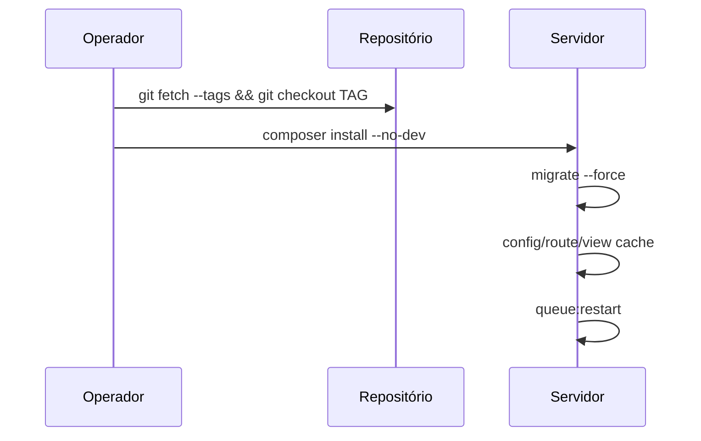

# Implantação em produção — servlitcys

**Versão do produto:** 6.3.0 · **Última revisão:** 2026-07-02

> **Índice:** [README.md](README.md) · **Variáveis:** [VARIAVEIS_AMBIENTE.md](VARIAVEIS_AMBIENTE.md) · **Comandos:** [COMANDOS_ARTISAN.md](COMANDOS_ARTISAN.md)

Guia passo a passo para publicar no servidor (código, assets, migrações, filas e `.env`).

**Versão de referência:** **6.3.0** · tag **`20260702b-Horizonte`** · commit **`4c420f8`** — [HISTORICO_VERSOES.md](HISTORICO_VERSOES.md) · [RELEASE_20260702b_HORIZONTE.md](RELEASE_20260702b_HORIZONTE.md)



Fluxo completo: [ARQUITETURA_E_FLUXOS.md](ARQUITETURA_E_FLUXOS.md) §6.

---

## 1. O que entra neste deploy

| Área | Alteração | Impacto em produção |
|------|-----------|---------------------|
| **Monitorização (Pulse)** | Novo layout NOC, KPIs executivos, cartão de municípios/infraestrutura | Só admins; rota `/pulse` (ou `PULSE_PATH`) |
| **Notificações** | Sino na barra, tabela `notifications`, jobs PDF/sync | Migração nova; fila `default` |
| **Financiamentos** | Consultas FNDE/Tesouro/Portal Transparência; rótulo «Financiamentos» | Variáveis `PORTAL_TRANSPARENCIA_API_KEY`, cache — ver [CONSULTAS_EXTERNAS.md](CONSULTAS_EXTERNAS.md) |
| **Censo** | Correcção SQL `groupBy` + aviso ano letivo consolidado | Sem migração |
| **Serventec** | Correcção Blade/AJAX (aba deixava de ficar em branco) | `view:cache` após deploy |
| **`.env`** | Checklist em [VARIAVEIS_AMBIENTE.md](VARIAVEIS_AMBIENTE.md) | Editar **apenas** `.env` no servidor (não há `.env.example` em produção) |
| **Seeder admin** | `AdminUserSeeder` lê `ADMIN_*` do `.env` | Só na 1.ª instalação |

---

## 2. Pré-requisitos

- PHP **8.3+** com `pdo_mysql`, `pdo_pgsql`, `mbstring`, `openssl`, `json`, `bcmath`
- MySQL/MariaDB da aplicação acessível
- Composer 2 no servidor (ou deploy com `vendor/` já gerado)
- **Node não é obrigatório no servidor** se `public/build/` vier no Git
- Backup antes do deploy:
  - Base de dados principal (`DB_*`)
  - Arquivo `.env` (em especial **`APP_KEY`** — necessário para passwords de cidades encriptadas)
  - `storage/app/` (cache FUNDEB, SAEB, PDFs exportados)

---

## 3. Janela de manutenção (recomendado)

1. Avisar usuários (análise e sync podem ficar lentos durante migrações).
2. Opcional: `php artisan down` com mensagem e bypass para admins.
3. Garantir que **nenhum** `queue:work` antigo fica preso após o deploy (reiniciar Supervisor).

---

## 4. Passos de implantação

### 4.1 Obter código

```bash
cd /caminho/para/servlitcys
git fetch origin
git checkout main   # ou a tag/branch acordada
git pull
```

Se o deploy for por pacote (zip/rsync), inclua `app/`, `config/`, `database/`, `resources/`, `routes/`, `public/build/`, `bootstrap/`, `composer.json` e `composer.lock`.

### 4.2 Dependências PHP

```bash
composer install --no-dev --optimize-autoloader
```

### 4.3 Variáveis de ambiente

Em produção existe **apenas** o arquivo `.env` no servidor. O repositório traz `.env.example` só para instalação nova ou desenvolvimento — **não** o use como referência no deploy de um servidor já em funcionamento.

**Referência canónica:** [VARIAVEIS_AMBIENTE.md](VARIAVEIS_AMBIENTE.md) — compare secção a secção com o `.env` actual e acrescente o que faltar.

```bash
# Instalação nova (clone no servidor pela primeira vez):
cp .env.example .env
php artisan key:generate   # só neste caso — ver nota APP_KEY abaixo

# Servidor já em produção (caso habitual):
nano .env   # ou o editor habitual — NÃO sobrescrever com .env.example
```

**Crítico — não alterar `APP_KEY` em servidor que já tem cidades cadastradas** (campo `db_password` encriptado no modelo `City`).

Valores mínimos a confirmar ou adicionar (detalhe em [VARIAVEIS_AMBIENTE.md](VARIAVEIS_AMBIENTE.md)):

```env
APP_ENV=production
APP_DEBUG=false
APP_URL=https://seu-dominio.exemplo.br

SESSION_ENCRYPT=true
SESSION_SECURE_COOKIE=true

QUEUE_CONNECTION=database

APP_NOTIFICATIONS_ENABLED=true
ANALYTICS_LAZY_TABS=true
ANALYTICS_INDEX_LIGHT_FILTERS=true
ANALYTICS_INDEX_LOAD_OVERVIEW=false
ANALYTICS_PDF_QUEUE=default

ADMIN_SYNC_QUEUE=admin-sync
ADMIN_SYNC_SCHEDULE_ENABLED=true
ADMIN_SYNC_SCHEDULE_TIMES=06:00,18:00
ADMIN_SYNC_SCHEDULE_ON_DEMAND=true
ADMIN_SYNC_SCHEDULE_MAX_SECONDS=3300

SCHEDULE_RUN_INTERVAL_MINUTES=3

PULSE_ENABLED=true
PULSE_DB_CONNECTION=mysql
PULSE_SCHEDULE_ENABLED=true
PULSE_SCHEDULE_INTERVAL_MINUTES=3

IEDUCAR_OTHER_FUNDING_PUBLIC_QUERIES=true
PORTAL_TRANSPARENCIA_API_KEY=   # preencher para despesas na aba Financiamentos
```

Consultas na aba Financiamentos: [CONSULTAS_EXTERNAS.md](CONSULTAS_EXTERNAS.md). Desenvolvimento local: [README.md](../README.md) e `.env.example`.

Depois de editar o `.env`:

```bash
php artisan config:clear
```

### 4.4 Migrações de base de dados

```bash
php artisan migrate --force
```

Migração **nova** neste ciclo (se ainda não existir em produção):

| Arquivo | Tabela |
|----------|--------|
| `2026_05_22_120000_create_notifications_table.php` | `notifications` |

As restantes migrações do projeto devem já estar aplicadas em ambientes anteriores.

### 4.5 Cache e optimização Laravel

```bash
php artisan config:cache
php artisan route:cache
php artisan view:cache
```

### 4.6 Assets front-end (Vite)

No servidor **não** corra `npm run dev`.

```bash
# Garantir que não há modo desenvolvimento Vite ativo:
rm -f public/hot

# Após deploy de alterações ao Início (Acesso rápido / mapa mental), rebuild obrigatório:
npm run build

# Confirmar build versionado:
test -f public/build/manifest.json && echo "OK: assets presentes"
```

Se `public/build/manifest.json` não existir, compile **na máquina de desenvolvimento ou CI** e volte a publicar:

```bash
npm ci
npm run build
git add public/build && git commit && git push
```

### 4.7 Permissões

```bash
chown -R www-data:www-data storage bootstrap/cache
chmod -R ug+rwx storage bootstrap/cache
```

(Ajuste `www-data` ao usuário do PHP-FPM/Apache/Nginx.)

### 4.8 Filas (obrigatório para notificações, PDF e sync)

Processos que dependem da fila:

- Notificações (`APP_NOTIFICATIONS_QUEUE=default`)
- Exportação PDF Serventec (`ANALYTICS_PDF_QUEUE`)
- Sincronização administrativa (`ADMIN_SYNC_QUEUE=admin-sync`)

**Opção A — Supervisor (recomendado em produção contínua)**

```ini
; /etc/supervisor/conf.d/servlitcys-worker.conf
[program:servlitcys-queue]
process_name=%(program_name)s
command=php /caminho/para/servlitcys/artisan queue:work database --sleep=3 --tries=3 --max-time=3600 --queue=default,admin-sync
autostart=true
autorestart=true
user=www-data
numprocs=1
redirect_stderr=true
stdout_logfile=/var/log/servlitcys-queue.log
```

```bash
sudo supervisorctl reread
sudo supervisorctl update
sudo supervisorctl restart servlitcys-queue
```

**Opção B — só cron** (já previsto para `admin-sync` via `schedule:run`; PDF e notificações em fila podem atrasar sem worker dedicado)

Confirme que o cron do sistema executa o scheduler Laravel:

```cron
# Recomendado: invocar o scheduler a cada minuto (o Laravel decide o que está «due»)
* * * * * cd /caminho/para/servlitcys && /usr/bin/php artisan schedule:run >> /caminho/para/servlitcys/storage/logs/scheduler.log 2>&1
```

Use o **mesmo utilizador** do PHP-FPM/deploy (ex.: `www-data`), caminho absoluto ao `php` e ao projeto. **Evite** `>> /dev/null` enquanto diagnosticar Pulse offline.

Alternativa (menos fiável): `*/3 * * * *` — só funciona se o minuto do cron coincidir com tarefas `everyThreeMinutes` (0, 3, 6…); se o servidor ficar «offline» no Pulse mas `schedule:run` manual funciona, mude para `* * * * *` e rode `php artisan schedule:pulse-diagnose`.

`SCHEDULE_RUN_INTERVAL_MINUTES` (defeito **3**) define a cadência das tarefas Pulse no scheduler, não precisa igualar ao intervalo do cron quando este corre **cada minuto**. O scheduler inclui (ver `bootstrap/app.php`):

- `pulse:check --once` e `pulse:work --stop-when-empty` — cadência `PULSE_SCHEDULE_INTERVAL_MINUTES` (defeito **3** min)
- `admin-sync-scheduled-work` — **2×/dia** (`ADMIN_SYNC_SCHEDULE_TIMES`, ex. `06:00,18:00` em `APP_TIMEZONE`)
- `admin-sync-on-demand` — em cada `schedule:run`, se houver jobs pendentes (`ADMIN_SYNC_SCHEDULE_ON_DEMAND=true`)

### 4.9 Modo manutenção (se ativou)

```bash
php artisan up
```

---

## 5. Verificação pós-deploy

| # | Teste | Resultado esperado |
|---|--------|-------------------|
| 1 | `GET /up` | HTTP 200 |
| 2 | Login admin | Entrada no painel |
| 3 | `/dashboard/analytics` | Abas carregam; Financiamentos com bloco de consultas públicas (se API key configurada) |
| 4 | Aba **Censo** | Sem erro SQL; banner de ano letivo quando aplicável |
| 5 | Aba **Serventec** | Conteúdo visível (não fica em branco após lazy load) |
| 6 | Sino de notificações | Ícone ao lado do usuário; lista após PDF/sync (com worker ativo) |
| 7 | `/pulse` (admin) | Painel executivo no topo, secção municípios, gráficos de servidor |
| 8 | `php artisan schedule:list` | Tarefas `pulse-scheduled-*` e `admin-sync-scheduled-work` |
| 9 | Consola do browser | Sem pedidos a `localhost:5173` / `[::1]:5173` |

Comandos úteis:

```bash
php artisan migrate:status
php artisan queue:failed
php artisan about
```

---

## 6. Primeira instalação vs atualização

### Instalação nova

```bash
php artisan migrate --force
php artisan db:seed --class=AdminUserSeeder   # exige ADMIN_EMAIL e ADMIN_PASSWORD no .env
```

Altere a senha do admin após o primeiro login.

### Atualização de servidor existente

- **Não** volte a correr o seeder de admin (sobrescreve usuário pelo email do `.env`).
- **Não** regenere `APP_KEY` sem plano de re-encriptar credenciais das cidades.

---

## 7. Problemas frequentes

| Sintoma | Causa provável | Acção |
|---------|----------------|--------|
| CSS/JS quebrados; pedidos a porta 5173 | `public/hot` presente ou falta `public/build` | `rm -f public/hot`; confirmar `manifest.json` |
| Aba Serventec em branco | Cache de views antiga | `php artisan view:clear && php artisan view:cache` |
| Notificações/PDF não aparecem | Fila sem worker | Supervisor `queue:work` com `default,admin-sync` |
| Pulse «Servers offline» no cron, OK no SSH | Cron com utilizador/permissões diferentes, `>> /dev/null`, ou cron `*/3` desalinhado | Cron `* * * * *` como utilizador da app; log em `storage/logs/scheduler.log`; `SCHEDULE_LOG_TO_FILE=true`; `php artisan schedule:pulse-diagnose`; `schedule:clear-cache` |
| Pulse «Servers offline» | Cron inactivo ou `PULSE_SCHEDULE_ENABLED=false` | Ativar cron; `PULSE_SCHEDULE_ENABLED=true` |
| Financiamentos sem Transparência | API key vazia | `PORTAL_TRANSPARENCIA_API_KEY` no `.env` + `config:cache` |
| Erro ao ligar Redis | Extensão ausente | `REDIS_CLIENT=predis` ou instalar `phpredis`; cache/fila podem ficar em `database` |

---

## 8. Rollback

1. Repor código da versão anterior (`git checkout <tag-anterior>`).
2. Restaurar backup da base de dados **se** migrações novas foram aplicadas e não são reversíveis.
3. `composer install --no-dev --optimize-autoloader`
4. `php artisan config:cache && php artisan route:cache && php artisan view:cache`
5. Reiniciar workers Supervisor.

A migração `notifications` pode ser revertida apenas com `php artisan migrate:rollback` se for a última batch — avalie perda de histórico de notificações.

---

## 9. Documentação relacionada

- [SEGURANCA.md](SEGURANCA.md) — checklist de segurança
- [METRICAS_QUERIES_ANALYTICS.md](METRICAS_QUERIES_ANALYTICS.md) — Pulse e abas lazy
- [COMANDOS_ARTISAN.md](COMANDOS_ARTISAN.md) — sync, FUNDEB, geo
- [STATUS_PROJETO.md](STATUS_PROJETO.md) — funcionalidades por área
- [README.md](../README.md) — requisitos e variáveis `.env`

---

## 10. Resumo rápido (copy-paste)

```bash
cd /caminho/para/servlitcys
git pull
composer install --no-dev --optimize-autoloader
# atualizar .env (ver secção 4.3)
php artisan migrate --force
php artisan config:cache
php artisan route:cache
php artisan view:cache
rm -f public/hot
# reiniciar: php artisan queue:work ... e cron schedule:run
php artisan up
```
