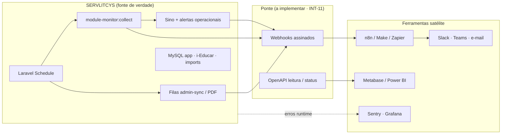

# Orquestração externa — n8n e ferramentas satélite (servlitcys)

**Versão do produto:** 9.0.1 · **Última revisão:** 2026-07-26

> **Índice:** [README.md](README.md) · **Segurança:** [SEGURANCA.md](SEGURANCA.md) · **Variáveis:** [VARIAVEIS_AMBIENTE.md](VARIAVEIS_AMBIENTE.md) · **Estudo setor público:** [ESTUDO_INTEGRACOES_SETOR_PUBLICO_E_PREVISAO_DEMANDA.md](ESTUDO_INTEGRACOES_SETOR_PUBLICO_E_PREVISAO_DEMANDA.md) · **Agentes IA:** [ESTUDO_AGENTES_IA_SERVLITCYS.md](ESTUDO_AGENTES_IA_SERVLITCYS.md) · **Backlog:** [BACKLOG_IMPLEMENTACOES.md](BACKLOG_IMPLEMENTACOES.md)

Documento **vivo (admin)** — desenho, uso, riscos, vantagens e melhor prática para ligar o SERVLITCYS a **n8n**, Make/Zapier, observabilidade e canais de operação **sem duplicar** o motor interno (Laravel Schedule, filas, monitor de módulos, sino).

**Estado:** desenho aprovado para implementação; **webhooks outbound ainda não existem no código** (item **INT-11** no backlog). O sino, o `module-monitor:collect` e os alertas operacionais já estão na aplicação.

---

## 1. Resumo

| Pergunta | Resposta curta |
|----------|----------------|
| n8n substitui o cron Laravel? | **Não.** Cron, sync e verdade de dados ficam no SERVLITCYS. |
| O que n8n faz bem aqui? | Comunicação, glue com ferramentas Serventec, humano-no-loop, digests. |
| Porta de entrada correcta? | **Webhooks autenticados** (eventos operacionais) + eventualmente OpenAPI de leitura. |
| Público deste doc | Administradores / ops / arquitectura — secção **11 · Integrações** no leitor. |

---

## 2. Princípio de fronteira



**Regra de ouro:** o satélite **reage** a eventos e **apresenta** informação; não reagenda sync de Portal/Horizonte/CadÚnico nem escreve nas tabelas de domínio sem um endpoint Laravel explícito e auditado.

---

## 3. Desenho dos webhooks (mínimo viável)

### 3.1 Eventos recomendados (fase 1)

| `event` | Quando dispara | Prioridade típica | Consumidor n8n |
|---------|----------------|-------------------|----------------|
| `ops.module_monitor.failed` | Pós-`module-monitor:collect` com sinal `failed` | Critical | Canal ops + link `/admin/monitor-modulos` |
| `ops.module_monitor.snapshot_stale` | Snapshot ausente/stale (alertas operacionais) | Critical | Página de agendamentos + runbook |
| `ops.schedule.failed` | `onFailure` de job crítico | Critical | Triagem + reopen ticket |
| `ops.horizonte.cycle` | Ciclo do feed bimestral terminou (ok ou avisos) | High / Normal | Digest consultoria (opcional) |
| `ops.cadunico.beneficios.failed` | CUN-04 falhou | Critical | Verificar API Portal |
| `ops.sync.stale` | Admin sync em «processing» há demais horas | Critical | Worker `admin-sync` |

### 3.2 Contrato de payload (proposta)

```json
{
  "id": "01JXYZ...",
  "event": "ops.module_monitor.failed",
  "occurred_at": "2026-07-26T15:00:00-03:00",
  "priority": "critical",
  "dedupe_key": "ops:module_monitor:failed",
  "title": "Monitor de módulos — falhas",
  "body": "2 módulo(s) com sinal «failed»: Geo, PDF",
  "action_url": "https://analise.exemplo.br/admin/monitor-modulos",
  "meta": {
    "failed_modules": ["geo", "pdf"],
    "environment": "production"
  }
}
```

### 3.3 Segurança do endpoint outbound / inbound

| Controlo | Melhor prática |
|----------|----------------|
| Autenticação | HMAC-SHA256 (`X-Servlitcys-Signature`) com segredo por ambiente; ou Bearer estático só em VPN |
| Idempotência | Respeitar `dedupe_key` / `id` no n8n (Wait ou Data Store) |
| TLS | HTTPS obrigatório; rejeitar HTTP em produção |
| Dados | **Sem CPF, NIS, tokens i-Educar, dumps SQL**; só agregados e URLs internas |
| Retries | 3 tentativas com backoff; dead-letter no n8n; log no Laravel |
| Feature flag | `OUTBOUND_WEBHOOKS_ENABLED=false` por default até validar |

### 3.4 Direcção inversa (n8n → SERVLITCYS)

Permitir só acções **explícitas**, com RBAC de serviço:

| Acção | Endpoint (proposta) | Exigência |
|-------|---------------------|-----------|
| Disparar `module-monitor:collect` | `POST /api/ops/module-monitor/collect` | Token ops + rate limit |
| Confirmar reset de pipeline (humano) | `POST /api/ops/horizonte/pipeline/reset` | Aprovação no fluxo n8n |
| Consultar status | `GET /api/ops/health/summary` | Só leitura |

**Proibido** via automação: apagar cidades, alterar RBAC, ler bases municipais i-Educar em massa, publicar versões legais.

---

## 4. n8n — uso, requisitos, vantagens e riscos

### 4.1 O que se precisa da ferramenta

| Necessidade | Detalhe |
|-------------|---------|
| Instância | Self-hosted (preferível LGPD) ou Cloud com DPA; rede com acesso HTTPS ao SERVLITCYS |
| Credenciais | Segredo HMAC / Bearer guardado em Credentials do n8n (não em nós plaintext) |
| Nós típicos | Webhook Trigger, IF/Switch, Slack/Teams/Email, HTTP Request, Wait, Error Trigger |
| Persistência | SQLite/Postgres do n8n para execução; Data Store para dedupe diário |
| Observabilidade | Logs de execução + alerta se o próprio n8n falhar (healthcheck) |

### 4.2 Fluxos de referência

1. **Ops crítico** — Webhook `ops.*.failed|stale` → IF priority=critical → Slack `#servlitcys-ops` + e-mail plantão.  
2. **Digest diário** — Cron n8n 08:15 → HTTP `GET /api/ops/health/summary` → formatar → canal consultoria (só se INT-11 existir).  
3. **Humano-no-loop** — Alerta pipeline Horizonte stuck → mensagem com botões Aprovar reset / Ignorar → HTTP POST auditado.  
4. **Cliente (opcional)** — Ciclo Horizonte OK → e-mail resumido **sem dados sensíveis** para lista aprovada.

### 4.3 Vantagens

- Canais que a app não precisa incorporar (WhatsApp Business, Notion, Jira).  
- Iteração rápida de runbooks sem deploy PHP.  
- Aprovações visuais para operações destrutivas.  
- Separação: produto analítico vs. glue corporativo Serventec.

### 4.4 Riscos

| Risco | Mitigação |
|-------|-----------|
| Dois schedulers (n8n + Laravel) a sincronizar dados | n8n **não** agenda `horizonte:*` / `cadunico:*`; só Laravel |
| Vazamento LGPD via payloads ricos | Contrato mínimo §3.2; revisão de nós |
| Ruído / fadiga de alertas | Alinhar a `dedupe_key` e TTL do sino; filtrar `degraded` |
| n8n cai e ninguém vê | Healthcheck + manter sino in-app como fonte primária |
| Credenciais em workflows exportados | Credentials nativas; rotação; ambientes separados |

### 4.5 Melhor prática n8n

1. Um workflow por **família de evento** (ops críticos vs digests).  
2. Nomear execuções com `dedupe_key`.  
3. Ambiente `staging` espelhado antes de produção.  
4. Documentar o workflow neste ficheiro ou anexo interno (ID do workflow + canal).  
5. Se o sino já notificou o mesmo `dedupe_key`, o n8n pode só espelhar — não inventar segunda lógica de negócio.

---

## 5. Outras ferramentas citadas

### 5.1 Make.com / Zapier

| Aspecto | Orientação |
|---------|------------|
| Papel | Igual ao n8n para glue SaaS; Zapier mais simples, Make mais visual |
| Quando preferir n8n | Self-host, LGPD, lógica condicional densa, custo previsível |
| Quando Make/Zapier | Integração pontual com SaaS que a Serventec já usa e volume baixo |
| Requisitos | Conta, webhooks HTTPS, mesmos eventos INT-11 |
| Risco | Vendor lock-in e custo por operação; menos controlo de dados |

### 5.2 Sentry (erros de runtime)

| Aspecto | Orientação |
|---------|------------|
| Papel | Captura excepções PHP/JS; complementa monitor de módulos (que cobre sondas/filas) |
| O que se precisa | DSN, `SENTRY_LARAVEL_DSN`, sample rate, release = tag `config/documentation.php` |
| Vantagem | Stack traces e regressões pós-deploy |
| Risco | PII em contexto de request — scrubbing obrigatório |
| Melhor prática | Ligar release ao `ProductReleaseTag`; não duplicar alertas de fila já no sino |

### 5.3 Grafana / Prometheus (infra)

| Aspecto | Orientação |
|---------|------------|
| Papel | CPU, disco, Redis, MySQL, latência HTTP — fora do Pulse da app |
| O que se precisa | Exporters, datasource, dashboards; alertmanager → n8n/Slack |
| Vantagem | Separar «app saudável» de «servidor a sufocar» |
| Risco | Sobreposição confusa com Pulse/Module Monitor — definir dono de cada alerta |
| Melhor prática | Alertas de infra ≠ alertas de domínio (FUNDEB/sync) |

### 5.4 Metabase / Power BI

| Aspecto | Orientação |
|---------|------------|
| Papel | BI de leitura sobre réplica ou views; ver também backlog Power BI |
| O que se precisa | Utilizador só-leitura, views sem PII, VPN/IP allowlist |
| Vantagem | Autosserviço consultoria sem novo ecrã Laravel |
| Risco | Queries pesadas na primária; contornar com réplica |
| Melhor prática | Nunca apontar BI à BD i-Educar municipal em produção sem contrato |

### 5.5 Pulse (já no produto)

Continua a ser a telemetria **in-app**. Ferramentas externas não o substituem; o Module Monitor agrega Pulse + sync + sondas.

---

## 6. Matriz «usar / não usar»

| Necessidade | Usar | Não usar |
|-------------|------|----------|
| Sync Portal / Horizonte / CadÚnico | Laravel Schedule + filas | n8n Cron |
| Aviso Slack de falha crítica | n8n ← webhook | Reimplementar canais na app |
| Saúde por módulo | `module-monitor:collect` + sino | Só Grafana |
| Relatório cliente PDF | Jobs PDF existentes | Zapier a gerar PDF fiscal |
| Explorar matrículas i-Educar | Painel / API futura catalogada | Agente n8n com SQL directo |
| Aprovar reset de pipeline | n8n + endpoint auditado | Bot sem autenticação |

---

## 7. Checklist de adopção (ordem sugerida)

1. **Manter** schedule e notificações internos estáveis (já em curso).  
2. Implementar **INT-11** — outbound webhooks + feature flag + testes de assinatura.  
3. Subir **n8n staging** com um fluxo Slack para `ops.module_monitor.failed`.  
4. Validar dedupe e ausência de PII.  
5. Produção: só eventos critical na fase 1.  
6. Opcional: Sentry + Grafana conforme porte de infra.  
7. Digests e humano-no-loop depois de 2–4 semanas sem fadiga de alertas.

---

## 8. Variáveis de ambiente (proposta INT-11)

Documentar em [VARIAVEIS_AMBIENTE.md](VARIAVEIS_AMBIENTE.md) quando implementar:

| Variável | Default | Função |
|----------|---------|--------|
| `OUTBOUND_WEBHOOKS_ENABLED` | `false` | Liga envio |
| `OUTBOUND_WEBHOOKS_URL` | — | URL do Webhook Trigger n8n (ou gateway) |
| `OUTBOUND_WEBHOOKS_SECRET` | — | HMAC |
| `OUTBOUND_WEBHOOKS_TIMEOUT` | `5` | Segundos |
| `OUTBOUND_WEBHOOKS_EVENTS` | lista | Allowlist de `event` |

Notificações internas já existentes: `MODULE_MONITOR_NOTIFY_*`, `APP_NOTIFICATIONS_SCHEDULE_FAILURES` — ver [VARIAVEIS_AMBIENTE.md](VARIAVEIS_AMBIENTE.md) §11c.

---

## 9. Relação com estudos e backlog

| Documento / ID | Relação |
|----------------|---------|
| [ESTUDO_INTEGRACOES_SETOR_PUBLICO…](ESTUDO_INTEGRACOES_SETOR_PUBLICO_E_PREVISAO_DEMANDA.md) | Fontes **públicas de dados**; este doc é **orquestração operacional** |
| [ESTUDO_AGENTES_IA…](ESTUDO_AGENTES_IA_SERVLITCYS.md) | IA interpreta números; n8n transporta alertas — não misturar papéis |
| **INT-11** | Webhooks outbound assinados + allowlist de eventos + flag |
| **INT-12** (opcional) | `GET /api/ops/health/summary` para digests |

---

## 10. Ver também

- Monitor e agendamentos: [COMANDOS_ARTISAN.md](COMANDOS_ARTISAN.md) · `php artisan module-monitor:collect` · `notifications:operational-alerts`  
- Hub admin de importação: [IMPORTACAO_DADOS_PUBLICOS.md](IMPORTACAO_DADOS_PUBLICOS.md)  
- Segurança / LGPD: [SEGURANCA.md](SEGURANCA.md)  
- Ponderações: [PONDERACOES_TECNICAS.md](PONDERACOES_TECNICAS.md)
