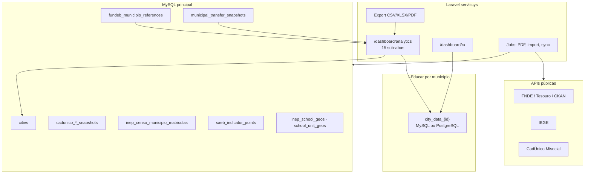
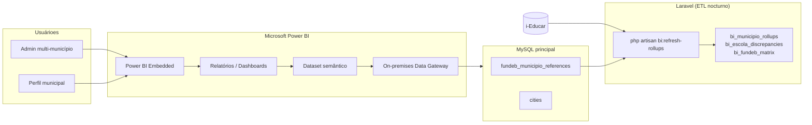
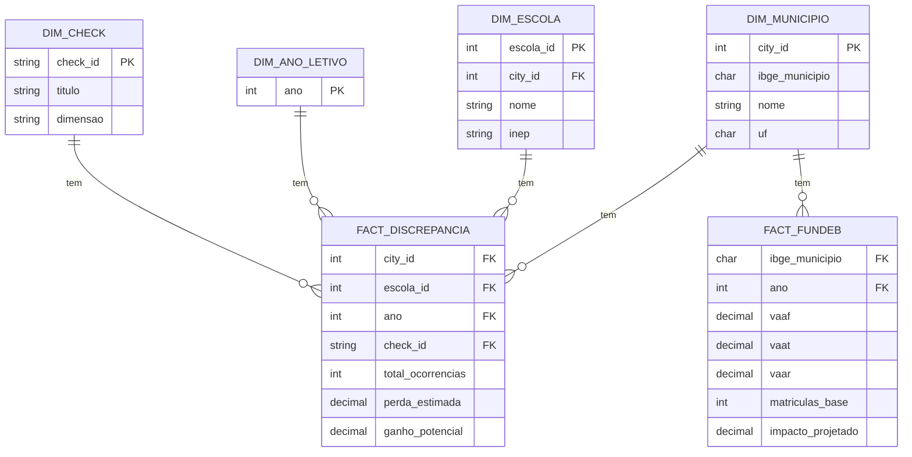
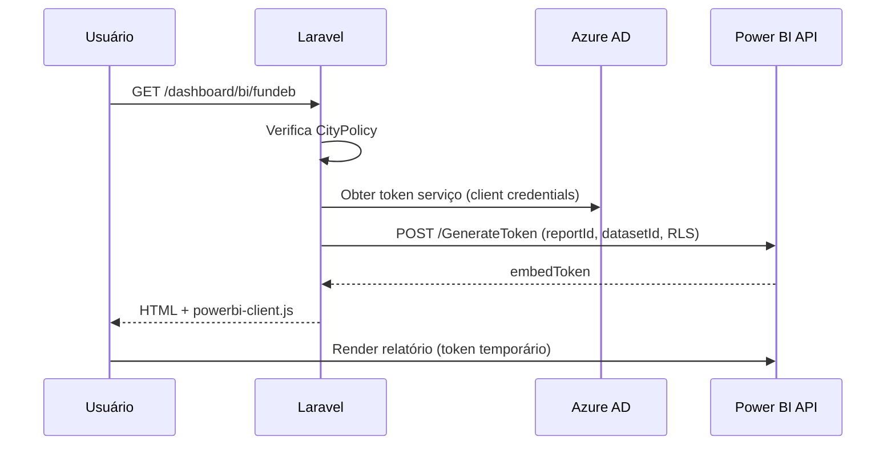
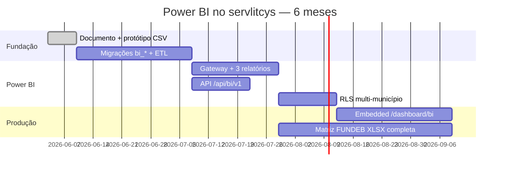

# Power BI — estudo de integração no servlitcys

**Versão do produto:** 8.0.3 · **Última revisão:** 2026-07-24

> **Índice:** [README.md](README.md) · **Clio:** [ROADMAP_CLIO.md](ROADMAP_CLIO.md) · **Arquitetura:** [ARQUITETURA_E_FLUXOS.md](ARQUITETURA_E_FLUXOS.md) · **Analytics:** [ANALYTICS_NAVEGACAO_UI.md](ANALYTICS_NAVEGACAO_UI.md) · **Performance:** [METRICAS_QUERIES_ANALYTICS.md](METRICAS_QUERIES_ANALYTICS.md) · **Export FUNDEB:** [EXPORTACAO_DADOS_FUNDEB_PLANILHA.md](EXPORTACAO_DADOS_FUNDEB_PLANILHA.md) · **BI Rede & Oferta:** [DOCUMENTO_EXECUTIVO_REDE_OFERTA_BI.md](DOCUMENTO_EXECUTIVO_REDE_OFERTA_BI.md)

## 1. Resumo executivo

O **servlitcys** implementa **BI embutido** em Laravel (`/dashboard/analytics`) e, no módulo **Clio**, o data mart **`bi_clio_*`** (S7 / CEN-16) com página de insights gestores e ligação a Power BI Desktop. **Power BI Embedded (Azure)** continua opcional e fora do MVP.

Este documento descreve:

- o **estado actual** dos dados e relatórios;
- **cenários técnicos** de adopção do Power BI (Embedded, Gateway, data mart);
- **exemplos** de modelos, medidas DAX e fluxos ETL;
- **vantagens e contras** face ao painel Laravel;
- **previsão de desenvolvimento** por fases, com esforço estimado.

**Conclusão antecipada:** Power BI complementa — não substitui — o painel operacional. O valor imediato está em **relatórios executivos multi-município**, **self-service para consultores** e **matrizes FUNDEB** alinhadas à planilha Serventec; o painel Laravel mantém-se como camada de **acção** (discrepâncias, RX, sync, alertas).

---

## 2. Estado actual — BI no servlitcys

### 2.1 Arquitetura de dados



| Camada | Componentes | Papel analítico |
|--------|-------------|-----------------|
| **UI** | `AnalyticsDashboardController`, 15 tabs (`AnalyticsTabCatalog`) | Visualização, filtros, lazy-load por aba |
| **Repositórios** | 18 classes em `app/Repositories/` | Agregações SQL, snapshots por aba |
| **Queries** | `app/Support/Ieducar/*Queries.php` | SQL parametrizado, adaptação de schema |
| **Conexão municipal** | `CityDataConnection` | Credenciais encriptadas em `cities`; conexão dinâmica `city_data_{id}` |
| **Cache** | `AnalyticsTabPayloadCache`, `config/analytics.php` | TTL por `(city_id, filtros)` |
| **Observabilidade** | Laravel Pulse | `analytics:tab:*`, `export:*`, `pdf:analytics` |

### 2.2 Catálogo de abas (fontes para datasets Power BI)

| Grupo | Tab `id` | Repositório principal | Métricas-chave |
|-------|----------|----------------------|----------------|
| Resumo | `municipality_health` | `MunicipalityHealthRepository` | Índice conformidade, prioridades, explorar |
| Cadastro | `overview` | `OverviewRepository` | Volume matrículas/alunos distintos |
| Cadastro | `enrollment` | `EnrollmentRepository` | Séries por etapa, turno, escola |
| Cadastro | `cadunico_previsao` | `CadunicoPrevisaoRepository` | Pressão territorial CadÚnico |
| Cadastro | `network` | `NetworkRepository` | Vagas, capacidade, ociosidade |
| Cadastro | `school_units` | `SchoolUnitsRepository` | Geo, mapa unidades |
| Pedagógico | `inclusion` | `InclusionRepository` | NEE, AEE, recursos de prova |
| Pedagógico | `performance` | `PerformanceRepository` | Aprovação, reprovação, abandono |
| Pedagógico | `attendance` | `AttendanceRepository` | Frequência |
| Censo | `work_done` | `WorkDoneRepository` | Exportação Educacenso |
| Finanças | `discrepancies` | `DiscrepanciesRepository` | Checks, perda/ganho R$ |
| Finanças | `fundeb` | `FundebRepository` | VAAF, VAAT, VAAR, projeção |
| Finanças | `finance_realtime` | `FinanceRealtimeFundebService` | Repasses observados |
| Finanças | `comparativo` | — | Comparativo VAAF multi-ano |
| Finanças | `other_funding` | `OtherFundingRepository` | PNAE, PNATE, PDDE |

Referência de navegação: [ANALYTICS_NAVEGACAO_UI.md](ANALYTICS_NAVEGACAO_UI.md).

### 2.3 Exportações existentes (ponte natural para Power BI)

| Formato | Rota / comando | Conteúdo | Uso Power BI |
|---------|----------------|----------|--------------|
| **CSV** | `GET /dashboard/analytics/discrepancies/export` | Discrepâncias por escola | Import directo; refresh manual ou agendado |
| **CSV/XLSX/PDF** | `GET /dashboard/analytics/cadunico-previsao/export?format=` | Previsão CadÚnico | Dataset territorial |
| **CSV/XLSX/PDF** | `GET /dashboard/analytics/comparativo/export?format=` | Comparativo VAAF | Série histórica FUNDEB |
| **XLSX** | `GET /dashboard/analytics/inclusion/export` | NEE por escola | Lista de correcção |
| **PDF** | `POST /dashboard/analytics/pdf-export` | Relatório Serventec completo | **Não** alimenta BI — consumo humano |
| **PNG** | Chart export nos painéis | Gráficos com metadados | Ilustração em relatórios PBI |

Exemplo técnico — cabeçalhos CSV discrepâncias (`DiscrepanciesExportController`):

```
cidade;ano_letivo;check_id;check_titulo;escola_id;escola;total;tipos_recurso;perda_estimada;ganho_potencial;agregado;sugestao_correcao
```

### 2.4 Tabelas locais já prontas para semantic layer

| Tabela | Chaves | Colunas analíticas | Origem |
|--------|--------|-------------------|--------|
| `cities` | `id`, `ibge_municipio` | `name`, `uf`, `is_active` | Cadastro plataforma |
| `fundeb_municipio_references` | `ibge_municipio`, `ano` | `vaaf`, `vaat`, `complementacao_vaar`, `fonte` | `fundeb:import-api` |
| `municipal_transfer_snapshots` | `ibge_municipio`, `ano`, `fonte` | valores repasse, `imported_at` | Tesouro, BB, SISWEB |
| `cadunico_municipio_snapshots` | `ibge_municipio`, `referencia` | agregados faixa etária | Cecad CSV / Misocial |
| `cadunico_territorio_snapshots` | territorial | pressão por bairro/setor | Import territorial |
| `inep_censo_municipio_matriculas` | `ibge_municipio`, `ano` | matrículas Censo INEP | Microdados INEP |
| `saeb_indicator_points` | `ibge_municipio`, `ano` | IDEB, proficiência | Planilhas INEP |
| `inep_school_geos` / `school_unit_geos` | INEP / escola | lat, lon | Catálogo / i-Educar |

**Nota:** dados de matrícula em tempo real **não** estão materializados na base local — residem nas bases i-Educar remotas.

---

## 3. Cenários de integração Power BI

### 3.1 Comparativo de abordagens

| Cenário | Descrição | Complexidade | Segurança LGPD | Refresh |
|---------|-----------|--------------|----------------|---------|
| **A — Import de exportações** | PBI lê CSV/XLSX gerados pela app | Baixa | Alta (sem PII directa) | Manual / agendado |
| **B — Data mart MySQL + Gateway** | ETL Laravel → tabelas `bi_*` → On-premises Gateway | Média | Alta (controlo de colunas) | Agendado (1–24 h) |
| **C — DirectQuery i-Educar** | Gateway liga a cada `city_data_*` | Alta | **Baixa** (credencial total) | Quase real-time |
| **D — API REST Laravel** | Endpoints JSON agregados → Power Query | Média-alta | Alta (scopes RBAC) | Configurável |
| **E — Power BI Embedded** | Relatórios embutidos em `/dashboard/bi` | Alta | Depende de A/B/D | Igual à fonte |
| **F — Fabric / OneLake** | Lakehouse centralizado (futuro) | Muito alta | Média | Enterprise |

**Recomendação para o servlitcys:** iniciar por **B + D** (data mart + API agregada), evoluir para **E** (Embedded) quando houver relatórios estáveis. **Evitar C** em produção — replica o risco já documentado em [CATALOGO_API_IEDUCAR_CONSULTAS_DIRETAS.md](CATALOGO_API_IEDUCAR_CONSULTAS_DIRETAS.md) §2.1.

### 3.2 Cenário recomendado — arquitetura alvo



---

## 4. Modelo semântico proposto

### 4.1 Diagrama estrela (exemplo FUNDEB + discrepâncias)



### 4.2 Mapeamento repositório → tabela `bi_*`

| Origem Laravel | Tabela destino sugerida | Granularidade | Job |
|----------------|------------------------|---------------|-----|
| `DiscrepanciesRepository::snapshot` | `bi_escola_discrepancies` | escola × check × ano | `bi:refresh-discrepancies` |
| `FundebRepository` + `fundeb_municipio_references` | `bi_fundeb_municipio` | município × ano | `bi:refresh-fundeb` |
| `NetworkRepository::snapshot` | `bi_network_vagas` | escola × curso × ano | `bi:refresh-network` |
| `EnrollmentRepository` | `bi_matriculas_resumo` | município × etapa × ano | `bi:refresh-enrollment` |
| `InclusionRepository` | `bi_inclusao_nee` | escola × designação × ano | `bi:refresh-inclusion` |
| `municipal_transfer_snapshots` | `bi_repasses` | município × fonte × mês | view SQL (sem ETL) |
| `cadunico_municipio_snapshots` | `bi_cadunico` | município × faixa | view SQL |

### 4.3 Exemplo SQL — rollup de discrepâncias (ETL)

```sql
-- Migração futura: bi_escola_discrepancies
CREATE TABLE bi_escola_discrepancies (
    id BIGINT UNSIGNED AUTO_INCREMENT PRIMARY KEY,
    city_id INT UNSIGNED NOT NULL,
    ibge_municipio CHAR(7) NOT NULL,
    ano_letivo SMALLINT UNSIGNED NOT NULL,
    check_id VARCHAR(64) NOT NULL,
    escola_id INT UNSIGNED NULL,
    escola_nome VARCHAR(255) NOT NULL,
    total_ocorrencias INT UNSIGNED NOT NULL DEFAULT 0,
    perda_estimada DECIMAL(14,2) NOT NULL DEFAULT 0,
    ganho_potencial DECIMAL(14,2) NOT NULL DEFAULT 0,
    refreshed_at TIMESTAMP NOT NULL,
    INDEX idx_city_ano (city_id, ano_letivo),
    INDEX idx_check (check_id),
    UNIQUE KEY uq_grain (city_id, ano_letivo, check_id, escola_id)
);
```

O comando Artisan correspondente reutilizaria `DiscrepanciesCsvRowsBuilder::fromSnapshot()` — mesma lógica do export CSV, garantindo **paridade** entre painel, export e Power BI.

---

## 5. Exemplos técnicos Power BI

### 5.1 Power Query (M) — importar CSV de discrepâncias

```powerquery
let
    Fonte = Csv.Document(
        File.Contents("C:\Exports\discrepancias-42-2025.csv"),
        [Delimiter=";", Encoding=65001, Columns=12]
    ),
    PromoverCabecalhos = Table.PromoteHeaders(Fonte, [PromoteAllScalars=true]),
    Tipos = Table.TransformColumnTypes(PromoverCabecalhos, {
        {"total", Int64.Type},
        {"perda_estimada", type number},
        {"ganho_potencial", type number},
        {"agregado", Int64.Type}
    }),
    FiltrarAgregado = Table.SelectRows(Tipos, each [agregado] = 0)
in
    FiltrarAgregado
```

Em produção, substituir `File.Contents` por **Web.Contents** com URL autenticada ou por **MySQL.Database** via Gateway.

### 5.2 Power Query (M) — ligação MySQL via Gateway

```powerquery
let
    Fonte = MySQL.Database(
        "mysql.servlitcys.local",
        "servlitcys",
        [Query="SELECT * FROM bi_fundeb_municipio WHERE ano >= 2022"]
    )
in
    Fonte
```

Configuração do **On-premises Data Gateway**:

| Parâmetro | Valor típico |
|-----------|--------------|
| Máquina | Mesmo VPC que MySQL Laravel (ou réplica read-only) |
| Conta de serviço | Usuário MySQL só-leitura (`bi_reader`) |
| Porta | 3306 (TLS recomendado) |
| Firewall | Só IPs Microsoft Power BI + app Laravel |

### 5.3 Medidas DAX — exemplos alinhados ao painel

**Perda estimada total (discrepâncias):**

```dax
Perda Total :=
SUM ( bi_escola_discrepancies[perda_estimada] )
```

**Taxa de ociosidade rede (equivalente `NetworkRepository`):**

```dax
Taxa Ociosidade :=
DIVIDE (
    SUM ( bi_network_vagas[vagas_livres] ),
    SUM ( bi_network_vagas[capacidade] ),
    0
)
```

**Impacto FUNDEB projetado (VAAF × matrículas):**

```dax
Impacto VAAF :=
SUMX (
    bi_fundeb_municipio,
    bi_fundeb_municipio[vaaf] * bi_fundeb_municipio[matriculas_base]
)
```

**Ranking municípios por perda:**

```dax
Rank Perda Município =
RANKX (
    ALL ( dim_municipio[nome] ),
    [Perda Total],
    ,
    DESC,
    DENSE
)
```

**Matrículas vs alunos distintos (regra 3.8.0):**

```dax
Razão Matrícula Aluno :=
DIVIDE (
    SUM ( bi_matriculas_resumo[matriculas_ativas] ),
    SUM ( bi_matriculas_resumo[alunos_distintos] ),
    BLANK ()
)
```

### 5.4 Row-Level Security (RLS) — perfil municipal

```dax
-- Papel: municipal
[ibge_municipio] IN USERPRINCIPALNAME()
-- Ou mapa auxiliar UsuarioMunicipio[email] → ibge_municipio
```

Na app Laravel, `CityPolicy::viewAnalytics` já restringe municípios via `city_user`. O RLS no Power BI deve **replicar** essa regra — idealmente com tabela `bi_user_cities` sincronizada a partir de `city_user`.

### 5.5 Power BI Embedded — fluxo de autenticação



Variáveis `.env` futuras sugeridas:

| Variável | Exemplo |
|----------|---------|
| `POWERBI_TENANT_ID` | UUID Azure AD |
| `POWERBI_CLIENT_ID` | App registration |
| `POWERBI_CLIENT_SECRET` | Secret (Key Vault) |
| `POWERBI_WORKSPACE_ID` | Workspace Serventec |
| `POWERBI_EMBED_ENABLED` | `false` (feature flag) |

---

## 6. Relatórios candidatos (prioridade)

| # | Relatório | Fonte | Equivalente Laravel | Valor Power BI |
|---|-----------|-------|---------------------|----------------|
| 1 | **Matriz FUNDEB 2022–2026** | `fundeb_municipio_references` + ETL | Aba FUNDEB, [EXPORTACAO_DADOS_FUNDEB_PLANILHA.md](EXPORTACAO_DADOS_FUNDEB_PLANILHA.md) | Drill-down multi-município, slicers, publicação |
| 2 | **Discrepâncias — lista de correcção** | `bi_escola_discrepancies` | Export CSV + aba Discrepâncias | Filtros avançados, bookmarks, subscrição e-mail |
| 3 | **Rede & Oferta — vagas** | `bi_network_vagas` | [DOCUMENTO_EXECUTIVO_REDE_OFERTA_BI.md](DOCUMENTO_EXECUTIVO_REDE_OFERTA_BI.md) | Comparativo temporal, top N escolas |
| 4 | **CadÚnico × matrículas** | `bi_cadunico` + `bi_matriculas_resumo` | Aba CadÚnico previsão | Mapas coropléticos, tendência |
| 5 | **Repasses tempo real** | `municipal_transfer_snapshots` | Aba Finanças → Tempo Real | Séries mensais, conciliação fontes |
| 6 | **Inclusão NEE** | `bi_inclusao_nee` | Aba Inclusão | Catálogo MEC completo, % cobertura |
| 7 | **Painel executivo multi-município** | Todas as `bi_*` | Diagnóstico (`municipality_health`) | Visão consolidada Serventec (vários clientes) |

---

## 7. Vantagens e contras

### 7.1 Vantagens do Power BI

| Vantagem | Detalhe no contexto servlitcys |
|----------|-------------------------------|
| **Self-service analítico** | Consultores Serventec exploram matrizes FUNDEB sem pedir alteração de código Laravel |
| **Visualização avançada** | Decomposition tree, key influencers, mapas, drill-through nativos |
| **Multi-município consolidado** | Admin vê todos os clientes num workspace; Laravel força contexto por `city_id` |
| **Subscrições e alertas** | E-mail automático quando perda estimada > limiar (não existe hoje na app) |
| **Mobile** | Apps Power BI para secretários municipais |
| **Ecossistema Microsoft** | Integração Teams, SharePoint, Excel — comum em secretarias estaduais |
| **Publicação externa** | Relatórios para conselhos municipais sem conta na plataforma (com RLS) |
| **Reutilização de exports** | CSV/XLSX já gerados alimentam protótipos rápidos |

### 7.2 Contras e riscos

| Contra | Detalhe | Mitigação |
|--------|---------|-----------|
| **Custo de licenciamento** | Pro/Premium Per User ou capacidade Embedded (ver §8) | Começar com Desktop + Gateway; Embedded só com ROI claro |
| **Duplicação de lógica** | Medidas DAX podem divergir de `FundebResourceProjection`, `DiscrepanciesFundingImpact` | ETL único em Laravel; testes de paridade |
| **Latência** | Rollups nocturnos vs. painel quasi real-time | Documentar SLA; abas críticas ficam no Laravel |
| **LGPD / dados pessoais** | i-Educar tem PII; Power BI cloud armazena em tenant Microsoft | Só agregados; RLS; DPA Microsoft; evitar nomes de alunos |
| **Credenciais i-Educar** | DirectQuery expõe senha municipal | **Proibido** em produção; usar data mart |
| **Operação adicional** | Gateway Windows, renovação tokens, monitorização refresh | Runbook em [IMPLANTACAO_PRODUCAO.md](IMPLANTACAO_PRODUCAO.md) |
| **Vendor lock-in** | Modelos `.pbix` não portáveis | Exportar dados via API Laravel mantém independência |
| **Curva de aprendizagem** | DAX, Gateway, Embedded | Formação consultores; protótipo Desktop primeiro |

### 7.3 Laravel vs Power BI — quando usar cada um

| Necessidade | Laravel (actual) | Power BI |
|-------------|------------------|----------|
| Corrigir cadastro (RX, discrepâncias) | **Sim** | Não |
| Sync i-Educar, import FUNDEB | **Sim** | Não |
| Filtros por ano/escola com RBAC | **Sim** | Sim (com RLS) |
| PDF Serventec narrativo | **Sim** (DomPDF) | Parcial (paginated reports Premium) |
| Exploração ad-hoc multi-município | Limitado | **Sim** |
| Alertas operacionais (sync, Censo) | **Sim** (notificações) | Complementar |
| Performance em bases lentas | Lazy tabs, cache, Pulse | Pré-agregação ETL |

---

## 8. Licenciamento e custos (referência 2026)

| Opção | Público | Custo indicativo | Adequação |
|-------|---------|------------------|-----------|
| **Power BI Desktop** | Developers | Gratuito | Protótipos, validação |
| **Power BI Pro** | Publicadores | ~US$ 10/usuário/mês | Equipa pequena Serventec |
| **Premium Per User (PPU)** | Embedded leve | ~US$ 20/usuário/mês | Relatórios paginados, AI |
| **Premium capacidade** | Embedded produção | ~US$ 4.995+/mês (P1) | Muitos municípios embutidos na app |
| **Fabric F2** | Lakehouse | Variável | Longo prazo, >50 municípios |

**Gateway:** gratuito (On-premises Data Gateway).

**Estimativa mínima viável (fase piloto):** 3 licenças Pro (1 dev + 2 consultores) ≈ **US$ 30/mês** + infra existente MySQL.

**Estimativa Embedded produção:** capacidade P1 + desenvolvimento Azure ≈ **US$ 5.000+/mês** — justificar apenas com contratos multi-município que exijam BI embutido na app.

---

## 9. Segurança e conformidade

| Requisito | Implementação |
|-----------|---------------|
| **Minimização de dados** | Datasets só com agregados escola/município; sem CPF, nome de aluno, endereço |
| **RBAC** | RLS Power BI + `bi_user_cities`; espelhar `CityPolicy` |
| **Auditoria** | Log Laravel em `bi:refresh-*`; Microsoft 365 audit logs |
| **Residência de dados** | Escolher região Azure (Brazil South se disponível para tenant) |
| **DPA** | Acordo de tratamento Microsoft + base legal municipal (LGPD art. 7) |
| **Credenciais** | `bi_reader` MySQL só-leitura; sem `db_password` de cidades no PBI |
| **Refresh seguro** | Gateway em VPC privada; sem exposição MySQL à Internet |

Referência: [SEGURANCA.md](SEGURANCA.md), [PONDERACOES_TECNICAS.md](PONDERACOES_TECNICAS.md) §10.

---

## 10. Previsão de desenvolvimento

### 10.1 Fases e entregas

| Fase | Entrega | Esforço | Dependências |
|------|---------|---------|--------------|
| **0 — Estudo** | Este documento + protótipo Desktop com CSV existente | 1 semana | Exports actuais |
| **1 — Data mart** | Migrações `bi_*`, comandos `bi:refresh-*`, job nocturno | 3–4 semanas | Repositórios estáveis |
| **2 — Gateway + datasets** | 3 relatórios base (FUNDEB, discrepâncias, rede) | 2–3 semanas | Fase 1 em staging |
| **3 — API analítica** | `GET /api/bi/v1/{dataset}` com token + scopes | 2 semanas | [CATALOGO_API_IEDUCAR](CATALOGO_API_IEDUCAR_CONSULTAS_DIRETAS.md) |
| **4 — RLS e multi-tenant** | Tabela `bi_user_cities`, testes paridade | 1–2 semanas | Fase 2 |
| **5 — Embedded** | Rota `/dashboard/bi`, `powerbi-client`, Azure app | 3–4 semanas | Premium ou PPU |
| **6 — Matriz Serventec** | Export XLSX 50 abas ([EXPORTACAO_DADOS_FUNDEB_PLANILHA.md](EXPORTACAO_DADOS_FUNDEB_PLANILHA.md)) | 4–6 semanas | Fases 1–2 |

**Total estimado (0→5):** **12–16 semanas** (1 dev + 1 analista BI em meio período).

**Total com matriz completa (0→6):** **18–24 semanas**.

### 10.2 Cronograma sugerido (Gantt simplificado)



### 10.3 Itens de backlog sugeridos

| ID | Prioridade | Item | Fase |
|----|------------|------|------|
| PBI-01 | P2 | Protótipo Desktop — discrepâncias CSV | 0 |
| PBI-02 | P1 | Tabela `bi_escola_discrepancies` + `bi:refresh-discrepancies` | 1 |
| PBI-03 | P1 | Tabela `bi_fundeb_municipio` + paridade VAAF | 1 |
| PBI-04 | P2 | `bi_network_vagas` (vagas por turma) | 1 |
| PBI-05 | P2 | Instalar Gateway em staging | 2 |
| PBI-06 | P2 | Relatório FUNDEB publicado no workspace | 2 |
| PBI-07 | P3 | API JSON `/api/bi/v1/fundeb` | 3 |
| PBI-08 | P2 | RLS `bi_user_cities` | 4 |
| PBI-09 | P3 | Power BI Embedded na app | 5 |
| PBI-10 | P2 | Export matriz Serventec (Fase 1 [EXPORTACAO](EXPORTACAO_DADOS_FUNDEB_PLANILHA.md)) | 6 |

Inserir em [BACKLOG_IMPLEMENTACOES.md](BACKLOG_IMPLEMENTACOES.md) quando o produto aprovar a linha Power BI.

### 10.4 Critérios de aceitação (fase piloto)

1. Relatório **Discrepâncias** no Power BI com totais **idênticos** ao export CSV (tolerância R$ 0,01).
2. Medida **VAAF × matrículas** igual a `FundebResourceProjection` para 3 municípios teste.
3. Usuário **municipal** vê só o seu IBGE (RLS validado).
4. Refresh nocturno < 30 min para 10 municípios em staging.
5. Nenhum campo PII no dataset publicado (revisão LGPD).

### 10.5 Riscos ao cronograma

| Risco | Impacto | Probabilidade |
|-------|---------|---------------|
| Bases i-Educar lentas no ETL nocturno | Atraso fase 1 | Alta |
| Schema i-Educar divergente entre municípios | ETL complexo | Alta |
| Aprovação orçamento Premium | Bloqueia fase 5 | Média |
| Divergência DAX vs PHP | Retrabalho, perda de confiança | Média |
| Indisponibilidade Gateway Windows | Refresh falha | Baixa |

---

## 11. Protótipo imediato (sem desenvolvimento)

Passos para validar valor com **ferramentas actuais**:

1. Exportar CSV de discrepâncias: `GET /dashboard/analytics/discrepancies/export?city_id={id}&ano_letivo=2025`.
2. Exportar comparativo: `GET /dashboard/analytics/comparativo/export?format=xlsx&...`.
3. Abrir **Power BI Desktop** → Obter dados → Texto/CSV (encoding UTF-8, delimitador `;`).
4. Modelar relação manual entre `cities.ibge_municipio` (Excel auxiliar) e exports.
5. Criar dashboard com: perda total, top 10 escolas, slicer por `check_id`.
6. Publicar no workspace de teste (licença Pro).

Tempo: **2–4 horas** para primeiro relatório útil.

---

## 12. Referências cruzadas

| Documento | Relação com Power BI |
|-----------|---------------------|
| [ARQUITETURA_E_FLUXOS.md](ARQUITETURA_E_FLUXOS.md) | Camadas de dados e fluxo FUNDEB |
| [METRICAS_QUERIES_ANALYTICS.md](METRICAS_QUERIES_ANALYTICS.md) | Queries a optimizar antes do ETL |
| [EXPORTACAO_DADOS_FUNDEB_PLANILHA.md](EXPORTACAO_DADOS_FUNDEB_PLANILHA.md) | Especificação matriz XLSX |
| [DOCUMENTO_EXECUTIVO_REDE_OFERTA_BI.md](DOCUMENTO_EXECUTIVO_REDE_OFERTA_BI.md) | Contrato vagas/ocupação |
| [CATALOGO_API_IEDUCAR_CONSULTAS_DIRETAS.md](CATALOGO_API_IEDUCAR_CONSULTAS_DIRETAS.md) | Alternativa API vs SQL directo |
| [PONDERACOES_TECNICAS.md](PONDERACOES_TECNICAS.md) §9–11 | Performance e exportação |
| [PERFIS_UTILIZADOR.md](PERFIS_UTILIZADOR.md) | RBAC a replicar em RLS |

---

## 12a. Clio — data mart `bi_clio_*` (S7 / CEN-16)

**Estado:** implementado no código (migração `2026_07_24_120000_create_bi_clio_tables`, refresh automático após análise).

| Tabela | Grão | Uso |
|--------|------|-----|
| `bi_clio_campaign` | coleta | KPIs municipais (tríade, distorção, densidade, NEE, erros) |
| `bi_clio_school` | escola × coleta | Tríade, deltas, actividade |
| `bi_clio_enrollment_stage` | etapa × coleta | Pirâmide alunos/turmas |
| `bi_clio_quality` | escola × coleta | Flags de qualidade |
| `bi_clio_inclusion` | escola × coleta | NEE por pessoa (DEF/TRS/AH, AEE) |
| `bi_clio_insight` | coleta × código | Textos em linguagem de gestão |

**Refresh**

```bash
php artisan bi:refresh-clio-campaigns {uuid}
php artisan bi:refresh-clio-campaigns --all --year=2026
```

Também corre no fim de `CampaignAnalyzer::analyze` e após lotes Drive completos (job de análise).

**UI:** `/clio/coletas/{uuid}/insights` · botão **Insights / BI** na home Clio.

**LGPD:** zero PII nas tabelas `bi_clio_*` (sem nome/CPF/ID de aluno).

**Power BI Desktop (exemplo)**

```
SELECT c.municipality_name, c.year, c.triade_pct, c.distortion_pct, c.nee_people
FROM bi_clio_campaign c
WHERE c.year = 2026
```

Relacionar `bi_clio_school.campaign_id` → `bi_clio_campaign.campaign_id`; insights por `campaign_id` + `sort`.

Roadmap vivo: [ROADMAP_CLIO.md](ROADMAP_CLIO.md).

---

## 13. Decisão recomendada

| Horizonte | Acção |
|-----------|-------|
| **Imediato** | Protótipo Desktop com exports CSV/XLSX (§11) |
| **Q3 2026** | Fase 1 — data mart `bi_*` + refresh nocturno |
| **Q4 2026** | Fase 2–4 — Gateway, relatórios, RLS |
| **2027** | Fase 5 — Embedded só se houver demanda contractual |
| **Contínuo** | Manter painel Laravel como fonte de verdade operacional |

O Power BI **não substitui** o investimento em lazy-load, cache e Pulse já feito no Laravel — **reutiliza** a mesma lógica de negócio via ETL e exports, oferecendo camada analítica superior para consultoria multi-município.
