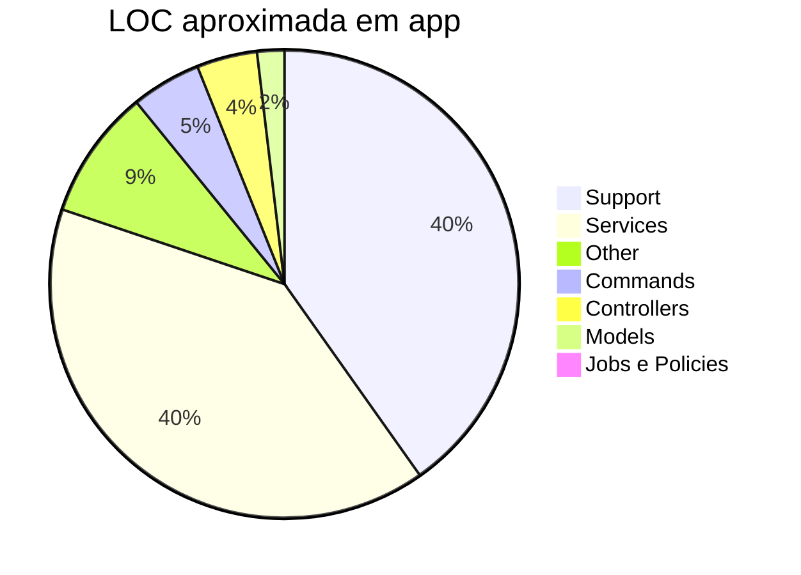

# Qualificação do sistema e cobertura de testes

**Versão do produto:** 8.2.2 · **Última revisão:** 2026-07-24  
**Ramo de referência:** `main` · tag `20260724e-Metis`

> **Índice:** [README.md](../README.md) · [STATUS_PROJETO.md](STATUS_PROJETO.md) · [PLANO_TESTES_UNITARIOS.md](PLANO_TESTES_UNITARIOS.md) · [ENTREGAS_ESCALONADAS_MELHORIAS_FUTURAS.md](ENTREGAS_ESCALONADAS_MELHORIAS_FUTURAS.md) · [ANALISE_PADROES_LARAVEL.md](ANALISE_PADROES_LARAVEL.md)

Documento de **qualificação** (tipo, porte, fundamentos) e de **cobertura de testes** (inventário, cenários, lacunas e metas). Complementa o plano histórico de unitários; não substitui o [STATUS_PROJETO.md](STATUS_PROJETO.md).

---

## 1. Qualificação do sistema

### 1.1 Tipo

| Dimensão | Classificação |
|----------|----------------|
| **Produto** | Plataforma web **B2G / educação municipal** — consultoria de dados, BI operacional e GIS comercial |
| **Modelo** | Aplicação **multi-município** (catálogo de cidades + ligação a bases **i-Educar** por município) |
| **Domínio** | Indicadores educacionais, FUNDEB/VAAT/VAAR, CadÚnico, SAEB, Educacenso (Clio), mapa Horizonte |
| **Estilo arquitectónico** | Monólito modular Laravel (MVC + Services + Jobs + Policies) com front Vite e filas longas |
| **Integrações** | APIs/dados públicos (FNDE, IBGE, MDS/Cecad, Tesouro, SICONFI, INEP) + SQL directo i-Educar (MySQL/PostgreSQL) |

Não é um CMS genérico nem um ERP escolar: é uma **camada analítica e de abastecimento** sobre sistemas municipais e fontes oficiais.

### 1.2 Porte (dimensão técnica — `main` em 2026-07-24)

| Indicador | Ordem de grandeza |
|-----------|-------------------|
| Ficheiros PHP em `app/` | **~683** |
| LOC PHP em `app/` | **~151 mil** |
| Services | **~171** (~60k LOC) |
| Support | **~60k LOC** (helpers, catálogos, regras puras) |
| Controllers HTTP | **~58** (~6k LOC) |
| Commands Artisan | **~61** |
| Models Eloquent | **~37** |
| Jobs de fila | **5** |
| Policies | **7** |
| Rotas HTTP nomeadas | **~169** (admin ~46, Clio ~29, consultoria ~16, Horizonte ~4, resto auth/UX) |
| Views Blade | **~321** |
| Testes PHPUnit | **~306** ficheiros · **~996** métodos · **~23,5k** LOC |
| Rácio testes / app (LOC) | **~0,16** |
| Rácio ficheiros teste / PHP app | **~0,45** |

**Porte:** **grande** (aplicação empresarial de domínio denso), não “startup CRUD”. O peso está em **Services + Support** (regras e ETL), não nos controllers.

Distribuição aproximada de LOC em `app/`:



### 1.3 Fundamentos

| Camada | Escolha |
|--------|---------|
| Runtime | PHP **8.3+** (CI 8.3 e 8.4) |
| Framework | **Laravel** (fila, auth, policies, Artisan, Vite) |
| Base app | **MySQL/MariaDB** (utilizadores, cidades, sync, Clio, BI) |
| Bases municipais | **i-Educar** por cidade (MySQL ou PostgreSQL) |
| Cache / sessão / filas (prod) | **Redis** recomendado; worker `default,admin-sync,clio` |
| Front | Vite + JS modular (code-split Horizonte/Clio/analytics) |
| Qualidade | PHPUnit Unit+Feature; CI GitHub Actions; clover opcional |
| Segurança | RBAC (admin / user / municipal), LGPD/consentimento, `SafeOutboundUrl`, uploads tipados |
| Observabilidade | Laravel Pulse (ingest Redis em checklist ops) |

Princípios de desenho recorrentes: **hubs admin** de importação; **fila `admin-sync`** para ETL longo; **consultoria lazy** por aba; **mapa Horizonte** com fingerprint/cache; **Clio** como pipeline CSV → análise → PDF/BI.

---

## 2. Inventário da suite de testes

### 2.1 Pirâmide actual

| Camada | Ficheiros | Papel |
|--------|-----------|--------|
| **Unit** (`tests/Unit`) | **271** | Regras, parsers, resolvers, catálogos, Jobs (contrato), Clio |
| **Feature** (`tests/Feature`) | **35** | HTTP, AuthZ, redirects/flash, filas `Queue::fake` |
| **Manual / ops** | — | Import FUNDEB real, malha IBGE nacional, smoke municipal |

Runner local: `composer test` → `scripts/run-tests.sh` → `vendor/bin/phpunit` com `pdo_sqlite` via `scripts/php-with-sqlite.sh`.  
CI: `.github/workflows/phpunit.yml` (Unit+Feature; job `coverage` clover **sem** threshold).

### 2.2 Cobertura por domínio (ficheiros Unit)

| Domínio | Ficheiros Unit (aprox.) | Força relativa |
|---------|-------------------------|----------------|
| Horizonte / GIS | 54 | Alta |
| FUNDEB / finanças | 46 | Alta |
| Consultoria / Analytics / RX | 37 | Boa |
| Clio | 29 | Boa |
| Admin / sync / ops | 24 | Média–boa |
| CadÚnico | 17 | Média |
| i-Educar / schema | 10 | Média |
| Auth / legal / UX | 9 | Média (Feature ajuda) |
| Documentação / release | 7 | Pontual |
| Jobs / filas | 5 | Contrato coberto (Fase E) |
| Segurança | 2 | Crítico mas fino (`SafeOutboundUrl`, paths) |
| Outros / suporte | 31 | Variado |

### 2.3 Feature — cenários cobertos (resumo)

| Área | Exemplos de cenários |
|------|----------------------|
| **Auth / perfis** | Welcome, profile, sessões, gestão de utilizadores, City policy, acesso operacional |
| **Legal** | Consentimento, privacidade, documentos admin |
| **Admin AuthZ** | Public Data, CadÚnico sync, Geo, Pedagógico, FUNDEB, SGE, resume sync-queue, Connections, Monitor, Docs |
| **Horizonte** | Acesso mapa; POSTs abastecimento (feed/educacenso/geo/bundle) AuthZ + flash |
| **Consultoria** | Dashboard analytics smoke; export PDF relatório; inclusão NEE export |
| **Filas** | Dispatch/processamento `ProcessAdminSyncTaskJob`; flush processing |
| **Clio** | Subconjunto Feature (pipeline/reanalyze — ver suite Clio) |
| **RX / notificações** | Dashboard RX; feed notificações |

### 2.4 Jobs (5/5 com Unit)

| Job | O que o Unit garante |
|-----|----------------------|
| `ProcessAdminSyncTaskJob` | Fila `admin-sync`, timeout/tries; no-op se task em falta ou já `completed` |
| `ImportMunicipalTransfersJob` | Fila/timeout; `ModelNotFoundException` se cidade inexistente |
| `GenerateAnalyticsReportPdfJob` | Fila `default`, timeout/tries; no-op se export em falta/`completed` |
| `ProcessClioCampaignIngestJob` | Fila `clio`, timeout 900 / tries 2; no-op sem campanha |
| `ProcessClioCampaignAnalyzeJob` | Fila `clio`, timeout 1200 / tries 2; no-op sem campanha |

`handle` completo com serviços `final` fica fora do mock fácil — regressão de **efeito** continua em Feature/`AdminSyncQueueTest` e fluxos Clio.

---

## 3. Lacunas relevantes

| Lacuna | Impacto | Notas |
|--------|---------|--------|
| **% de linhas (clover) sem meta no CI** | Não há gate numérico | Artefacto clover opcional; ambiente local sem pcov/xdebug por defeito |
| **Feature Clio parcial** | Regressões UI/upload | Unit Clio forte; Feature HTTP ainda limitada |
| **~metade dos controllers sem Feature directa** | AuthZ/export pode escapar | Auth Breeze e vários exports Clio/analytics |
| **Serviços `final`** | Happy-path HTTP difícil de mockar | Preferir validação/config desligada + AuthZ; ou extrair interfaces no futuro |
| **SQL i-Educar real** | Falsos verdes em Unit | `IeducarSchemaTest` + testes manuais municipais |
| **Front JS** | Sem suite automatizada dedicada | Code-split coberto por build, não por testes E2E |

Diagnóstico pós-Fase E: suite **mais estável** (sqlite runner + consentimento em testes + AuthZ admin), ainda **assimétrica** (Unit >> Feature).

---

## 4. Metas de cobertura

Metas são **orientadoras** (não substituem revisão de PR). Medição preferencial: clover sobre `app/` excluindo `View/`, stubs e providers de bootstrap se o ruído for alto.

### 4.1 Metas por horizonte

| Horizonte | Meta | Critério de done |
|-----------|------|------------------|
| **H0 — agora (baseline)** | Inventário + clover no CI sem falhar o merge | Este documento; job `coverage` continua `continue-on-error` |
| **H1 — 30–60 dias** | **≥ 40%** linhas em `app/Services` + `app/Jobs` + `app/Policies` + `app/Support/Http` | Gate opcional só nesses paths; AuthZ Feature em todo POST admin mutador restante |
| **H2 — trimestre** | **≥ 55%** nos mesmos paths; **≥ 25%** Feature routes críticas (admin + Clio + consultoria smoke) | Threshold CI em paths críticos; 1 smoke Feature por módulo de menu |
| **H3 — semestre** | **≥ 65%** paths críticos; zero Job/Policy sem teste de contrato | Revisar exclusões clover; E2E mínimo (Playwright/Dusk) opcional |

### 4.2 Metas qualitativas (sempre)

1. **Todo Job novo** → Unit de fila/timeout + early-return ou Feature `assertPushed`.
2. **Todo POST admin mutador** → Feature AuthZ (403 não-admin) + flash/redirect feliz ou de validação.
3. **Toda regra FUNDEB/Clio/Horizonte pura** → Unit sem rede.
4. **Nenhum threshold global 80%+** enquanto Support+Services ultrapassarem ~120k LOC — priorizar **paths críticos**.

### 4.3 O que *não* é meta

- Cobrir 100% de Blade/JS.
- Mockar todos os serviços `final` só para inflar %.
- Substituir validação com dados oficiais reais por Unit.

---

## 5. Como medir e acompanhar

```bash
# Suite completa (local)
composer test

# Só Unit / Feature
bash scripts/run-tests.sh --testsuite=Unit
bash scripts/run-tests.sh --testsuite=Feature

# Clio
composer test:clio

# Clover (CI ou local com pcov/xdebug)
# ver job coverage em .github/workflows/phpunit.yml
```

Actualizar este documento quando:

- o rácio Unit/Feature mudar materialmente (±20 ficheiros);
- se adoptar threshold no CI;
- um módulo novo entrar em produção (ex.: novo domínio de importação).

---

## 6. Relação com outros docs

| Documento | Papel |
|-----------|--------|
| [PLANO_TESTES_UNITARIOS.md](PLANO_TESTES_UNITARIOS.md) | Convenções e mapa histórico de unitários por classe |
| [ENTREGAS_ESCALONADAS_MELHORIAS_FUTURAS.md](ENTREGAS_ESCALONADAS_MELHORIAS_FUTURAS.md) | Fases A–E (qualidade → segurança → perf → docs → gaps) |
| [ANALISE_PADROES_LARAVEL.md](ANALISE_PADROES_LARAVEL.md) | Auditoria de padrões (inclui testes) |
| [SEGURANCA.md](SEGURANCA.md) | Controles que os testes de AuthZ devem guardar |
| [STATUS_PROJETO.md](STATUS_PROJETO.md) | Capacidade funcional (não é matriz de testes) |

---

*Inventário gerado a partir da árvore `app/` e `tests/` em 2026-07-24; percentagens de linha clover a preencher quando o artefacto CI estiver disponível de forma estável.*
