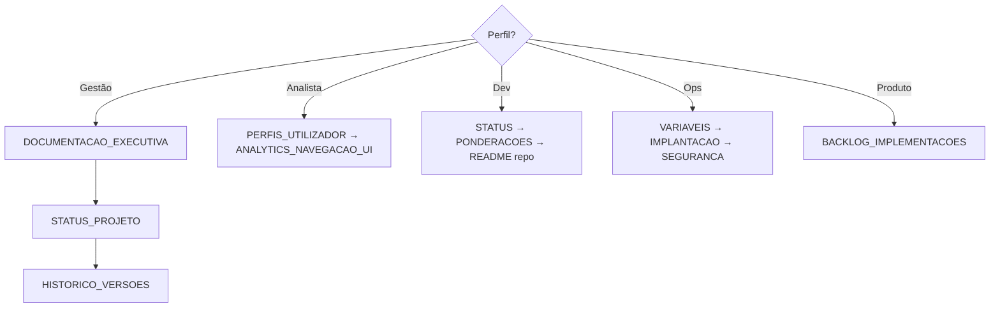
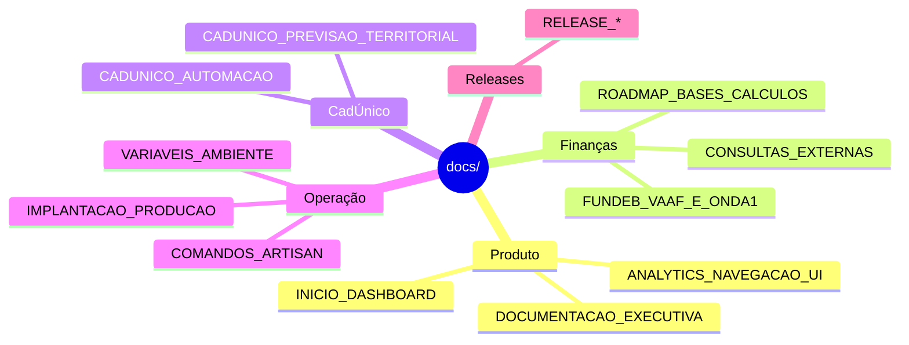
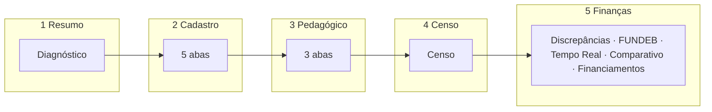

# Documentação central — servlitcys

**Versão do produto:** 4.4.2 · tag `20260608a-Pythia` · **Última revisão:** 2026-06-08

Ponto de entrada da documentação técnica e funcional. Para **padrão editorial** (tom, cabeçalhos, hierarquia): [PADRAO_DOCUMENTACAO.md](PADRAO_DOCUMENTACAO.md). Para **diagramas** (arquitectura, deploy, FUNDEB, releases): [ARQUITETURA_E_FLUXOS.md](ARQUITETURA_E_FLUXOS.md).

**Hub visual** (timeline 4.x, mapa de docs): [HUB_DOCUMENTACAO.md](HUB_DOCUMENTACAO.md) — leitor Documentação na app · [canvases/documentacao-hub.canvas.tsx](../canvases/documentacao-hub.canvas.tsx) no Cursor IDE.

### Leitor na aplicação (`/documentacao`)

| Recurso | Descrição |
|---------|-----------|
| **Menu lateral** | Seis secções numeradas (Entrada → Operação) + releases descobertos |
| **Pesquisa** | Campo no menu — mínimo 2 caracteres; indexa título, secção e cabeçalhos |
| **Neste documento** | Sumário à direita (desktop) com âncoras nos títulos `h1`–`h4` |
| **Idioma** | Português europeu — cadastro, utilizador, secção, arquitectura |

---

## Começar aqui

| Perfil | Leia primeiro |
|--------|----------------|
| Gestão / secretaria | [DOCUMENTACAO_EXECUTIVA.md](DOCUMENTACAO_EXECUTIVA.md) → [STATUS_PROJETO.md](STATUS_PROJETO.md) → [HISTORICO_VERSOES.md](HISTORICO_VERSOES.md) |
| Analista (utilizador) | [PERFIS_UTILIZADOR.md](PERFIS_UTILIZADOR.md) → [DESIGN_SYSTEM.md](DESIGN_SYSTEM.md) → [ANALYTICS_NAVEGACAO_UI.md](ANALYTICS_NAVEGACAO_UI.md) |
| Desenvolvimento | [STATUS_PROJETO.md](STATUS_PROJETO.md) → [ARQUITETURA_E_FLUXOS.md](ARQUITETURA_E_FLUXOS.md) → [PONDERACOES_TECNICAS.md](PONDERACOES_TECNICAS.md) → [README do repositório](../README.md) |
| Operações / deploy | [VARIAVEIS_AMBIENTE.md](VARIAVEIS_AMBIENTE.md) → [IMPLANTACAO_PRODUCAO.md](IMPLANTACAO_PRODUCAO.md) → [SEGURANCA.md](SEGURANCA.md) → [COMANDOS_ARTISAN.md](COMANDOS_ARTISAN.md) |
| Priorização de produto | [BACKLOG_IMPLEMENTACOES.md](BACKLOG_IMPLEMENTACOES.md) |

---

## Documentos âncora

| Documento | Função |
|-----------|--------|
| [HUB_DOCUMENTACAO.md](HUB_DOCUMENTACAO.md) | Mapa visual — versão, 4.x, consultoria, releases |
| [ARQUITETURA_E_FLUXOS.md](ARQUITETURA_E_FLUXOS.md) | Diagramas: camadas, RBAC, consultoria, FUNDEB, deploy, releases |
| [PADRAO_DOCUMENTACAO.md](PADRAO_DOCUMENTACAO.md) | Padrão editorial e checklist de manutenção |
| [HISTORICO_VERSOES.md](HISTORICO_VERSOES.md) | Tags, commits e trajetória de releases |
| [STATUS_PROJETO.md](STATUS_PROJETO.md) | Funcionalidades **implementadas** em produção |
| [PONDERACOES_TECNICAS.md](PONDERACOES_TECNICAS.md) | Decisões técnicas e limites do sistema |
| [DESIGN_SYSTEM.md](DESIGN_SYSTEM.md) | Identidade visual e ordem das abas |
| [BACKLOG_IMPLEMENTACOES.md](BACKLOG_IMPLEMENTACOES.md) | Evoluções planeadas (único backlog) |

---

## Mapa por tema

### 1. Produto e acesso

| Documento | Conteúdo |
|-----------|----------|
| [DOCUMENTACAO_EXECUTIVA.md](DOCUMENTACAO_EXECUTIVA.md) | Propósito, público, governação |
| [INICIO_DASHBOARD.md](INICIO_DASHBOARD.md) | Início admin — KPIs, atalhos, mapa mental |
| [PERFIS_UTILIZADOR.md](PERFIS_UTILIZADOR.md) | RBAC: admin, user, municipal |
| [SEGURANCA.md](SEGURANCA.md) | Senhas, sessões, checklist produção |

### 2. Consultoria municipal (`/dashboard/analytics`)

| Documento | Conteúdo |
|-----------|----------|
| [ANALYTICS_NAVEGACAO_UI.md](ANALYTICS_NAVEGACAO_UI.md) | 5 áreas, UI, Diagnóstico, lazy-load |
| [CONSULTORIA_ABAS_DECISAO.md](CONSULTORIA_ABAS_DECISAO.md) | Decisão de produto — cenário C (4.1.0) |
| [METRICAS_QUERIES_ANALYTICS.md](METRICAS_QUERIES_ANALYTICS.md) | Performance, Pulse, Diagnóstico estratégico |
| [CADUNICO_CECAD.md](CADUNICO_CECAD.md) · [CADUNICO_AUTOMACAO.md](CADUNICO_AUTOMACAO.md) | CadÚnico / Cecad |
| [CADUNICO_FAIXAS_ETARIAS_FUNDEB.md](CADUNICO_FAIXAS_ETARIAS_FUNDEB.md) | Faixas 4–17, 0–3 e indicadores FUNDEB |
| [CADUNICO_PREVISAO_TERRITORIAL.md](CADUNICO_PREVISAO_TERRITORIAL.md) | Mapa territorial e pressão |
| [RELATORIO_PDF_ATM.md](RELATORIO_PDF_ATM.md) | PDF Serventec |
| [POWERBI.md](POWERBI.md) | Estudo Power BI — integração, ETL, DAX, previsão |
| [SUGESTOES_GRAFICOS_INFERENCIAS_MEC_INEP.md](SUGESTOES_GRAFICOS_INFERENCIAS_MEC_INEP.md) | Cobertura MEC/INEP |
| [saeb_pedagogico_referencias.md](saeb_pedagogico_referencias.md) | SAEB / IDEB |
| [PLUGINS_E_REFINO_CADASTRO_IEDUCAR.md](PLUGINS_E_REFINO_CADASTRO_IEDUCAR.md) | Cadastro e integrações |
| [DOCUMENTO_EXECUTIVO_ROADMAP_INCLUSAO_E_QUALIDADE_CADASTRO.md](DOCUMENTO_EXECUTIVO_ROADMAP_INCLUSAO_E_QUALIDADE_CADASTRO.md) | Roadmap NEE / AEE |

### 3. Financiamento e repasses

| Documento | Conteúdo |
|-----------|----------|
| [FUNDEB_VAAF_E_ONDA1.md](FUNDEB_VAAF_E_ONDA1.md) | VAAF, VAAT, VAAR, previsão |
| [CONSULTAS_EXTERNAS.md](CONSULTAS_EXTERNAS.md) | FNDE, Tesouro, INEP, repasses |
| [BB_EXTRATO_OPEN_FINANCE.md](BB_EXTRATO_OPEN_FINANCE.md) | Extrato BB / Open Finance |
| [EXPORTACAO_DADOS_FUNDEB_PLANILHA.md](EXPORTACAO_DADOS_FUNDEB_PLANILHA.md) | Export matriz FUNDEB |
| [POWERBI.md](POWERBI.md) | Power BI — cenários, licenciamento, roadmap |
| [COMPARATIVO_VAAF_SERVLITCYS_VS_FNDE_MEC.md](COMPARATIVO_VAAF_SERVLITCYS_VS_FNDE_MEC.md) | Base local vs FNDE |

### 4. Releases (recentes primeiro)

| Documento | Versão |
|-----------|--------|
| [RELEASE_20260608a_PYTHIA.md](RELEASE_20260608a_PYTHIA.md) | **4.4.2** — Pythia |
| [RELEASE_20260607b_PEITHO.md](RELEASE_20260607b_PEITHO.md) | **4.4.1** — Peitho |
| [RELEASE_20260607a_ANANKE.md](RELEASE_20260607a_ANANKE.md) | 4.4.0 — Ananke |
| [RELEASE_20260611_HARMONIA.md](RELEASE_20260611_HARMONIA.md) | 4.3.0 — Harmonia |
| [RELEASE_20260610_CLIO.md](RELEASE_20260610_CLIO.md) | 4.2.0 — Clio |
| [RELEASE_20260609_THEIA.md](RELEASE_20260609_THEIA.md) | 4.1.9 — Theia |
| [RELEASE_20260608_SOPHIA.md](RELEASE_20260608_SOPHIA.md) | 4.1.8 — Sophia |
| [RELEASE_20260607_PHRONESIS.md](RELEASE_20260607_PHRONESIS.md) | 4.1.7 — Phronesis |
| [RELEASE_20260606_ALETHEIA.md](RELEASE_20260606_ALETHEIA.md) | 4.1.6 — Aletheia |
| [RELEASE_20260605_EUNOMIA.md](RELEASE_20260605_EUNOMIA.md) | 4.1.2 — Eunomia |
| [RELEASE_20260605_KAIROS.md](RELEASE_20260605_KAIROS.md) | 4.1.1 — Kairos |
| [RELEASE_20260605_ATHENA.md](RELEASE_20260605_ATHENA.md) | 4.1.0 — Athena |
| [RELEASE_20260604_HESTIA.md](RELEASE_20260604_HESTIA.md) | 4.0.0 — Hestia |

Histórico completo: [HISTORICO_VERSOES.md](HISTORICO_VERSOES.md).

### 5. Integrações e dados públicos *(admin)*

| Documento | Conteúdo |
|-----------|----------|
| [IMPORTACAO_DADOS_PUBLICOS.md](IMPORTACAO_DADOS_PUBLICOS.md) | Hub `/admin/dados-publicos` |
| [IMPORTACAO_SAEB_PLANILHAS_INEP.md](IMPORTACAO_SAEB_PLANILHAS_INEP.md) | Planilhas INEP → SAEB |
| [ESTUDO_AGENTES_IA_SERVLITCYS.md](ESTUDO_AGENTES_IA_SERVLITCYS.md) | Agentes, LLM, RAG e copilot |
| [ESTUDO_INTEGRACOES_SETOR_PUBLICO_E_PREVISAO_DEMANDA.md](ESTUDO_INTEGRACOES_SETOR_PUBLICO_E_PREVISAO_DEMANDA.md) | Estudo setor público |
| [CATALOGO_API_IEDUCAR_CONSULTAS_DIRETAS.md](CATALOGO_API_IEDUCAR_CONSULTAS_DIRETAS.md) | Proposta API i-Educar |
| [ROADMAP_BASES_CALCULOS_FINANCEIROS.md](ROADMAP_BASES_CALCULOS_FINANCEIROS.md) | Motor de repasses (futuro) |

### 6. Operação e deploy *(admin)*

| Documento | Conteúdo |
|-----------|----------|
| [VARIAVEIS_AMBIENTE.md](VARIAVEIS_AMBIENTE.md) | Referência `.env` |
| [IMPLANTACAO_PRODUCAO.md](IMPLANTACAO_PRODUCAO.md) | Deploy, filas, cron |
| [COMANDOS_ARTISAN.md](COMANDOS_ARTISAN.md) | CLI (incl. repasses §4.1) |
| [PERFORMANCE.md](PERFORMANCE.md) | Redis e performance |
| [PLANO_TESTES_UNITARIOS.md](PLANO_TESTES_UNITARIOS.md) | Estratégia de testes |

### 7. Entregas escalonadas

| Documento | Conteúdo |
|-----------|----------|
| [ENTREGAS_ESCALONADAS.md](ENTREGAS_ESCALONADAS.md) | Índice mensal + ligação às releases |
| [ENTREGAS_ESCALONADAS_JUNHO_2026.md](ENTREGAS_ESCALONADAS_JUNHO_2026.md) | Jun/2026 — 3.5.0 → 4.4.2 (20 releases) |
| [ENTREGAS_ESCALONADAS_MAIO_2026.md](ENTREGAS_ESCALONADAS_MAIO_2026.md) | Mai/2026 *(arquivo)* — 2.3.6 → 3.4.0 |

### 8. Arquivo

| Documento | Conteúdo |
|-----------|----------|
| [DOCUMENTO_EXECUTIVO_REVISAO_PROJETO.md](DOCUMENTO_EXECUTIVO_REVISAO_PROJETO.md) | Revisão Laravel |
| [DOCUMENTO_EXECUTIVO_REDE_OFERTA_BI.md](DOCUMENTO_EXECUTIVO_REDE_OFERTA_BI.md) | Rede & oferta — BI |
| [DOCUMENTO_EXECUTIVO_TESTE_MAPA_UNIDADES_ESCOLARES.md](DOCUMENTO_EXECUTIVO_TESTE_MAPA_UNIDADES_ESCOLARES.md) | Testes mapa |

---

## Consultoria — abas (4.1.0+)

Faixa de impacto (saldo indicativo): `AnalyticsTabImpactBuilder` — ver [METRICAS_QUERIES_ANALYTICS.md](METRICAS_QUERIES_ANALYTICS.md).

---

## Leitura na interface

| Perfil | Caminho |
|--------|---------|
| **Administrador** | Menu → **Documentação** (`/admin/documentacao`) |
| **Utilizador / Municipal** | Menu → **Recursos** → **Documentação** (`/documentacao`) |
| **Filas** | `/filas` ou `/admin/sync-queue` |

Links internos abrem no leitor da mesma rota; «Ver no GitHub» usa `config/documentation.php` → `github.repository`.

---

## Manutenção

Seguir [PADRAO_DOCUMENTACAO.md](PADRAO_DOCUMENTACAO.md) §6. Resumo:

1. Funcionalidade nova → `STATUS_PROJETO.md` + release se visível ao utilizador
2. Decisão técnica → `PONDERACOES_TECNICAS.md`
3. Planeamento → `BACKLOG_IMPLEMENTACOES.md`
4. Versão → `HISTORICO_VERSOES.md` + `config/documentation.php`
5. Diagrama novo de arquitectura → preferir [ARQUITETURA_E_FLUXOS.md](ARQUITETURA_E_FLUXOS.md)

---

*Instalação do repositório: [README.md](../README.md).*
