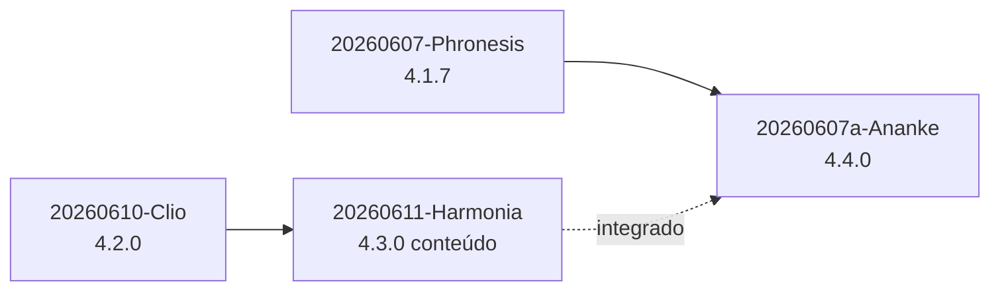
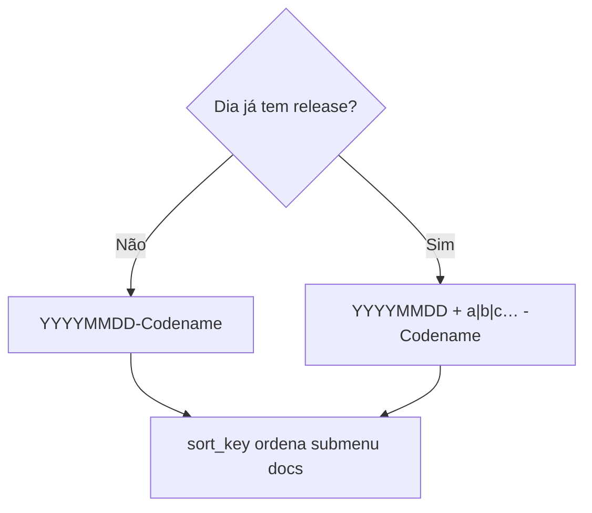

# Release `20260607a-Ananke` — ServLitcys 4.4.0

**Data:** 2026-06-07 · **Ramo:** `main` · **Figura:** *Ananke* (necessidade ordenada — tags de release com sufixo no mesmo dia e paridade de discrepâncias).

## Resumo

Marco **4.4.0** sobre **4.3.0** (Harmonia — conteúdo integrado; data da tag corrigida) e **4.2.0** (Clio):



Convenção de tag no mesmo dia:



### Convenção de tags (mesmo dia)

- Formato habitual: `YYYYMMDD-Codename` (ex.: `20260607-Phronesis`).
- **Segunda release (ou seguinte) no mesmo dia civil:** `YYYYMMDD` + letra minúscula em sequência + `-Codename` (ex.: `20260607a-Ananke`, `20260607b-…`).
- `ProductReleaseTag` e `DocumentationCatalog` usam `sort_key` com data + sufixo para ordenar o submenu de releases sem colisão.

### Admin — compatibilidade i-Educar

- Matriz FUNDEB anual com coluna **VAAR**; export CSV `fundeb-vaaf-vaat-vaar-*.csv`.
- **CadÚnico** no painel modular de discrepâncias (`CadunicoOperationalSignals`).
- Discrepâncias avaliam o **ano letivo vigente** (`compatibility.vigente_year`).

### Paridade admin ↔ consultoria (Discrepâncias)

- `DiscrepanciesPanelAssembler` como fonte única de rotinas, NEE e sinais operacionais (FUNDEB, CadÚnico, rede).
- Mesma lógica em `/admin/ieducar-compatibility` e na aba Finanças → Discrepâncias.

### Painel RX e gráfico FUNDEB (desde Harmonia)

- Portaria FUNDEB completa no RX; gráfico de complementações na home; `fundeb:import-api --replace`.
- Ritmo de cadastro 24h/48h/72h; FUNDEB estimado na coluna Município; correções de tooltip e zoom.

## Deploy

```bash
git fetch --tags && git checkout 20260607a-Ananke
composer install --no-dev
npm ci && npm run build
php artisan migrate --force
php artisan view:clear
php artisan config:clear
```

## Testes

```bash
php artisan test --filter='ProductReleaseTagTest|DocumentationCatalogTest|DiscrepanciesModuleCatalogTest|IeducarCompatibilityProbeTest'
```

## Documentação

- [HISTORICO_VERSOES.md](HISTORICO_VERSOES.md)
- [ARQUITETURA_E_FLUXOS.md](ARQUITETURA_E_FLUXOS.md) — diagramas de sistema e deploy
- [PADRAO_DOCUMENTACAO.md](PADRAO_DOCUMENTACAO.md) §6
- [README.md](../README.md) e [docs/README.md](README.md) — índice revisado com Mermaid
