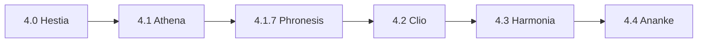

# Release `20260610-Clio` — ServLitcys 4.2.0

**Data:** 2026-06-10 · **Ramo:** `main` · **Figura:** *Clio* (registo fiel — portaria consolidada vs cadastro em curso).

## Contexto na linha 4.x



Ver [ARQUITETURA_E_FLUXOS.md](ARQUITETURA_E_FLUXOS.md) e [HISTORICO_VERSOES.md](HISTORICO_VERSOES.md).

## Resumo

Minor **4.2.0** sobre **4.1.9** (Theia — projeção Finanças e mapa CadÚnico):

### FUNDEB — portaria 6/2026 e importação

- **VAAT:** parse de `vaat_antes`, `vaat_com_compl`, `iei_pct`; coluna `complementacao_vaat` em `fundeb_municipio_references`.
- **VAAR:** `FundebFndeVaarCsvService` + coeficiente e complementação no import (`FundebOpenDataImportService`).
- **Expectativa portaria:** `FundebPortariaExpectation` usa `complementacao_vaat` (não o VAAT bruto).
- **Discrepâncias:** módulo `fundeb` (`FundebOperationalSignals`) — VAAF fonte Censo vs i-Educar, IBGE×nome divergente.
- **Projeção Finanças:** KPI previsão VAAT + IEI (`FundebResourceProjection`).
- **Admin:** badges VAAF/VAAT/VAAR no card FUNDEB.

### Painel RX — complementações da portaria

- Gráfico empilhado **Complementações previstas por município** (VAAF/VAAT/VAAR em milhões de R$).
- Fonte: referências importadas ou CSV receita FNDE; exercício = ano vigente (`RX_VIGENTE_YEAR`) ou `RX_FUNDEB_PORTARIA_EXERCICIO`.
- Callout distingue cadastro RX (em andamento) de dados consolidados da portaria.

### Consultoria — Discrepâncias

- Hub modular (`DiscrepanciesModuleCatalog`) com cartões por área e painel admin alinhado.

## Deploy

```bash
git fetch --tags && git checkout 20260610-Clio
composer install --no-dev
npm ci && npm run build
php artisan migrate --force
php artisan view:clear
php artisan config:clear
php artisan fundeb:import-api 0 --all --from=2025 --to=2026 --nearest
```

## Testes

```bash
php artisan test --filter='FundebOpenDataImportServiceTest|FundebFndeVaatCsvServiceTest|RxFundebPortariaChartTest|ChartPayloadTest|DiscrepanciesModuleCatalogTest|RxDashboardTest'
```

## Documentação

- `/dashboard/rx` — gráfico FUNDEB portaria (após import)
- `/dashboard/analytics` → Finanças → Discrepâncias / FUNDEB
- `/admin/ieducar-compatibility` — matriz VAAF/VAAT/VAAR e painel discrepâncias
- [FUNDEB_VAAF_E_ONDA1.md](FUNDEB_VAAF_E_ONDA1.md) · [VARIAVEIS_AMBIENTE.md](VARIAVEIS_AMBIENTE.md) (`RX_FUNDEB_PORTARIA_EXERCICIO`)
