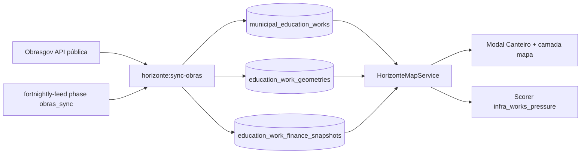

# Roadmap — Canteiro (obras de educação / Obrasgov · SIMEC)

**Versão do produto:** 9.0.0 · **Última revisão:** 2026-07-25 · **Estado:** implementado (fases 0–7) · extrator alinhado à API real

> **Índice:** [ROADMAP_INDICE.md](ROADMAP_INDICE.md) · **Horizonte:** [ROADMAP_HORIZONTE.md](ROADMAP_HORIZONTE.md) · **Guia técnico:** [HORIZONTE.md](HORIZONTE.md) · **Backlog:** [BACKLOG_IMPLEMENTACOES.md](BACKLOG_IMPLEMENTACOES.md) § J · **Consultas:** [CONSULTAS_EXTERNAS.md](CONSULTAS_EXTERNAS.md)

Integração de **obras públicas de educação** (em execução, paralisadas, inacabadas, canceladas, cadastradas — excluir ou destacar `Concluída`) no Servlitcys, a partir da API pública **Obrasgov.br** (com SIMEC/FNDE como origem dominante).

---

## 1. Nome sugerido e local de uso

| Opção | Papel | Notas |
|-------|-------|--------|
| **Canteiro** *(recomendado)* | Nome de produto / bloco UI | Claro para gestores; diferencia de convênios/empenhos já existentes |
| **Opus** | Codename de release / epic interno | Alinha ao padrão mitológico/latino das tags |
| ID backlog | `HOR-19` (+ `INT-10` se separado) | Enriquecimento Horizonte |

**Onde usar (prioridade):**

1. **Horizonte — modal municipal** — bloco *Canteiro* abaixo de Finanças / Transparência: contagens por situação, top obras, valor/empenho quando houver, link Obrasgov/SIMEC.
2. **Horizonte — mapa** — camada opcional de pins (paralisada / em execução), cluster por UF; filtro «municípios com obra paralisada ou em execução».
3. **Segmentos comerciais** — «infraestrutura escolar travada», «expansão física em curso» (apoia fecho comercial + priorização de visita).
4. **Hub abastecimento** (`/admin/horizonte/abastecimento`) — fase `obras_sync` no feed bimestral, espelhando `transparency_sync` / `siconfi_sync`.
5. **Secundário (fase 2)** — ficha consultoria / PDF analítico (resumo de obras no município cliente); Power BI só se houver demanda explícita.

**Fora de escopo inicial:** scraping do painel SIMEC Obras 2.0 (sem API estável); obras 100 % estaduais/municipais sem recurso federal (Obrasgov cobre sobretudo financiamento federal).

---

## 2. Como enriquece o Servlitcys

| Dimensão | Hoje | Com Canteiro |
|----------|------|--------------|
| **Prospecção (Horizonte)** | FUNDEB, fiscal, SAEB, convênios/empenhos | Sinal de **capacidade/necessidade de infraestrutura física** e risco de execução |
| **Narrativa comercial** | Déficit pedagógico / pressão financeira | «Há creche/escola paralisada / em execução no município» — gatilho de visita e de solução (gestão, prestação de contas, SGE) |
| **Scoring** | Sem dimensão de obras | Nova dimensão opcional `infra_works_pressure` (ex.: peso de paralisadas + inacabadas; bónus leve a em execução com % físico avançado) |
| **Transparência** | HOR-08 = convênios + empenhos genéricos | Complemento **físico** (obra) vs **financeiro** (empenho) — mesmo município, duas lentes |
| **Operação interna** | Link SIMEC só em alertas | Inventário consultável, sincronizado, filtrável por IBGE |

Valor de negócio: diferenciação face a dashboards só financeiros; alinha ao Pacto de retomada de obras e à fiscalização TCU/FNDE sem depender de login SIMEC no dia a dia da equipa.

---

## 3. Fontes e viabilidade técnica

### 3.1 Fonte primária — Obrasgov.br (API pública)

| Item | Valor |
|------|--------|
| Base nova (usar esta) | `https://api-publica.obrasgov.gestao.gov.br/obras` |
| OpenAPI | `…/obras/openapi.json` · Swagger UI: `…/obras/docs` |
| Auth | Não requerida (dados abertos) |
| API antiga | `api.obrasgov.gestao.gov.br` — **desliga 31/08/2026**; não basear implementação nova nela |
| Paginação | Preferir `pagina` (≥ 1) + `tamanho_da_pagina`; aliases `page`/`size` existem mas o `size` default pode ignorar o pedido |

**Endpoints úteis:**

| Path | Uso no Canteiro |
|------|-----------------|
| `GET /projeto-investimento` | Inventário + filtros de situação/UF/órgão |
| `GET /geometria` | Município (`cod_ibge`, `no_municipio`, `sg_uf`) |
| `GET /execucao-fisica` | % físico, datas, instrumento |
| `GET /empenho` | Origem orçamentária (`fonte`, UG, emenda, valores) |
| `GET /contrato` | Contratada, valores, situação contratual |
| `GET /historico-situacao-cancelada-paralisada` | Justificativa e tratativas de paralisação/cancelamento |
| `GET /estudo-viabilidade` | Complemento (fase 2) |
| `GET /data-atualizacao` | Controlo de freshness do sync |

### 3.2 Fonte complementar — SIMEC Obras 2.0

Painel público [simec.mec.gov.br/painelObras](https://simec.mec.gov.br/painelObras/) — consulta cidadã por UF. **Sem API documentada** para integração. No produto: deep-link + texto «detalhe operacional no SIMEC». No Obrasgov, projetos FNDE já trazem `sistema_resp: SIMEC-FNDE`.

### 3.3 Recorte educação (spike 2026-07-24)

Filtro operacional validado: **CNPJ FNDE** `00378257000262` (`cnpj_organizacao_resp`).

| Situação | Obras FNDE (aprox.) |
|----------|---------------------|
| Concluída | 18.754 |
| Cadastrada | 2.615 |
| Em execução | 1.660 |
| Cancelada | 1.087 |
| Paralisada | 546 |
| Inacabada | 0 |
| **Total FNDE** | **~24.662** |

Exemplo: Bahia + Em execução + FNDE ≈ **198** obras. Quase todas com `sistema_resp = SIMEC-FNDE`.

**Heurística educação além do FNDE (fase 2):** MEC/outras UGs + palavras-chave em `desc_nome` / `desc_funcao_social` / `desc_meta_global` (escola, creche, quadra, Proinfância, etc.) — exigir validação manual da taxa de falso positivo antes de scoring.

---

## 4. Filtros e dados disponíveis (educação)

### 4.1 Filtros na API (`/projeto-investimento`)

| Necessidade | Filtro / campo | Viável? |
|-------------|----------------|---------|
| Status ≠ concluído | `situacao` ∈ `Cadastrada`, `Cancelada`, `Em execução`, `Inacabada`, `Paralisada` | **Sim** (enum oficial) |
| Só educação (FNDE) | `cnpj_organizacao_resp` / `organizacao_resp` / `sistema_resp=SIMEC-FNDE` | **Sim** |
| UF | `uf_principal` | **Sim** |
| Município / IBGE | Não no projeto; via `/geometria?cod_ibge=` (+ join por `id_projeto_investimento`) | **Sim** (2 passos) |
| Espécie (construção/reforma/…) | `especie_intervencao`, `natureza_intervencao` | **Sim** |
| Nome / função social | `desc_nome`, `desc_funcao_social`, `desc_projeto`, `desc_meta_global` | **Sim** (texto) |
| CEP / endereço | `nr_cep`, `desc_endereco` | Parcial (muitos nulos no spike) |
| Datas previstas/efetivas | `dt_*_prevista`, `dt_*_efetiva`, `ano_cadastro` | **Sim** |

### 4.2 Origem do recurso

| Camada | Campos | Nota |
|--------|--------|------|
| Previsto no projeto | `investimentos_previstos[].vl_investimento_previsto` | Placeholder `0.01` **ignorado** pelo extrator (`ObrasgovWorkFieldExtractor::valorPrevisto`) |
| Empenho | `/empenho`: `valor_empenho`, `liquidado`, `pago` (não `valor_empenhado`/`valor_pago`) | Extrator `totaisEmpenho` |
| Datas | Projeto: `dt_inicial_efetiva`/`dt_inicial_prevista`; execução: `dt_inicial_execucao`, `dt_atualizacao_execucao`; histórico: `data_historico_situacao_investimento` | Extrator datas |
| Contrato | `/contrato`: fornecedor, valores, modalidade, `link_transparencia` | Complemento |

### 4.3 Detalhes do ente

| Papel | Campos embutidos |
|-------|------------------|
| Organização responsável | `organizacao_resp`, `cnpj_organizacao_resp` |
| Executor | `executores[]` (`organizacao_executor`, `cnpj_executor`) |
| Tomador | `tomadores[]` (`organizacao_tomador`, `cnpj_tomador`) — no spike FNDE muitas vezes vazio |
| Repassador | `repassadores[]` |
| Sistema de origem | `sistema_resp` (ex.: SIMEC-FNDE) |

**Município beneficiário:** preferir join com `/geometria` (`cod_ibge`, `no_municipio`). Se tomador/CNPJ municipal estiver preenchido, cruzar com catálogo de cidades Servlitcys.

### 4.4 Localização da obra

| Fonte | Campos |
|-------|--------|
| Pin no projeto | `pins[]`: `latitude`, `longitude`, WKT `pin` |
| Geometria | `/geometria`: UF, município, IBGE, `origem_geometria` |
| Endereço textual | `desc_endereco`, `nr_cep` (cobertura irregular) |

### 4.5 Demais informações úteis à educação

- Espécie/meta (`Construção`, `Reforma`, `Ampliação`, «Escola N salas», quadra, creche).
- `%` e datas em `/execucao-fisica`.
- Histórico de paralisação/cancelamento (justificativa, tratativas).
- Fotos embutidas (`fotos[]`) — opcional na UI.
- Eixos/tipos (`eixos_tipos`) — taxonomia MGI; no spike FNDE pode vir desalinhada (não depender só disto para classificar educação).

---

## 5. Arquitetura proposta (espelho HOR-08)



**Persistência sugerida (MVP):**

- `municipal_education_works` — 1 linha por `id_projeto_investimento` + IBGE resolvido, situação, espécie, sistema, datas, pin, JSON leve de meta.
- Agregado no marker: `obras_em_execucao`, `obras_paralisadas`, `obras_canceladas`, `obras_cadastradas`, `has_obras_ativas`.
- Fase 2: tabelas ou colunas para empenho/execução física / histórico.

**Comandos:** `horizonte:sync-obras` · fase `obras_sync` no feed · env `HORIZONTE_OBRAS_*` (base URL, CNPJ FNDE, situações sync, rate limit, cache).

**Rate / volume:** ~25k projetos FNDE; sync nacional por UF ou por `situacao`≠`Concluída` (~7k ativos) é o MVP recomendado. Respeitar paginação e `data-atualizacao`.

---

## 6. Etapas de implantação

| Fase | Entrega | Critério de done | Esforço |
|------|---------|------------------|---------|
| **0 — Spike** *(feito neste doc)* | Validar OpenAPI, filtros educação, volumes | Documento + amostras | 0,5 d |
| **1 — Ingestão MVP** | Client HTTP + `SafeOutboundUrl` + tabela + comando sync (UF/`--ibge`/`--situacao`) | Dados em BD para ≥1 UF; teste unitário do parser | 4–6 d |
| **2 — Modal Canteiro** | Bloco no modal Horizonte (contagens, lista curta, fonte, data captação, regras) | Paridade visual com Finanças/Pedagogia | 2–3 d |
| **3 — Feed + hub** | Fase `obras_sync` + UI abastecimento + VARIÁVEIS / COMANDOS | Operável em produção como SICONFI | 1–2 d |
| **4 — Mapa + filtros** | Camada pins/cluster; filtro segmento «obra travada / em curso» | Toggle no mapa; performance UF grande | 3–5 d |
| **5 — Financeiro + histórico** | Join empenho + execução física + histórico paralisação | Valores e % no detalhe da obra | 3–4 d |
| **6 — Scoring + segmentos** | `infra_works_pressure` + HOR-11 | Documentado em HORIZONTE § scoring | 2–3 d |
| **7 — Polish** | Deep-link SIMEC; PDF consultoria; alertas | Opcional conforme demanda | 2–3 d |

**Ordem sugerida:** `0 → 1 → 2 → 3 → 4 → 5 → 6` (7 sob demanda).

---

## 7. Dimensionamento de custo

Estimativas em **dias-pessoa** (dev pleno familiarizado com Horizonte). Converter para R$ com a taxa interna da Serventec.

| Pacote | Conteúdo | Dias | Faixa relativa |
|--------|----------|------|----------------|
| **MVP comercial** | Fases 1–3 (sync + modal + feed) | **7–11** | Obrigatório para valor em prospecção |
| **Mapa completo** | MVP + fase 4 | **10–16** | Alto impacto visual |
| **Canteiro completo** | Até fase 6 | **15–23** | Paridade com outras dimensões HOR-* |
| **Opcional PDF/alertas** | Fase 7 | +2–3 | Baixa prioridade |

**Custos não-dev:**

| Item | Nota |
|------|------|
| API / licença | R$ 0 (dados abertos) |
| Infra | Storage baixo (~dezenas de MB); CPU no sync (paginação); cache Redis opcional |
| Risco de migração API | Mitigado usando já o ambiente `api-publica` (obrigatório pós-31/08/2026) |
| Qualidade de dados | Tomador/endereço/valores previstos incompletos — UI deve rotular «indicativo» e preferir empenho/% físico |
| Manutenção | ~0,5–1 d/mês (monitorar `data-atualizacao`, enums, rate limits) |

**Comparável interno:** esforço próximo de **HOR-08 (Transparência)** no MVP; mapa + scoring aproximam-se de **HOR-01 + pedaço de HOR-11**.

---

## 8. Riscos e mitigação

| Risco | Mitigação |
|-------|-----------|
| Classificar «educação» só por texto | MVP = só FNDE/SIMEC-FNDE; keywords só em fase 2 com amostragem |
| IBGE ausente no projeto | Sync geometria obrigatório; fallback parse nome «Município - UF» com confiança baixa |
| Valores `investimentos_previstos` irreais | Não exibir como R$ oficial; usar `/empenho` |
| Volume + rate limit | Sync por UF; checkpoint como SICONFI; `size` conservador |
| Confusão com HOR-08 | UI: Transparência = convênios/empenhos; Canteiro = obras físicas |
| SIMEC sem API | Link externo; nunca scraper no core |

---

## 9. IDs de backlog sugeridos

| ID | Prioridade | Item |
|----|------------|------|
| **HOR-19** | P2 | Canteiro — sync Obrasgov educação + bloco modal Horizonte |
| **HOR-20** | P2 | Camada mapa + filtros de obras (paralisada / em execução) |
| **HOR-21** | P3 | Empenhos/execução física/histórico + dimensão `infra_works_pressure` |
| **INT-10** | P2 | Client Obrasgov (`api-publica`) + catálogo de filtros (doc CONSULTAS_EXTERNAS) |

---

## 10. Critérios de aceite

### MVP (fases 1–3)

1. Comando importa obras FNDE com `situacao ≠ Concluída` para uma UF e resolve IBGE via geometria quando existir.
2. Modal municipal mostra bloco **Canteiro** com contagens, até N obras, fonte Obrasgov, data de captação e nota de regras.
3. Sem chave de API; URLs via `SafeOutboundUrl`.
4. Documentado em VARIÁVEIS, COMANDOS, HORIZONTE §11 e este roadmap.
5. Testes unitários do normalizador + sync + alertas.

### Completo (fases 4–7) — **aceite**

6. Camada de pins no mapa (paralisada / em execução) com toggle e filtros de segmento.
7. Empenho / % físico / histórico no detalhe; scoring `infra_works` no Horizonte.
8. Fase `obras_sync` no feed + hub abastecimento.
9. **Fase 7:** `horizonte:canteiro-alerts` mensal **apenas** para cidades com consultoria (`is_active` + `hasDataSetup()`); deep-link SIMEC; PDF opcional (`--pdf`).
10. Riscos do §8 mitigados na UI/docs (FNDE-only, sem `investimentos_previstos` como R$ oficial, geometria para IBGE, sync por UF).

---

## 11. Referências

- OpenAPI: https://api-publica.obrasgov.gestao.gov.br/obras/openapi.json  
- Portal: https://www.gov.br/obrasgov/pt-br/ferramentas-de-gestao-e-transparencia/api-de-dados-abertos-obrasgov-br_novo  
- SIMEC painel: https://simec.mec.gov.br/painelObras/  
- Comunicado migração API (até 31/08/2026): Transferegov / Obrasgov Comunicado nº 23/2026  

---

## 12. Variáveis de ambiente

```bash
# Habilitação geral
HORIZONTE_OBRAS_ENABLED=true

# API Obrasgov
HORIZONTE_OBRAS_BASE_URL=https://api-publica.obrasgov.gestao.gov.br/obras
HORIZONTE_OBRAS_HTTP_TIMEOUT=45
HORIZONTE_OBRAS_PAGE_SIZE=50

# Filtros de sincronização
HORIZONTE_OBRAS_CNPJ_FNDE=00378257000262
HORIZONTE_OBRAS_SITUACOES="Cadastrada,Cancelada,Em execução,Inacabada,Paralisada"
HORIZONTE_OBRAS_ENRICH_FINANCE=true
HORIZONTE_OBRAS_UFS_PER_STEP=1

# Agendamento (mensal)
HORIZONTE_OBRAS_SCHEDULE_ENABLED=true
HORIZONTE_OBRAS_SCHEDULE_DAY=5
HORIZONTE_OBRAS_SCHEDULE_TIME=05:30
HORIZONTE_OBRAS_SCHEDULE_OVERLAP_MINUTES=43200
HORIZONTE_OBRAS_SCHEDULE_STEP_INTERVAL=30
HORIZONTE_OBRAS_SCHEDULE_STAGED=true

# Alertas Canteiro
HORIZONTE_OBRAS_ALERTS_ENABLED=true
HORIZONTE_OBRAS_ALERTS_PATH=horizonte/canteiro_alerts_snapshot.json
HORIZONTE_OBRAS_ALERTS_DAY=8
HORIZONTE_OBRAS_ALERTS_TIME=06:00
HORIZONTE_OBRAS_SIMEC_URL=https://simec.mec.gov.br/painelObras/
```

---

## 13. Comandos Artisan

### Sincronização de obras

```bash
# Sincronizar todas as UFs (ciclo completo com --reset + --continue)
php artisan horizonte:sync-obras --reset
php artisan horizonte:sync-obras --continue

# Sincronizar uma UF específica
php artisan horizonte:sync-obras --uf=BA

# Filtrar por situação
php artisan horizonte:sync-obras --uf=SP --situacao="Paralisada"

# Desabilitar enriquecimento financeiro (execução física + empenhos)
php artisan horizonte:sync-obras --no-enrich-finance

# Limitar páginas (desenvolvimento)
php artisan horizonte:sync-obras --uf=RJ --limit-pages=2

# Dry-run (simulação)
php artisan horizonte:sync-obras --uf=CE --dry-run
```

### Snapshot de alertas para consultorias

```bash
# Gerar snapshot de alertas (obras paralisadas/em execução/inacabadas)
php artisan horizonte:canteiro-alerts

# Dry-run (exibe JSON sem gravar)
php artisan horizonte:canteiro-alerts --dry-run
```

**Integração no feed bimestral:** fase `obras_sync` incluída automaticamente no `horizonte:fortnightly-feed`.

---

## 14. Estado de implementação

| ID Backlog | Fase | Estado | Nota |
|------------|------|--------|------|
| **HOR-19** | MVP Canteiro — sync + modal + feed | **Implementado** | Sync UF, modal, fase `obras_sync` |
| **HOR-20** | Camada mapa + filtros | **Implementado** | Pins + toggles «paralisada / em execução» |
| **HOR-21** | Enriquecimento financeiro + scoring | **Implementado** | Empenhos, % físico, histórico, `infra_works` |
| **UI gestional** | Detalhe no Horizonte + Unidades | **Implementado** | Tabela full-width; pins/modal em Unidades; datas + previsto indicativo |
| **INT-10** | Client Obrasgov + catálogo | **Implementado** | `ObrasgovClient` + `SafeOutboundUrl` |
| **Fase 7** | Alertas consultoria + PDF | **Implementado** | Mensal; só `hasDataSetup()`; `--pdf` |

**UI gestional:** modal Horizonte com Canteiro em linha completa (KPIs + tabela). Aba Unidades: losangos coloridos por status + modal; lista sem geo. Re-sync com enrich para datas/previsto: `horizonte:sync-obras --uf=XX`.

**Rotinas:**

| Rotina | Cadência | Escopo |
|--------|----------|--------|
| `horizonte:sync-obras` | Mensal (dia 5) staged | Nacional UF a UF |
| `horizonte:canteiro-alerts` | Mensal (dia 8) | Só municípios com consultoria activa |
| Fase `obras_sync` | Feed bimestral | 1 UF por passo |

---

*Documento de planeamento e implementação — Canteiro completo (fases 0–7).*
