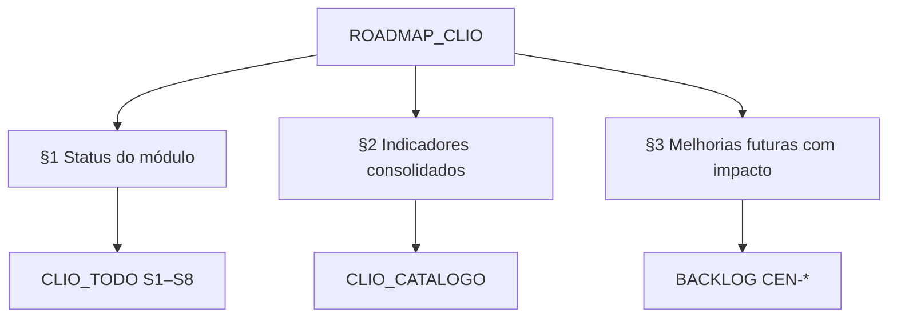

# Roadmap Clio — status, indicadores e melhorias

**Versão do produto:** 8.2.0 · **Última revisão:** 2026-07-24 · **Estado:** S1–S7 em produção; próximo S8 (promote i-Educar) · Hygieia

> **Índice geral:** [ROADMAP_INDICE.md](ROADMAP_INDICE.md) · **Landing:** [modulos/MODULO_CLIO.md](modulos/MODULO_CLIO.md) · **Spec fechada (S1–S6):** [ROADMAP_EDUCACENSO_RELATORIOS_ETAPA1.md](ROADMAP_EDUCACENSO_RELATORIOS_ETAPA1.md) · **TODO código:** [CLIO_TODO_IMPLEMENTACAO.md](CLIO_TODO_IMPLEMENTACAO.md) · **Catálogo UI/INF-*:** [CLIO_CATALOGO_ERROS_E_RELATORIOS.md](CLIO_CATALOGO_ERROS_E_RELATORIOS.md) · **Backlog:** [BACKLOG_IMPLEMENTACOES.md](BACKLOG_IMPLEMENTACOES.md) (`CEN-*`)

Documento **vivo** do módulo Clio: o que está estável, quais indicadores o produto consolida hoje e o que ainda muda números/interpretação. A spec histórica de implementação permanece em [ROADMAP_EDUCACENSO…](ROADMAP_EDUCACENSO_RELATORIOS_ETAPA1.md); este arquivo é o mapa operacional pós-MVP.

---

## 1. Status do módulo

### 1.1 Panorama

| Campo | Valor |
|-------|--------|
| Nome | **Clio** — coletas Educacenso 1ª etapa (Matrícula inicial) |
| Feature flag | `CLIO_ENABLED` |
| Rotas | `/clio/*` |
| Perfis | Só coleta (`analysis_only`) · Consultoria (`consultancy` + cruzamento i-Educar) |
| Acesso | Ver: admin + usuário · Mutar: só admin · Municipal: sem acesso |
| Sprint código | **S7 concluída** (BI + medidores) · próximo **S8** (promote i-Educar) |
| Release base | **8.2.0 Hygieia** (série SVG PDF gestor + reanálise lote + Censo 2025) |

### 1.2 Capacidade por sprint

| Sprint | Entrega | Estado |
|--------|---------|--------|
| **S1** | Fundação, ficha leve, campanha | Concluído |
| **S2** | Upload / ZIP / inventário | Concluído |
| **S3** | Parsers CSV (Acomp + tríade) | Concluído (+ detecção `,`/`;`) |
| **S4** | Análise Modo A (`INF-*`), painel, medidores | Concluído |
| **S5** | Vincular i-Educar, cruzamento (`INF-GAP`) | Concluído |
| **S6** | Export CSV/PDF/Excel, bloco RX | Concluído |
| **S7** | ETL `bi_clio_*` + insights gestores | **Concluído** |
| **S8** | Promote assistido i-Educar | Pendente (`CEN-11`…`13`; flag `CLIO_PROMOTE_ENABLED`) |

### 1.3 Superfícies em produção

| Superfície | Rota / artefacto | Estado |
|------------|------------------|--------|
| Home do exercício | `/clio` | Estável — KPIs + pulse de ficheiros |
| Lista / central da coleta | `/clio/coletas`, hub | Estável — inventário geral → tríade por escola (INEP + status) |
| Upload / Drive | upload · Verificar/Importar | Estável — lotes; retry de parse em falhas |
| Análise municipal | `/clio/coletas/{uuid}/analise` | Estável — medidores, relatório da rede, matriz, NEE, jornada (faixas CH + Outros), transporte, Diagnóstico Geral |
| Detalhe escola | `…/escolas/{inep}` | Estável — medidores locais + distorção por etapa |
| Cruzamento | `…/cruzamento` | Estável — preserva `INF-GAP` na reanálise |
| Insights / BI | `…/insights` | Estável — Chart.js sobre `bi_clio_*` |
| Exports | CSV / PDF detalhado / **PDF gestor** / Excel | Estável — Excel completo (índice, demografia/Cor-Raça, tempo escolar, leituras BI, Diagnóstico Geral); PII só em PDF/Excel interno |
| Home — card | `/clio` | Estável — slider cobertura ↔ série histórica |
| RX / aba Censo | ranking do exercício | Estável |

### 1.4 Patches relevantes pós-Harmonia (indicadores / qualidade)

| Tema | Efeito | Ref. |
|------|--------|------|
| Matriz de exposição + NEE | Classificação de tipo de turma (curricular antes de AC); NEE por pessoa; ignora «Não se aplica» | `8c39072a` |
| CSV delimitador | Auto `,`/`;` — evita `parse_failed` / `EDU-REL-COLS` | `4ba91144` |
| Home — status ficheiros | Pulse ok/falha/pendente + Acomp | `4ba91144` |
| Central — inventário | Geral primeiro; tríade por escola; INEP; cores de parse | `7178000f` |
| Drive — reparse | Duplicata `failed` → `pending` + reparse do lote | `7178000f` |
| Análise — glossário distorção | Legenda das colunas «Distorção por etapa / ano» | local |
| **Asclepius (8.1.0)** | Diagnóstico Geral; PDF gestor; tempo escolar; faixas CH; Outros em turnos; série no card | [RELEASE_20260724b_ASCLEPIUS.md](RELEASE_20260724b_ASCLEPIUS.md) |
| **Hygieia (8.2.0)** | Série SVG no PDF gestor; `clio:campaign-reanalyze-all`; Censo 2025; NEE/Excel/Cor-Raça | [RELEASE_20260724c_HYGIEIA.md](RELEASE_20260724c_HYGIEIA.md) |

Checklist de código: [CLIO_TODO_IMPLEMENTACAO.md](CLIO_TODO_IMPLEMENTACAO.md). Rastreio: [CLIO_CHANGELOG_DEV.md](CLIO_CHANGELOG_DEV.md).

---

## 2. Indicadores consolidados

Indicadores que o Clio **já calcula e expõe** de forma estável (UI, inferências e/ou export). Detalhe de códigos: [CLIO_CATALOGO…](CLIO_CATALOGO_ERROS_E_RELATORIOS.md).

### 2.1 Operação da coleta (qualidade do lote)

| Indicador | Fonte | Onde aparece | Nota |
|-----------|-------|--------------|------|
| **% tríade** | Cobertura aluno+turma+profissional (escolas ativas) | Home, hub, análise, RX, PDF | Denominador = escolas em atividade |
| **Arquivos ok / falha / pendente** | `parse_status` | Home (pulse), Central (inventário) | Inclui Acomp municipal |
| **Situação da coleta** | Acomp (`INF-COL`) | Análise | Em andamento / não iniciou / fechada / bloqueada |
| **Rede escolar** | Acomp (`INF-ESC`) | Análise | Ativas × extintas / dependência |
| **Coerência** | `INF-COE` | Análise | Sem tríade / sem Acomp |
| **Gap i-Educar** | `INF-GAP` | Cruzamento | Só Clio / só i-Educar / ambos |

### 2.2 Volume e oferta (Matrícula inicial)

| Indicador | Fonte | Onde aparece | Nota |
|-----------|-------|--------------|------|
| Matrículas curricular / AEE / AC | Acomp × Relação (`INF-MAT`, `INF-TUR`) | Relatório da rede, KPIs | Delta Acomp × Relação (`INF-DELTA`, `INF-XCHK`) |
| Pirâmide por etapa/ano | Relações aluno/turma | Relatório da rede | Acomp **não** desagrega por ano |
| Composição curricular / AEE / AC | Tipo de turma | Relatório da rede | Curricular com AC conta como curricular |
| **Matriz de exposição** | Turma × aluno (ativas, ano da coleta) | Análise, PDF | Infantil / Fund. / EJA × parcial·integral × urbana·rural × regular·especial |
| Fundamental I / II | Agregação pedagógica | Exposição / PDF | Separados do «9 anos» genérico |

### 2.3 Medidores da 1ª etapa (estimativas CSV ≠ INEP oficial)

| Indicador | Código | Critério resumido | Escopo |
|-----------|--------|-------------------|--------|
| **Distorção idade-série** | `INF-DIS` | Atraso ≥ 2 anos vs idade esperada em **31/03** | EF/EM seriados; EJA/AEE/AC fora |
| Adequados / atraso 1 ano / adiantados | `INF-DIS` | Delay 0 / 1 / &lt;0 | Mesmo escopo |
| Distorção por etapa/ano | `INF-DIS` payload | Por `Etapa de ensino` | Tabela + glossário na análise |
| **Densidade aluno/turma** | `INF-DEN` | Média; turmas vazias; ≥40 | Código de turma |
| **Turmas sem profissional** | `INF-DOC` | Vínculo Relação profissional × turma | Rede / escola |

### 2.4 Inclusão, jornada e transporte

| Indicador | Código | Consolidado hoje |
|-----------|--------|------------------|
| NEE / TEA / AH | `INF-NEE` | Contagem por pessoa (não por linha); DEF / TRS / AH; subnotificação `SUB-*` |
| NEE sem AEE | relatório / PDF | Destaque operacional |
| Tempo de escolarização | `INF-JOR` | Turnos canónicos + Outros; CH em faixas pedagógicas; fund.+AEE; regular+AC; infantil estendida |
| Tempo escolar semanal | composer | CH ponderada por alunos × segmentos (PDF gestor / Insights) |
| Transporte | `INF-TRA` | Uso; rural/urbano (Acomp); veículo; ativas × demais |
| Demografia | `INF-DEM` | Cor/Raça, sexo, faixa etária (quando colunas existem) |
| **Diagnóstico Geral** | findings + parse_meta | Escolas ativas × erros/avisos + Cor/Raça; PDF + Excel |

### 2.5 Export e BI

| Canal | Indicadores típicos | PII |
|-------|---------------------|-----|
| **Excel / CSV** | Contadores, INF-*, Diagnóstico Geral, escolas ativas × demais, o que corrigir | Sem PII no CSV |
| **PDF detalhado** | Mesmos + distorção (+ amostra), NEE, matriz, Diagnóstico Geral, nome/CPF | Uso interno |
| **PDF do gestor** | KPIs BI, insights (sem `error`), etapas, série, tempo escolar, Diagnóstico Geral | Sem PII operacional |
| **Power BI / painel nativo (`bi_clio_*`)** | KPIs, etapas, inclusão, qualidade | Sem PII — UI `/insights` |

---

## 3. Ajustes e melhorias futuras (impacto nos indicadores)

Itens que **mudam números, denominadores ou interpretação**. Prioridade relativa; IDs quando já existem no backlog.

### 3.1 Alta — qualidade e alinhamento dos medidores

| ID sugerido | Melhoria | Impacto nos indicadores | Estado |
|-------------|----------|-------------------------|--------|
| **CLI-IND-01** | NEE na página da escola por pessoa (`CampaignNeeCensusBuilder`) | `%` / totais NEE escola vs municipal / PDF | **Feito** |
| **CLI-IND-02** | Demografia (`INF-DEM`) no PDF alinhada à UI | Cor/Raça · sexo · faixa no PDF | **Feito** |
| **CLI-IND-03** | Distorção ordenada por sequência pedagógica (`EtapaLabelOrder`) | Leitura da tabela por etapa | **Feito** |
| **CLI-IND-04** | Reanálise automática após parse Drive / reparse ingest | Tríade / INF-* frescos | **Feito** |
| **CLI-IND-05** | Purge / retenção (`clio:prune-artifacts`) | Espaço em disco | **Feito** |

### 3.2 Média — cobertura e denominadores

| ID sugerido | Melhoria | Impacto nos indicadores | Estado |
|-------------|----------|-------------------------|--------|
| **CLI-IND-06** | KPIs da home só sobre escolas ativas | Tríade média e erros da rede | **Feito** |
| **CLI-IND-07** | Densidade: denominador só turmas curriculares | `INF-DEN` média e ≥40 | **Feito** |
| **CLI-IND-08** | Margem de distorção configurável (`CLIO_DISTORCAO_MARGEM_ANOS`) | `pct_distorcao` | **Feito** |
| **CLI-IND-09** | Matriz: Especial = turma AEE explícita | Células da matriz de exposição | **Feito** |
| **CLI-IND-10** | Transporte: fallback Localização Acomp/INEP | `INF-TRA` rural/urbano | **Feito** |

### 3.3 S7 — BI (muda onde os indicadores vivem)

| ID | Item | Impacto | Estado |
|----|------|---------|--------|
| **CEN-16** | Tabelas `bi_clio_*` + painel `/insights` nativo | Indicadores consolidados (UI Chart.js; Desktop opcional) | **Feito** |
| — | `bi:refresh-clio-campaigns` | Série temporal por exercício / município | **Feito** |
| — | Dataset documentado em [POWERBI.md](POWERBI.md) | Consumo consultoria | **Feito** |

### 3.4 S8 — Promote (muda o destino dos dados, não as fórmulas Clio)

| ID | Item | Impacto nos indicadores Clio |
|----|------|------------------------------|
| **CEN-11…13** | Mapa Relação → i-Educar, dry-run, promote | Não altera fórmulas; após promote, **gap** (`INF-GAP`) e painel analytics i-Educar passam a refletir a carga |
| — | Auditoria / `--confirm=` | Rastreio de quem promoveu o que |

### 3.5 Baixa / exploração

| Tema | Impacto potencial |
|------|-------------------|
| 2ª etapa / rendimento (quando o portal exportar) | Novos `INF-*`; não no escopo Matrícula inicial |
| Comparativo Clio × microdados INEP (Horizonte) | Benchmark externo dos mesmos conceitos |
| Sonda `ModuleMonitorCatalog` clio | Saúde operacional, não indicador pedagógico |

---

## 4. Ordem sugerida (próximos ciclos)

1. **CEN-11…13 (S8)** — promote assistido i-Educar quando a consultoria pedir carga.  
2. Comparativo Clio × microdados INEP (Horizonte) — benchmark externo.  
3. 2ª etapa / rendimento — quando o portal exportar.

---

## 5. Manutenção deste roadmap

| Quando | O quê actualizar |
|--------|------------------|
| Patch que muda fórmula ou denominador | §2 (indicador) + §1.4 (patch) + [CLIO_CHANGELOG_DEV.md](CLIO_CHANGELOG_DEV.md) |
| Novo `INF-*` / `CLIO-*` | §2 + [CLIO_CATALOGO…](CLIO_CATALOGO_ERROS_E_RELATORIOS.md) |
| Sprint S7/S8 | §1.2 + [CLIO_TODO…](CLIO_TODO_IMPLEMENTACAO.md) + [BACKLOG…](BACKLOG_IMPLEMENTACOES.md) |
| Release com bump | Cabeçalho versão + [HISTORICO_VERSOES.md](HISTORICO_VERSOES.md) |

*Não duplicar a spec longa de parsers/corpus — apontar para [ROADMAP_EDUCACENSO…](ROADMAP_EDUCACENSO_RELATORIOS_ETAPA1.md).*
