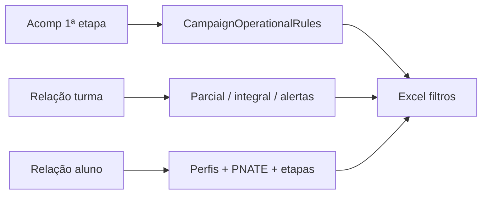

# Roadmap Clio — Excel de filtros operacionais (Acomp + Relações + Jornada)

**Última revisão:** 2026-08-05 · **Estado:** implementado (P0/P1) · **IDs:** `CLI-XLS-*`

> **Índice:** [ROADMAP_INDICE.md](ROADMAP_INDICE.md) · **Clio:** [ROADMAP_CLIO.md](ROADMAP_CLIO.md) · **Tempo escolar:** [CLIO_TEMPO_ESCOLAR.md](CLIO_TEMPO_ESCOLAR.md) · **Excel completo:** `CampaignExcelExporter` · **Excel filtros:** `CampaignFiltrosOperacionaisExcelExporter` · **Regras:** `CampaignOperationalRules`

Workbook dedicado aos filtros operacionais do portal Educacenso — **separado** do Excel “documento completo” (10 abas).

---

## 1. Regras congeladas (CLI-XLS-00)

| Tema | Regra aplicada no Clio |
|------|-------------------------|
| **Escolas aptas** | Em atividade **e** (**Municipal** **OU** (Privada **filantrópica** com parceria/convênio **Municipal**)); localização válida Urbana/Rural (rejeita indefinida) |
| **Parcial / integral** | Curricular: parcial **&lt; 35 h**; integral **≥ 35 h** (ou turno integral/estendido) |
| **EJA** | Alertar CH **&lt; 20 h** |
| **AC** | Elegível a proxy se CH **≥ 15 h**; alertar se CH **&lt; 15 h** |
| **Turmas vs profissionais** | Nº de turmas = **contagem de linhas**; col. profissionais é soma à parte |
| **PNATE** | Transporte Sim + escola Urbana + residência Urbana → **excluído**; sem coluna de residência → não aplica exclusão |
| **Tempo integral** | Canónico por CH/turno; EJA/AEE fora; proxy Acomp AA+AB só como referência (flag «sem CH») |
| **JornadaEscolar** | Ainda **não ingerido** (P2) — aba 09 usa Relação turma |

Dependência vazia no Acomp: **não restringe** (compatibilidade com fichas incompletas).

---

## 2. O que mudou no Clio (denominador operacional)

O escopo «escolas ativas» passou a ser **escolas aptas no arquivo geral** (`CampaignOperationalRules::isOperationallyEligible` + `isInArquivoGeral`) em:

- `CampaignParseService::coverage`
- `CampaignAnalysisPresenter` (lista ativas / fora do escopo)
- `CampaignActiveCensusMatrixBuilder`
- `DiagnosticoGeralComposer`, `CampaignFinalPdfComposer`, `ClioBiRefreshService`, `ClioCampaign::schoolScopeStats`
- Transporte (`CampaignAnalyzer`) — partição ativa/outra

Escolas estaduais/federais em atividade aparecem como **fora do escopo** (não como pendência de tríade).

---

## 3. Workbook Excel

Rota: `clio.campaigns.export.xlsx-filtros` · Menu Downloads + card da home.

| Aba | Conteúdo |
|-----|----------|
| **00-Índice** | Meta + glossário de regras |
| **01-Escolas aptas** | Lista filtrada |
| **02-Somatórios Acomp** | Curricular, AEE, AC, Curricular+AC, Infantil, Fund., EJA, proxy integral |
| **03-Turmas** | Classificação + CH + alertas |
| **04-Somatórios turmas** | Linhas ≠ profissionais |
| **05-Demografia** | Cor/Raça + lista não declarados |
| **06-NEE-TRS** | Totais K/L + lista L sem K |
| **07-PNATE** | Elegíveis / excluídos / veículos |
| **08-Etapas aluno** | Curricular + AEE/AC |
| **09-Tempo integral** | Pleno ≥35; proxy AC≥15; exclusões |
| **10-Alertas** | EJA&lt;20, AC&lt;15, etc. |
| **11-Fora do escopo** | Não aptas / inativas |

PII: abas com listagens = **uso interno**.

---

## 4. Estado das fases

| ID | Entrega | Estado |
|----|---------|--------|
| **CLI-XLS-00** | Regras congeladas | ✓ |
| **CLI-XLS-01** | `CampaignOperationalRules` + uso no denominador | ✓ |
| **CLI-XLS-03** | `CampaignFiltrosOperacionaisComposer` + ExcelExporter | ✓ |
| **CLI-XLS-04** | Aba PNATE | ✓ |
| **CLI-XLS-06** | Demografia / NEE / alertas | ✓ |
| **CLI-XLS-07** | Testes unitários | ✓ |
| **CLI-XLS-08** | Link Downloads + home | ✓ |
| **CLI-XLS-02** | Ingest `JornadaEscolar` | Backlog P2 |
| **CLI-XLS-05** | Aba integral via Jornada | Backlog P2 |
| **CLI-XLS-09** | MAPA PDF com mesmo denominador (já parcial via elegibilidade nas escolas) | Parcial / P2 fino |

---

## 5. Decisões de negócio (fechadas na implementação)

1. Filantrópica: **só** com parceria **Municipal**.
2. EJA: alertar CH **&lt; 20 h**.
3. Integral: canónico CH ≥35; proxy Acomp AA+AB só na aba 02 com nota.
4. JornadaEscolar: adiado (P2).
5. Excel: **workbook novo** separado.

---

## 6. Referências de código

| Peça | Path |
|------|------|
| Regras | `app/Services/Clio/Analysis/CampaignOperationalRules.php` |
| Composer | `app/Services/Clio/Export/CampaignFiltrosOperacionaisComposer.php` |
| Excel filtros | `app/Services/Clio/Export/CampaignFiltrosOperacionaisExcelExporter.php` |
| Excel completo | `app/Services/Clio/Export/CampaignExcelExporter.php` |
| Parser Acomp | `app/Services/Clio/Parse/AcompColeta1EtapaParser.php` |
| Matriz | `app/Services/Clio/Export/CampaignActiveCensusMatrixBuilder.php` |
| Testes | `tests/Unit/Clio/CampaignOperationalRulesTest.php`, `CampaignFiltrosOperacionaisExcelExporterTest.php` |
