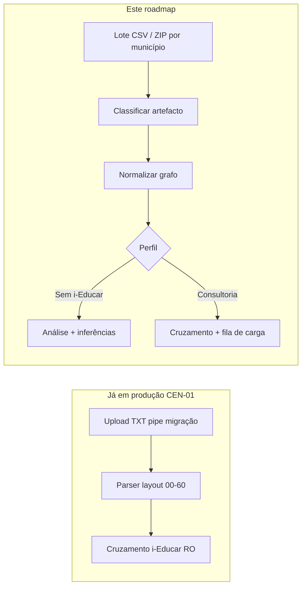
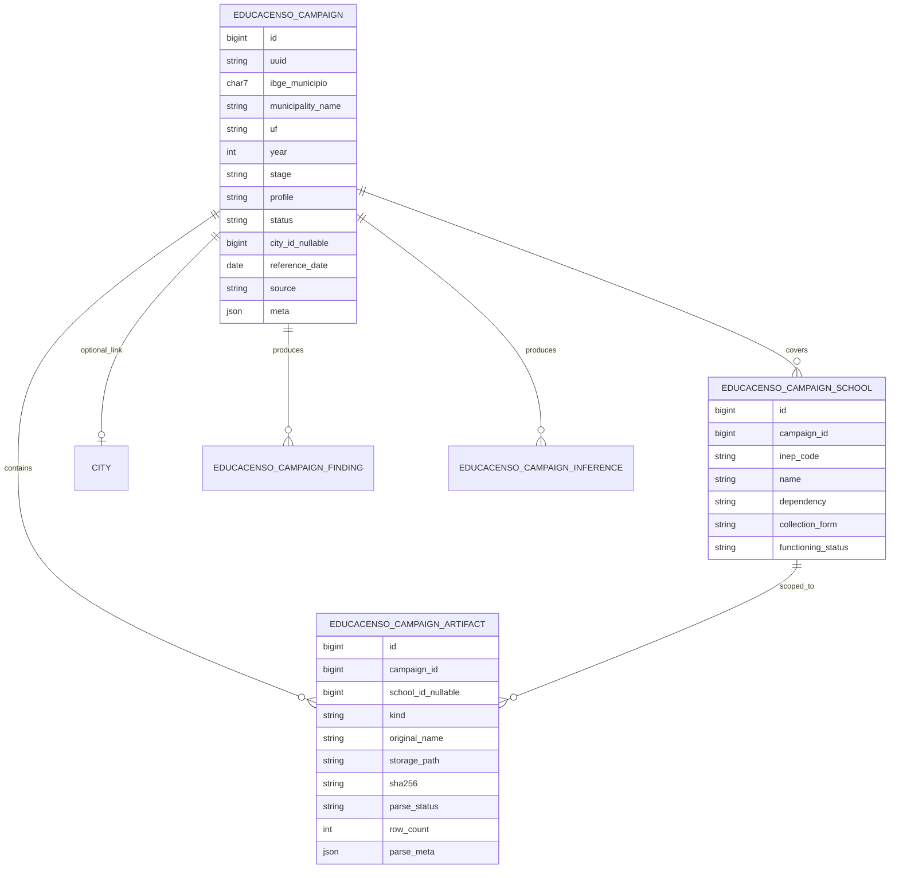
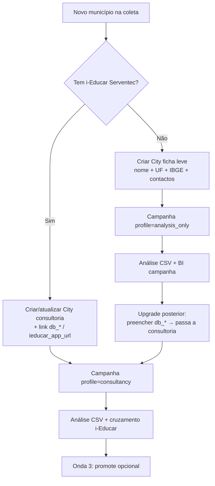
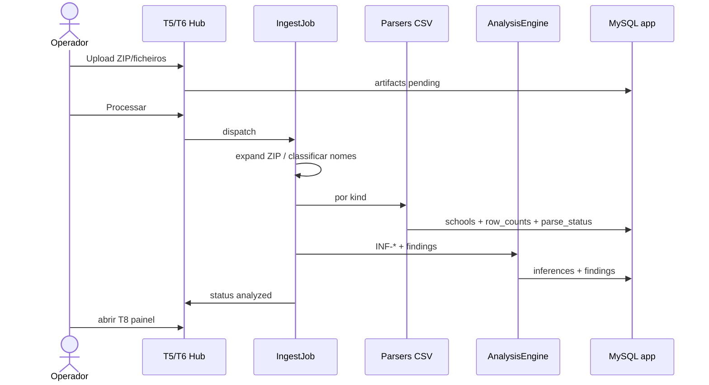

# Roadmap — **Clio** (campanhas e relatórios Educacenso 1ª etapa)

**Versão do produto:** 7.0.3 · **Última revisão:** 2026-07-21 · **Estado do roadmap:** **fechado para implementação**

> **Módulo:** [MODULO_CLIO.md](modulos/MODULO_CLIO.md) · **TODO de código:** [CLIO_TODO_IMPLEMENTACAO.md](CLIO_TODO_IMPLEMENTACAO.md) · **Índice:** [ROADMAP_INDICE.md](ROADMAP_INDICE.md) · **Backlog:** [BACKLOG_IMPLEMENTACOES.md](BACKLOG_IMPLEMENTACOES.md) · **CEN-01:** [EDUCACENSO_SIMULACAO_CARGA_ETAPA1.md](EDUCACENSO_SIMULACAO_CARGA_ETAPA1.md)

**Nome:** **Clio** (mitologia grega — musa da história): regista e narra a **declaração da Matrícula inicial** a partir dos relatórios do portal Educacenso.  
**Código:** namespace `App\Services\Clio\` · controllers `App\Http\Controllers\Clio\` · rotas `/clio/*` · Artisan `clio:*` · tabelas `clio_*`.  
**Implementação:** S1–S6 no código ([CLIO_TODO…](CLIO_TODO_IMPLEMENTACAO.md) · [CHANGELOG dev](CLIO_CHANGELOG_DEV.md)); próximo S7 BI / S8 promote.  
**Corpus:** [Google Drive — COLETA 2026](https://drive.google.com/drive/folders/1xP9cMR6JYHXRezzMs5ybSUdoR5V-yxLh)

| Marco | Estado |
|-------|--------|
| CEN-02 inventário Drive | **Concluído** |
| CEN-03 modelo de campanha | **Concluído (spec)** |
| §5 cadastro dual · §8 BI | **Concluído (spec)** |
| §9 caminho de desenvolvimento | **Validado** (§9.6) |
| S1–S6 (código) | **Concluído** — [CLIO_TODO…](CLIO_TODO_IMPLEMENTACAO.md) |
| S7–S8 | Pendente |

---

## 1. Objectivo

Implementar o módulo **Clio**: **ingestão e análise** de **relatórios da 1ª etapa do Censo Escolar (Matrícula inicial)** exportados do portal Educacenso, com dois destinos:

| Perfil do município | O que o módulo faz | Escrita i-Educar |
|---------------------|--------------------|------------------|
| **Consultoria** (já cadastrado / com conexão) | Análise +, em momento oportuno, **subida** dos dados para a base i-Educar | Sim (fase controlada, opt-in) |
| **Sem i-Educar** (coleta / prospecto / rede sem sistema) | **Somente análise e inferências** sobre o(s) arquivo(s) | Não |

Responde a:

1. *«O que estes relatórios da 1ª etapa dizem sobre a rede?»*
2. *«O que precisa ser corrigido antes de fechar o Censo?»*
3. *«Para clientes da consultoria, o que pode ser promovido ao i-Educar sem risco?»*

**Público:** consultoria Serventec, secretarias municipais, TI municipal.

---

## 2. Delimitação face ao que já existe

| Capacidade | Documento / código | Relação com este roadmap |
|------------|--------------------|--------------------------|
| Conferência **TXT pipe** portal × i-Educar (read-only) | CEN-01 · `EducacensoStage1ConferenceService` | **Paralelo** — formato diferente; reutilizar painel/padrões de erro, **não** o parser TXT |
| Microdados nacionais INEP | Horizonte · `horizonte:sync-educacenso` | Paralelo (série pública) |
| Status exportado/fechado por escola | Aba Censo / RX | Complementar |
| **Clio** (este módulo) | `CEN-02`… | Relatórios CSV do portal (acompanhamento + relações por escola) |



**Descoberta crítica (CEN-02):** a coleta 2026 no Drive **não** traz o arquivo de migração TXT (registos `00`…`60`). Traz **relatórios CSV** gerados no Educacenso (separador `;`, BOM UTF-8). O MVP deve priorizar estes CSV; o TXT CEN-01 continua como fluxo à parte (ou artefacto opcional na campanha).

---

## 3. Entrada de dados

### 3.1 Artefactos observados (portal Educacenso)

| Código artefacto | Padrão de nome | Escopo | Conteúdo (resumo) |
|------------------|----------------|--------|-------------------|
| `acomp_coleta_1etapa` | `Relatorio_Acomp_Coleta_1Etapa_DDMMYYYY[.csv]` | **Municipal** | Uma linha por escola: situação, forma de coleta, totais de matrícula por etapa/modalidade |
| `relacao_aluno_escola` | `RelacaoAlunoEscola_D_M_YYYY[.csv]` | **Escola** | Alunos/matrículas: identificação, demografia, NEE, código turma, etapa |
| `relacao_turma_escola` | `RelacaoTurmaEscola_D_M_YYYY[.csv]` | **Escola** | Turmas: código, nome, mediação, etapa, carga horária, dias |
| `relacao_profissional_escola` | `RelacaoProfissionalEscola_D_M_YYYY[.csv]` | **Escola** | Profissionais: cadastro + vínculos (cabeçalho multi-linha) |
| `pacote_zip` | `Dados {Município}.zip` | **Municipal** | Pacote compactado (ex.: Santo Amaro) — tratar como lote a expandir |

Separador: **`;`**. Encoding: **UTF-8 com BOM**. Datas no nome: `DDMMYYYY` (municipal) ou `D_M_YYYY` (escola). Sufixos `(N)` = downloads duplicados do portal — normalizar no ingest.

#### Colunas-chave — `acomp_coleta_1etapa` (amostra Amélia Rodrigues, ref. 21/07/2026)

`Data de Referência` · `UF` · `Município` · `Dependência Administrativa` · `Código da escola` · `Nome da escola` · `Situação de Funcionamento` · `Localização` · `Situação de Fechamento` · `Forma de Coleta` · `Escola Bloqueada` · `Gestor Escolar` · `Matrículas a confirmar ou desconsiderar` · totais (`Total matrículas - Curricular/AEE/AC/…`) · desagregação presencial/EAD/EJA por etapa.

#### Colunas-chave — `relacao_aluno_escola` (amostra escola INEP 29157714)

`Identificação única` · `Nome` · `Data de nascimento` · `CPF` · `Cor/Raça` · deficiências/TEA/AH · `Código da Matrícula` · `Código da turma` · etapa da turma · …

#### Colunas-chave — `relacao_turma_escola`

`Código da turma` · `Nome da turma` · `Tipo de mediação` · `Tipo de turma` · `Etapa Agregada` · `Etapa de ensino` · carga horária · dias/horário · flags educação especial / bilíngue.

#### `relacao_profissional_escola`

CSV com **duas linhas de cabeçalho** (`Dados cadastrais` + `Vínculos`) — o parser precisa de modo *header offset* específico.

### 3.2 Inventário Drive COLETA 2026 (CEN-02) — 2026-07-21

Pasta raiz: [COLETA 2026](https://drive.google.com/drive/folders/1xP9cMR6JYHXRezzMs5ybSUdoR5V-yxLh) · UF observada: **BA**.

#### Árvore típica

```
COLETA 2026/
  {Município}/
    Relatorio_Acomp_Coleta_1Etapa_{DDMMYYYY}.csv     # opcional (faltou em SAJ)
    {INEP 8 dígitos}[- ]{NOME DA ESCOLA}/
      RelacaoAlunoEscola_{D_M_YYYY}.csv
      RelacaoTurmaEscola_{D_M_YYYY}.csv
      RelacaoProfissionalEscola_{D_M_YYYY}.csv
  # variante:
  Santo Amaro/
    Dados Santo Amaro.zip                            # ~603 KB — sem pastas expandidas
```

#### Matriz por município

| Município | Pasta Drive | Relatório municipal | Pastas escola (INEP) | Notas |
|-----------|-------------|---------------------|----------------------|-------|
| **Amélia Rodrigues** | [abrir](https://drive.google.com/drive/folders/15kh59OedYM3RHFyr9NvbShxlkxBq2grx) | `Relatorio_Acomp_Coleta_1Etapa_21072026 (1).csv` | **21** | Lock LibreOffice `.~lock…` presente (ignorar no ingest) |
| **Mairi** | [abrir](https://drive.google.com/drive/folders/1aq3VGXUhgzOBUr3IIfwnsz7SCECMLEky) | `Relatorio_Acomp_Coleta_1Etapa_21072026.csv` | **17** | Naming `INEP - NOME` |
| **Presidente Tancredo Neves** | [abrir](https://drive.google.com/drive/folders/1T7Pf0ZBFn6RZG086XwwF29GPHb5V3gU3) | `Relatorio_Acomp_Coleta_1Etapa_21072026.csv` | **40** | Maior rede no corpus |
| **Santo Amaro** | [abrir](https://drive.google.com/drive/folders/1XWCGUGeSgUqIuLtQ6VZjB5P9ZyWK-24l) | — | **0** (só ZIP) | `Dados Santo Amaro.zip` (~603 KB) |
| **Santo Antônio de Jesus** | [abrir](https://drive.google.com/drive/folders/1LinlgvIdajordSutV3rZUuaGTpQifBm-) | **ausente** | **49** | Tríade Relacao confirmada por escola (ex. 16/07/2026) |
| **Saubara** | [abrir](https://drive.google.com/drive/folders/1vxN6vZysR8I-ySLUZEgZo8d-5tc08PDO) | `Relatorio_Acomp_Coleta_1Etapa_20072026.csv` | **20** | Data municipal 20/07; escolas 20/07 |

**Totais aproximados:** 6 municípios · ≥ **147** pastas-escola · 1 ZIP · 4 CSV municipais de acompanhamento.

#### Amostras de conteúdo (não versionar PII)

| Amostra | Achado |
|---------|--------|
| Acomp. Amélia | Inclui escolas **extintas** / «Não iniciou» coleta com matrículas 0 — útil para INF-COL |
| Relacao aluno (1 escola) | ~414 linhas; CPF e nomes em claro → **LGPD** |
| Relacao turma | ~15 turmas na escola amostrada |
| Relacao profissional | ~118 linhas; cabeçalho duplo |

**Fixtures:** só versões **anonimizadas** em `tests/fixtures/educacenso/coleta_2026/` (CPF/nome mascarados). Originais ficam no Drive / storage privado.

### 3.3 Proveniência

| Origem | Uso |
|--------|-----|
| Relatórios do [portal Educacenso](https://educacenso.inep.gov.br/) | Entrada **primária** deste módulo |
| Pasta Drive / e-mail da secretaria | Coleta operacional 2026 |
| TXT migração INEP | Fluxo CEN-01 (opcional na campanha como `migracao_txt`) |
| Export i-Educar | **Não** é entrada primária |

---

## 4. Modelo de campanha (CEN-03)

### 4.1 Conceito

Uma **campanha** é a unidade de trabalho da coleta de um município num exercício:

> **Campanha** = município (IBGE ou ficha leve) + ano letivo + etapa Censo (`stage1`) + lote de artefactos + perfil operacional (A/B) + estado do pipeline.



### 4.2 Campos da campanha

| Campo | Tipo | Regra |
|-------|------|-------|
| `uuid` | UUID | Identificador público (rotas/CLI) |
| `ibge_municipio` | char(7) nullable | Preferencial; pode preencher depois do parse do `acomp_*` |
| `municipality_name` / `uf` | string | Da pasta Drive ou do CSV |
| `year` | int | Ex.: 2026 |
| `stage` | enum | `stage1` (MVP); `stage2` fora de escopo |
| `profile` | enum | `analysis_only` (A) \| `consultancy` (B) |
| `status` | enum | `draft` → `ingesting` → `parsed` → `analyzed` → `cross_checked` → `promote_ready` → `promoted` / `archived` |
| `city_id` | FK nullable | Preenchido no Modo B |
| `reference_date` | date nullable | Extraído de `Data de Referência` ou do nome do arquivo |
| `source` | enum | `drive_upload` \| `manual_upload` \| `zip_bundle` |
| `meta` | json | Pasta Drive id, operador, notas |

### 4.3 Artefactos (`educacenso_campaign_artifacts`)

| Campo | Nota |
|-------|------|
| `kind` | `acomp_coleta_1etapa` \| `relacao_aluno_escola` \| `relacao_turma_escola` \| `relacao_profissional_escola` \| `pacote_zip` \| `migracao_txt` (opcional CEN-01) |
| `school_id` | NULL se municipal; FK se relação por escola |
| `original_name` | Nome tal como chegou (incl. `(1)`) |
| `storage_path` | Disco privado (não git) |
| `sha256` | Deduplicação |
| `parse_status` | `pending` \| `ok` \| `warning` \| `failed` |
| `row_count` / `parse_meta` | Contagens, encoding, header_offset, avisos |

**Classificador de nome (heurística MVP):**

| Regex / regra | `kind` |
|---------------|--------|
| `Relatorio_Acomp_Coleta_1Etapa_` | `acomp_coleta_1etapa` |
| `RelacaoAlunoEscola_` | `relacao_aluno_escola` |
| `RelacaoTurmaEscola_` | `relacao_turma_escola` |
| `RelacaoProfissionalEscola_` | `relacao_profissional_escola` |
| `\.zip$` + `Dados` | `pacote_zip` → expandir e reclassificar filhos |
| `^\d{8}` pasta | criar `campaign_school` (INEP + nome) |
| `.~lock.` | **ignorar** |

### 4.4 Escolas da campanha

Criadas a partir de:

1. Pastas `{INEP} {NOME}` no lote; e/ou  
2. Linhas do `acomp_coleta_1etapa` (`Código da escola`).

Campos úteis do acompanhamento: dependência, situação de funcionamento, forma de coleta, bloqueio, totais de matrícula (snapshot municipal).

### 4.5 Completude da campanha (checklist automático)

| Critério | Regra sugerida |
|----------|----------------|
| Relatório municipal | Aviso se ausente (caso SAJ) — análise escola-a-escola ainda possível |
| Cobertura escolas | `% escolas com tríade Relacao completa` |
| Tríade | Aluno + Turma + Profissional por INEP |
| Consistência | Soma matrículas Relacao vs totais do Acomp (tolerância configurável) |
| Pronto para Modo B | `city_id` resolvido + conexão i-Educar ok |

### 4.6 Achados e inferências persistidos

- `educacenso_campaign_findings` — erros/avisos por artefacto/escola/linha (código estável `EDU-REL-xxx`).
- `educacenso_campaign_inferences` — agregados INF-* (JSON + contadores) para o painel.

### 4.7 API / CLI / UI (esboço)

| Superfície | Responsabilidade |
|------------|------------------|
| UI «Campanhas Educacenso» | Criar campanha, upload pasta/ZIP, ver cobertura, painel |
| `clio:campaign-ingest {uuid\|path}` | Classificar + gravar artefactos |
| `censo:campaign-analyze {uuid}` | Parse + INF-* Modo A |
| `clio:campaign-status {uuid}` | Completude e status |
| `censo:campaign-promote {uuid} --dry-run` | Onda 3 |

Rotas: `/clio/campanhas` (consultoria) e bloco na aba **Censo** / RX.

### 4.8 Relação com CEN-01

| | Campanha (este módulo) | Conferência CEN-01 |
|--|------------------------|--------------------|
| Entrada | CSV Relatorio/Relacao (+ ZIP) | TXT pipe |
| Persistência | Campanha + artefactos | Cache por user/city |
| i-Educar | Opcional (perfil B) | Obrigatório para cruzamento |
| Carga | Onda 3 | Nunca |

Uma campanha **pode** anexar `migracao_txt` e despachar o motor CEN-01; não é requisito do MVP.

---

## 5. Cadastro de municípios (com e sem i-Educar)

O módulo precisa **cadastrar municípios novos** que entram pela coleta Educacenso — inclusive os que **ainda não** são clientes com base i-Educar. Hoje `City::forAnalytics()` exige `db_host` + database + username; isso **bloqueia** o Modo A se a única entidade for `cities` «completas».

### 5.1 Dois tipos de cadastro

| Tipo | Nome interno | Credenciais i-Educar | Uso principal |
|------|--------------|----------------------|---------------|
| **Ficha leve** | `catalog_only` / sem `hasDataSetup()` | Não | Coleta, prospecto, análise de relatórios, BI só sobre campanha |
| **Consultoria** | `consultancy` + `hasDataSetup()` | Sim (`db_*`, schema, URL app) | Painel analytics completo, cruzamento, carga assistida |



### 5.2 Ficha leve (sem i-Educar)

**Campos mínimos**

| Campo | Obrigatório | Nota |
|-------|-------------|------|
| `name` | Sim | Alinhado à pasta Drive / CSV |
| `uf` | Sim | Ex.: BA |
| `ibge_municipio` | Sim (preferencial) | 7 dígitos; resolver por nome+UF se ausente |
| `is_active` | Sim | `true` para aparecer em listagens de campanha |
| Contactos (`contact_*`) | Não | Útil para RX / follow-up coleta |
| `db_host` / `db_*` | **Vazio** | Sem conexão dinâmica |
| `ieducar_app_url` | Não | Pode ficar null |

**Comportamento na plataforma**

- Elegível para **campanhas Educacenso** e listagens do módulo.
- **Não** entra em `City::forAnalytics()` (dropdowns das 15 abas que leem i-Educar).
- Pode aparecer no RX/Horizonte como «catálogo / coleta» (tier distinto — alinhar com `catalog_pending` do Horizonte se fizer sentido).
- Upgrade: preencher credenciais → `hasDataSetup()=true` → passa a consultoria sem recriar o município.

**UI sugerida:** Admin → Municípios → «Novo (só coleta / sem i-Educar)» com aviso claro de capacidades limitadas.

### 5.3 Consultoria (com link i-Educar)

**Além da ficha leve**

| Campo | Nota |
|-------|------|
| `db_driver` | `mysql` \| `pgsql` |
| `db_host`, `db_port`, `db_database`, `db_username`, `db_password` | Conexão `city_data_{id}` |
| `ieducar_schema` | Schema PostgreSQL quando aplicável |
| `ieducar_app_url` | Link para o i-Educar da rede (atalho consultor) |
| RBAC `city_user` | Quem vê o município |

**Comportamento**

- Entra em analytics, discrepâncias, RX operacional, CEN-01.
- Campanha Modo B: cruzamento + (depois) promote.
- Teste de conexão obrigatório no cadastro/edição antes de marcar «pronto para cruzamento».

### 5.4 Ligação campanha ↔ município

| Situação | Regra |
|----------|-------|
| Pasta Drive com nome conhecido | Match por `name`+`uf` ou IBGE; senão criar ficha leve |
| CSV `acomp_*` traz Município/UF | Prefill; IBGE via catálogo IBGE local/API |
| Município já consultoria | Reutilizar `city_id`; `profile=consultancy` |
| Só ficha leve | `profile=analysis_only`; botão «Vincular i-Educar» abre formulário de credenciais |

IDs de implementação: **CEN-14** (ficha leve + scopes), **CEN-15** (vincular/desvincular i-Educar na campanha).

---

## 6. Modos de operação

### 6.1 Modo A — Análise pura (`profile=analysis_only`)

- `City` ficha leve **ou** campanha sem `city_id` (temporário; preferir sempre FK para histórico).
- Usa só artefactos da campanha.
- Saídas: cobertura de coleta, totais, coerência aluno↔turma, NEE, duplicidades, escolas sem tríade.

### 6.2 Modo B — Consultoria (`profile=consultancy`)

- Exige `City` com `hasDataSetup()`.
- Camada 1 = Modo A.
- Camada 2 = cruzamento com snapshot i-Educar (totais, INEP, turmas/matrículas).
- Camada 3 = promoção assistida (Onda 3).

> Nenhuma carga sobe para i-Educar sem confirmação humana e dry-run. Em produção: `--confirm`.

---

## 7. Inferências (produto) — alinhadas aos CSV

| ID | Inferência | Entrada | Valor |
|----|------------|---------|-------|
| **INF-COL** | Situação da coleta por escola (não iniciou / em andamento / fechada / bloqueada) | `acomp_*` | Ritmo operacional RX |
| **INF-ESC** | Rede: funcionamento, localização, dependência | `acomp_*` | Dimensionar + filtrar extintas |
| **INF-MAT** | Totais matrícula curricular/AEE/AC + por etapa | `acomp_*` e/ou soma `relacao_aluno` | Volume 1ª etapa |
| **INF-TUR** | Turmas por etapa / mediação / especial | `relacao_turma` | Perfil pedagógico |
| **INF-DOC** | Profissionais e vínculos × turmas | `relacao_profissional` (+ turma) | Cobertura docente |
| **INF-NEE** | Alunos com deficiência/TEA/AH e AEE | `relacao_aluno` (+ totais AEE acomp.) | Inclusão |
| **INF-COE** | Coerência: aluno→turma inexistente; turma sem aluno; escola sem tríade | relações | Qualidade |
| **INF-DUP** | CPF / identificação única duplicada na rede | `relacao_aluno` | Limpeza |
| **INF-GAP** | Lacunas vs i-Educar | campanha × snapshot | Só Modo B |
| **INF-DELTA** | Acomp. municipal vs soma das Relacoes | ambos | Divergência de declaração |

Indicadores FUNDEB (VAAF × matrícula): onda posterior — [ROADMAP_BASES_CALCULOS_FINANCEIROS.md](ROADMAP_BASES_CALCULOS_FINANCEIROS.md).

---

## 8. BI e o que se pode analisar por município

Complementa o painel operacional Laravel. Estudo geral: [POWERBI.md](POWERBI.md). Aqui fica o **catálogo específico** deste módulo e o que muda com/sem i-Educar.

### 8.1 Camadas de BI

| Camada | Onde | Público | Dados |
|--------|------|---------|-------|
| **Painel campanha** (app) | UI Campanhas / aba Censo | Operacional | INF-* + coverage em tempo quase real |
| **Export analítico** | CSV/XLSX/PDF Serventec | Consultor / secretaria | Agregados por escola/município (**sem PII** no default) |
| **Data mart `bi_*`** | MySQL app → Power BI | Self-service multi-município | Tabelas ETL; ver §8.3 |
| **Power BI workspace** | Relatórios publicados | Diretoria / contratos | Slicers IBGE, ano, dependência |

Regra LGPD: datasets BI usam **agregados** (escola/município/etapa). CPF, nome e data de nascimento **não** vão para Power BI.

### 8.2 O que analisar — por perfil de município

#### A) Só campanha Educacenso (ficha leve / sem i-Educar)

Disponível assim que a campanha estiver `analyzed`:

| Tema | Perguntas / indicadores | Fonte |
|------|-------------------------|-------|
| **Ritmo da coleta** | % escolas que não iniciaram / em coleta / fechadas / bloqueadas; gestor informado? | `acomp_*` · INF-COL |
| **Rede escolar** | Nº escolas ativas vs extintas; urbana/rural; dependência | `acomp_*` · INF-ESC |
| **Matrícula inicial** | Total curricular, AEE, AC; pirâmide por etapa (creche→EJA/EAD) | `acomp_*` / soma alunos · INF-MAT |
| **Turmas** | Distribuição por etapa, mediação, classe especial, carga horária | `relacao_turma` · INF-TUR |
| **Profissionais** | Contagem por escola; vínculos vs turmas (heurística de cobertura) | `relacao_profissional` · INF-DOC |
| **Inclusão** | Alunos com NEE/TEA/AH; matrículas AEE vs curricular | `relacao_aluno` · INF-NEE |
| **Qualidade declaratória** | Tríade incompleta; aluno sem turma; delta Acomp×Relacao; duplicidades | INF-COE / DELTA / DUP |
| **Comparativo multi-município** | Ranking cobertura coleta e volume entre municípios da coleta | várias campanhas |

**Não disponível** sem i-Educar: frequência, aprovação/abandono, discrepâncias cadastrais internas, repasses ligados ao cadastro local, «o que falta corrigir no sistema».

#### B) Consultoria (campanha + i-Educar)

Além de tudo em (A):

| Tema | Perguntas / indicadores | Fonte |
|------|-------------------------|-------|
| **Lacuna declaração × cadastro** | Escolas/turmas/matrículas só no Educacenso ou só no i-Educar | INF-GAP · padrões CEN-01 |
| **Conformidade operacional** | Checks de discrepâncias, impacto FUNDEB estimado | Aba Discrepâncias |
| **Saúde municipal** | Índice / prioridades do diagnóstico | `municipality_health` |
| **Série e finanças** | VAAF/VAAT, repasses, CadÚnico, SAEB (já na app por IBGE) | tabelas locais + i-Educar |
| **Pós-carga** | O que foi promovido vs pendente | Onda 3 auditoria |

Dados **só por IBGE** (mesmo em ficha leve, se o código existir): FUNDEB referência, microdados Censo INEP, SAEB, CadÚnico nacional, repasses Tesouro — via Horizonte / imports públicos, **independentes** do i-Educar.

### 8.3 Datasets sugeridos para Power BI (`bi_clio_*`)

| Tabela ETL | Grão | Colunas-chave | Origem |
|------------|------|---------------|--------|
| `bi_educacenso_campaign` | campanha | ibge, ano, profile, status, reference_date, coverage_pct | campanhas |
| `bi_educacenso_school` | escola × campanha | inep, nome, situacao_coleta, totais_mat_*, urbana/rural | acomp + schools |
| `bi_educacenso_enrollment_stage` | escola × etapa | qt_matriculas | acomp desagregado / alunos |
| `bi_educacenso_quality` | escola × campanha | flags_coerencia, delta_acomp, missing_triad | findings |
| `bi_educacenso_inclusion` | escola × campanha | qt_nee, qt_aee | agregados (sem PII) |

Refresh: job `bi:refresh-clio-campaigns` (alinhar a [POWERBI.md](POWERBI.md) · IDs **PBI-*** + **CEN-16**).

### 8.4 Relatórios BI prioritários (consultoria)

1. **Painel coleta 1ª etapa** — mapa/tabela UF×município: % escolas em cada situação de coleta.
2. **Volume e etapa** — matrículas por etapa; comparação com Censo INEP microdados quando IBGE existir.
3. **Qualidade da declaração** — ranking de escolas com achados críticos.
4. **Inclusão** — NEE/AEE por município (agregado).
5. **Gap i-Educar** (só consultoria) — divergências volume/INEP para priorizar correção ou promote.

### 8.5 Matriz resumo — capacidade analítica

| Capacidade | Ficha leve | Consultoria |
|------------|------------|-------------|
| Importar relatórios 1ª etapa | Sim | Sim |
| INF-COL…INF-DELTA | Sim | Sim |
| BI campanha / exports agregados | Sim | Sim |
| FUNDEB/SAEB/CadÚnico por IBGE | Se IBGE preenchido | Sim |
| Cruzamento i-Educar / INF-GAP | Não | Sim |
| Abas analytics (matrícula, frequência, …) | Não | Sim |
| Carga assistida → i-Educar | Não | Sim (Onda 3) |
| Power BI Embedded na app | Opcional (PBI-09) | Opcional |

---

## 9. Caminho de desenvolvimento (para validação)

Este capítulo descreve **como o produto será construído e usado**, para alinhamento com consultoria e TI **antes** de codificar a Onda 1. Cada etapa tem: objectivo, telas, upload, processamento, exposição e critério de aceite.


| Etapa | Nome | Onda | IDs | Validar com |
|-------|------|------|-----|-------------|
| **E0** | Spec e corpus | 0 | CEN-02/03 | Product / consultoria |
| **E1** | Cadastro município | 1 | CEN-14 | Admin municípios |
| **E2** | Campanha + upload | 1 | CEN-04 | Operador coleta |
| **E3** | Processamento / parse | 1 | CEN-05–07 | TI + operador |
| **E4** | Exposição painel | 1 | CEN-06 | Consultor / secretaria |
| **E5** | Cruzamento i-Educar | 2 | CEN-08/15 | Consultoria |
| **E6** | Export e BI | 2 | CEN-10/16 | Diretoria |
| **E7** | Carga assistida | 3 | CEN-11–13 | TI + governação |

---

### 9.1 Mapa de telas (alvo)

| # | Rota sugerida | Tela | Quem usa | Etapa |
|---|---------------|------|----------|-------|
| T1 | `/admin/cities/create?mode=catalog` | Novo município **ficha leve** | Admin | E1 |
| T2 | `/admin/cities/{id}/edit` | Editar + **Vincular i-Educar** (credenciais, teste, URL app) | Admin | E1 / E5 |
| T3 | `/clio/campanhas` | Lista de campanhas (município, ano, status, cobertura %) | Operador | E2+ |
| T4 | `/clio/campanhas/nova` | Nova campanha (município, ano, perfil A/B) | Operador | E2 |
| T5 | `/clio/campanhas/{uuid}` | **Hub da campanha** — resumo, upload, progresso, atalhos | Operador | E2–E4 |
| T6 | `…/{uuid}/upload` | Zona de upload (arrastar pasta/ZIP/ficheiros) | Operador | E2 |
| T7 | `…/{uuid}/artifacts` | Inventário de artefactos (kind, escola, parse_status) | Operador / TI | E3 |
| T8 | `…/{uuid}/analysis` | **Painel analítico** (INF-*, escolas, drill-down) | Consultor | E4 |
| T9 | `…/{uuid}/schools/{inep}` | Detalhe escola (tríade, achados, totais) | Consultor | E4 |
| T10 | `…/{uuid}/cross-check` | Lacunas vs i-Educar (só perfil B) | Consultor | E5 |
| T11 | `…/{uuid}/promote` | Dry-run / confirmação de carga | Admin TI | E7 |
| T12 | Bloco na aba **Censo** (`work_done`) | Atalho «Campanhas 1ª etapa» + último status | Analytics | E4 |
| T13 | `/dashboard/rx` (bloco) | Ranking cobertura coleta multi-município | RX | E5/E6 |

Navegação: menu Admin → **Clio / Campanhas**; badge de perfil «Só coleta» vs «Consultoria».

---

### 9.2 Formas de upload (E2)

Todas gravam em storage **privado** (fora do git); PII não vai para logs.

| Modo | Como o utilizador entrega | Comportamento do sistema | Prioridade MVP |
|------|---------------------------|--------------------------|----------------|
| **U1 — ZIP municipal** | Um `.zip` (`Dados X.zip` ou árvore compactada) | Expandir → classificar → criar escolas/artefactos | **P0** (Santo Amaro) |
| **U2 — Multi-ficheiro** | Seleção múltipla de CSV no browser | Classificar por nome; associar escola se INEP no path/meta | **P0** |
| **U3 — Árvore / pasta** | Upload recursivo (webkitdirectory) ou ZIP com pastas `{INEP} NOME/` | Reconstruir hierarquia Drive | **P0** |
| **U4 — Incremental** | Novos CSV numa campanha já existente | Dedup por `sha256`; reprocessar só novos/alterados | P1 |
| **U5 — CLI** | `clio:campaign-ingest {uuid} --path=/dados/Saubara` | Mesmo pipeline que U1–U3; útil para corpus Drive | P1 |
| **U6 — TXT migração** | Opcional `migracao_txt` | Encaminha motor CEN-01; não bloqueia MVP | P2 |

**Regras de UX no upload**

1. Mostrar fila: nome → `kind` detectado → escola (se houver) → tamanho.  
2. Rejeitar cedo: extensão inválida, `.~lock.*`, CSV sem `;` / sem colunas mínimas.  
3. Permitir continuar com avisos (ex.: SAJ sem Acomp municipal).  
4. Limite configurável (`clio.upload_max_mb`, nº ficheiros).  
5. Após upload: botão **Processar** (ou auto-processar se lote pequeno).

---

### 9.3 Processamento (E3)

Pipeline assíncrono (fila `admin-sync` ou dedicada `educacenso`), espelhável em CLI.



| Passo | Acção | Saída | Falha |
|-------|-------|-------|-------|
| 1. Expand | ZIP → ficheiros temporários | Lista paths | ZIP corrompido |
| 2. Classify | Regex de nome (§4.3) | `kind` + INEP | kind=unknown → warning |
| 3. School upsert | Pasta/código INEP | `campaign_schools` | — |
| 4. Parse | Parser por kind (profissional: header offset 2) | Contagens, meta | `parse_status=failed` |
| 5. Analyze | INF-COL…INF-DELTA, INF-COE/DUP | `findings` + `inferences` | Parcial se ficheiros em falta |
| 6. Completeness | Checklist §4.5 | % cobertura tríade | Avisos, não bloqueia painel |

Estados da campanha visíveis na UI: `draft` → `ingesting` → `parsed` → `analyzed` (+ erros).

**Observabilidade:** progresso % na T5; log por artefacto na T7; Pulse/job failed como restantes syncs.

---

### 9.4 Exposição dos resultados (E4+)

| Canal | O quê mostra | Formato | Etapa |
|-------|--------------|--------|-------|
| **Painel campanha (T8)** | Cards INF-*, tabela escolas, semáforo coleta, lista achados | HTML app | E4 |
| **Detalhe escola (T9)** | Tríade presente/ausente, totais, top erros | HTML | E4 |
| **Hub (T5)** | Cobertura %, último processado, perfil A/B | HTML | E2+ |
| **Aba Censo (T12)** | Resumo + link para campanha do município/ano | HTML | E4 |
| **RX (T13)** | Comparativo multi-município cobertura/críticos | HTML | E5 |
| **Export CSV** | Escolas + indicadores agregados (sem CPF/nome) | Download | E6 |
| **Export PDF Serventec** | Relatório narrativo da campanha | Fila PDF | E6 |
| **CLI JSON** | `clio:campaign-status --json` | Terminal/CI | E3+ |
| **Data mart BI** | `bi_clio_*` → Power BI | ETL | E6 |
| **Cross-check (T10)** | Gap Educacenso × i-Educar | HTML | E5 |
| **Promote (T11)** | Preview do que seria escrito + confirmação | HTML + CLI | E7 |

**Drill-down sugerido no painel T8**

1. Município → KPIs (escolas, matrículas, % coleta iniciada, achados críticos).  
2. Filtro: situação de coleta / dependência / só com erro.  
3. Clique escola → T9.  
4. Clique achado → contexto (artefacto, linha amostral **mascarada** se PII).

---

### 9.5 Jornada utilizador (cenários de validação)

#### Cenário A — Município sem i-Educar (MVP)

1. Admin cria município ficha leve (**T1**) — ex.: Mairi.  
2. Operador cria campanha 2026 perfil `analysis_only` (**T4**).  
3. Upload ZIP ou pasta com tríades (**T6** / U1–U3).  
4. Processar → status `analyzed` (**T5**).  
5. Abrir painel (**T8**): ver INF-COL/MAT/COE; export CSV opcional.  

**Aceite:** sem credenciais DB; painel utilizável em < 5 min após upload de amostra Saubara/Mairi.

#### Cenário B — Upgrade para consultoria

1. Em **T2**, preencher `db_*` + teste conexão + `ieducar_app_url`.  
2. Na campanha, perfil passa a `consultancy` (**CEN-15**).  
3. Correr cruzamento (**T10**) → INF-GAP.  
4. (Onda 3) Dry-run promote (**T11**) sem escrita; só depois `--confirm`.

**Aceite:** analytics Laravel passa a listar o município; gap visível; zero escrita sem confirmação.

#### Cenário C — Lote Drive (vários municípios)

1. CLI ou uploads sucessivos por pasta do [COLETA 2026](https://drive.google.com/drive/folders/1xP9cMR6JYHXRezzMs5ybSUdoR5V-yxLh).  
2. Lista **T3** com 6 campanhas; RX (**T13**) compara cobertura.

**Aceite:** SAJ sem Acomp e Santo Amaro só ZIP tratados sem crash.

---

### 9.6 Checklist de validação — **fechado** (2026-07-21)

Decisões adoptadas para desbloquear o código (ajustes pontuais de rota/copy OK na implementação).

| # | Pergunta | Decisão |
|---|----------|---------|
| V1 | Telas T1–T13 | **Sim** — prefixo de rota `/clio/…` (spec inicial `/admin/clio`; ajustado na implementação) |
| V2 | Uploads U1–U3 no MVP | **Sim** — U5 CLI na mesma onda (S2/S3) |
| V3 | Processamento em fila | **Sim** — fila `clio`; lotes grandes assíncronos |
| V4 | Exposição principal | **Painel T8** no MVP; Power BI / `bi_clio_*` na Onda 2 |
| V5 | Ficha leve antes da campanha | **Sim** — campanha exige `city_id` (ficha leve ou consultoria) |
| V6 | PII em export/BI | **Proibido** no default — só agregados |
| V7 | Promote i-Educar | **Só Onda 3** + feature flag + `--confirm` |
| V8 | Corpus de teste MVP | **Saubara** + **Mairi** (ZIP Santo Amaro como 3.º smoke U1) |

---

### 9.7 Fatias de entrega (sprints sugeridos)

| Sprint | Entrega demonstrável | Telas | Notas |
|--------|---------------------|-------|-------|
| **S1** | City ficha leve + lista campanhas vazia | T1, T3, T4 | CEN-14 |
| **S2** | Upload ZIP + inventário artefactos | T5, T6, T7 | CEN-04; sem análise ainda |
| **S3** | Parsers + status parsed | T7 | CEN-05 |
| **S4** | Painel INF-* + detalhe escola | T8, T9, T12 | CEN-06/07 — **MVP validável** |
| **S5** | Vincular i-Educar + cross-check | T2, T10 | CEN-15/08 |
| **S6** | Export PDF/CSV + RX comparativo | T13 + exports | CEN-09/10 |
| **S7** | `bi_clio_*` | — | CEN-16 |
| **S8** | Promote dry-run + confirm | T11 | CEN-11–13 |

---

## 10. Ondas de entrega

### Onda 0 — Descoberta

| ID | Item | Estado |
|----|------|--------|
| **CEN-02** | Inventário Drive + matriz formato×município | **Concluído** (§3.2) |
| **CEN-03** | Spec modelo de campanha | **Concluído** (§4) — código na Onda 1 |

### Onda 1 — Ingestão + análise pura (MVP)

| ID | Item | Critério de pronto |
|----|------|--------------------|
| **CEN-04** | Upload lote/ZIP → campanha | Aceita árvore município/escolas; ignora locks |
| **CEN-05** | Parsers CSV por `kind` (+ expand ZIP) | Headers validados; profissional com offset 2 |
| **CEN-06** | Motor Modo A (INF-COL…INF-DUP, INF-DELTA) | Painel + CLI |
| **CEN-07** | Persistência findings/inferences | Consultável após logout; retenção config |
| **CEN-14** | Cadastro ficha leve (`City` sem `db_*`) + scopes de campanha | Município novo sem i-Educar usável na coleta |

### Onda 2 — Consultoria, RX e BI

| ID | Item | Critério de pronto |
|----|------|--------------------|
| **CEN-08** | `city_id` + cruzamento i-Educar | INF-GAP |
| **CEN-09** | Comparativo multi-município (RX) | Ranking cobertura/críticos |
| **CEN-10** | Export Serventec CSV/PDF | Fila PDF existente |
| **CEN-15** | Vincular / desvincular i-Educar na ficha (upgrade consultoria) | Teste de conexão + `ieducar_app_url` |
| **CEN-16** | ETL `bi_clio_*` + refresh | Dataset sem PII; liga a [POWERBI.md](POWERBI.md) |

### Onda 3 — Carga assistida i-Educar

| ID | Item | Critério de pronto |
|----|------|--------------------|
| **CEN-11** | Mapa Relacao → entidades i-Educar | Doc + testes |
| **CEN-12** | Dry-run de carga | Zero escrita |
| **CEN-13** | Promote confirmado + auditoria | Feature flag + `--confirm` |

---

## 11. Arquitetura proposta (alvo) — módulo **Clio**

```
app/Services/Clio/
  Campaign/          # aggregate root, status machine
  Ingest/            # zip, classificador de nome, storage
  Parse/             # AcompColetaParser, RelacaoAlunoParser, …
  Analysis/          # Modo A
  Inference/         # INF-*
  CrossCheck/        # Modo B (reusa padrões CEN-01, não o FileReader TXT)
  Promote/           # Onda 3
app/Models/Clio/     # ClioCampaign, ClioCampaignSchool, …
app/Http/Controllers/Clio/
config/clio.php      # kinds, limites, feature flags
```

| Peça | Papel |
|------|-------|
| Migrations | `clio_campaigns`, `clio_campaign_schools`, `clio_campaign_artifacts`, `clio_campaign_findings`, `clio_campaign_inferences` |
| Config | `config/clio.php` (+ refs em `educacenso.php` se partilhar layout year) |
| UI | `/clio/campanhas` + ficha leve `/clio/municipios/ficha-leve` |
| CLI | `clio:campaign-ingest\|status\|analyze\|cross-check` · (S8) `promote` · (S7) `bi:refresh-clio-campaigns` |
| Fila | `clio` (fallback `admin-sync`) |

CEN-01 (`Educacenso*`) permanece **paralelo**; Clio **não** reutiliza `EducacensoFileReader` (TXT). Partilhar catálogo de erros / padrões de UI quando fizer sentido.

Scopes `City` (CEN-14):

- `forClioCatalog()` — activos **com ou sem** `hasDataSetup()`
- Manter `forAnalytics()` restrito a quem tem i-Educar

---

## 12. Riscos e decisões

| Item | Decisão / nota |
|------|----------------|
| Formato ≠ TXT migração | **Confirmado** — CSV portal; TXT é artefacto opcional |
| PII (CPF, nome, nasc.) | Storage privado; fixtures anonimizadas; **BI só agregados** |
| Cabeçalho duplo profissionais | Parser dedicado |
| SAJ sem Acomp municipal | Campanha válida só com Relacoes; aviso de completude |
| Santo Amaro só ZIP | Ingest deve expandir ZIP antes de classificar |
| Escrita i-Educar | Feature flag; governação explícita |
| Lock files | Ignorar `.~lock.*` |
| Município sem IBGE | Permitir campanha; bloquear cruze com FUNDEB/SAEB públicos até resolver IBGE |
| Confusão analytics vs campanha | UI deve distinguir «só coleta» vs «consultoria com i-Educar» |

---

## 13. Critérios de sucesso (MVP = fim Onda 1)

Alinhados ao checklist de validação **§9.6** e às sprints **S1–S4** (§9.7).

1. Operador **cadastra município ficha leve** e importa a árvore (ex.: Saubara ou Mairi) **sem** i-Educar; vê painel + INF-COL/MAT/COE.
2. ZIP de Santo Amaro é expandido e classificado.
3. Parser rejeita CSV sem colunas obrigatórias com código `EDU-REL-*`.
4. Fixtures anonimizadas de ≥ 2 municípios no repositório de testes.
5. Jornada §9.5 cenário A percorrida de ponta a ponta nas telas T1→T8.

---

## 14. Ordem de implementação

Seguir o caminho **§9** (E1→E4 = MVP). Ordem técnica:

1. ~~CEN-02 inventário~~ · ~~CEN-03 spec~~ · ~~§9.6 validado~~
2. ~~**S1–S4**~~ MVP (ficha leve, upload, parsers, painel INF-*) — **concluído**
3. ~~**S5–S6**~~ consultoria / cruzamento / export / RX — **concluído**
4. **S7** CEN-16 datasets BI ← **próximo** ([TODO](CLIO_TODO_IMPLEMENTACAO.md))
5. **S8** CEN-11–CEN-13 carga i-Educar

---

## 15. TODO de implementação

Lista executável do que **codificar** (ficheiros, jobs, telas, testes): **[CLIO_TODO_IMPLEMENTACAO.md](CLIO_TODO_IMPLEMENTACAO.md)**.

Landing do módulo: **[modulos/MODULO_CLIO.md](modulos/MODULO_CLIO.md)**.

---

## 16. Referências


| Recurso | Ligação |
|---------|---------|
| Coleta 2026 | [Drive](https://drive.google.com/drive/folders/1xP9cMR6JYHXRezzMs5ybSUdoR5V-yxLh) |
| Spec TXT CEN-01 | [EDUCACENSO_SIMULACAO_CARGA_ETAPA1.md](EDUCACENSO_SIMULACAO_CARGA_ETAPA1.md) |
| Power BI (estudo) | [POWERBI.md](POWERBI.md) |
| Portal Educacenso | [educacenso.inep.gov.br](https://educacenso.inep.gov.br/) |
| Migração TXT (paralelo) | [gov.br — Matrícula inicial](https://www.gov.br/inep/pt-br/areas-de-atuacao/pesquisas-estatisticas-e-indicadores/censo-escolar/orientacoes/matricula-inicial/migracao) |
| Calendário RX 2026 | `config/rx.php` · Portaria Inep 219/2026 |

---

*Roadmap **Clio** fechado 2026-07-21 (§9.6 validado). Implementação: [CLIO_TODO_IMPLEMENTACAO.md](CLIO_TODO_IMPLEMENTACAO.md) · S1–S6 concluídos · próximo S7–S8.*
