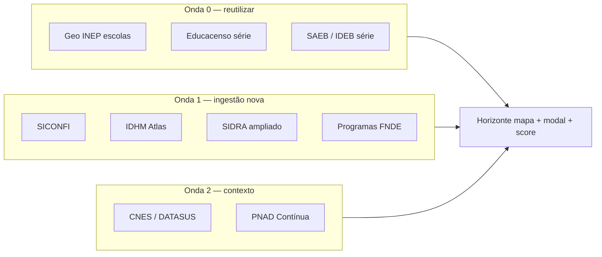

# Roadmap Horizonte — mapa de oportunidade municipal

**Versão do produto:** 8.2.2 · **Última revisão:** 2026-07-24 · **Estado:** v2.2 em curso (HOR-02–04, HOR-08, HOR-19–21 concluídos)

> **Índice geral:** [ROADMAP_INDICE.md](ROADMAP_INDICE.md) · **Landing:** [modulos/MODULO_HORIZONTE.md](modulos/MODULO_HORIZONTE.md) · **Guia técnico:** [HORIZONTE.md](HORIZONTE.md) · **Canteiro:** [ROADMAP_CANTEIRO.md](ROADMAP_CANTEIRO.md) · **Backlog:** [BACKLOG_IMPLEMENTACOES.md](BACKLOG_IMPLEMENTACOES.md) (`HOR-*`)

Documento **canónico** do roadmap Horizonte (ondas, IDs `HOR-*`). O guia operacional permanece em [HORIZONTE.md](HORIZONTE.md).

---

## 1. Conteúdo do roadmap

### 1.1 Linha do tempo (produto)

| Fase | Melhoria | Estado |
|------|----------|--------|
| **v1** | Mapa IBGE conhecidos + scores + busca + rankings UF/prospectos | Concluído |
| **v1.1** | Importação nacional por UF (job batch) sem cadastrar cidade | Concluído |
| **v1.2** | Coroplético IBGE UF + mesorregiões + export CSV prospectos | Concluído |
| **v2 (parcial)** | CadÚnico + demanda social · SIDRA pop. 4–17 · repasses Tesouro · bundle offline v2 · alertas VAAT · malha municipal · Educacenso modal | Concluído |
| **v2.1** | Versão mão (detecção automática + alternância manual) | Concluído |
| **v2.2** | Enriquecimento por bases públicas (§11.2–§11.6) | **Em curso** — HOR-02–04 e HOR-08 em 7.0.0; HOR-01, HOR-05–07 e HOR-18 pendentes — ver [ROADMAP_INDICE.md](ROADMAP_INDICE.md) |
| **v3** | Comparativo antes/depois para clientes (`delta compliance_score`) | Planeado |

Itens rastreáveis: seção **J** em [BACKLOG_IMPLEMENTACOES.md](BACKLOG_IMPLEMENTACOES.md) (`HOR-*`). Panorama: [ROADMAP_INDICE.md](ROADMAP_INDICE.md). Estudo transversal: [ESTUDO_INTEGRACOES_SETOR_PUBLICO_E_PREVISAO_DEMANDA.md](ESTUDO_INTEGRACOES_SETOR_PUBLICO_E_PREVISAO_DEMANDA.md).

---

### 1.2 Enriquecimento por bases públicas — visão geral

O Horizonte consome hoje o **triângulo FUNDEB–Censo–SAEB**, complementado por CadÚnico, SIDRA (população), repasses Tesouro, malha IBGE e alertas VAAT. O roadmap abaixo organiza **novas fontes públicas** por:

| Eixo | Objectivo |
|------|-----------|
| **Mapa** | Camadas visuais, coropléticos e densidade territorial |
| **Ficha municipal** | Campos no modal (finanças, pedagogia, social, compliance) |
| **Decisão comercial** | Novas dimensões de score, filtros e segmentos «Onde buscar clientes» |

**Princípios** (alinhados ao [estudo de integrações](ESTUDO_INTEGRACOES_SETOR_PUBLICO_E_PREVISAO_DEMANDA.md) §2):

1. Agregado por **IBGE 7 dígitos** — sem CPF/NIS em massa.
2. Ingestão via **feed bimestral** ou hub Dados públicos — nunca consulta pesada no clique.
3. Indicadores **indicativos** para priorização comercial; repasses oficiais continuam FNDE/Tesouro/Simec.
4. Reutilizar pipelines **Onda 0** já existentes no SERVLITCYS antes de abrir fontes novas.

---

### 1.3 Prioridade 1 — quick wins (Onda 0)

Fontes **já importáveis** no hub `/admin/dados-publicos`; falta expor no Horizonte.

| ID | Fonte | Mapa | Ficha | Decisão | Entrega |
|----|-------|------|-------|---------|---------|
| **HOR-01** | **Geo INEP escolas** (`school_unit_geos`) | Camada de pontos/cluster ao abrir UF ou município; heatmap densidade rede | Contagem escolas mapeadas vs matrículas Censo | Segmento «fragmentação de rede»; filtro municípios com muitas unidades pequenas | v2.2a |
| **HOR-02** | **Educacenso — momentum** (série já no modal §6.9) | Cor opcional por Δ matrículas 5 anos | Chip «tendência» (↑ estável ↓) no cabeçalho do modal | Dimensão `enrollment_momentum` no scorer; segmento «mercado em retração» | v2.2a · **7.0.0** |
| **HOR-03** | **SAEB / IDEB — série histórica** (`saeb_indicator_points`) | — | Gráfico ou sparkline LP/MAT (últimos 3–4 ciclos) | Dimensão `learning_trajectory` (tendência, não só nível) | v2.2a · **7.0.0** |

**Critério de prioridade:** alto impacto comercial, **zero API nova** — derivar do que o feed bimestral já indexa.

---

### 1.4 Prioridade 2 — mapa e ficha municipal (Onda 1)

| ID | Fonte | Ingestão | Mapa | Ficha | Decisão | Entrega |
|----|-------|----------|------|-------|---------|---------|
| **HOR-04** | **SICONFI** (API Contas Tesouro) | API REST por ente IBGE + exercício · ver INT-06 | — | Despesa educação/receita, endividamento, liquidez, restos a pagar | Dimensão `fiscal_capacity`; filtro «capacidade fiscal mínima» | v2.2b · **7.0.0** (*cobertura nacional em curso*) |
| **HOR-05** | **IDHM** (Atlas IPEA/PNUD) | CSV/API quinquenal por município | Coroplético «IDHM educação» (modo Contornos ou UF) | Pílula IDHM educação + ranking na UF | Refina `social_demand` e narrativa socioeconómica | v2.2b |
| **HOR-06** | **IBGE SIDRA ampliado** | API agregados (urbanização, migração, domicílios c/ crianças) · base INT-05 parcial | Choropleth «pressão demográfica» | População 0–14, taxa urbanização, saldo migratório | Dimensão `demographic_pressure`; segmento «crescimento populacional» | v2.2c |
| **HOR-07** | **Programas FNDE** (PDDE, PNAE, PNATE) | CKAN FNDE / CSV repasses programáticos | Intensidade por município (opcional) | Volume histórico por programa | Segmento «dependência de programas»; risco prestação de contas | v2.2c |
| **HOR-08** | **Portal da Transparência** | API REST (`PORTAL_TRANSPARENCIA_API_KEY`) — client `PortalTransparenciaApiClient` | — | Convénios educação + recursos recebidos (já); próximos: emendas, contratos/licitações MEC-FNDE | Proxy SGE / projeto em curso + due diligence | v2.2c · **7.0.0** + evolução — ver [PORTAL_TRANSPARENCIA_API.md](PORTAL_TRANSPARENCIA_API.md) |
| **HOR-19** | **Canteiro / Obrasgov** (obras educação FNDE·SIMEC) | API pública Obrasgov (`api-publica`…/obras) · ver [ROADMAP_CANTEIRO.md](ROADMAP_CANTEIRO.md) | Pins opcionais (HOR-20) | Contagens por situação; lista de obras ≠ concluída | Dimensão `infra_works`; segmento «obra travada / em curso»; alertas mensais só consultoria | **Concluído** · fases 1–7 |

**Persistência sugerida:** `municipal_fiscal_snapshots`, `municipal_idhm_snapshots`, extensão de `municipal_demography_snapshots`, `municipal_program_snapshots`, `municipal_education_works` (Canteiro), evolução de `municipal_transparency_snapshots` (convênios/emendas detalhados) — incluir no bundle offline v3 quando existir.

#### HOR-08 — evolução Portal da Transparência (pós-7.0.0)

Inventário completo de endpoints e prioridades: **[PORTAL_TRANSPARENCIA_API.md](PORTAL_TRANSPARENCIA_API.md)**.

| Sub-ID | Entrega | Endpoint(s) | Prioridade |
|--------|---------|-------------|------------|
| **HOR-08b** | Lista/alertas de convênios educação na ficha | `convenios` (`codigoIBGE`, `funcao=12`) | P1 |
| **HOR-08c** | ~~Emendas no Horizonte~~ — **cancelado**; emendas só na consultoria (FIN-08) | — | Cancelado |
| **HOR-08d** | Contratos órgãos MEC/FNDE (lista SIAFI curada) | `contratos` (`codigoOrgao` obrig.) | P2 |
| **HOR-08e** | Licitações recentes dos mesmos órgãos | `licitacoes` | P2 |
| **HOR-08f** | Cruzamento CNPJ fornecedores software educação | `contratos/cpf-cnpj`, `itens-contratados` | P2 |
| **HOR-08g** | Sanções CEIS/CNEP em fornecedores/convenentes | `ceis`, `cnep`, `cepim` | P3 |

---

### 1.5 Prioridade 3 — decisão comercial e scoring v3 (Onda 1–2)

Novas **dimensões** candidatas (pesos a calibrar em `config/horizonte.php` após dados disponíveis):

| Dimensão | Fontes | Detecta | Indica |
|----------|--------|---------|--------|
| `enrollment_momentum` | Educacenso | Queda ou alta de matrículas 5 anos | Urgência de modernização vs mercado maduro |
| `learning_trajectory` | SAEB série | IDEB estável / em queda / em recuperação | Argumento pedagógico na abordagem |
| `fiscal_capacity` | SICONFI | Endividamento, % educação, liquidez | Viabilidade de contrato e prazo de ROI |
| `inclusion_gap` | CadÚnico × Censo | Crianças vulneráveis vs cobertura municipal | Prioridade inclusão / PBF |
| `network_fragmentation` | Geo INEP + Censo | Muitas escolas pequenas / km² | Dor de gestão — fit i-Educar |
| `demographic_pressure` | SIDRA migração | Crescimento 0–14 vs oferta | Expansão futura de matrículas |
| `program_dependency` | FNDE programas | Alto PDDE/PNAE sem VAAR OK | Risco operacional / oportunidade consultoria |
| `infra_works_pressure` | Obrasgov / Canteiro | Obras paralisadas, inacabadas ou em execução | Dor de infraestrutura física + gatilho de visita |
| `regional_cluster` | Catálogo `cities` | Consultorias activas em corredor geográfico | Planeamento de visitas comerciais |

**Segmentos «Onde buscar clientes»** previstos: mercado em retração · alta fragmentação · capacidade fiscal · tendência IDEB negativa · corredor regional · obra escolar travada / em curso.

**Scoring v3:** rebalancear pesos actuais (§5.1) após calibragem com amostra nacional; manter benchmarks dinâmicos (`saeb_p25`, medianas FUNDEB/transferências).

| ID | Entrega |
|----|---------|
| **HOR-11** | Novos segmentos + filtros mapa (depende HOR-01–04; inclui Canteiro quando HOR-19) |
| **HOR-12** | Visual «corredor regional» — consultorias activas + prospectos adjacentes |
| **HOR-13** | Comparativo antes/depois `compliance_score` (clientes com Consultoria activa) — **v3** |
| **HOR-19** | Sync + modal **Canteiro** — [ROADMAP_CANTEIRO.md](ROADMAP_CANTEIRO.md) — **concluído** |
| **HOR-20** | Camada mapa obras + filtros — **concluído** |
| **HOR-21** | Empenho/% físico + scoring `infra_works` — **concluído** |

---

### 1.6 Contexto territorial e saúde (Onda 2 — opcional)

| ID | Fonte | Mapa | Ficha | Notas |
|----|-------|------|-------|-------|
| **HOR-09** | **CNES** (DATASUS) | Camada UBS/UPA; distância média escola–UBS | Equipamentos saúde no município | Ver INT-08; agregado público |
| **HOR-10** | **PNAD Contínua** (IBGE) | — | Escolaridade média, NEET jovem | Argumento EJA; importação SIDRA pendente (**HOR-18**) | UI modal **7.0.0** |

---

### 1.7 Fora de âmbito (Onda 3 ou não aplicável)

| Fonte | Motivo |
|-------|--------|
| CadÚnico Serviços (CPF/NIS individual) | LGPD; credencial Conecta gov.br |
| e-SUS APS / RNDS clínico | Credencial SMS; sem API municipal simples |
| SIAFI, CADIN | Não aplicável ao recorte municipal comercial |
| Scraping massivo Simec | Instável; preferir listas FNDE + alertas pontuais (VAAT já implementado) |
| Dados eleitorais automatizados | Baixo valor / alto ruído para score comercial |

---

### 1.8 Ordem de implementação recomendada

| Ordem | IDs | Esforço | Impacto | Dependências |
|-------|-----|---------|---------|--------------|
| 1 | HOR-01 | Baixo | Alto (visual) | `school_unit_geos` + endpoint mapa regional |
| 2 | HOR-02, HOR-03 | Baixo | Alto (decisão) | Série Educacenso/SAEB já indexada |
| 3 | HOR-04 | Médio | Alto (fecho comercial) | INT-06 · API SICONFI · **código 7.0.0; cobertura nacional em curso** |
| 4 | HOR-11, HOR-12 | Médio | Médio | HOR-01–04 |
| 5 | HOR-05, HOR-06 | Médio | Médio | INT-05 ampliado |
| 6 | HOR-07, HOR-08 | Médio–alto | Médio | CKAN FNDE · API Transparência |
| 7 | HOR-09, HOR-10 | Alto | Baixo–médio | Onda 2 |
| 8 | HOR-13 | Médio | Alto (retention) | Consultoria activa + histórico compliance |

---

### 1.9 Rastreabilidade com o backlog global

| ID Horizonte | ID transversal | Documento |
|--------------|----------------|-----------|
| HOR-04 | INT-06 | SICONFI |
| HOR-06 | INT-05 | SIDRA demografia |
| HOR-07 | — | Programas FNDE (catálogo `PublicDataSourcesCatalog`) |
| HOR-08 | — | [CONSULTAS_EXTERNAS.md](CONSULTAS_EXTERNAS.md) § Portal · **[PORTAL_TRANSPARENCIA_API.md](PORTAL_TRANSPARENCIA_API.md)** (inventário Swagger + HOR-08b–g) |
| HOR-19–21 | INT-10 | [ROADMAP_CANTEIRO.md](ROADMAP_CANTEIRO.md) · Obrasgov |
| HOR-09 | INT-08 | DATASUS / CNES |
| HOR-01 | — | [IMPORTACAO_DADOS_PUBLICOS.md](IMPORTACAO_DADOS_PUBLICOS.md) · `geo_inep` |

Ao concluir cada item: mover para **G** em [BACKLOG_IMPLEMENTACOES.md](BACKLOG_IMPLEMENTACOES.md) e atualizar [STATUS_PROJETO.md](STATUS_PROJETO.md).

---

---

*Roadmap canónico Horizonte — ver também [ROADMAP_INDICE.md](ROADMAP_INDICE.md).*
