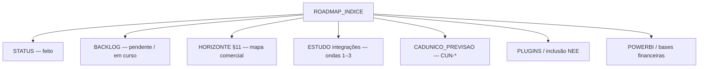

# Índice de roadmaps — servlitcys

**Versão em produção:** **8.1.0** · tag `20260724b-Asclepius` · **Última revisão:** 2026-07-24

> **Índice:** [README.md](README.md) · **Implementado:** [STATUS_PROJETO.md](STATUS_PROJETO.md) · **Pendente / IDs:** [BACKLOG_IMPLEMENTACOES.md](BACKLOG_IMPLEMENTACOES.md) · **Versões:** [HISTORICO_VERSOES.md](HISTORICO_VERSOES.md)

Mapa único do que está **feito**, **em andamento** e **planeado**, com ligações aos roadmaps temáticos. Use este arquivo antes de abrir estudos longos ou o backlog completo.

---

## Como ler a documentação de produto

| Documento | Papel | Quando abrir |
|-----------|-------|--------------|
| [STATUS_PROJETO.md](STATUS_PROJETO.md) | Funcionalidades **em produção** hoje | «Isto já existe?» |
| [BACKLOG_IMPLEMENTACOES.md](BACKLOG_IMPLEMENTACOES.md) | Lista única com IDs (`HOR-*`, `FIN-*`, …) e estados | Priorizar sprint / estimar |
| **Este índice** | Navegação entre roadmaps e panorama actual | Orientação rápida |
| [HISTORICO_VERSOES.md](HISTORICO_VERSOES.md) | Tags, commits, linha do tempo | Deploy e auditoria |
| [ENTREGAS_ESCALONADAS.md](ENTREGAS_ESCALONADAS.md) | Entregas por mês civil | Revisão de release |

---

## Panorama actual (julho/2026)

### Em produção — marco 7.0.x

| Versão | Tag | Release | Conteúdo principal |
|--------|-----|---------|-------------------|
| **7.0.1** | `20260705b-Moneta` | [RELEASE_20260705b_MONETA.md](RELEASE_20260705b_MONETA.md) | Tooltip FUNDEB por UF (rank, total, % federal); `horizonte:warm-map-cache` sem lock HTTP |
| **7.0.0** | `20260705-Ploutos` | [RELEASE_20260705_PLUTOS.md](RELEASE_20260705_PLUTOS.md) | SICONFI/RREO, Transparência, tendência SAEB 4 ciclos, modal enriquecido, scoring ampliado |

**Patches em `main` após 7.0.1** (sem bump de versão — ver [ENTREGAS_ESCALONADAS_JULHO_2026.md](ENTREGAS_ESCALONADAS_JULHO_2026.md)):

| Entrega | Estado | Referência |
|---------|--------|------------|
| Hub Horizonte unificado (`/admin/horizonte/abastecimento`) | Concluído | Hub consultoria simplificado |
| Checkpoint Educacenso persistente (arquivo + inferência BD) | Concluído | `HorizonteEducacensoImportProgressSnapshot` |
| SICONFI — 1 UF por execução, ordem DF→MG por nº municípios | Concluído | `horizonte:sync-siconfi --continue` |
| Modal — cards Finanças / Pedagogia / Social (layout e overflow) | Concluído | `horizonteMap.js`, `horizonte.css` |

### Em andamento

| Área | O quê | Roadmap / backlog | Operação |
|------|-------|-------------------|----------|
| **Horizonte — SICONFI** | Preencher `municipal_fiscal_snapshots` nacionalmente | [HORIZONTE.md](HORIZONTE.md) §9.2 · [HOR-04](BACKLOG_IMPLEMENTACOES.md#j-horizonte--enriquecimento-por-bases-públicas) | `php artisan horizonte:sync-siconfi --continue` (1 UF/exec.) |
| **Horizonte — Transparência** | Cobertura convénios/empenhos (requer API key) | [HOR-08](BACKLOG_IMPLEMENTACOES.md#j-horizonte--enriquecimento-por-bases-públicas) · [CONSULTAS_EXTERNAS.md](CONSULTAS_EXTERNAS.md) | `horizonte:sync-transparency` |
| **Horizonte — PNAD** | UI modal pronta; falta pipeline SIDRA | [HOR-10](BACKLOG_IMPLEMENTACOES.md#j-horizonte--enriquecimento-por-bases-públicas) · [HOR-18](BACKLOG_IMPLEMENTACOES.md#j-horizonte--enriquecimento-por-bases-públicas) | Tabela `municipal_pnad_snapshots` vazia |
| **Horizonte — v2.2** | Geo INEP escolas, IDHM, SIDRA ampliado, programas FNDE | [HORIZONTE.md](HORIZONTE.md) §11.3–§11.6 · `HOR-01`, `HOR-05`–`HOR-07` | — |
| **Consultoria — SAEB** | Metas PNE / semáforo no quadro | [GRA-07](BACKLOG_IMPLEMENTACOES.md#b-painel--gráficos-e-inferências-mec--inep) · [saeb_pedagogico_referencias.md](saeb_pedagogico_referencias.md) | Em andamento |
| **Censo — Clio** | S1–S7 em produção; próximo S8 promote · indicadores vivos | [ROADMAP_CLIO.md](ROADMAP_CLIO.md) · [ROADMAP_EDUCACENSO…](ROADMAP_EDUCACENSO_RELATORIOS_ETAPA1.md) · [CLIO_TODO…](CLIO_TODO_IMPLEMENTACAO.md) | Em curso |
| **Infra — CI** | `pdo_sqlite` / MySQL de testes no pipeline | [INF-04](BACKLOG_IMPLEMENTACOES.md#a-produto-e-infraestrutura) | Em andamento |
| **PHPStan** | Redução gradual do baseline | [TEC-06](BACKLOG_IMPLEMENTACOES.md#e-arquitetura-e-refactor-técnico) | Em andamento |

### Planeado (próximas ondas)

| Onda | Foco | Documento mestre | IDs principais |
|------|------|------------------|----------------|
| **Onda 0** | Quick wins Horizonte (geo escolas) | [HORIZONTE.md](HORIZONTE.md) §11.3 | HOR-01 |
| **Onda 1** | IDHM, SIDRA ampliado, programas FNDE, segmentos comerciais | [HORIZONTE.md](HORIZONTE.md) §11.4–§11.5 · [ESTUDO_INTEGRACOES…](ESTUDO_INTEGRACOES_SETOR_PUBLICO_E_PREVISAO_DEMANDA.md) | HOR-05–07, HOR-11–12, INT-01–04 |
| **Onda 2** | CNES, busca ativa CadÚnico, PNAD completo | [CADUNICO_PREVISAO_TERRITORIAL.md](CADUNICO_PREVISAO_TERRITORIAL.md) · [HORIZONTE.md](HORIZONTE.md) §11.6 | HOR-09–10, HOR-18, CUN-03, INT-07–08 |
| **Onda 3** | e-SUS escola, comparativo compliance clientes | [HORIZONTE.md](HORIZONTE.md) §11.7 | HOR-13, INT-09 |
| **Transversal** | Power BI, plugins i-Educar, inclusão NEE | Ver tabela abaixo | PBI-*, PLG-*, CAD-* |
| **Censo / Educacenso** | **Clio** — campanhas CSV 1ª etapa | [ROADMAP_CLIO.md](ROADMAP_CLIO.md) · [ROADMAP_EDUCACENSO…](ROADMAP_EDUCACENSO_RELATORIOS_ETAPA1.md) · [CLIO_TODO…](CLIO_TODO_IMPLEMENTACAO.md) | CEN-04…CEN-16 · CLI-IND-* |

---

## Roadmaps por área (ligações directas)

### Horizonte — mapa de oportunidade municipal

| Documento | Conteúdo |
|-----------|----------|
| [HORIZONTE.md](HORIZONTE.md) | Guia completo — scoring, modal, feed, CLI |
| [HORIZONTE.md §11 — Roadmap](HORIZONTE.md#11-roadmap) | Ondas 0–2, IDs `HOR-*`, ordem de implementação |
| [IMPORTACAO_DADOS_PUBLICOS.md](IMPORTACAO_DADOS_PUBLICOS.md) §11 | Hub abastecimento e fases do feed |
| [COMANDOS_ARTISAN.md](COMANDOS_ARTISAN.md) §3.2 | `horizonte:*`, sync nacional |

**Estado dos itens Horizonte (`HOR-*`):**

| ID | Item | Estado |
|----|------|--------|
| HOR-01 | Geo INEP escolas no mapa | Pendente |
| HOR-02 | Momentum Educacenso no scorer | Concluído (7.0.0) |
| HOR-03 | Série SAEB / `learning_trajectory` | Concluído (7.0.0) |
| HOR-04 | SICONFI no modal + `fiscal_capacity` | Concluído (7.0.0) — *cobertura nacional em curso* |
| HOR-05 | IDHM educação (Atlas IPEA) | Pendente |
| HOR-06 | SIDRA ampliado | Pendente |
| HOR-07 | Programas FNDE agregados | Pendente |
| HOR-08 | Portal da Transparência | Concluído (7.0.0) — *sync em curso* |
| HOR-09 | CNES / proximidade escola–UBS | Pendente |
| HOR-10 | PNAD no modal | Parcial — UI 7.0.0; importação pendente |
| HOR-11–12 | Segmentos e corredor regional | Pendente |
| HOR-13 | Comparativo `compliance_score` (v3) | Pendente |
| HOR-14 | Versão mão no mapa | Concluído (6.5.0) |
| HOR-18 | Importação PNAD (SIDRA → snapshots) | Pendente |

### Integrações setor público e previsão de demanda

| Documento | Conteúdo |
|-----------|----------|
| [ESTUDO_INTEGRACOES_SETOR_PUBLICO_E_PREVISAO_DEMANDA.md](ESTUDO_INTEGRACOES_SETOR_PUBLICO_E_PREVISAO_DEMANDA.md) | Ondas 1–3, matriz de fontes |
| [BACKLOG_IMPLEMENTACOES.md § H](BACKLOG_IMPLEMENTACOES.md#h-integrações-setor-público-e-previsão-de-demanda) | IDs `INT-*` |

### CadÚnico — previsão territorial e busca ativa

| Documento | Conteúdo |
|-----------|----------|
| [CADUNICO_PREVISAO_TERRITORIAL.md](CADUNICO_PREVISAO_TERRITORIAL.md) | CUN-01/02 entregues; CUN-03 pendente |
| [CADUNICO_AUTOMACAO.md](CADUNICO_AUTOMACAO.md) | Import nacional, cron, filas |
| [BACKLOG_IMPLEMENTACOES.md § I](BACKLOG_IMPLEMENTACOES.md#i-cadúnico--acurácia-da-lacuna-mapa-e-busca-ativa) | IDs `CUN-*` |

### Censo / Educacenso — 1ª etapa

| Documento | Conteúdo |
|-----------|----------|
| [ROADMAP_CLIO.md](ROADMAP_CLIO.md) | **Roadmap vivo** — status do módulo, indicadores consolidados, melhorias com impacto |
| [ROADMAP_EDUCACENSO_RELATORIOS_ETAPA1.md](ROADMAP_EDUCACENSO_RELATORIOS_ETAPA1.md) | Spec histórica — multi-arquivo, análise com/sem i-Educar, carga · §9 validado |
| [CLIO_TODO_IMPLEMENTACAO.md](CLIO_TODO_IMPLEMENTACAO.md) | TODO de código do módulo Clio (S1–S8) |
| [CLIO_CATALOGO_ERROS_E_RELATORIOS.md](CLIO_CATALOGO_ERROS_E_RELATORIOS.md) | Catálogo INF-* / CLIO-* / superfícies de relatório |
| [modulos/MODULO_CLIO.md](modulos/MODULO_CLIO.md) | Landing Clio |
| [EDUCACENSO_SIMULACAO_CARGA_ETAPA1.md](EDUCACENSO_SIMULACAO_CARGA_ETAPA1.md) | Spec CEN-01 (conferência TXT × i-Educar) — base a reutilizar |
| [modulos/MODULO_RX_CENSO.md](modulos/MODULO_RX_CENSO.md) | Landing RX / Censo |
| [BACKLOG_IMPLEMENTACOES.md § F](BACKLOG_IMPLEMENTACOES.md#f-plugins-integrações-e-cadastro-i-educar) | IDs `CEN-*` |

**Estado dos itens Educacenso (`CEN-*`):**

| ID | Item | Estado |
|----|------|--------|
| CEN-01 | Conferência TXT portal × i-Educar | Concluído (4.4.8) |
| CEN-02 | Inventário corpus Drive COLETA 2026 | **Concluído** (docs 21/07) |
| CEN-03 | Modelo de campanha (spec) | **Concluído** (docs 21/07) |
| CEN-04–07 | MVP ingestão CSV + análise Modo A | **Concluído** (S1–S4) |
| CEN-14 | Cadastro ficha leve (sem i-Educar) | **Concluído** (S1) |
| CEN-08–10 · CEN-15 | Modo B, vínculo i-Educar, export/RX | **Concluído** (S5–S6) |
| CEN-16 | ETL `bi_clio_*` | **Concluído (S7 / 8.0.3)** |
| CEN-11–13 | Carga assistida i-Educar | Pendente (S8) |

### Inclusão, NEE e qualidade de cadastro

| Documento | Conteúdo |
|-----------|----------|
| [DOCUMENTO_EXECUTIVO_ROADMAP_INCLUSAO_E_QUALIDADE_CADASTRO.md](DOCUMENTO_EXECUTIVO_ROADMAP_INCLUSAO_E_QUALIDADE_CADASTRO.md) | Roadmap executivo NEE/AEE |
| [PLUGINS_E_REFINO_CADASTRO_IEDUCAR.md](PLUGINS_E_REFINO_CADASTRO_IEDUCAR.md) | Catálogo plugins e checklist |
| [BACKLOG_IMPLEMENTACOES.md § D e F](BACKLOG_IMPLEMENTACOES.md#d-qualidade-de-cadastro-e-inclusão) | IDs `CAD-*`, `PLG-*`, `API-01` |

### Financiamento, FUNDEB e bases de cálculo

| Documento | Conteúdo |
|-----------|----------|
| [FUNDEB_VAAF_E_ONDA1.md](FUNDEB_VAAF_E_ONDA1.md) | VAAF, VAAT, VAAR — onda 1 entregue |
| [ROADMAP_BASES_CALCULOS_FINANCEIROS.md](ROADMAP_BASES_CALCULOS_FINANCEIROS.md) | Motor de repasses (futuro) |
| [EXPORTACAO_DADOS_FUNDEB_PLANILHA.md](EXPORTACAO_DADOS_FUNDEB_PLANILHA.md) | Matriz Serventec — fases 2–3 |
| [BACKLOG_IMPLEMENTACOES.md § C](BACKLOG_IMPLEMENTACOES.md#c-financiamento-e-repasses-dados-públicos) | IDs `FIN-*` |

### Power BI e camada analítica

| Documento | Conteúdo |
|-----------|----------|
| [POWERBI.md](POWERBI.md) | Estudo completo — fases 0–6 |
| [BACKLOG_IMPLEMENTACOES.md § I (Power BI)](BACKLOG_IMPLEMENTACOES.md#i-power-bi-e-camada-analítica) | IDs `PBI-01`…`PBI-10` |

### Infraestrutura e escalabilidade

| Documento | Conteúdo |
|-----------|----------|
| [ESCALABILIDADE_INFRAESTRUTURA.md](ESCALABILIDADE_INFRAESTRUTURA.md) | Etapas 1–9 (pool, Redis, Horizon…) |
| [BACKLOG_IMPLEMENTACOES.md § A](BACKLOG_IMPLEMENTACOES.md#a-produto-e-infraestrutura) | IDs `INF-*` |

### Gráficos e inferências MEC / INEP

| Documento | Conteúdo |
|-----------|----------|
| [SUGESTOES_GRAFICOS_INFERENCIAS_MEC_INEP.md](SUGESTOES_GRAFICOS_INFERENCIAS_MEC_INEP.md) | Sugestões por aba |
| [saeb_pedagogico_referencias.md](saeb_pedagogico_referencias.md) | SAEB / IDEB / metas PNE |
| [BACKLOG_IMPLEMENTACOES.md § B](BACKLOG_IMPLEMENTACOES.md#b-painel--gráficos-e-inferências-mec--inep) | IDs `GRA-*` |

---

## Consultoria municipal — mapa de capacidades

| Área (5) | Documentação | Backlog relacionado |
|----------|--------------|---------------------|
| Resumo / Diagnóstico | [ANALYTICS_NAVEGACAO_UI.md](ANALYTICS_NAVEGACAO_UI.md) | TEC-01–03 |
| Cadastro | [CADUNICO_CECAD.md](CADUNICO_CECAD.md) | CUN-*, CAD-* |
| Pedagógico | [saeb_pedagogico_referencias.md](saeb_pedagogico_referencias.md) | GRA-*, PLG-* |
| Censo | [ROADMAP_CLIO.md](ROADMAP_CLIO.md) · [MODULO_CLIO.md](modulos/MODULO_CLIO.md) · [EDUCACENSO_SIMULACAO_CARGA_ETAPA1.md](EDUCACENSO_SIMULACAO_CARGA_ETAPA1.md) · [ROADMAP_EDUCACENSO…](ROADMAP_EDUCACENSO_RELATORIOS_ETAPA1.md) | CEN-01 ✓ · CEN-04…15 ✓ (S1–S6) · CEN-16/11–13 pendente · CLI-IND-* |
| Finanças | [FUNDEB_VAAF_E_ONDA1.md](FUNDEB_VAAF_E_ONDA1.md) | FIN-* (maioria ✓) |
| Horizonte (paralelo) | [HORIZONTE.md](HORIZONTE.md) | HOR-* |

---

## Manutenção deste índice

Ao fechar entrega relevante:

1. Actualizar [STATUS_PROJETO.md](STATUS_PROJETO.md) e linha em [HISTORICO_VERSOES.md](HISTORICO_VERSOES.md).
2. Mover ID no [BACKLOG_IMPLEMENTACOES.md](BACKLOG_IMPLEMENTACOES.md) para **Concluído** ou seção **G**.
3. Actualizar tabelas **Panorama actual** e **Estado HOR-*** neste arquivo.
4. Se for marco semântico: nota `RELEASE_*.md` + [ENTREGAS_ESCALONADAS_JULHO_2026.md](ENTREGAS_ESCALONADAS_JULHO_2026.md).

Checklist completo: [PADRAO_DOCUMENTACAO.md](PADRAO_DOCUMENTACAO.md) §6.

---

*Índice vivo — não substitui roadmaps temáticos nem o backlog com IDs.*
