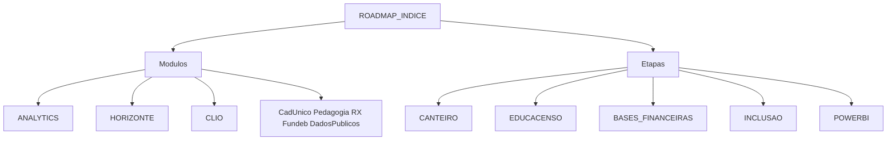

# Índice de roadmaps — servlitcys

**Versão em produção:** **9.0.1** · **Última revisão:** 2026-07-25

> **Índice docs:** [README.md](README.md) · **Implementado:** [STATUS_PROJETO.md](STATUS_PROJETO.md) · **Pendente / IDs:** [BACKLOG_IMPLEMENTACOES.md](BACKLOG_IMPLEMENTACOES.md) · **Versões:** [HISTORICO_VERSOES.md](HISTORICO_VERSOES.md) · **Módulos:** [modulos/README.md](modulos/README.md)

Mapa único dos **roadmaps construídos** (`ROADMAP_*.md`), com ligação por módulo e panorama feito / em curso / planeado. Padrão: **`ROADMAP_{MODULO_OU_ETAPA}.md`**.

---

## 1. Catálogo de roadmaps construídos

### Módulos

| Ficheiro | Módulo | Estado | IDs principais |
|----------|--------|--------|----------------|
| [ROADMAP_ANALYTICS.md](ROADMAP_ANALYTICS.md) | Painel analítico | Produção + melhorias | TEC-*, GRA-*, PBI-* |
| [ROADMAP_HORIZONTE.md](ROADMAP_HORIZONTE.md) | Horizonte | v2.2 em curso | HOR-* |
| [ROADMAP_CADUNICO.md](ROADMAP_CADUNICO.md) | CadÚnico | CUN-01/02 ✓ · CUN-03 pendente | CUN-* |
| [ROADMAP_PEDAGOGIA_SAEB.md](ROADMAP_PEDAGOGIA_SAEB.md) | Pedagogia / SAEB | GRA-07 em andamento | GRA-* |
| [ROADMAP_RX_CENSO.md](ROADMAP_RX_CENSO.md) | RX — Censo | Produção · S8 pendente | CEN-* |
| [ROADMAP_CLIO.md](ROADMAP_CLIO.md) | Clio | S1–S7 ✓ · S8 pendente | CEN-*, CLI-IND-* |
| [ROADMAP_FUNDEB.md](ROADMAP_FUNDEB.md) | Financiamento FUNDEB | Onda 1 ✓ | FIN-* |
| [ROADMAP_DADOS_PUBLICOS.md](ROADMAP_DADOS_PUBLICOS.md) | Dados públicos (admin) | Hubs + feed em produção | INT-*, INF-* |

### Etapas / temas transversais

| Ficheiro | Tema | Estado | IDs principais |
|----------|------|--------|----------------|
| [ROADMAP_CANTEIRO.md](ROADMAP_CANTEIRO.md) | Canteiro — obras educação | Fases 0–7 concluídas | HOR-19–21, INT-10 |
| [ROADMAP_EDUCACENSO.md](ROADMAP_EDUCACENSO.md) | Spec Educacenso / Clio S1–S6 | Spec fechada | CEN-04…15 |
| [ROADMAP_BASES_FINANCEIRAS.md](ROADMAP_BASES_FINANCEIRAS.md) | Motor bases financeiras | Planeado | FIN-* |
| [PORTAL_TRANSPARENCIA_API.md](PORTAL_TRANSPARENCIA_API.md) | Portal Transparência — inventário API | Inventário + backlog | FIN-07–10, HOR-08b–g |
| [ROADMAP_INCLUSAO.md](ROADMAP_INCLUSAO.md) | Inclusão NEE / cadastro | Parcial | CAD-*, PLG-* |
| [ROADMAP_POWERBI.md](ROADMAP_POWERBI.md) | Power BI | Estudo · Embedded fora MVP | PBI-* |

```mermaid
flowchart TD
  indice[ROADMAP_INDICE]
  indice --> mods[Modulos]
  indice --> etapas[Etapas]
  mods --> analytics[ANALYTICS]
  mods --> horizonte[HORIZONTE]
  mods --> clio[CLIO]
  mods --> outros[CadUnico Pedagogia RX Fundeb DadosPublicos]
  etapas --> canteiro[CANTEIRO]
  etapas --> educacenso[EDUCACENSO]
  etapas --> bases[BASES_FINANCEIRAS]
  etapas --> inclusao[INCLUSAO]
  etapas --> powerbi[POWERBI]
```

---

## 2. Por módulo (roadmap → landing → demais)

Ordem fixa em cada bloco e no leitor de documentação: **1º roadmap · 2º landing · 3º guias**.

### Painel analítico

1. [ROADMAP_ANALYTICS.md](ROADMAP_ANALYTICS.md)
2. [modulos/MODULO_ANALYTICS.md](modulos/MODULO_ANALYTICS.md)
3. [ANALYTICS_NAVEGACAO_UI.md](ANALYTICS_NAVEGACAO_UI.md) · [CONSULTORIA_ABAS_DECISAO.md](CONSULTORIA_ABAS_DECISAO.md) · [RELATORIO_PDF_ATM.md](RELATORIO_PDF_ATM.md) · [ROADMAP_POWERBI.md](ROADMAP_POWERBI.md) · [POWERBI.md](POWERBI.md)

### Horizonte

1. [ROADMAP_HORIZONTE.md](ROADMAP_HORIZONTE.md)
2. [modulos/MODULO_HORIZONTE.md](modulos/MODULO_HORIZONTE.md)
3. [HORIZONTE.md](HORIZONTE.md) · [ROADMAP_CANTEIRO.md](ROADMAP_CANTEIRO.md) · [IMPORTACAO_DADOS_PUBLICOS.md](IMPORTACAO_DADOS_PUBLICOS.md) · [COMANDOS_ARTISAN.md](COMANDOS_ARTISAN.md) §3.2

### CadÚnico

1. [ROADMAP_CADUNICO.md](ROADMAP_CADUNICO.md)
2. [modulos/MODULO_CADUNICO.md](modulos/MODULO_CADUNICO.md)
3. [CADUNICO_PREVISAO_TERRITORIAL.md](CADUNICO_PREVISAO_TERRITORIAL.md) · [CADUNICO_AUTOMACAO.md](CADUNICO_AUTOMACAO.md) · [ROADMAP_INCLUSAO.md](ROADMAP_INCLUSAO.md)

### Pedagogia e SAEB

1. [ROADMAP_PEDAGOGIA_SAEB.md](ROADMAP_PEDAGOGIA_SAEB.md)
2. [modulos/MODULO_PEDAGOGIA_SAEB.md](modulos/MODULO_PEDAGOGIA_SAEB.md)
3. [saeb_pedagogico_referencias.md](saeb_pedagogico_referencias.md) · [SUGESTOES_GRAFICOS_INFERENCIAS_MEC_INEP.md](SUGESTOES_GRAFICOS_INFERENCIAS_MEC_INEP.md)

### RX — Censo

1. [ROADMAP_RX_CENSO.md](ROADMAP_RX_CENSO.md)
2. [modulos/MODULO_RX_CENSO.md](modulos/MODULO_RX_CENSO.md)
3. [ROADMAP_CLIO.md](ROADMAP_CLIO.md) · [ROADMAP_EDUCACENSO.md](ROADMAP_EDUCACENSO.md) · [EDUCACENSO_SIMULACAO_CARGA_ETAPA1.md](EDUCACENSO_SIMULACAO_CARGA_ETAPA1.md)

### Clio

1. [ROADMAP_CLIO.md](ROADMAP_CLIO.md)
2. [modulos/MODULO_CLIO.md](modulos/MODULO_CLIO.md)
3. [ROADMAP_EDUCACENSO.md](ROADMAP_EDUCACENSO.md) · [CLIO_CATALOGO_ERROS_E_RELATORIOS.md](CLIO_CATALOGO_ERROS_E_RELATORIOS.md) · [CLIO_TODO_IMPLEMENTACAO.md](CLIO_TODO_IMPLEMENTACAO.md)

### Financiamento (FUNDEB)

1. [ROADMAP_FUNDEB.md](ROADMAP_FUNDEB.md)
2. [modulos/MODULO_FUNDEB.md](modulos/MODULO_FUNDEB.md)
3. [FUNDEB_VAAF_E_ONDA1.md](FUNDEB_VAAF_E_ONDA1.md) · [ROADMAP_BASES_FINANCEIRAS.md](ROADMAP_BASES_FINANCEIRAS.md) · [CONSULTAS_EXTERNAS.md](CONSULTAS_EXTERNAS.md)

### Dados públicos (admin)

1. [ROADMAP_DADOS_PUBLICOS.md](ROADMAP_DADOS_PUBLICOS.md)
2. [modulos/MODULO_DADOS_PUBLICOS.md](modulos/MODULO_DADOS_PUBLICOS.md)
3. [IMPORTACAO_DADOS_PUBLICOS.md](IMPORTACAO_DADOS_PUBLICOS.md) · [ESTUDO_INTEGRACOES_SETOR_PUBLICO_E_PREVISAO_DEMANDA.md](ESTUDO_INTEGRACOES_SETOR_PUBLICO_E_PREVISAO_DEMANDA.md)

---

## 3. Panorama actual

### Em curso

| Área | O quê | Roadmap |
|------|-------|---------|
| Horizonte — SICONFI / Transparência | Cobertura nacional | [ROADMAP_HORIZONTE.md](ROADMAP_HORIZONTE.md) |
| Horizonte — PNAD / geo escolas | HOR-01, HOR-10, HOR-18 | Idem |
| Pedagogia — GRA-07 | Metas PNE / semáforo | [ROADMAP_PEDAGOGIA_SAEB.md](ROADMAP_PEDAGOGIA_SAEB.md) |
| Clio — S8 | Promote i-Educar | [ROADMAP_CLIO.md](ROADMAP_CLIO.md) |
| Infra — CI / PHPStan | INF-04, TEC-06 | [ROADMAP_DADOS_PUBLICOS.md](ROADMAP_DADOS_PUBLICOS.md) · backlog |

### Planeado (ondas)

| Onda | Foco | Roadmaps |
|------|------|----------|
| Onda 0–1 | Geo escolas, IDHM, SIDRA, programas FNDE, segmentos | [ROADMAP_HORIZONTE.md](ROADMAP_HORIZONTE.md) |
| Onda 2 | CNES, busca activa CadÚnico, PNAD | [ROADMAP_CADUNICO.md](ROADMAP_CADUNICO.md) · Horizonte |
| Transversal | Power BI, inclusão, bases financeiras | [ROADMAP_POWERBI.md](ROADMAP_POWERBI.md) · [ROADMAP_INCLUSAO.md](ROADMAP_INCLUSAO.md) · [ROADMAP_BASES_FINANCEIRAS.md](ROADMAP_BASES_FINANCEIRAS.md) |

### Horizonte — estado `HOR-*` (resumo)

| ID | Item | Estado |
|----|------|--------|
| HOR-01 | Geo INEP escolas | Pendente |
| HOR-02–04, HOR-08 | Momentum, SAEB série, SICONFI, Transparência | Concluído (cobertura parcial) |
| HOR-05–07, HOR-09–13, HOR-18 | IDHM, SIDRA, programas, CNES, PNAD, segmentos, v3 | Pendente / parcial |
| HOR-14 | Versão mão | Concluído |
| HOR-19–21 | Canteiro | **Concluído** — [ROADMAP_CANTEIRO.md](ROADMAP_CANTEIRO.md) |

---

## 4. Como ler a documentação de produto

| Documento | Papel |
|-----------|-------|
| [STATUS_PROJETO.md](STATUS_PROJETO.md) | O que está em produção |
| [BACKLOG_IMPLEMENTACOES.md](BACKLOG_IMPLEMENTACOES.md) | IDs e estados |
| **Este índice** | Catálogo de roadmaps + ordem por módulo |
| [HISTORICO_VERSOES.md](HISTORICO_VERSOES.md) | Tags e linha do tempo |
| [ENTREGAS_ESCALONADAS_MELHORIAS_FUTURAS.md](ENTREGAS_ESCALONADAS_MELHORIAS_FUTURAS.md) | Plano técnico pós-8.2 |

---

## 5. Manutenção

1. Novo módulo → criar `ROADMAP_{SLUG}.md` + landing `modulos/MODULO_*` + entrada neste catálogo e no `DocumentationCatalog` (ordem: landing → roadmap → resto).
2. Nova etapa → `ROADMAP_{ETAPA}.md` + linha na tabela de etapas.
3. Ao fechar entrega: STATUS + backlog + tabela §3 deste índice.
4. Paths antigos (ex. `ROADMAP_OBRAS_EDUCACAO`) resolvem via aliases no leitor.

Checklist: [PADRAO_DOCUMENTACAO.md](PADRAO_DOCUMENTACAO.md) §6.

---

*Índice vivo dos roadmaps construídos — não substitui os roadmaps temáticos nem o backlog com IDs.*
