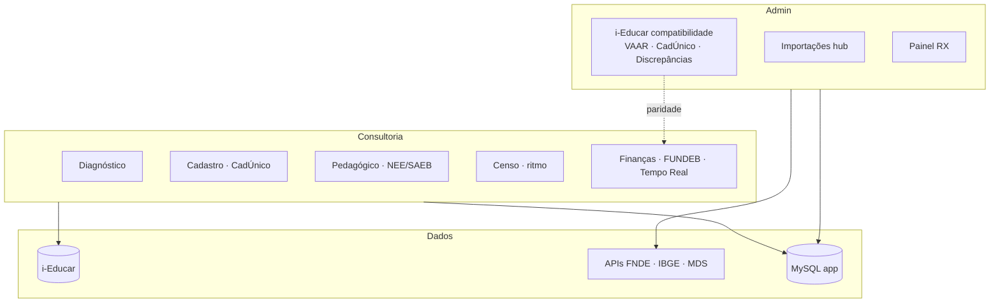

# Estado do projeto — servlitcys

**Versão em produção:** **4.4.2** · release `20260608a-Pythia` · **Ramo:** `main` · **Última revisão:** 08/06/2026

Histórico de releases: [HISTORICO_VERSOES.md](HISTORICO_VERSOES.md).

Referência do que está **implementado** hoje. Para **decisões técnicas**, ver [PONDERACOES_TECNICAS.md](PONDERACOES_TECNICAS.md). Para **próximas entregas**, ver [BACKLOG_IMPLEMENTACOES.md](BACKLOG_IMPLEMENTACOES.md). **Índice completo:** [README.md](README.md) · **diagramas:** [ARQUITETURA_E_FLUXOS.md](ARQUITETURA_E_FLUXOS.md).

---

## Mapa de capacidades (4.4.0)

---

## Resumo executivo

| Área | Estado |
|------|--------|
| RBAC (admin / user / municipal) | Implementado |
| Painel de análise i-Educar (abas lazy + faixa impacto por aba) | Implementado |
| Analytics — Comparativo (Finanças: ano base vs anterior, FUNDEB, export PDF/CSV/Excel) | Implementado (3.5.0) |
| Analytics — CadÚnico previsão (lacuna rede, impacto VAAF, export consultoria) | Implementado (3.5.0) |
| CadÚnico — mapa territorial, faixas com lacuna, cenários NEE/AEE, import IBGE (`cadunico:sync-territorio`) | Implementado (3.9.0) |
| Repasses FUNDEB — 3 extratos, download BB, extrato Tempo Real (mês/ano + comparativo) | Implementado (3.10.0) |
| Consultoria 4.1 — navegação cenário C (Resumo → Diagnóstico; 5 áreas; aba inicial com ano) | Implementado (4.1.0) |
| Finanças Tempo Real — fix alertas + filtro FUNDEB unificado KPI/extrato | Implementado (4.1.0) |
| Início 4.0 — Acesso rápido curado, mapa mental em camadas, rebuild `funding:rebuild-finance-realtime` | Implementado (4.0.0) |
| CadÚnico — importação automática (URL nacional, fila `cadastro`, cron, admin) | Implementado (3.5.0) |
| CadÚnico — SAGI/Misocial (MDS) nacional + `cadunico:import-misocial` histórico | Implementado (3.6.0) |
| Analytics — Finanças «Tempo Real» (repasses vs FUNDEB) | Implementado (3.6.0) |
| FUNDEB — metodologia de impacto + fontes/portarias no admin | Implementado (3.6.0) |
| Analytics — Finanças lazy otimizado (FUNDEB leve, Comparativo shell, snapshot memoizado) | Implementado (3.7.0) |
| Consultoria — VAAF×matrículas com ponderações e base legal (Lei/portarias) | Implementado (3.7.0) |
| Admin — hub importação unificado (`import-hub`) | Implementado (3.7.0) |
| Segurança — URLs outbound e paths contidos (CadÚnico/import) | Implementado (3.7.0) |
| Analytics — volume matrículas + alunos distintos nos medidores de quantidade | Implementado (3.8.0) |
| FUNDEB / Inclusão — base e ponderação NEE por aluno (sem inflar matrícula duplicada) | Implementado (3.8.0) |
| Diagnóstico — velocímetro único; faixa de impacto sem anel fictício em falha parcial | Implementado (3.8.0) |
| Analytics — navegação 5 áreas (**Resumo** → Cadastro → Pedagógico → Censo → Finanças) | Implementado (4.1.0) |
| Finanças / Censo — UI `consultoria-tab-frame` por tom temático | Implementado (3.4.0) |
| Diagnóstico — qualidade do sistema + «Explorar em detalhe» | Implementado (3.4.0; refinado pós-release: métricas por área, PDF) |
| Diagnóstico — modo estratégico (um pedido leve + cache partilhado entre abas) | Implementado (3.3.2) |
| Diagnóstico — progressivo AJAX (legado) | Opcional (`mode=progressive`) |
| Finanças — contexto municipal reutilizado (sem queries duplicadas no lazy) | Implementado (3.3.1+) |
| Overlay global de carregamento (filtros, admin, auth) | Implementado |
| Discrepâncias + export CSV | Implementado |
| FUNDEB / VAAF (import + cascata + matriz + export CSV + perfil planejamento) | Implementado |
| Importações externas (guias UX admin + hub público) | Implementado |
| Mapa Início — semáforo cadastro RX + contato municipal | Implementado (2.3.8.6) |
| Pulse — diagnóstico SQL + operações estruturadas | Implementado (2.3.8.7) |
| Consultoria — Matrículas ganho VAAF (sem perdas) | Implementado (2.3.8.7) |
| Mapa unidades — capacidade/vagas (fallback ocupação) | Implementado (2.3.8.5) |
| Matrículas — cartões saldo + fórmula VAAF indicativa | Implementado (2.3.8.5) |
| Inclusão NEE — dataset unificado grupo + catálogo | Implementado (`InclusionNeeDesignacaoDataset`) |
| Inclusão NEE — cadastro + turma AEE (SQL alinhado gráficos/medidores) | Implementado (3.0.0; `IEDUCAR_INCLUSION_NEE_INCLUIR_TURMA_AEE`) |
| Desempenho — gráficos SAEB em grelha 4 colunas | Implementado (3.0.0) |
| Rodapé área logada + política de privacidade (`/privacidade`) | Implementado (3.0.0) |
| Welcome / home — UI ícones, RX barra Censo, mapa mental | Implementado (3.0.0; Início refinado 4.0.0 — [INICIO_DASHBOARD.md](INICIO_DASHBOARD.md)) |
| Consentimento LGPD (PP + cookies, versão, `/consentimento`) | Implementado (3.0.0; `legal_consent_logs`; layout desktop) |
| Admin — relatório consentimentos (`/admin/consentimentos-legais`) | Implementado (3.0.0) |
| Admin — editor documentos legais + revogação/reconsentimento (`/admin/documentos-legais`) | Implementado (3.0.0; patch pós-release; `legal_document_versions`) |
| Notificações — página `/notifications` + API `/notifications/feed` | Implementado (3.0.0) |
| Rodapé — selo versão (tag Apollo + data lançamento) | Implementado (`ProductVersion`, `x-product-version-badge`) |
| Inclusão — gráfico catálogo completo NEE (INEP / i-Educar, contagens exclusivas + barra AEE) | Implementado (3.0.0; patch pós-release) |
| Inclusão — impacto FUNDEB indicativo (ponderação 1,20 + VAAR proporcional) | Implementado (3.1.0) |
| Inclusão — inconsistências cadastro (AEE / recurso prova INEP com nome do aluno) | Implementado (3.1.0) |
| Admin — leitor documentação (todos os `.md` em `docs/`, links internos) | Implementado (3.1.0) |
| Inclusão — exportação NEE CSV/Excel (admin, fila `inclusion_nee_export`) | Implementado (3.1.0–3.2.0; dados alinhados ao painel em 3.2.0) |
| Inclusão — risco financeiro turma AEE sem cadastro deficiência | Implementado (3.2.0) |
| Admin — fila processamento (cards temáticos, download com ícone) | Implementado (3.2.0) |
| Admin — monitor de módulos (`/admin/monitor-modulos`, saúde + histórico incidentes) | Implementado (3.3.0) |
| Utilizador/Municipal — documentação (`/documentacao`) e filas (`/filas`) | Implementado (3.3.0) |
| Inclusão — exportação NEE para utilizador/municipal (não só admin) | Implementado (3.3.0) |
| Painel RX (`/dashboard/rx`) — legendas unificadas, KPIs `serv-home-kpi`, tons sky/teal | Implementado (patch pós-3.3.0) |
| Painel RX — gráfico complementações FUNDEB (portaria consolidada vs cadastro em andamento) | Implementado (4.2.0; painel completo 4.3.0) |
| Início — gráfico complementações FUNDEB após mapa municipal | Implementado (4.3.0) |
| FUNDEB — complementação VAAT/VAAR da portaria, discrepâncias operacionais, projeção VAAT+IEI | Implementado (4.2.0) |
| FUNDEB — `fundeb:import-api --replace` (reimportação limpa por âmbito) | Implementado (4.3.0) |
| Consultoria — hub Discrepâncias modular por área | Implementado (4.2.0) |
| Discrepâncias — geo escolas sem mapa alinhada a Unidades; sinais operacionais em todas as rotinas | Implementado (4.3.0) |
| Discrepâncias — painel modular unificado admin/consultoria (`DiscrepanciesPanelAssembler`) | Implementado (4.4.0) |
| Admin i-Educar — VAAR na matriz FUNDEB, CadÚnico nas discrepâncias, ano letivo vigente | Implementado (4.4.0) |
| Tags de release — sufixo alfabético no mesmo dia (`ProductReleaseTag`) | Implementado (4.4.0) |
| Hub documentação — `HUB_DOCUMENTACAO.md`, Mermaid no leitor, canvas no repo | Implementado (4.4.1) |
| Pesquisa na documentação (`/documentacao/buscar`, índice MD + menu) | Implementado (4.4.2) |
| Estudo Power BI — `docs/POWERBI.md`, backlog PBI-01…10 | Implementado (4.4.2) |
| Rodapé autenticado — créditos desenvolvedor e link GitHub | Implementado (4.4.1) |
| Admin — monitor de módulos — UI `serv-*`, cartões só saúde (sem atalhos) | Implementado (patch pós-3.3.0) |
| Catálogo API i-Educar (consultas SQL → endpoints propostos, JSON, perf/seg) | Documentado — [CATALOGO_API_IEDUCAR_CONSULTAS_DIRETAS.md](CATALOGO_API_IEDUCAR_CONSULTAS_DIRETAS.md) |
| Estudo integrações setor público + previsão demanda (doc) | Documentado — [ESTUDO_INTEGRACOES_SETOR_PUBLICO_E_PREVISAO_DEMANDA.md](ESTUDO_INTEGRACOES_SETOR_PUBLICO_E_PREVISAO_DEMANDA.md); implementação Ondas 1–3 no backlog §H |
| Sync massiva semanal (`system::weekly_mass_sync`, checkpoint) | Implementado |
| Repasses Tesouro CSV + snapshots municipais | Implementado |
| PDF analítico (fila + comparativos + quadros FUNDEB) | Implementado |
| Dashboard admin / Conexões | Implementado |
| Financiamentos (consultas públicas FNDE/Tesouro/Transparência) | Implementado (requer `.env`; ver [CONSULTAS_EXTERNAS.md](CONSULTAS_EXTERNAS.md)) |
| Censo (ritmo, meta ano anterior, enturmações) | Implementado |
| Serventec (diagnóstico + PDF) | Implementado |
| Gestão de usuários (ativar / desativar / excluir) | Implementado |
| Pulse / monitorização | Implementado |
| CI/CD remoto | Planeado — ver backlog INF-01 |

---

## Perfis e acesso

| Perfil | Página inicial | Escopo |
|--------|----------------|--------|
| `admin` | `/dashboard` | Sistema completo |
| `user` | `/dashboard/analytics` | Todos os municípios `forAnalytics` |
| `municipal` | `/dashboard/analytics` (+ `city_id` se um só município) | Só `city_user` |

- Contas **`is_active = false`**: login bloqueado; sessão terminada pelo middleware `EnsureUserIsActive`.
- Admin em `/users`: **Desativar**, **Ativar**, **Excluir** (com proteção do último admin).
- Detalhe: [PERFIS_UTILIZADOR.md](PERFIS_UTILIZADOR.md) · [SEGURANCA.md](SEGURANCA.md)

---

## Painel de análise (`/dashboard/analytics`) — 4.1.0

Navegação em **5 áreas** ([ANALYTICS_NAVEGACAO_UI.md](ANALYTICS_NAVEGACAO_UI.md)). Aba inicial com ano aplicado: **Diagnóstico** (área Resumo).

| Área | Abas | Notas |
|------|------|-------|
| **1 Resumo** | Diagnóstico | PDF, Explorar, índice conformidade |
| **2 Cadastro** | Visão geral, Matrículas, CadÚnico, Rede, Unidades | Volume matrículas/alunos (3.8.0+) |
| **3 Pedagógico** | Inclusão, Desempenho, Frequência | SAEB, NEE, exportação |
| **4 Censo** | Censo | Ritmo Educacenso, meta ano anterior |
| **5 Finanças** | Discrepâncias, FUNDEB, Tempo Real, Comparativo, Financiamentos | Repasses em `municipal_transfer_snapshots` |

| Funcionalidade | Notas |
|----------------|-------|
| Lazy load por aba | `ANALYTICS_LAZY_TABS` — [METRICAS_QUERIES_ANALYTICS.md](METRICAS_QUERIES_ANALYTICS.md) |
| Faixa impacto (até Censo) | Saldo indicativo + status aba + velocímetro municipal (`AnalyticsTabImpactBuilder`) |
| Filtros i-Educar | Cidade, ano letivo, escola, curso, turno |
| Export discrepâncias | `GET /dashboard/analytics/discrepancies/export` |
| Modal condições FUNDEB | Programas complementares + repasses públicos |

---

## FUNDEB / VAAF

| Componente | Arquivo / comando |
|------------|-------------------|
| Ordem de anos (cascata) | `FundebReferenceYearOrder` |
| Resolver municipal | `FundebMunicipalReferenceResolver` |
| Import API / arquivo | `FundebOpenDataImportService`, `fundeb:import-api` |
| UI admin | Compatibilidade i-Educar → card FUNDEB + matriz VAAF/VAAT (`fundeb-yearly-matrix`) |
| Modo importação | `FundebImportMode`: atualizar se diferente / apagar e buscar |
| Classificação visual | `FundebMatrixCellPresentation` (admin) e `Ieducar\FundebReferenceDisplay` (painel): consolidado, prévia, nacional |

Ver [FUNDEB_VAAF_E_ONDA1.md](FUNDEB_VAAF_E_ONDA1.md) e [CONSULTAS_EXTERNAS.md](CONSULTAS_EXTERNAS.md).

---

## Código — organização

| Camada | Convenção |
|--------|-----------|
| Controllers | Finos; autorização + orquestração |
| Repositories `app/Repositories/Ieducar/` | Consultas pesadas ao i-Educar |
| Support `app/Support/` | Regras de negócio, builders de UI (ex. tab impact) |
| Services `app/Services/` | Integrações (FUNDEB, INEP, geo) |

Ponderações: [PONDERACOES_TECNICAS.md](PONDERACOES_TECNICAS.md).

---

## Deploy e testes

- Deploy: [IMPLANTACAO_PRODUCAO.md](IMPLANTACAO_PRODUCAO.md)
- CLI: [COMANDOS_ARTISAN.md](COMANDOS_ARTISAN.md)
- Testes: `php artisan test` (requer `pdo_sqlite`)

---

## Interface (consultoria)

- Identidade **slate + teal** (`resources/css/app.css`, [DESIGN_SYSTEM.md](DESIGN_SYSTEM.md)).
- Abas reordenadas: finanças → cadastro → pedagógico (`AnalyticsTabCatalog`).
- Menu: **Meu município** / **Consultoria municipal**; admin → **Documentação do sistema** (`/admin/documentacao`).

## Alterações recentes (maio/2026)

Commits de referência — detalhe em [HISTORICO_VERSOES.md](HISTORICO_VERSOES.md).

| Commit | # | Entrega |
|--------|---|---------|
| `2c8cf44` | 135 | Guias «Para que serve» em FUNDEB, geo, SAEB e fila; fluxos admin visíveis |
| `48887a3` | 134 | Matriz VAAF/VAAT, legenda por tipo, filtros de anos, export CSV, modo replace/update |
| `b5ad612` | 127 | Dashboard admin moderna; menu Conexões |
| `e84cfcb` | 129 | PDF analítico em fila com comparativos |
| `20208c4` | 108 | Fila `admin-sync` para importações pesadas |
| `094da72` | 100 | RBAC, FUNDEB tooling, segurança |

Anteriores (tag **v2.1.0**, `c3ec8b9` #66): pipeline geo INEP e mapa Censo.

---

*Atualizar este arquivo quando comportamento visível ou contratos API/CLI mudarem.*
