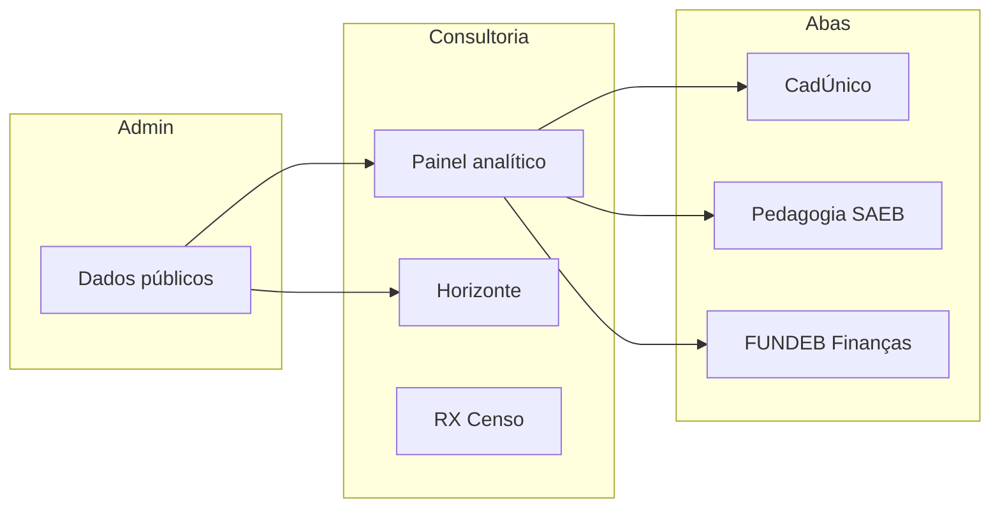

# Módulos da consultoria — servlitcys

**Versão do produto:** 7.0.2 · **Última revisão:** 2026-07-06

> **Índice geral:** [README.md](../README.md) · **Estado em produção:** [STATUS_PROJETO.md](../STATUS_PROJETO.md) · **Roadmaps:** [ROADMAP_INDICE.md](../ROADMAP_INDICE.md)

Visão por **módulo funcional**, alinhada ao menu da aplicação (Consultoria, Dados públicos, Administração). Cada página abaixo é a **porta de entrada** do módulo; o detalhe técnico está nos documentos ligados.

---

## Mapa de módulos

| Módulo | Rota principal | Documentação |
|--------|----------------|--------------|
| **Painel analítico** | `/dashboard/analytics` | [MODULO_ANALYTICS.md](MODULO_ANALYTICS.md) |
| **Horizonte** | `/dashboard/horizonte` | [MODULO_HORIZONTE.md](MODULO_HORIZONTE.md) |
| **Cadastro e CadÚnico** | Aba Cadastro no analytics | [MODULO_CADUNICO.md](MODULO_CADUNICO.md) |
| **Pedagogia e SAEB** | Aba Pedagógico no analytics | [MODULO_PEDAGOGIA_SAEB.md](MODULO_PEDAGOGIA_SAEB.md) |
| **RX — Censo** | `/dashboard/rx` | [MODULO_RX_CENSO.md](MODULO_RX_CENSO.md) |
| **Financiamento (FUNDEB)** | Aba Finanças no analytics | [MODULO_FUNDEB.md](MODULO_FUNDEB.md) |
| **Dados públicos (admin)** | `/admin/public-data`, `/admin/horizonte-import` | [MODULO_DADOS_PUBLICOS.md](MODULO_DADOS_PUBLICOS.md) |

---

## Como usar esta seção

1. Abra a **visão do módulo** correspondente ao que você opera no dia a dia.
2. Siga os links para documentação técnica, roadmaps e procedimentos de importação.
3. Para decisões de produto pendentes, consulte [BACKLOG_IMPLEMENTACOES.md](../BACKLOG_IMPLEMENTACOES.md) e [ROADMAP_INDICE.md](../ROADMAP_INDICE.md).

---

*Menu lateral do leitor Documentação: seções **4–11** espelham esta tabela.*
