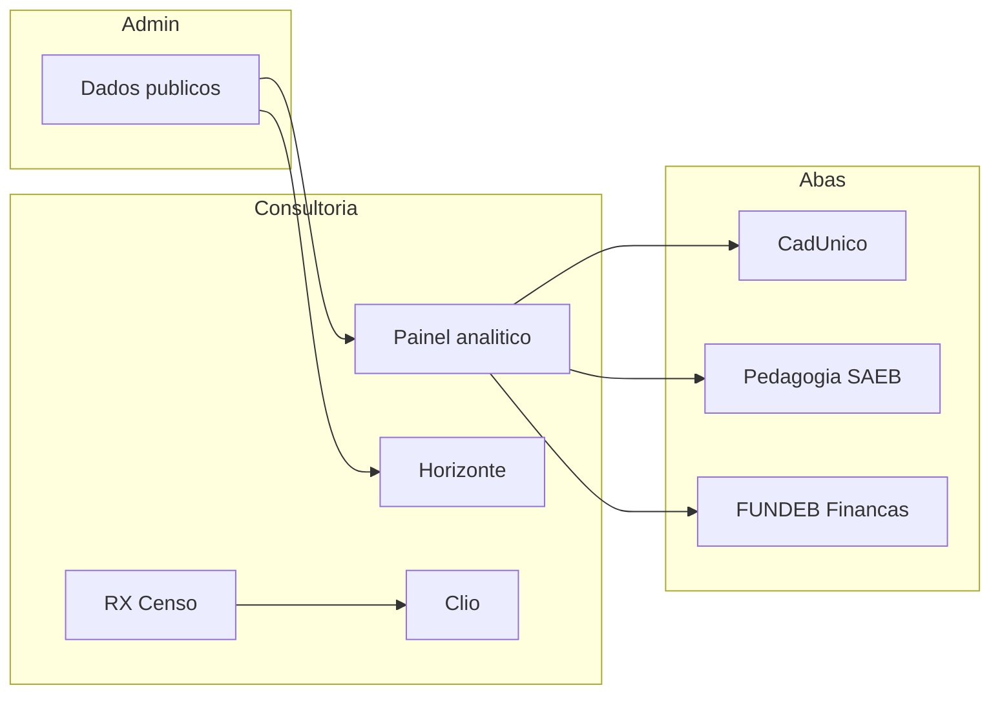

# Módulos da consultoria — servlitcys

**Versão do produto:** 8.2.2 · **Última revisão:** 2026-07-24

> **Índice geral:** [README.md](../README.md) · **Estado em produção:** [STATUS_PROJETO.md](../STATUS_PROJETO.md) · **Roadmaps:** [ROADMAP_INDICE.md](../ROADMAP_INDICE.md)

Visão por **módulo funcional**, alinhada ao menu da aplicação. Cada linha liga a **landing** e ao **roadmap** do módulo; o detalhe técnico está nos documentos ligados a partir do roadmap.

---

## Mapa de módulos

| Módulo | Rota principal | Landing | Roadmap |
|--------|----------------|---------|---------|
| **Painel analítico** | `/dashboard/analytics` | [MODULO_ANALYTICS.md](MODULO_ANALYTICS.md) | [ROADMAP_ANALYTICS.md](../ROADMAP_ANALYTICS.md) |
| **Horizonte** | `/dashboard/horizonte` | [MODULO_HORIZONTE.md](MODULO_HORIZONTE.md) | [ROADMAP_HORIZONTE.md](../ROADMAP_HORIZONTE.md) |
| **Cadastro e CadÚnico** | Aba Cadastro no analytics | [MODULO_CADUNICO.md](MODULO_CADUNICO.md) | [ROADMAP_CADUNICO.md](../ROADMAP_CADUNICO.md) |
| **Pedagogia e SAEB** | Aba Pedagógico no analytics | [MODULO_PEDAGOGIA_SAEB.md](MODULO_PEDAGOGIA_SAEB.md) | [ROADMAP_PEDAGOGIA_SAEB.md](../ROADMAP_PEDAGOGIA_SAEB.md) |
| **RX — Censo** | `/dashboard/rx` | [MODULO_RX_CENSO.md](MODULO_RX_CENSO.md) | [ROADMAP_RX_CENSO.md](../ROADMAP_RX_CENSO.md) |
| **Clio** | `/clio` | [MODULO_CLIO.md](MODULO_CLIO.md) | [ROADMAP_CLIO.md](../ROADMAP_CLIO.md) |
| **Financiamento (FUNDEB)** | Aba Finanças no analytics | [MODULO_FUNDEB.md](MODULO_FUNDEB.md) | [ROADMAP_FUNDEB.md](../ROADMAP_FUNDEB.md) |
| **Dados públicos (admin)** | `/admin/public-data`, `/admin/horizonte/abastecimento` | [MODULO_DADOS_PUBLICOS.md](MODULO_DADOS_PUBLICOS.md) | [ROADMAP_DADOS_PUBLICOS.md](../ROADMAP_DADOS_PUBLICOS.md) |

```mermaid
flowchart LR
    subgraph Consultoria
        A[Painel analitico]
        H[Horizonte]
        R[RX Censo]
        L[Clio]
    end
    subgraph Abas
        C[CadUnico]
        P[Pedagogia SAEB]
        F[FUNDEB Financas]
    end
    subgraph Admin
        D[Dados publicos]
    end
    A --> C
    A --> P
    A --> F
    R --> L
    D --> A
    D --> H
```

---

## Como usar esta seção

1. Abra o **roadmap** do módulo para estado e IDs.
2. Use a **landing** como porta de entrada operacional.
3. Para decisões pendentes: [BACKLOG_IMPLEMENTACOES.md](../BACKLOG_IMPLEMENTACOES.md) e [ROADMAP_INDICE.md](../ROADMAP_INDICE.md).

---

*Menu lateral do leitor: seções de módulo espelham esta tabela (ordem landing → roadmap → guias).*
